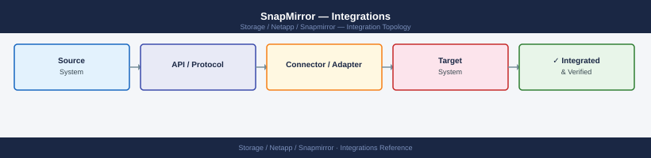

---
tags:
  - architecture
  - netapp
description: "SnapMirror integrations: SnapCenter backup chain extension, SnapVault for long-term retention, SVM-DR for disaster recovery, and S3 SnapMirror for object..."
---
# SnapMirror — Integrations

<div class="kb-summary">
SnapMirror integrations: SnapCenter backup chain extension, SnapVault for long-term retention, SVM-DR for disaster recovery, and S3 SnapMirror for object replication.

*Applies to: SnapMirror*
</div>


---

## SnapCenter Orchestration

SnapCenter uses SnapMirror to replicate application-consistent snapshots to a DR site. SnapCenter manages the full workflow: application quiesce, snapshot creation, SnapMirror update, and snapshot catalog registration. For DR failover, SnapCenter orchestrates `snapmirror break` on the destination, mounts the destination volume, and presents it to hosts — enabling application-consistent failover without manual intervention. SnapCenter also manages the resync and failback sequence post-recovery.

## SVM-DR for NAS Failover

SVM-DR replicates an entire data SVM — including all volumes, LIF configuration, NFS exports, CIFS shares, and local users — to a destination SVM. This enables complete NAS server failover where the destination SVM can be activated with the same share paths and permissions. SVM-DR is preferred over volume-level relationships where full NAS server recoverability is required, not just data. Superna Eyeglass can automate SVM-DR failover workflows for environments requiring automated NAS DR.

## SMBC for Transparent Host Failover

SnapMirror Business Continuity (SMBC) uses ONTAP consistency groups to replicate groups of volumes synchronously. Hosts access the LUNs via the same LUN path on both sites — both storage nodes present the same LUN identity. In the event of a source cluster failure, the ONTAP Mediator signals the destination cluster to begin serving I/O automatically, with no host-side path changes or reconfiguration required. SMBC is designed for SAN workloads (iSCSI, FC) where continuous availability is mandatory.

## Cloud Volumes ONTAP

SnapMirror replication operates natively between on-premises ONTAP clusters and Cloud Volumes ONTAP (CVO) instances in AWS, Azure, or GCP. This supports cloud-based DR scenarios where the destination is a CVO instance rather than a physical cluster. BlueXP manages the cloud replication relationship setup. SnapMirror policies and schedules function identically regardless of whether the destination is on-premises or cloud-hosted.

## REST API

ONTAP provides a REST API for programmatic SnapMirror relationship management. Use for automation, monitoring dashboards, and ITSM integration.

```bash
# List all SnapMirror relationships
GET /api/snapmirror/relationships

# Create a new SnapMirror relationship
POST /api/snapmirror/relationships

# Trigger an update on a specific relationship
PATCH /api/snapmirror/relationships/{uuid}

# Get transfer history
GET /api/snapmirror/relationships/{uuid}/transfers
```


```text title="Expected output"
GET /api/snapmirror/relationships
{
  "records": [
    {
      "uuid": "550e8400-e29b-41d4-a716-446655440000",
      "source": {"path": "cluster1.example.com:/vol/source_vol"},
      "destination": {"path": "cluster2.example.com:/vol/dest_vol"},
      "state": "snapmirrored",
      "policy": "MirrorAllSnapshots",
      "lag_time": 3600
    },
    {
      "uuid": "6ba7b810-9dad-11d1-80b4-00c04fd430c8",
      "source": {"path": "cluster1.example.com:/vol/data_prod"},
      "destination": {"path": "cluster3.example.com:/vol/data_prod_dr"},
      "state": "snapmirrored",
      "policy": "DailyBackup",
      "lag_time": 86400
    }
  ],
  "num_records": 2
}

POST /api/snapmirror/relationships
{
  "job": {
    "uuid": "7ce8b920-1f3a-11ec-81d3-0242ac130003",
    "state": "running",
    "message": "SnapMirror relationship creation in progress"
  }
}

PATCH /api/snapmirror/relationships/550e8400-e29b-41d4-a716-446655440000
{
  "job": {
    "uuid": "8df9c031-2g4b-12fd-92e4-1353bd141114",
    "state": "success",
    "message": "SnapMirror update completed successfully"
  }
}

GET /api/snapmirror/relationships/550e8400-e29b-41d4-a716-446655440000/transfers
{
  "records": [
    {
      "uuid": "9ea0d142-3h5c-13ge-a3f5-2464ce252225",
      "state": "success",
      "bytes_transferred": 1099511627776,
      "start_time": "2024-01-15T08:30:00Z",
      "end_time": "2024-01-15T09:45:00Z",
      "duration": 4500
    },
    {
      "uuid": "aeb1e253-4i6d-14hf-b4g6-3575df363336",
      "state": "success",
      "bytes_transferred": 549755813888,
      "start_time": "2024-01-16T08:30:00Z",
      "end_time": "2024-01-16T09:15:00Z",
      "duration": 2700
    }
  ],
  "num_records": 2
}
```

!!! warning "Common errors"
    | Error | Fix |
    |---|---|
    | `Error: 13001 - Relationship does not exist` | Verify the UUID is correct by listing all relationships with `GET /api/snapmirror/relationships`. |
    | `Error: 14002 - Source volume is offline` | Check source cluster health and ensure the source volume is online before creating or updating the relationship. |
Authenticate with HTTP Basic or cluster-scoped API tokens. Use the ONTAP REST API documentation at `https://<cluster-mgmt>/docs/api` for interactive exploration.

---

## See also

- [Snapmirror — How It Works](../how-it-works/)
- [Snapmirror — Design Standards](../design-standards/)
