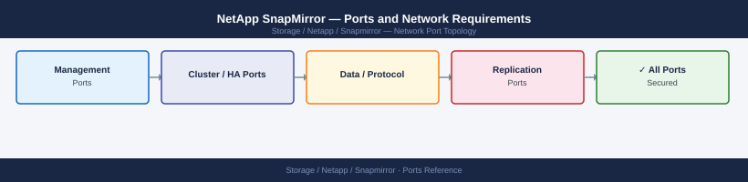
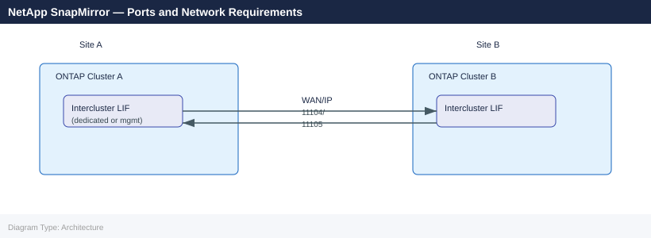

---
tags:
  - snapmirror
  - netapp
  - networking
  - firewall
  - ports
  - replication
description: "Firewall port reference for NetApp SnapMirror. SnapMirror is a replication feature built into ONTAP — it is not a separate product. All traffic flows..."
---
# NetApp SnapMirror — Ports and Network Requirements

<div class="kb-summary">
Firewall port reference for NetApp SnapMirror. SnapMirror is a replication feature built into ONTAP — it is not a separate product. All traffic flows between ONTAP intercluster LIFs. The only ports required are the ONTAP cluster peering and replication ports.

*Applies to: ONTAP 9.x (SnapMirror and SnapVault)*
</div>


## Network Zones



## Before you begin

- SnapMirror traffic uses **intercluster LIFs** — dedicated data LIFs configured for intercluster role, or management LIFs if no dedicated intercluster LIF is configured.
- Ports must be open **bidirectionally** between both clusters (each side initiates transfers at different points).
- SnapMirror over IP requires routable connectivity between intercluster LIFs across the WAN/routed network.
- For SnapMirror over FC (SMBC / MetroCluster), there are no IP port requirements — traffic runs over Fibre Channel fabric.

## Intercluster Replication Ports

| Port | Protocol | Source | Destination | Purpose |
|---|---|---|---|---|
| 11104 | TCP | Intercluster LIF (Cluster A) | Intercluster LIF (Cluster B) | SnapMirror control traffic — peering negotiation |
| 11105 | TCP | Intercluster LIF (Cluster A) | Intercluster LIF (Cluster B) | SnapMirror data transfer (Snapshot block transfer) |
| 443 | TCP | Intercluster LIF | Intercluster LIF (remote) | Cluster peering authentication and management |

## Cloud SnapMirror (SnapMirror to Cloud / S3)

| Port | Protocol | Source | Destination | Purpose |
|---|---|---|---|---|
| 443 | TCP | ONTAP cluster management LIF | AWS S3 / StorageGRID / ONTAP S3 endpoint | SnapMirror to Cloud control and data path |

## ONTAP System Manager / SnapCenter (Management)

SnapMirror relationships are managed through ONTAP System Manager or SnapCenter. See:
- [NetApp ONTAP — Ports](../../../ontap/architecture/ports/) for ONTAP management port requirements
- [NetApp SnapCenter — Ports](../../../snapcenter/architecture/ports/) for backup orchestration

## Firewall Zone Summary

| From | To | Ports | Notes |
|---|---|---|---|
| Cluster A intercluster LIF | Cluster B intercluster LIF | 11104, 11105 | Both directions |
| ONTAP mgmt LIF | Remote cluster mgmt LIF | 443 | Cluster peer setup |
| ONTAP intercluster LIF | Cloud S3 endpoint | 443 | SnapMirror to Cloud only |

## Verify

```bash
# From ONTAP CLI on source cluster — ping intercluster LIF on destination
network ping -lif <source-intercluster-lif> -destination <dest-intercluster-lif-ip>

# Check cluster peer health
cluster peer show
cluster peer health show

# Check SnapMirror relationship status
snapmirror show -fields state,healthy,lag-time

# Verify intercluster LIF status
network interface show -role intercluster
```


```text title="Expected output"
PING <dest-intercluster-lif-ip> from <source-intercluster-lif>: 56 data bytes
64 bytes from <dest-intercluster-lif-ip>: icmp_seq=0 ttl=64 time=2.45 ms
64 bytes from <dest-intercluster-lif-ip>: icmp_seq=1 ttl=64 time=2.31 ms
64 bytes from <dest-intercluster-lif-ip>: icmp_seq=2 ttl=64 time=2.38 ms
64 bytes from <dest-intercluster-lif-ip>: icmp_seq=3 ttl=64 time=2.42 ms
64 bytes from <dest-intercluster-lif-ip>: icmp_seq=4 ttl=64 time=2.29 ms

Peer Cluster Name         Cluster UUID                 Availability
------------------------- ---------------------------- ---------------
dest-cluster-01           4a3c8e9f-2b1d-11ed-9c4a-... Available

Cluster peer health status
Source Cluster Name       Destination Cluster Name     Cluster UUID                 Health Status
------------------------- ---------------------------- ---------------------------- ---------------
source-cluster-01         dest-cluster-01              4a3c8e9f-2b1d-11ed-9c4a-... Connected

Source Destination Path Type State Healthy Lag Time
------ ----------- ---- ---- ----- ------- --------
svm1 dest-svm1 /vol/data DP Snapmirrored true 0s
svm2 dest-svm2 /vol/logs DP Snapmirrored true 45s
svm3 dest-svm3 /vol/archive DP Snapmirrored true 2m15s

Vserver     Interface       Role         Status  Data Protocol
----------- --------------- ------------ ------- ----------------
source-cluster-01 ic_lif_01 intercluster up      none
source-cluster-01 ic_lif_02 intercluster up      none
dest-cluster-01   ic_lif_01 intercluster up      none
dest-cluster-01   ic_lif_02 intercluster up      none
```

!!! warning "Common errors"
    **`PING <dest-intercluster-lif-ip> from <source-intercluster-lif>: no answer`** — Verify network connectivity and firewall rules allow port 10001 (ONTAP cluster communication) between intercluster LIFs.
    **`Error: command failed: Cluster peer relationship does not exist`** — Establish cluster peering first using `cluster peer create -peer-addrs <dest-cluster-mgmt-ip>` before attempting SnapMirror operations.
    **`Error: command failed: SnapMirror relationship not initialized`** — Initialize the SnapMirror relationship with `snapmirror initialize -source-path <source-svm>:<volume> -destination-path <dest-svm>:<volume>`.
## See also

- [NetApp ONTAP — Ports](../../ontap/architecture/ports.md)
- [NetApp SnapCenter — Ports](../../snapcenter/architecture/ports.md)
- [NetApp ONTAP — Architecture](../../../ontap/architecture/how-it-works/)
