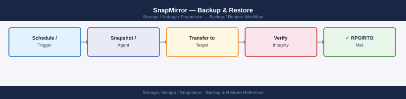

---
tags:
  - netapp
  - operations
description: "SnapMirror backup and restore: snapmirror initialize, snapmirror update, snapmirror break, snapmirror restore, and failover resync procedure."
---
# SnapMirror — Backup & Restore

<div class="kb-summary">
SnapMirror backup and restore: `snapmirror initialize`, `snapmirror update`, `snapmirror break`, `snapmirror restore`, and failover resync procedure.

*Applies to: SnapMirror*
</div>


---

## Before you begin

- **Access:** Storage admin credentials (cluster admin or equivalent)
- **Timing:** safe to run during business hours unless a step is marked ⚠ (causes interruption)
- **Dependencies:** no active upgrades or migrations on the same infrastructure
- **Logging:** capture command output — paste into the change record on completion

---

## How SnapMirror Fits into Backup and Restore

SnapMirror is a replication technology, not a backup application. It maintains a continuously updated copy of source data on a destination cluster. The destination volume retains a configurable number of snapshots that represent point-in-time recovery points. For application-consistent backup orchestration — quiesce, snapshot, SnapMirror update, catalog registration — use [SnapCenter](../../snapcenter/index.md).

The following procedures cover the ONTAP-level operations for DR-oriented restore from a SnapMirror destination, snapshot-level recovery from a vault (XDP) relationship, and SVM-DR-level restore.

---

## Restore from a SnapMirror Destination (DR Failover)

In a DR scenario where the source cluster is unavailable, restore access to data by activating the destination volume.

### Planned Failover (Source Available)

If the source is still accessible, run a final update to minimise RPO before breaking the relationship.

```bash
# Step 1: Final update to reduce RPO gap
snapmirror update -destination-path svm_dr:vol_data
# Wait for the update to complete
snapmirror show -destination-path svm_dr:vol_data -fields transfer-progress,last-transfer-end-timestamp

# Step 2: Quiesce to stop further transfers
snapmirror quiesce -destination-path svm_dr:vol_data

# Step 3: Break the mirror — destination becomes read-write
snapmirror break -destination-path svm_dr:vol_data

# Step 4: Verify the destination volume is now read-write
volume show -vserver svm_dr -volume vol_data -fields state,junction-path

# Step 5: Mount the volume if not already mounted
volume mount -vserver svm_dr -volume vol_data -junction-path /vol_data

# Step 6: Update export policy or CIFS share to allow client access
# (if not pre-configured on the DR SVM)
export-policy rule show -vserver svm_dr -policyname <policy>
```


```text title="Expected output"
Operation is running.
Destination-path: svm_dr:vol_data
Transfer-progress: 100%
Last-transfer-end-timestamp: 2024-01-15 14:32:47 +00:00

Operation succeeded: SnapMirror quiesce of destination "svm_dr:vol_data" completed successfully.

Operation succeeded: SnapMirror break for destination "svm_dr:vol_data" completed successfully.

Vserver     Volume   State       Junction-path
----------- -------- ----------- ----------------
svm_dr      vol_data online      /vol_data

Volume mount completed successfully for volume "vol_data" on Vserver "svm_dr".

Vserver Policy-name Rule-index Protocol Client-match RW-Rule RO-Rule
------- ----------- ---------- -------- ------------ ------- -------
svm_dr  default     1          nfs      0.0.0.0/0    sys     sys
svm_dr  default     2          cifs     0.0.0.0/0    ntlm    ntlm
```

!!! warning "Common errors"
    **`Error: command failed: SnapMirror transfer is in progress. Quiesce the relationship first.`** — Wait for the snapmirror update to complete fully before attempting to quiesce.
    **`Error: command failed: Volume "vol_data" is already mounted at junction path "/vol_data".`** — Remove the mount command if the volume is already mounted, or verify the junction-path is not already in use.
    **`Error: command failed: Policy "<policy>" does not exist on Vserver "svm_dr".`** — Replace `<policy>` with an actual export policy name or create the policy first using `export-policy create`.
### Unplanned Failover (Source Down)

```bash
# Source is unreachable — break the relationship to activate the destination
snapmirror break -destination-path svm_dr:vol_data

# Check lag time to understand RPO impact
snapmirror show -destination-path svm_dr:vol_data -fields lag-time
# Lag time = amount of data loss since last successful transfer

# Mount and serve data from the DR volume
volume mount -vserver svm_dr -volume vol_data -junction-path /vol_data

# Update DNS to point the storage hostname to the DR SVM LIF
# (update your DNS zone for the storage hostname)
network interface show -vserver svm_dr -role data
```


```text title="Expected output"
Operation succeeded: SnapMirror relationship for destination "svm_dr:vol_data" is now broken.

Destination Path       Lag Time
---------------------  ----------
svm_dr:vol_data        47 minutes

Volume mount completed successfully.

Vserver     Interface       IP Address      Netmask         Status
----------- --------------- --------------- --------------- ---------
svm_dr      data_lif_01     192.168.10.45   255.255.255.0   up
svm_dr      data_lif_02     192.168.10.46   255.255.255.0   up
```

!!! warning "Common errors"
    **`Error: command failed: SnapMirror relationship does not exist for destination "svm_dr:vol_data"`** — Verify the destination path is correct and the relationship exists using `snapmirror show -all`.
    **`Error: Cannot mount volume vol_data: volume is already mounted`** — Check if the volume is already mounted on the DR SVM with `volume show -vserver svm_dr -volume vol_data -fields junction-path`.
---

## Restore from a Snapshot on the Destination Volume (Point-in-Time Recovery)

SnapMirror destinations retain multiple snapshots. If the required data was present at an earlier point in time, restore from a specific snapshot rather than using the most recent state.

### List Available Snapshots on the Destination

```bash
# List all snapshots on the destination volume
snapshot list -vserver svm_dr -volume vol_data

# Show snapshot sizes and creation times
snapshot show -vserver svm_dr -volume vol_data \
    -fields snapshot,size,create-time
```


```text title="Expected output"
Vserver     Volume     Snapshot                                  Size  Total% Used%
----------- ---------- ---------------------------------------- ------ ------ -----
svm_dr      vol_data   snapmirror.c6287330-ccf7-11ed-8f2a-005... 2.1GB    8%    12%
svm_dr      vol_data   snapmirror.c628733a-ccf7-11ed-8f2a-005... 2.3GB    9%    13%
svm_dr      vol_data   snapmirror.c6287344-ccf7-11ed-8f2a-005... 2.0GB    7%    11%
svm_dr      vol_data   daily.2024-01-15_0010                    1.8GB    6%    10%
svm_dr      vol_data   hourly.2024-01-15_1400                   892MB    3%     5%

Snapshot                                  Size  Create Time
----------------------------------------- ------ -------------------------
snapmirror.c6287330-ccf7-11ed-8f2a-005... 2.1GB  Jan 15 08:32:17 +0000
snapmirror.c628733a-ccf7-11ed-8f2a-005... 2.3GB  Jan 15 09:15:42 +0000
snapmirror.c6287344-ccf7-11ed-8f2a-005... 2.0GB  Jan 15 10:01:08 +0000
daily.2024-01-15_0010                    1.8GB  Jan 15 00:10:33 +0000
hourly.2024-01-15_1400                   892MB  Jan 15 14:00:22 +0000
```

!!! warning "Common errors"
    **`Error: command failed: no snapshots found for volume vol_data`** — Verify the volume name and SVM name are correct using `volume show -vserver svm_dr`.
    **`Error: invalid vserver name "svm_dr"`** — Confirm the SVM exists and is accessible with `vserver show -vserver svm_dr`.
### Mount a Specific Snapshot for File-Level Recovery

```bash
# Create a FlexClone from a specific snapshot for read access
# (does not affect the destination volume or SnapMirror relationship)
volume clone create \
    -vserver svm_dr \
    -flexclone vol_data_recovery \
    -type RW \
    -parent-volume vol_data \
    -parent-snapshot <snapshot-name>

# Mount the clone
volume mount -vserver svm_dr \
    -volume vol_data_recovery \
    -junction-path /vol_data_recovery

# Copy the required files from the clone mount point to the active volume
# (done via NFS/CIFS client — mount /vol_data_recovery, copy files)

# After recovery, unmount and delete the clone
volume unmount -vserver svm_dr -volume vol_data_recovery
volume delete -vserver svm_dr -volume vol_data_recovery
```


```text title="Expected output"
Volume clone create: Command completed successfully.
Volume "vol_data_recovery" created successfully.
Volume mount: Command completed successfully.
Volume "vol_data_recovery" mounted at junction path "/vol_data_recovery".
Volume unmount: Command completed successfully.
Volume "vol_data_recovery" unmounted successfully.
Volume delete: Command completed successfully.
Volume "vol_data_recovery" deleted successfully.
```

!!! warning "Common errors"
    **`Error: command failed: Cannot unmount volume vol_data_recovery: volume is in use`** — Ensure all NFS/CIFS clients have disconnected from the mount point and no processes hold open file handles before unmounting.
    **`Error: command failed: Cannot create clone: parent snapshot <snapshot-name> does not exist on volume vol_data`** — Verify the snapshot name exists by running `snapshot show -vserver svm_dr -volume vol_data` and use the exact snapshot name in the parent-snapshot parameter.
    **`Error: command failed: Cannot mount volume: junction path /vol_data_recovery already exists`** — Remove the conflicting junction path with `volume unmount -vserver svm_dr -volume <existing-volume>` or choose a different junction path for the clone.
### Revert a Destination Volume to a Specific Snapshot

This is destructive — it discards all data newer than the selected snapshot on the destination. Only use when breaking the mirror and restoring from a specific point-in-time.

```bash
# Break the mirror first
snapmirror break -destination-path svm_dr:vol_data

# Revert the volume to a specific snapshot
snapshot restore -vserver svm_dr -volume vol_data \
    -snapshot <snapshot-name>

# Confirm the volume reflects the correct restore point
snapshot show -vserver svm_dr -volume vol_data
```


```text title="Expected output"
Operation succeeded: SnapMirror relationship between "cluster1://svm_prod:vol_data" and "cluster2://svm_dr:vol_data" has been broken.

Volume restore operation initiated for "svm_dr:vol_data" to snapshot "vol_data.20240115_0200".
Restore operation completed successfully. Volume is now at snapshot "vol_data.20240115_0200" created on Jan 15 02:00:15 UTC 2024.

Vserver Volume Snapshot Size State
------- ------ -------- ---- -----
svm_dr vol_data vol_data.20240115_0200 2.5GB valid
svm_dr vol_data vol_data.20240115_1800 2.5GB valid
svm_dr vol_data vol_data.20240116_0200 2.6GB valid
svm_dr vol_data vol_data.20240116_1800 2.6GB valid
```

!!! warning "Common errors"
    **`Error: command failed: SnapMirror relationship is not in a state that allows this operation.`** — Ensure the mirror is fully synchronized and not in a transfer state before attempting to break it.
    **`Error: snapshot "vol_data.20240115_0200" does not exist.`** — Verify the exact snapshot name using `snapshot show -vserver svm_dr -volume vol_data` and correct the spelling or date format.
    **`Error: cannot restore snapshot while volume has active SnapMirror relationship.`** — Break the SnapMirror relationship completely before attempting the restore operation.
---

## Restore from a SnapVault (XDP Vault) Relationship

XDP vault relationships retain long-term backup copies on the destination, with independent retention policies that allow keeping daily, weekly, and monthly snapshots separately from the source. This is the primary mechanism for restoring from a backup copy older than what SnapMirror async retention provides.

```bash
# List all retained snapshots in the vault
snapshot show -vserver svm_vault -volume vol_data_vault \
    -fields snapshot,create-time,size | sort -k2

# For file-level recovery — clone from a specific vault snapshot
volume clone create \
    -vserver svm_vault \
    -flexclone vol_data_clone \
    -type RW \
    -parent-volume vol_data_vault \
    -parent-snapshot <snapshot-name>

volume mount -vserver svm_vault \
    -volume vol_data_clone \
    -junction-path /vol_data_clone

# After copying the required files, clean up the clone
volume unmount -vserver svm_vault -volume vol_data_clone
volume delete -vserver svm_vault -volume vol_data_clone
```


```text title="Expected output"
Snapshot                                Create Time                Size
--------------------------------------------  ------------------------  ----------
vol_data_vault.1@hourly.2024-01-15_0600     Jan 15 06:00:15 +0000     2.4GB
vol_data_vault.1@hourly.2024-01-15_0500     Jan 15 05:00:22 +0000     2.3GB
vol_data_vault.1@daily.2024-01-14_2300      Jan 14 23:00:08 +0000     2.5GB
vol_data_vault.1@weekly.2024-01-08_2300     Jan 08 23:00:31 +0000     2.6GB
vol_data_vault.1@monthly.2023-12-31_2300    Dec 31 23:00:44 +0000     2.7GB

Volume clone "vol_data_clone" created successfully.

Volume "vol_data_clone" mounted successfully at junction path "/vol_data_clone".

Volume "vol_data_clone" unmounted successfully.

Volume "vol_data_clone" deleted successfully.
```

!!! warning "Common errors"
    **`Error: command failed: Parent snapshot does not exist.`** — Verify the snapshot name exists by running `snapshot show -vserver svm_vault -volume vol_data_vault` and use the exact snapshot identifier from the output.
    **`Error: command failed: Volume vol_data_clone already exists.`** — Delete the existing clone volume first with `volume delete -vserver svm_vault -volume vol_data_clone -force true` or use a different clone name.
    **`Error: command failed: Cannot unmount volume with active CIFS/NFS connections.`** — Ensure all client connections are closed by running `cifs session show` or `nfs connected-clients` to identify and disconnect active sessions before unmounting.
### Restore from Vault to Source (Full Volume Restore)

This procedure restores a full volume from the XDP vault back to the source — for example, after an accidental deletion or corruption on the source.

```bash
# Step 1: Break the existing XDP vault relationship
snapmirror quiesce -destination-path svm_vault:vol_data_vault
snapmirror break -destination-path svm_vault:vol_data_vault

# Step 2: Reverse resync — vault becomes source, original source becomes destination
snapmirror resync \
    -source-path svm_vault:vol_data_vault \
    -destination-path svm_prod:vol_data

# Step 3: Monitor until the reverse sync completes
snapmirror show -destination-path svm_prod:vol_data -fields lag-time,mirror-state

# Step 4: Break the reverse relationship to make the source writable
snapmirror break -destination-path svm_prod:vol_data

# Step 5: Re-establish the original XDP relationship direction
snapmirror resync -destination-path svm_vault:vol_data_vault

# Step 6: Verify normal replication is restored
snapmirror show -destination-path svm_vault:vol_data_vault -fields healthy,lag-time
```


```text title="Expected output"
Operation succeeded: SnapMirror relationship quiesced.
Operation succeeded: SnapMirror relationship broken.
Operation succeeded: SnapMirror resync started.
Source: svm_vault:vol_data_vault
Destination: svm_prod:vol_data
Lag-time: 2m 15s
Mirror-state: snapmirrored

Lag-time: 45s
Mirror-state: snapmirrored

Operation succeeded: SnapMirror relationship broken.
Operation succeeded: SnapMirror resync started.
Destination: svm_vault:vol_data_vault
Healthy: true
Lag-time: 1m 30s
```

!!! warning "Common errors"
    **`Error: SnapMirror relationship is not idle`** — Run `snapmirror quiesce -destination-path svm_vault:vol_data_vault` and wait 60 seconds before attempting the break operation.
    **`Error: Cannot resync relationship in broken state without source-path`** — Verify the source and destination paths are correctly specified and the relationship type matches (use `snapmirror show -all` to confirm current state).
    **`Error: Transfer aborted. Insufficient space on destination volume`** — Expand the destination volume with `volume size -vserver svm_prod -volume vol_data -size +10GB` before retrying the resync.
---

## SVM-DR Failover and Failback

SVM-DR replicates the entire SVM — volumes, LIF configuration, NFS exports, CIFS shares, and local users. Activating an SVM-DR relationship brings up the destination SVM as a fully functional replacement.

```bash
# Break the SVM-DR relationship to activate the destination SVM
snapmirror break -destination-path svm_dr:

# Start the destination SVM (starts all volumes and makes the SVM operational)
vserver start -vserver svm_dr

# Verify the SVM is running
vserver show -vserver svm_dr -fields state
# Expected: state: running

# Verify volumes are online and mounted
volume show -vserver svm_dr -fields state,junction-path

# Update DNS to point the SVM hostname to the DR SVM LIF
network interface show -vserver svm_dr -role data
```


```text title="Expected output"
Operation succeeded: SnapMirror relationship between source and destination SVMs broken.

vserver "svm_dr" started successfully.

Vserver     State
----------- ---------
svm_dr      running

Vserver   Volume       State    Junction Path
--------- ------------ -------- -----------------
svm_dr    vol_data_01  online   /data
svm_dr    vol_data_02  online   /logs
svm_dr    vol_backup   online   /backup
svm_dr    vol_home     online   /home

Vserver  Logical Interface     IP              Netmask         Status
-------- --------------------- --------------- --------------- ----------
svm_dr   svm_dr_data_lif_01    192.168.10.45   255.255.255.0   up
svm_dr   svm_dr_data_lif_02    192.168.10.46   255.255.255.0   up
```

!!! warning "Common errors"
    **`Error: command failed: Snapmirror relationship is not in a quiesced state`** — Run `snapmirror quiesce -destination-path svm_dr:` before attempting to break the relationship.
    **`Error: Vserver svm_dr is not in a stopped state and cannot be started`** — The destination SVM is already running; verify with `vserver show -vserver svm_dr` before issuing the start command.
    **`Error: Cannot resolve hostname svm_dr in DNS`** — Update your DNS server or /etc/hosts file to map the SVM hostname to the new DR LIF IP address (192.168.10.45 in this example).
### SVM-DR Failback

```bash
# After the primary SVM is recovered, reverse sync from DR back to primary
snapmirror resync \
    -source-path svm_dr: \
    -destination-path svm_prod:

# Wait for sync to complete
snapmirror show -destination-path svm_prod: -fields lag-time,healthy

# Break the reverse relationship
snapmirror break -destination-path svm_prod:

# Re-establish original direction (primary → DR)
snapmirror resync -destination-path svm_dr:

# Verify SVM-DR relationship is healthy
snapmirror show -destination-path svm_dr: -fields healthy,lag-time
```


```text title="Expected output"
Operation succeeded: snapmirror resync from "svm_dr:" to "svm_prod:" started.
Waiting for resync to complete...

                                                 Lag
Source Destination             Healthy          Time
------ ------------------------ ------- ----------
svm_dr: svm_prod:              true    00:00:15

Operation succeeded: snapmirror break for destination "svm_prod:".

Operation succeeded: snapmirror resync from "svm_prod:" to "svm_dr:" started.

                                                 Lag
Source Destination             Healthy          Time
------ ------------------------ ------- ----------
svm_prod: svm_dr:              true    00:00:08
```

!!! warning "Common errors"
    **`Error: command failed: Snapmirror relationship is not idle`** — Wait for the previous transfer to complete using `snapmirror show -destination-path svm_prod:` before attempting resync.
    **`Error: command failed: Snapmirror relationship does not exist`** — Verify the source and destination SVM names match the original SnapMirror configuration using `snapmirror show -all`.
    **`Error: command failed: Snapmirror relationship is not in a valid state for break`** — Ensure the resync operation has completed and the relationship is idle before breaking it.
---

## Post-Restore Validation

```bash
# Confirm the restored volume is accessible
volume show -vserver <svm> -volume <vol> -fields state,junction-path

# Verify application connectivity after restore
# (application-specific — for example, mount NFS path and check files)

# For SQL/Oracle databases — run integrity checks at the application layer
# before re-enabling production workloads

# After restore and validation, confirm SnapMirror protection is re-established
snapmirror show -fields healthy,lag-time
# All relationships should return to healthy: true with lag within RPO
```


```text title="Expected output"
Vserver     Volume       State    Junction Path
----------- ------------ -------- ----------------
svm-prod    vol_data     online   /mnt/data
svm-prod    vol_logs     online   /mnt/logs

Relationship                                    Healthy  Lag Time
------------------------------------------------ -------- ----------
svm-prod:vol_data => svm-dr:vol_data_mirror     true     00:00:15
svm-prod:vol_logs => svm-dr:vol_logs_mirror     true     00:00:22
```

!!! warning "Common errors"
    **`Error: command failed: no matching volumes found`** — Verify the SVM name and volume name are correct using `vserver show` and `volume show` commands.
    **`Relationship is not healthy: false, Lag Time: 00:45:30`** — Wait for the SnapMirror resynchronization to complete or manually trigger `snapmirror resync` if the lag exceeds your RPO threshold.
---

## Verify

- Confirm the operation completed without errors in the log or management UI
- Verify the expected state change is visible (service running, object created, config applied)
- Document the outcome in the change record

---

## See also

- [Snapmirror — Procedures](../procedures/)
- [Snapmirror — Health Checks](../health-checks/)
- [Snapmirror — Common Issues](../../troubleshooting/common-issues/)
