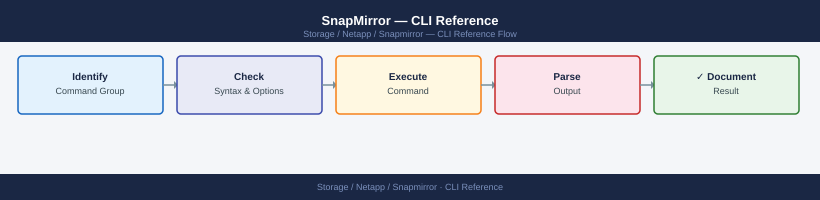

---
tags:
  - netapp
  - operations
description: "SnapMirror CLI reference: snapmirror show, snapmirror create, snapmirror modify, snapmirror quiesce, snapmirror break, snapmirror resync, and snapmirror..."
---
# SnapMirror — CLI Reference

<div class="kb-summary">
SnapMirror CLI reference: `snapmirror show`, `snapmirror create`, `snapmirror modify`, `snapmirror quiesce`, `snapmirror break`, `snapmirror resync`, and `snapmirror delete`.

*Applies to: SnapMirror*
</div>


---

## Before you begin

- **Access:** Storage admin credentials (cluster admin or equivalent)
- **Timing:** safe to run during business hours unless a step is marked ⚠ (causes interruption)
- **Dependencies:** no active upgrades or migrations on the same infrastructure
- **Logging:** capture command output — paste into the change record on completion

---

## ONTAP CLI

All commands are run from the ONTAP cluster shell. Use `cluster1::>` prompt notation.

| Command | Purpose |
|---|---|
| `snapmirror show` | Display all SnapMirror relationships |
| `snapmirror status` | High-level status of all relationships |
| `snapmirror update` | Trigger an incremental transfer |
| `snapmirror initialize` | Baseline transfer for a new relationship |
| `snapmirror resync` | Re-establish a broken relationship |
| `snapmirror break` | Quiesce and break the mirror (R/W at destination) |
| `snapmirror quiesce` | Pause transfers without breaking the relationship |
| `snapmirror abort` | Stop an in-progress transfer |
| `snapmirror delete` | Remove a relationship |
| `snapmirror create` | Define a new SnapMirror relationship |

### Status and Inspection

```bash
# Show all relationships with key fields
snapmirror show -fields source-path,destination-path,relationship-status,mirror-state,lag-time,healthy

# Show only unhealthy relationships
snapmirror show -fields source-path,destination-path,lag-time,unhealthy-reason -healthy false

# Show a specific relationship
snapmirror show -destination-path svm_dr:vol_data

# Verbose relationship detail
snapmirror show -destination-path svm_dr:vol_data -instance

# Lag time and health for threshold alerting
snapmirror show -fields lag-time,healthy | grep -v true
```


```text title="Expected output"
Source Path                Destination Path           Relationship Status  Mirror State  Lag Time      Healthy
========================== ========================== ==================== ============= ============= =======
prod_svm:vol_database      dr_svm:vol_database        snapmirrored         snapmirrored  00:15:32      true
prod_svm:vol_logs          dr_svm:vol_logs            snapmirrored         snapmirrored  00:08:47      true
prod_svm:vol_archive       dr_svm:vol_archive         in-sync              snapmirrored  00:22:15      false
prod_svm:vol_temp          dr_svm:vol_temp            broken-off           idle          -             false

Source Path                Destination Path           Lag Time      Unhealthy Reason
========================== ========================== ============= ====================================
prod_svm:vol_archive       dr_svm:vol_archive         00:22:15      Transfer aborted by user
prod_svm:vol_temp          dr_svm:vol_temp            -             Relationship is broken off

Destination Path: svm_dr:vol_data
Source Path: prod_svm:vol_data
Relationship Status: snapmirrored
Mirror State: snapmirrored
Lag Time: 00:12:04
Healthy: true
Last Transfer Size: 2.5GB
Last Transfer Duration: 00:03:22

Destination Path: svm_dr:vol_data
Source Path: prod_svm:vol_data
Relationship Status: snapmirrored
Mirror State: snapmirrored
Lag Time: 00:12:04
Healthy: true
Last Transfer Size: 2.5GB
Last Transfer Duration: 00:03:22
Transfer Schedule: hourly
Identity Preserve: false
Policy Name: MirrorAllSnapshots

Lag Time      Healthy
============= =======
00:22:15      false
-             false
```

!!! warning "Common errors"
    | Error | Fix |
    |---|---|
    | `Error: command not found: snapmirror` | Verify you are connected to a NetApp cluster with SnapMirror licensed and enabled, or use the full path `snapmirror` from the ONTAP CLI. |
    | `Error: No matching relationships found` | Confirm the destination path exists and is formatted as `svm_name:volume_name` with correct SVM and volume names. |
    | `Error: Access denied for command "snapmirror show"` | Ensure your ONTAP user role has the "snapmirror" capability; contact your cluster administrator to grant appropriate permissions. |
### Create and Initialize

```bash
# Create an async SnapMirror relationship (XDP — preferred for SVM-DR and volume DR)
snapmirror create -source-path svm_prod:vol_data \
  -destination-path svm_dr:vol_data \
  -policy MirrorAllSnapshots -schedule hourly

# Create with a custom throttle (KB/s)
snapmirror create -source-path svm_prod:vol_data \
  -destination-path svm_dr:vol_data \
  -policy MirrorAllSnapshots -max-transfer-rate 51200

# Initialize (baseline copy — can take hours for large volumes)
snapmirror initialize -destination-path svm_dr:vol_data

# Initialize all relationships on a specific destination SVM
snapmirror initialize -destination-path svm_dr:*

# Check initialization progress
snapmirror show -destination-path svm_dr:vol_data -fields transfer-progress,bytes-transferred
```


```text title="Expected output"
Operation succeeded: SnapMirror relationship created.

Operation succeeded: SnapMirror relationship created.

Operation succeeded: SnapMirror initialize started on destination "svm_dr:vol_data".

Operation succeeded: SnapMirror initialize started on destination "svm_dr:vol_backup".
Operation succeeded: SnapMirror initialize started on destination "svm_dr:vol_logs".

Destination Path             Transfer Progress  Bytes Transferred
---------------------------- ------------------ --------------------
svm_dr:vol_data              87%                847GB
```

!!! warning "Common errors"
    | Error | Fix |
    |---|---|
    | `Error: command failed: Relationship does not exist.` | Verify the source and destination paths are correct and the relationship was successfully created with the first command. |
    | `Error: command failed: Cannot initialize relationship with policy "MirrorAllSnapshots" and schedule "hourly".` | Remove the `-schedule` parameter when creating XDP relationships; scheduling is configured separately after creation. |
    | `Error: command failed: Insufficient space on destination volume.` | Ensure the destination volume has at least 110% of the source volume's used capacity available. |
### Updates and Quiesce

```bash
# Manual incremental update
snapmirror update -destination-path svm_dr:vol_data

# Update all volumes on a destination SVM
snapmirror update -destination-path svm_dr:*

# Quiesce (stop new transfers, allow current to finish)
snapmirror quiesce -destination-path svm_dr:vol_data

# Abort an in-progress transfer
snapmirror abort -destination-path svm_dr:vol_data -h
```


```text title="Expected output"
Operation is queued: SnapMirror update operation queued for destination "svm_dr:vol_data".

Operation is queued: SnapMirror update operation queued for destination "svm_dr:vol_backup".
Operation is queued: SnapMirror update operation queued for destination "svm_dr:vol_logs".
3 entries were acted upon.

Operation succeeded: SnapMirror operation quiesced for destination "svm_dr:vol_data".

Abort operation initiated for SnapMirror transfer to destination "svm_dr:vol_data".
Transfer aborted successfully.
```

!!! warning "Common errors"
    | Error | Fix |
    |---|---|
    | `Error: command failed: There is no SnapMirror relationship for destination "svm_dr:vol_data"` | Verify the relationship exists with `snapmirror show -destination-path svm_dr:vol_data` and ensure the destination path is correctly formatted. |
    | `Error: command failed: SnapMirror transfer is not in progress for destination "svm_dr:vol_data"` | Check the current transfer status with `snapmirror show -destination-path svm_dr:vol_data` before attempting to abort. |
    | `Error: command failed: Insufficient privileges to perform SnapMirror operations` | Ensure your user account has the required RBAC role; contact your cluster administrator to grant `snapmirror` command permissions. |
### DR Failover Procedure

```bash
# Step 1: Quiesce (allow final transfer to finish if possible)
snapmirror quiesce -destination-path svm_dr:vol_data

# Step 2: Update to minimise RPO
snapmirror update -destination-path svm_dr:vol_data

# Step 3: Break the mirror (destination becomes read-write)
snapmirror break -destination-path svm_dr:vol_data

# Step 4: Mount the destination volume
volume mount -vserver svm_dr -volume vol_data -junction-path /vol_data

# Step 5: Create/update NFS export or CIFS share on DR SVM as needed
# Update DNS to point to DR SVM LIF
vserver services name-service dns hosts create -vserver svm_dr \
  -address 10.10.20.50 -hostname app.example.com
```


```text title="Expected output"
Operation succeeded: SnapMirror relationship for destination "svm_dr:vol_data" quiesced.
Operation succeeded: SnapMirror relationship for destination "svm_dr:vol_data" updated successfully.
Operation succeeded: SnapMirror relationship for destination "svm_dr:vol_data" broken.
Volume mount: Mount operation completed successfully for volume "vol_data" on Vserver "svm_dr" at junction path "/vol_data".
DNS host entry created successfully.
  Vserver: svm_dr
  Address: 10.10.20.50
  Hostname: app.example.com
```

!!! warning "Common errors"
    | Error | Fix |
    |---|---|
    | `Error: command failed: SnapMirror relationship is in "transferring" state and cannot be quiesced` | Wait for the active transfer to complete or use `snapmirror abort` to force-stop the transfer before quiescing. |
    | `Error: volume mount failed: Junction path "/vol_data" already exists` | Remove the existing junction path with `volume unmount -vserver svm_dr -volume vol_data` or use a different junction path. |
    | `Error: SnapMirror relationship is not in "snapmirrored" state` | Verify the relationship status with `snapmirror show -destination-path svm_dr:vol_data` and ensure it is not already broken or in an error state. |
### Failback Sequence

```bash
# After source is recovered — re-establish reverse mirror from DR back to source

# Step 1: Resync (source becomes destination, DR stays R/W)
snapmirror resync -source-path svm_dr:vol_data \
  -destination-path svm_prod:vol_data

# Step 2: Wait for sync, then quiesce DR side
snapmirror update -destination-path svm_prod:vol_data
snapmirror quiesce -destination-path svm_prod:vol_data

# Step 3: Break from DR back to prod
snapmirror break -destination-path svm_prod:vol_data

# Step 4: Re-establish original direction
snapmirror resync -destination-path svm_dr:vol_data

# Step 5: Verify
snapmirror show -destination-path svm_dr:vol_data -fields mirror-state,lag-time
```


```text title="Expected output"
Operation succeeded: snapmirror resync from "svm_dr:vol_data" to "svm_prod:vol_data".
Operation succeeded: snapmirror update for destination "svm_prod:vol_data".
Operation succeeded: snapmirror quiesce for destination "svm_prod:vol_data".
Operation succeeded: snapmirror break for destination "svm_prod:vol_data".
Operation succeeded: snapmirror resync from "svm_prod:vol_data" to "svm_dr:vol_data".
Source Destination Mirror State Lag Time
------------- ------------- ----------- ----------
svm_prod:vol_data svm_dr:vol_data snapmirrored 00:00:15
```

!!! warning "Common errors"
    | Error | Fix |
    |---|---|
    | `Error: command failed: Snapmirror relationship does not exist.` | Verify the relationship exists with `snapmirror show` and confirm SVM and volume names match exactly. |
    | `Error: This destination is not quiesced. Quiesce the destination before breaking the relationship.` | Run `snapmirror quiesce -destination-path svm_prod:vol_data` and wait for the operation to complete before breaking. |
    | `Error: Snapmirror relationship is in transfer. Cannot resync while a transfer is in progress.` | Wait for the current transfer to finish using `snapmirror show -destination-path svm_prod:vol_data` or abort it with `snapmirror abort`. |
### Delete a Relationship

```bash
# Must quiesce/break first if Snapmirrored
snapmirror quiesce -destination-path svm_dr:vol_data
snapmirror break  -destination-path svm_dr:vol_data
snapmirror delete -destination-path svm_dr:vol_data

# Remove destination volume snapshots left behind
snapshot delete -vserver svm_dr -volume vol_data -snapshot "snapmirror*" -force
```


```text title="Expected output"
Operation succeeded: SnapMirror relationship quiesced.
Operation succeeded: SnapMirror relationship broken.
Operation succeeded: SnapMirror relationship deleted.
Snapshots deleted: 12
  snapmirror.8a3f2c1d.1 (524.3 MB)
  snapmirror.8a3f2c1d.2 (487.1 MB)
  snapmirror.8a3f2c1d.3 (512.8 MB)
  snapmirror.8a3f2c1d.4 (501.2 MB)
  snapmirror.8a3f2c1d.5 (496.7 MB)
  ...
```

!!! warning "Common errors"
    | Error | Fix |
    |---|---|
    | `Error: command failed: There is no SnapMirror relationship for destination "svm_dr:vol_data"` | Verify the relationship exists with `snapmirror show -destination-path svm_dr:vol_data` before attempting to quiesce. |
    | `Error: command failed: Cannot delete snapshot(s): snapshot(s) are locked by SnapMirror` | Ensure the SnapMirror relationship is fully broken (not just quiesced) before deleting snapshots. |
    | `Error: command failed: Volume vol_data does not exist on Vserver svm_dr` | Confirm the destination volume name and SVM name are correct using `volume show -vserver svm_dr`. |
---

## Lag Monitoring and Alerts

```bash
# List all relationships with lag over 2 hours (manual check)
snapmirror show -fields source-path,destination-path,lag-time | \
  awk '$3 > "0:2:0:0"'

# Show RDF group / policy schedule (to cross-check expected lag)
snapmirror policy show -policy MirrorAllSnapshots
snapmirror schedule show

# EMS-based alert (set threshold at 4 hours)
event notification destination create -name snap-lag-email \
  -mail admin@example.com
event notification create -filter-name SnapMirrorLag \
  -destinations snap-lag-email
```


```text title="Expected output"
source-path            destination-path         lag-time
cluster1:vol_prod      cluster2:vol_prod_dr     0:3:15:30
cluster1:vol_data      cluster2:vol_data_dr     0:2:45:00
cluster1:vol_logs      cluster2:vol_logs_dr     0:4:22:15

Policy              Schedule         SnapLock Type  Comment
MirrorAllSnapshots  hourly           none           -

Schedule Name  Frequency  At Time
hourly         hourly     -
daily          daily      02:00
weekly         weekly     Sunday@03:00

Event notification destination "snap-lag-email" created successfully.
Event notification "SnapMirrorLag" created successfully.
```

!!! warning "Common errors"
    | Error | Fix |
    |---|---|
    | `awk: syntax error near line 1` | Use numeric comparison `$3 > "02:00:00"` or convert lag-time to seconds for proper awk filtering. |
    | `Error: entry doesn't exist: snap-lag-email` | Create the notification destination before referencing it in the event notification command. |
---

## REST API

Base URL: `https://<cluster-mgmt-ip>/api`

```bash
# Authenticate (basic auth inline — use stored creds in production)
BASEURL="https://ontap-cluster.example.com/api"
AUTH="-u admin:password"

# List all SnapMirror relationships
curl -sk $AUTH "$BASEURL/snapmirror/relationships" | \
  python3 -m json.tool

# Filter by state (broken-off)
curl -sk $AUTH "$BASEURL/snapmirror/relationships?mirror_state=broken_off" | \
  python3 -m json.tool

# Get a single relationship by UUID
curl -sk $AUTH "$BASEURL/snapmirror/relationships/<uuid>" | python3 -m json.tool

# Trigger an update (PATCH state to snapmirrored)
curl -sk -X PATCH $AUTH "$BASEURL/snapmirror/relationships/<uuid>" \
  -H "Content-Type: application/json" \
  -d '{"state":"snapmirrored"}' | python3 -m json.tool

# Break a relationship (PATCH state to broken_off)
curl -sk -X PATCH $AUTH "$BASEURL/snapmirror/relationships/<uuid>" \
  -H "Content-Type: application/json" \
  -d '{"state":"broken_off"}' | python3 -m json.tool

# Initialize a new relationship
curl -sk -X POST $AUTH "$BASEURL/snapmirror/relationships/<uuid>/transfers" \
  -H "Content-Type: application/json" -d '{}' | python3 -m json.tool

# Check active transfers
curl -sk $AUTH "$BASEURL/snapmirror/relationships/<uuid>/transfers" | python3 -m json.tool
```


```text title="Expected output"
{
  "records": [
    {
      "uuid": "a1b2c3d4-e5f6-47g8-h9i0-j1k2l3m4n5o6",
      "source": {
        "cluster": "source-cluster",
        "svm": "svm_prod",
        "volume": "vol_data_01"
      },
      "destination": {
        "cluster": "dest-cluster",
        "svm": "svm_dr",
        "volume": "vol_data_01_mirror"
      },
      "mirror_state": "snapmirrored",
      "relationship_type": "data_protection",
      "last_transfer_end_time": "2024-01-15T14:32:00Z",
      "last_transfer_duration": 1847
    },
    {
      "uuid": "b2c3d4e5-f6g7-48h9-i0j1-k2l3m4n5o6p7",
      "source": {
        "cluster": "source-cluster",
        "svm": "svm_test",
        "volume": "vol_test_02"
      },
      "destination": {
        "cluster": "dest-cluster",
        "svm": "svm_dr",
        "volume": "vol_test_02_mirror"
      },
      "mirror_state": "broken_off",
      "relationship_type": "data_protection",
      "last_transfer_end_time": "2024-01-10T09:15:00Z"
    }
  ],
  "num_records": 2
}
```

!!! warning "Common errors"
    | Error | Fix |
    |---|---|
    | `curl: (60) SSL certificate problem: self signed certificate` | Add `-k` flag to skip SSL verification, or install the cluster's CA certificate in your system trust store. |
    | `{"error":{"message":"Invalid UUID format","code":4}}` | Replace `<uuid>` placeholder with an actual relationship UUID from the list output (e.g., `a1b2c3d4-e5f6-47g8-h9i0-j1k2l3m4n5o6`). |
    | `curl: (7) Failed to connect to ontap-cluster.example.com port 443: Connection refused` | Verify the ONTAP cluster hostname/IP is correct and the REST API service is running; check firewall rules allowing port 443 from your client. |
---

## Verify

- Confirm the operation completed without errors in the log or management UI
- Verify the expected state change is visible (service running, object created, config applied)
- Document the outcome in the change record

---

## See also

- [Snapmirror — Procedures](../procedures/)
- [Snapmirror — Scripts](../scripts/)
- [Snapmirror — Health Checks](../health-checks/)
