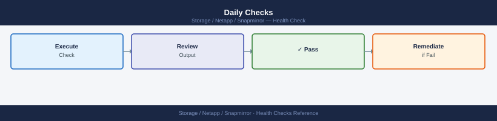
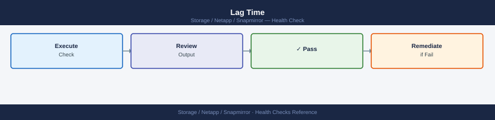

---
tags:
  - netapp
  - operations
---
# SnapMirror — Health Checks

<div class="kb-summary">
SnapMirror health checks: `snapmirror show -fields lag-time,health`, relationship state review, last-transfer-size trend, and broken-off relationship count.

*Applies to: SnapMirror*
</div>

## Before you begin

- **Access:** Storage admin credentials (cluster admin or equivalent)
- **Timing:** safe to run during business hours unless a step is marked ⚠ (causes interruption)
- **Dependencies:** no active upgrades or migrations on the same infrastructure
- **Logging:** capture command output — paste into the change record on completion

---

## Run This Routine

1. **Relationship health** — `snapmirror show -health false` — should return empty
2. **Lag time** — `snapmirror show -fields lag-time | sort -k2 -r | head -10` — flag any relationship with lag exceeding 2× its schedule interval
3. **Failed transfers** — `snapmirror show -transfer-error !- | grep -v healthy` — investigate any transfer errors
4. **Broken-off relationships** — `snapmirror show -state broken-off` — should be empty during normal operations
5. **Throttle check** — `snapmirror show -fields throttle` — verify throttle is not inadvertently set to 0 during business hours
6. **Vault relationship status** — `snapmirror show -policy-type vault` — check all SnapVault relationships are current
7. **Policy compliance** — `snapmirror policy show` — verify a schedule is attached to all relationships

---

## Daily Checks



| Check | Command | Notes |
|---|---|---|
| [ ] Run `snapmirror show -fields lag-time,healthy,state` | `snapmirror show -fields lag-time,healthy,state` | confirm all relationships are healthy with lag within RPO thresholds |
| [ ] Flag any relationship with `healthy: false` | `healthy: false` | review the reason field for root cause |
| [ ] Flag any relationship with lag exceeding the defined RPO (typically) | | |
| [ ] Check for relationships in `broken-off` state from DR tests that have not been resynced | `snapmirror show -relationship-status broken-off` | |
| [ ] Check XDP (SnapVault) relationships are up to date | `snapmirror show -type XDP -fields lag-time,healthy` | |
| [ ] Verify transfer schedules are running as expected | `snapmirror show -fields schedule,last-transfer-end-timestamp` | |
| [ ] For SMBC/AutomatedFailOver, verify mediator reachability | | |

## Health Check


- [ ] All relationships show `healthy: true`
- [ ] No relationships in `broken-off` state
- [ ] All lag times are within the defined RPO for their relationship type
- [ ] SnapMirror Synchronous relationships show `In-Sync` (not `Out-of-Sync`)
- [ ] SMBC mediator is reachable if AutomatedFailOver policies are configured
- [ ] Destination aggregate has sufficient free space for incoming transfers
- [ ] No transfer queue backlog on the destination cluster

```bash
# Show all relationships with lag time, health, and state
snapmirror show -fields source-path,destination-path,lag-time,healthy,state,last-transfer-end-timestamp

# Show only unhealthy relationships
snapmirror show -fields lag-time,healthy -health-status unhealthy

# Show relationships in broken-off state
snapmirror show -relationship-status broken-off

# Show XDP (SnapVault) relationships specifically
snapmirror show -type XDP -fields lag-time,healthy,state

# Show transfer history — check for failures in the last 24 hours
snapmirror history show -fields source-path,destination-path,status,transfer-size

# Show SnapMirror Synchronous relationships and sync state
snapmirror show -type sync -fields lag-time,healthy,is-healthy
```


```text title="Expected output"
Source Path                 Destination Path            Lag Time State    Healthy Last Transfer End Timestamp
-------------------------------- -------------------------------- -------- -------- ------- --------------------------------
cluster1:vol_prod_01        cluster2:vol_prod_01_mirror  00:15:32 snapmirrored true    2024-01-15 14:32:18 -05:00
cluster1:vol_data_02        cluster2:vol_data_02_mirror  00:08:45 snapmirrored true    2024-01-15 14:39:05 -05:00
cluster1:vol_test_03        cluster2:vol_test_03_mirror  02:22:10 snapmirrored false   2024-01-15 12:25:33 -05:00
cluster1:vol_archive_04     cluster2:vol_archive_04_mr   06:45:22 snapmirrored true    2024-01-15 08:02:11 -05:00

Lag Time State    Healthy
-------- -------- -------
02:22:10 snapmirrored false

Relationship Status
-------------------
broken-off

Source Path         Destination Path        Lag Time State    Healthy
------------------- ----------------------- -------- -------- -------
cluster1:vol_vault  cluster2:vol_vault_xdp  00:03:18 snapmirrored true

Source Path              Destination Path         Status    Transfer Size
------------------------ ------------------------ ---------- ----------------
cluster1:vol_prod_01     cluster2:vol_prod_01_m   Success   524.2MB
cluster1:vol_data_02     cluster2:vol_data_02_m   Success   1.8GB
cluster1:vol_test_03     cluster2:vol_test_03_m   Failed    0B
cluster1:vol_archive_04  cluster2:vol_archive_04  Success   256.5MB

Lag Time State    Healthy Is-Healthy
-------- -------- ------- -----------
00:02:15 in-sync  true    true
```

!!! warning "Common errors"
    **`Error: command not found: snapmirror`** — Ensure you are logged into the ONTAP cluster CLI (SSH to cluster management IP) and not a local shell.
    **`Error: There are no entries matching your query`** — Verify the relationship exists with `snapmirror show` and confirm the filter criteria (e.g., `-health-status unhealthy`) matches actual relationships.
    **`Error: Invalid field name "is-healthy"`** — Use `healthy` instead of `is-healthy` for SnapMirror Asynchronous relationships; `is-healthy` is only valid for Synchronous relationships.
## Relationship States


| State | Meaning |
|---|---|
| Snapmirrored | Healthy — replication current |
| Uninitialized | Never seeded; baseline transfer needed |
| Broken-off | Intentionally or unintentionally broken |
| Quiesced | Paused; not replicating |
| Transferring | Actively replicating |

## Lag Time



Lag time is the age of the last successful transfer. For async SnapMirror:
- **< 1 hour** — normal for hourly schedule
- **> 4 hours** — investigate
- **> RPO threshold** — escalate

```bash
snapmirror show -fields lag-time
```


```text title="Expected output"
Source Destination Lag Time
vserver1:vol_data vserver2:vol_data_mirror 00:15:32
vserver1:vol_logs vserver2:vol_logs_mirror 00:08:47
vserver1:vol_archive vserver2:vol_archive_mirror 02:34:19
vserver3:vol_prod vserver4:vol_prod_dr 00:22:11
vserver3:vol_temp vserver4:vol_temp_mirror 01:45:56
```

!!! warning "Common errors"
    **`Error: command not found`** — Ensure you are logged into the NetApp cluster CLI (ssh to cluster IP) rather than a Linux shell.
    **`Error: Invalid field name "lag-time"`** — Use the correct field name `lag-time` or run `snapmirror show -fields ?` to list available fields for your ONTAP version.
    **`No SnapMirror relationships found`** — Verify that SnapMirror relationships exist on this cluster by running `snapmirror list-destinations` first.
---

## Verify

- Confirm the operation completed without errors in the log or management UI
- Verify the expected state change is visible (service running, object created, config applied)
- Document the outcome in the change record

---

## See also

- [Snapmirror — Procedures](../procedures/)
- [Snapmirror — CLI Reference](../cli-reference/)
- [Snapmirror — Common Issues](../../troubleshooting/common-issues/)
