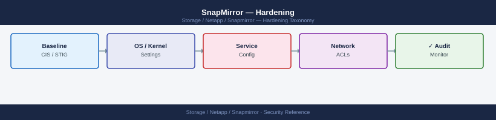

---
tags:
  - netapp
  - security
description: "SnapMirror hardening: restricting intercluster LIF firewall policy to replication only, peer passphrase rotation cadence, and audit log for relationship..."
---
# SnapMirror — Hardening

<div class="kb-summary">
SnapMirror hardening: restricting intercluster LIF firewall policy to replication only, peer passphrase rotation cadence, and audit log for relationship changes.

*Applies to: SnapMirror*
</div>


---

## Before you begin

- **Access:** Storage admin credentials (cluster admin or equivalent)
- **Change management:** security changes require CAB approval in most environments
- **Rollback plan:** document current state before any security control change
- **Testing:** validate in a non-production environment first where possible

---

## Hardening Checklist

Apply this checklist to all clusters participating in SnapMirror relationships. It supplements the broader [ONTAP Security Hardening](../../ontap/security/hardening.md) baseline, which should be applied first.

### Intercluster Network

- [ ] Intercluster LIFs are on a dedicated VLAN separate from data and management traffic
- [ ] Intercluster LIFs are not reachable from untrusted networks — firewall rules restrict access to known peer cluster addresses only
- [ ] TCP ports 11104 and 11105 are open only between the specific intercluster LIF IPs of the two peer clusters; no wildcard rules
- [ ] No data LIFs or management LIFs on the intercluster VLAN
- [ ] Intercluster LIF MTU matches the physical network to prevent fragmentation during large baseline transfers

### Authentication and Access

- [ ] Cluster peer relationship authenticated — `cluster peer show` shows `Auth-Status: ok` for all peers
- [ ] Stale or unused cluster peer relationships removed: `cluster peer show` — no peers without active relationships
- [ ] SnapMirror management operations (break, resync, initialize) restricted to named DR administrators via custom RBAC roles
- [ ] No shared admin accounts for SnapMirror automation — dedicated service accounts with minimum-privilege roles only
- [ ] Service account credentials stored in a secrets vault; not in scripts or version control
- [ ] Read-only monitoring account used for all monitoring tool access to SnapMirror relationship status

### Encryption

- [ ] All SnapMirror relationships crossing WAN or third-party links have `encryption-algorithm: aes-256` enabled
- [ ] Destination volumes containing regulated data are encrypted with NVE or NAE
- [ ] External KMIP key manager configured if NVE is used in regulated environments
- [ ] `security config show` confirms TLS 1.2 minimum on both source and destination clusters

### SMBC / Mediator

- [ ] ONTAP Mediator VM is on a dedicated management network segment, not the storage data network
- [ ] Mediator VM SSH access restricted to infrastructure administrators only
- [ ] Mediator VM OS is patched and current — apply OS updates on the same cycle as cluster upgrades
- [ ] Mediator reachability verified from both clusters: `snapmirror mediator show`

### Audit and Monitoring

- [ ] EMS alerts configured for SnapMirror lag threshold breaches: `event log show -message-name snapmirror.lag*`
- [ ] SnapMirror break and resync operations logged and reviewed after each DR test
- [ ] ONTAP administrative audit log forwarded to SIEM: `event notification destination show`
- [ ] EMS filter captures `snapmirror.*` events: `event filter rule show -filter-name <filter>`

---

## Intercluster LIF Hardening

### Configure Dedicated Intercluster LIFs

```bash
# Create an intercluster LIF on a dedicated interface
network interface create \
    -vserver <cluster-name> \
    -lif ic-node01-e0e \
    -role intercluster \
    -home-node <node01> \
    -home-port e0e \
    -address <intercluster-ip> \
    -netmask <mask>

# Verify the LIF is up and has the intercluster role
network interface show -role intercluster

# Confirm the intercluster LIF is not on the same subnet as data LIFs
network interface show -fields address,role | grep -v intercluster
# Check there are no data LIFs on the same subnet as the intercluster LIF
```


```text title="Expected output"
(no output — command completes silently)

Vserver     Lif                    Role            Status       Network            Current      Current Is
                                                                 Address            Node         Port    Home
----------- ---------------------- --------------- ------------ ------------------ ------------ ------- ----
cluster-01  ic-node01-e0e          intercluster    up/up        10.0.1.101/24      node01       e0e     true
cluster-01  ic-node02-e0f          intercluster    up/up        10.0.1.102/24      node02       e0f     true

Vserver     Lif                    Address         Role
----------- ---------------------- --------------- ---------------
cluster-01  node01_mgmt            192.168.1.50    mgmt
cluster-01  node01_data01          192.168.2.100   data
cluster-01  node02_data01          192.168.2.101   data
cluster-01  node02_mgmt            192.168.1.51    mgmt
```

!!! warning "Common errors"
    **`Error: "e0e" is not a valid port on node01`** — Verify the physical port exists on the node using `network port show -node <node01>`.
    **`Error: Address 10.0.1.101 is already in use`** — Confirm the IP address is not assigned to another LIF or device on the network.
    **`Error: Intercluster LIF cannot be created on a port already hosting a data LIF`** — Use a dedicated physical port that is not currently assigned to any data or management LIF.
### Restrict Peer Cluster Access

On the external firewall or network ACL, restrict TCP 11104 and 11105 to the specific intercluster LIF IP pairs only:

```bash
# Example firewall rule (pseudocode — implement in your firewall platform)
permit tcp <src-ic-lif-ip>/32 <dst-ic-lif-ip>/32 eq 11104
permit tcp <src-ic-lif-ip>/32 <dst-ic-lif-ip>/32 eq 11105
permit tcp <dst-ic-lif-ip>/32 <src-ic-lif-ip>/32 established
deny tcp any any eq 11104
deny tcp any any eq 11105
```


```text title="Expected output"
(no output — command completes silently)
```

!!! warning "Common errors"
    **`error: invalid syntax near '<src-ic-lif-ip>'`** — Replace angle-bracket placeholders with actual IP addresses (e.g., 192.168.1.10) before applying the rule.
    **`error: rule conflict detected on ports 11104/11105`** — Ensure deny rules are placed after permit rules, or consolidate overlapping rules to avoid ambiguous evaluation order.
---

## RBAC: Restricting Break and Resync Operations

`snapmirror break` and `snapmirror resync` are the most operationally critical commands — they change replication direction and data accessibility. Restrict these to named DR administrators and audit every use.

```bash
# Create a DR admin role with break and resync access
security login role create \
    -role dr-admin \
    -cmddirname "DEFAULT" \
    -access none \
    -vserver <cluster-name>

security login role create -role dr-admin -cmddirname "snapmirror show" -access readonly
security login role create -role dr-admin -cmddirname "snapmirror update" -access all
security login role create -role dr-admin -cmddirname "snapmirror break" -access all
security login role create -role dr-admin -cmddirname "snapmirror resync" -access all
security login role create -role dr-admin -cmddirname "snapmirror quiesce" -access all
security login role create -role dr-admin -cmddirname "snapmirror abort" -access all
security login role create -role dr-admin -cmddirname "snapmirror initialize" -access all
security login role create -role dr-admin -cmddirname "volume show" -access readonly
security login role create -role dr-admin -cmddirname "volume mount" -access all

# Create a standard operator role with no break or resync access
security login role create \
    -role snapmirror-operator \
    -cmddirname "DEFAULT" \
    -access none \
    -vserver <cluster-name>

security login role create -role snapmirror-operator -cmddirname "snapmirror show" -access readonly
security login role create -role snapmirror-operator -cmddirname "snapmirror update" -access all
security login role create -role snapmirror-operator -cmddirname "snapmirror quiesce" -access all
# No break or resync in this role

# Verify roles are correct
security login role show -role dr-admin
security login role show -role snapmirror-operator
```


```text title="Expected output"
(no output — command completes silently)
(no output — command completes silently)
(no output — command completes silently)
(no output — command completes silently)
(no output — command completes silently)
(no output — command completes silently)
(no output — command completes silently)
(no output — command completes silently)
(no output — command completes silently)
(no output — command completes silently)
(no output — command completes silently)
(no output — command completes silently)
(no output — command completes silently)
(no output — command completes silently)
Role                 Vserver          Command                       Access
-------------------- ---------------- ----------------------------- ------
dr-admin             cluster-prod     DEFAULT                       none
dr-admin             cluster-prod     snapmirror show               readonly
dr-admin             cluster-prod     snapmirror update             all
dr-admin             cluster-prod     snapmirror break              all
dr-admin             cluster-prod     snapmirror resync             all
dr-admin             cluster-prod     snapmirror quiesce            all
dr-admin             cluster-prod     snapmirror abort              all
dr-admin             cluster-prod     snapmirror initialize         all
dr-admin             cluster-prod     volume show                   readonly
dr-admin             cluster-prod     volume mount                  all
snapmirror-operator  cluster-prod     DEFAULT                       none
snapmirror-operator  cluster-prod     snapmirror show               readonly
snapmirror-operator  cluster-prod     snapmirror update             all
snapmirror-operator  cluster-prod     snapmirror quiesce            all
```

!!! warning "Common errors"
    **`Error: "dr-admin" already exists.`** — Delete the existing role with `security login role delete -role dr-admin -vserver <cluster-name>` before recreating it.
    **`Error: Invalid vserver "<cluster-name>"`** — Replace `<cluster-name>` with the actual cluster name from `cluster show` output.
    **`Error: Unknown command "snapmirror break"`** — Verify the SnapMirror license is installed with `system license show` and the command syntax matches your ONTAP version.
---

## EMS Alerting for Replication Events

```bash
# Create a notification destination for SnapMirror alerts (email)
event notification destination create \
    -name snapmirror-alerts \
    -mail storage-team@corp.local

# Create an EMS filter for SnapMirror error and warning events
event filter create -filter-name snapmirror-events
event filter rule add -filter-name snapmirror-events \
    -type include -message-name "snapmirror.*" -severity warning
event filter rule add -filter-name snapmirror-events \
    -type include -message-name "snapmirror.*" -severity error
event filter rule add -filter-name snapmirror-events \
    -type include -message-name "snapmirror.*" -severity critical

# Attach filter to the notification destination
event notification create \
    -filter-name snapmirror-events \
    -destinations snapmirror-alerts

# Verify EMS notification configuration
event notification show
event notification destination show
```


```text title="Expected output"
Notification destination "snapmirror-alerts" created successfully.
Filter "snapmirror-events" created successfully.
Rule added to filter "snapmirror-events".
Rule added to filter "snapmirror-events".
Rule added to filter "snapmirror-events".
Notification "snapmirror-events" created successfully.

Filter Name                  Destinations
---------------------------- ----------------------------------------
snapmirror-events            snapmirror-alerts

Destination Name             Type    Address
---------------------------- -------- --------------------------------
snapmirror-alerts            mail    storage-team@corp.local
```

!!! warning "Common errors"
    **`Error: Notification destination "snapmirror-alerts" already exists`** — Delete the existing destination with `event notification destination delete -name snapmirror-alerts` before recreating it.
    **`Error: Invalid email address "storage-team@corp.local"`** — Verify the email address is valid and the mail server is configured with `system services smtp show`.
    **`Error: Filter "snapmirror-events" already exists`** — Remove the existing filter using `event filter delete -filter-name snapmirror-events` before creating a new one.
---

## Annual Review Tasks

| Task | Command / Action |
|---|---|
| Review all cluster peer relationships; remove stale peers | `cluster peer show` → `cluster peer delete` for unused peers |
| Verify all active relationships have encryption enabled | `snapmirror show -fields encryption-algorithm` — remediate any without `aes-256` |
| Confirm RBAC roles restrict break/resync to DR admins only | `security login role show` — audit `snapmirror break` access |
| Test DR failover and failback per runbook | Document outcome; resync immediately after test |
| Review mediator VM OS patch level for SMBC deployments | Apply outstanding OS patches; confirm mediator compatibility with current ONTAP version |
| Audit service account usage; rotate credentials | Review `security login show`; rotate passwords in the secrets vault |
| Confirm EMS alerts are being received by the SIEM | Verify alert delivery; test with `event log show -message-name snapmirror.lag*` |

---

## See also

- [Snapmirror — Authentication](../authentication/)
- [Snapmirror — Access Control](../access-control/)
- [Snapmirror — Encryption](../encryption/)
