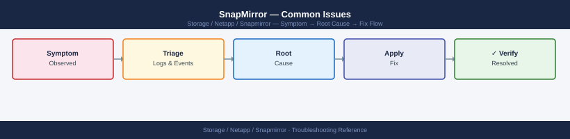

---
tags:
  - netapp
  - troubleshooting
search:
  boost: 1.5
description: "SnapMirror troubleshooting: snapmirror show -fields status,health for broken relationships, transfer failures, missing common snapshots, and NetApp..."
---
# SnapMirror — Common Issues

<div class="kb-summary">
SnapMirror troubleshooting: `snapmirror show -fields status,health` for broken relationships, transfer failures, missing common snapshots, and NetApp support escalation.

*Applies to: SnapMirror*
</div>


---

```d2
direction: down

symptom: Identify Symptom {shape: diamond}
diagnostic_flow: "Diagnostic Flow" {shape: rectangle}
common_issues_reference: "Common Issues Reference" {shape: rectangle}
verify_resolution: "Verify resolution" {shape: rectangle}
resolution: Resolve or Escalate {shape: oval}

symptom -> diagnostic_flow: investigate
symptom -> common_issues_reference: investigate
symptom -> verify_resolution: investigate
diagnostic_flow -> resolution
common_issues_reference -> resolution
verify_resolution -> resolution
```

## Diagnostic Flow

```d2
direction: right

S: "What is the symptom?" {shape: rectangle}
A: "Relationship in broken-off state" {shape: rectangle}
B: "Lag time exceeding RPO" {shape: rectangle}
C: "Transfer stuck in progress" {shape: rectangle}
D: "Destination volume full" {shape: rectangle}
E: "SnapMirror Sync out of sync" {shape: rectangle}
A1: "A1" {shape: rectangle}
A2: "Resync after confirming data direction — see\nCommon Issues Reference" {shape: rectangle}
A3: "Check for manual quiesce and break commands in\naudit log" {shape: rectangle}
B1: "B1" {shape: rectangle}
B2: "Check intercluster LIF and WAN bandwidth — see\nCommon Issues Reference" {shape: rectangle}
B3: "Increase transfer frequency or adjust throttle" {shape: rectangle}
C1: "C1" {shape: rectangle}
C2: "Abort and restart transfer — see Common Issues\nReference" {shape: rectangle}
C3: "Check network interruption and resume transfer" {shape: rectangle}
D1: "D1" {shape: rectangle}
D2: "Update SnapVault retention and delete excess snapshots" {shape: rectangle}
D3: "Expand destination volume size — see Common Issues\nReference" {shape: rectangle}
E1: "Check intercluster latency; relationship auto-\nresyncs on restore — see Common Issues Reference" {shape: rectangle}

S -> A
S -> B
S -> C
S -> D
S -> E
A1 -> A2
A1 -> A3
B1 -> B2
B1 -> B3
C1 -> C2
C1 -> C3
D1 -> D2
D1 -> D3
E -> E1
```

---

## Before you begin

- **Access:** Storage admin credentials (cluster admin or equivalent)
- **Gather first:** recent error message text, event timestamps, and affected object names
- **Scope:** confirm whether the issue affects a single object, host, cluster, or site
- **Escalation:** open a vendor support ticket before running any destructive step
- **Logging:** document each command and output — required if escalation is needed

---

## Common Issues Reference

| Symptom | Likely Cause | Action |
|---|---|---|
| Relationship in `broken-off` state | `snapmirror quiesce` + `snapmirror break` was run manually for a DR test or failover and was never resynced | Resync with `snapmirror resync -destination-path svm_dst:vol_dst`; confirm data direction before running |
| Lag time exceeding RPO | Network congestion, high source change rate, or transfer schedule too infrequent | Check `snapmirror show -fields lag-time,transfer-bytes`; increase schedule frequency or investigate network bandwidth |
| Transfer stuck in progress | Network interruption mid-transfer or source snapshot deleted before transfer completed | Run `snapmirror abort -destination-path svm_dst:vol_dst`; wait for abort to complete; restart with `snapmirror update` |
| Destination volume full | SnapVault/XDP retention policy not pruning old snapshots; autogrow not configured | Check destination volume space with `volume show -fields size,used`; review SnapVault retention rules; delete excess snapshots |
| SMBC mediator unreachable | Network connectivity issue to mediator VM or mediator service not running | Check mediator connectivity from both clusters: `snapmirror mediator show`; verify mediator VM status and network path |
| Initialize failing: destination not DP type | Destination volume created as RW instead of DP | Delete and recreate destination volume with `-type DP`; rerun `snapmirror initialize` |
| SnapMirror Sync showing `Out-of-Sync` | Inter-site latency exceeded threshold or network interruption | Check intercluster LIF connectivity; relationship auto-resyncs when connectivity restores within the resync window |
| SVM-DR update failing | SVM configuration change on source not yet reflected on destination | Run `snapmirror update -destination-path svm_dst:` at the SVM level to force a configuration sync |

---

## Verify resolution

- Confirm the original symptom no longer occurs
- Check logs for any residual errors related to the issue
- Monitor for 10–15 minutes to confirm the fix is stable

---

## See also

- [Snapmirror — Diagnostics](../diagnostics/)
- [Snapmirror — Escalation](../escalation/)
- [Snapmirror — Health Checks](../../operations/health-checks/)
