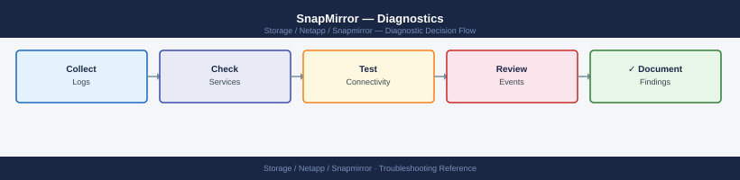

---
tags:
  - netapp
  - troubleshooting
search:
  boost: 1.5
---
# SnapMirror — Diagnostics

<div class="kb-summary">
SnapMirror diagnostic commands: check relationship health and lag with snapmirror show, diagnose intercluster LIF connectivity, trace transfer errors in ONTAP EMS, check SM-BC mediator status, and collect diagnostic output for NetApp support cases.

*Applies to: ONTAP 9.x SnapMirror (Async, Sync, SM-BC, SnapVault)*
</div>


```d2
direction: right

A: "SnapMirror Issue" {shape: rectangle}
B: "snapmirror show\nfields lag-time,healthy" {shape: rectangle}
C: "C" {shape: rectangle}
D: "snapmirror show\n-destination-path\nRead Reason field" {shape: rectangle}
E: "snapmirror show-history\nLast transfer duration" {shape: rectangle}
F: "F" {shape: rectangle}
G: "network interface show\n-role intercluster" {shape: rectangle}
H: "event log show\n-message-name snapmirror.*" {shape: rectangle}
I: "snapmirror mediator show\nCheck mediator connectivity" {shape: rectangle}
J: "J" {shape: rectangle}
K: "Check intercluster\nLIF bandwidth" {shape: rectangle}
L: "snapmirror abort\nThen retry update" {shape: rectangle}
M: "ping -lif <ic-lif>\n-destination <dest-lif>" {shape: rectangle}
N: "Collect AutoSupport\nand EMS for NetApp SR" {shape: rectangle}

A -> B
C -> D
C -> E
F -> G
F -> H
F -> I
J -> K
J -> L
G -> M
H -> N
I -> N
K -> N
L -> N
M -> N
```

```d2
direction: down

symptom: Identify Symptom {shape: diamond}
step_1_check_relationship_health_and: "Step 1 — Check relationship health and lag" {shape: rectangle}
step_2_check_transfer_history: "Step 2 — Check transfer history" {shape: rectangle}
step_3_check_intercluster_lifs: "Step 3 — Check intercluster LIFs" {shape: rectangle}
step_4_check_ontap_ems_for_snapmirro: "Step 4 — Check ONTAP EMS for SnapMirror events" {shape: rectangle}
step_5_smbc_specific_diagnostics: "Step 5 — SM-BC specific diagnostics" {shape: rectangle}
step_6_collect_autosupport_and_ems_f: "Step 6 — Collect AutoSupport and EMS for NetApp SR" {shape: rectangle}
resolution: Resolve or Escalate {shape: oval}

symptom -> step_1_check_relationship_health_and: investigate
symptom -> step_2_check_transfer_history: investigate
symptom -> step_3_check_intercluster_lifs: investigate
symptom -> step_4_check_ontap_ems_for_snapmirro: investigate
symptom -> step_5_smbc_specific_diagnostics: investigate
symptom -> step_6_collect_autosupport_and_ems_f: investigate
step_1_check_relationship_health_and -> resolution
step_2_check_transfer_history -> resolution
step_3_check_intercluster_lifs -> resolution
step_4_check_ontap_ems_for_snapmirro -> resolution
step_5_smbc_specific_diagnostics -> resolution
step_6_collect_autosupport_and_ems_f -> resolution
```

## Before you begin

- **Access:** Cluster admin credentials on both source and destination ONTAP clusters; SSH or NetApp System Manager access
- **Gather first:** the relationship path (`source-svm:volume` → `dest-svm:volume`), current lag time, and the "Reason" text from `snapmirror show` on the unhealthy relationship
- **Scope:** confirm whether the issue affects a single volume relationship, all relationships on one cluster, or all cross-cluster replication
- **SM-BC caution:** for SM-BC relationships, do not run `snapmirror break` or `snapmirror resync` without confirming the mediator is reachable — automatic failover requires the mediator to be healthy
- **Logging:** run each command and save the output; ONTAP EMS event log is the primary artifact for NetApp TAC cases

---

## Step 1 — Check relationship health and lag

```bash
# Summary view — all relationships with health and lag
snapmirror show -fields lag-time,healthy,last-transfer-end-timestamp,status
# Columns:
#   healthy:       true = no errors; false = relationship has an error
#   lag-time:      time since last successful transfer; for async: should be < schedule interval
#   status:        Idle | Transferring | Aborting | Quiesced | Broken-off
# Focus on rows with healthy=false first

# Detailed view of a specific relationship
snapmirror show -destination-path <dest-svm>:<dest-vol>
# Key fields:
#   Relationship Status:   Snapmirrored | Broken-off | Quiesced
#   Transferring?:         true if a transfer is in progress
#   Last Transfer Size:    how much data moved in the last transfer
#   Unhealthy Reason:      exact error text — this is what to search in NetApp KB and EMS

# All destination relationships from this cluster's perspective
snapmirror list-destinations
# Shows: source path, dest path, relationship type, status

# Find all broken-off (activated) relationships
snapmirror show -relationship-status broken-off
# Expected: none in normal operation; present after a DR failover
```


```text title="Expected output"
Source Destination Lag Time Healthy Last Transfer End Timestamp Status
------- ----------- -------- ------- ---------------------------- ------
svm1:vol_data svm2:vol_data_mirror 00:15:32 true 2024-01-15 14:32:18 +00:00 Idle
svm1:vol_logs svm2:vol_logs_mirror 00:08:45 false 2024-01-15 14:28:02 +00:00 Idle
svm3:vol_archive svm4:vol_archive_dr 02:22:10 true 2024-01-15 12:15:55 +00:00 Idle
svm2:vol_critical svm3:vol_critical_bak 00:31:05 false 2024-01-15 14:05:33 +00:00 Transferring
...

Source Destination: svm1:vol_logs svm2:vol_logs_mirror
Relationship Status: Snapmirrored
Transferring?: false
Last Transfer Size: 2.4GB
Unhealthy Reason: Transfer aborted: insufficient space on destination volume

Destination Paths:
svm1:vol_data → svm2:vol_data_mirror (type: DP, status: Snapmirrored)
svm1:vol_logs → svm2:vol_logs_mirror (type: DP, status: Snapmirrored)
svm3:vol_archive → svm4:vol_archive_dr (type: DP, status: Snapmirrored)

Relationship Status: broken-off
(no relationships found)
```

!!! warning "Common errors"
    **`Error: command failed: No such relationship`** — Verify the destination path format is correct (svm-name:volume-name) and the relationship exists with `snapmirror show`.
    **`Transfer aborted: insufficient space on destination volume`** — Increase the destination volume size with `volume modify -vserver <dest-svm> -volume <dest-vol> -size +<amount>` or enable autogrow.
    **`Transfer failed: source volume is offline`** — Bring the source volume online with `volume online -vserver <src-svm> -volume <src-vol>` and resume the relationship with `snapmirror resume -destination-path <dest-svm>:<dest-vol>`.
---

## Step 2 — Check transfer history

```bash
# Transfer history for a specific relationship (last 20 transfers)
snapmirror show-history -destination-path <dest-svm>:<dest-vol>
# Shows: start time, end time, bytes transferred, transfer duration, status
# Look for: recent failures, very short durations (abort), increasing transfer size

# Active transfers in progress right now
snapmirror show -fields is-current-op-abort-enabled,transferring | grep -i true

# Abort a stuck transfer (safe — only cancels the current transfer; does not break the relationship)
snapmirror abort -destination-path <dest-svm>:<dest-vol>
# Then manually trigger a new update:
snapmirror update -destination-path <dest-svm>:<dest-vol>
```


```text title="Expected output"
Source Path: cluster1://prod_svm:prod_vol
                                  Destination Path: cluster2://dr_svm:prod_vol
                                             Start Time: 11/15/2024 14:32:18
                                               End Time: 11/15/2024 14:47:52
                                       Bytes Transferred: 847.3GB
                                       Transfer Duration: 915 seconds
                                                 Result: Success
                                       Bytes Transferred: 823.1GB
                                       Transfer Duration: 28 seconds
                                                 Result: Aborted
                                       Bytes Transferred: 1.2TB
                                       Transfer Duration: 1847 seconds
                                                 Result: Success

Is-current-op-abort-enabled Transferring
true               true
true               true

Operation succeeded: SnapMirror transfer aborted for destination "cluster2://dr_svm:prod_vol".

Operation succeeded: SnapMirror update started for destination "cluster2://dr_svm:prod_vol".
```

!!! warning "Common errors"
    **`Error: command failed: No SnapMirror relationship found for destination path cluster2://dr_svm:prod_vol`** — Verify the destination SVM and volume names are correct using `snapmirror show` without filters.
    **`Error: SnapMirror transfer cannot be aborted: transfer is not in progress`** — Check if the transfer has already completed or failed using `snapmirror show-history`; only active transfers can be aborted.
    **`Error: This operation is not permitted: SnapMirror relationship is broken`** — Resynchronize the relationship with `snapmirror resync -destination-path <dest-svm>:<dest-vol>` before attempting manual updates.
---

## Step 3 — Check intercluster LIFs

SnapMirror traffic uses dedicated intercluster logical interfaces. If these are down or misconfigured, all cross-cluster replication fails.

```bash
# List all intercluster LIFs on the local cluster
network interface show -role intercluster
# Columns: LIF Name, SVM, Home Node, Home Port, Current Node, Current Port, Status Admin/Oper
# Expected: Status Admin = up, Status Oper = up for all intercluster LIFs

# Test ICMP reachability between intercluster LIFs
network ping -lif <local-intercluster-lif> -destination <remote-intercluster-lif-ip>
# Expected: 0% packet loss; round-trip time < 5ms (LAN) or < 80ms (WAN typical)

# Check intercluster peer relationship
cluster peer show
# Shows: peer cluster name, availability (Available/Partial/Unavailable), ping status
# If status = Unavailable: intercluster LIF connectivity is broken

# Show intercluster peer detail
cluster peer show -instance
# Shows: remote IPs, last heartbeat, authentication status
```


```text title="Expected output"
Vserver         LIF                       Node            Port       Status
-------         ---                       ----            ----       ------
cluster1        cluster1_icl_1            node-01         e0c        up
cluster1        cluster1_icl_2            node-02         e0c        up
cluster1        cluster1_icl_3            node-03         e0d        up

PING 10.45.12.8 from 10.45.12.5: 56 bytes of data.
64 bytes from 10.45.12.8: icmp_seq=0 tloc=1.234 ms
64 bytes from 10.45.12.8: icmp_seq=1 tloc=1.156 ms
64 bytes from 10.45.12.8: icmp_seq=2 tloc=1.289 ms
3 packets transmitted, 3 packets received, 0% packet loss

Cluster-Name          Cluster-UUID                 Availability   Authentication
-----------           -------                      -----------    ---------------
cluster2-prod         4a1b2c3d-5e6f-7a8b-9c0d-1e2f3a4b5c6d   Available      ok

Peer Cluster Name: cluster2-prod
           Remote Intercluster LIFs: 10.45.12.8, 10.45.12.9
           Peer Addresses: 192.168.100.15, 192.168.100.16
           Last Heartbeat: 2024-01-15 14:32:18
           Authentication Status: ok
           Availability: Available
```

!!! warning "Common errors"
    **`Error: command failed: No entry found for intercluster LIFs`** — Verify intercluster LIFs exist by running `network interface show -role intercluster` and create them if missing using `network interface create -vserver <cluster> -lif <name> -role intercluster -home-node <node> -home-port <port> -address <ip> -netmask <mask>`.
    **`100% packet loss`** — Check firewall rules allow UDP 11104-11105 between clusters, verify network routing with `network route show`, and confirm intercluster LIF is in "up" status.
    **`Cluster peer show: Availability = Unavailable`** — Verify both clusters can reach each other's intercluster LIFs using `network ping`, check DNS resolution, and re-establish the peer relationship with `cluster peer create -peer-addrs <remote-ip>`.
---

## Step 4 — Check ONTAP EMS for SnapMirror events

```bash
# Show all SnapMirror-specific EMS events (most specific filter)
event log show -message-name "snapmirror.*" -severity error -time-range <start>..<end>
# Replace <start>..<end> with: "2026-06-15 08:00:00".."2026-06-15 10:00:00"

# Broader search — all errors in the relevant time window
event log show -severity error -time-range <start>..<end>
# Look for: snapmirror, network, disk, aggr messages

# Show EMS messages mentioning a specific volume
event log show -node * | grep -i "<volume-name>"

# Common SnapMirror EMS messages and their meaning:
#   snapmirror.src.notSnapshot   → source snapshot was deleted before transfer completed
#   snapmirror.xfer.write.err    → write error on destination volume; check destination aggregate
#   snapmirror.dst.noSpace       → destination volume or aggregate is full
#   netc.conn.refused            → intercluster connection refused; LIF or firewall issue
```


```text title="Expected output"
cluster1::> event log show -message-name "snapmirror.*" -severity error -time-range "2026-06-15 08:00:00".."2026-06-15 10:00:00"
Time                Node             Severity Event
------------------ ---------------- -------- ----------------------------------------
2026-06-15 08:23:14 cluster1-01       ERROR    snapmirror.xfer.write.err
2026-06-15 08:47:22 cluster1-02       ERROR    snapmirror.dst.noSpace
2026-06-15 09:15:08 cluster1-01       ERROR    snapmirror.src.notSnapshot
2026-06-15 09:52:31 cluster1-02       ERROR    snapmirror.xfer.write.err

cluster1::> event log show -severity error -time-range "2026-06-15 08:00:00".."2026-06-15 10:00:00"
Time                Node             Severity Event
------------------ ---------------- -------- ----------------------------------------
2026-06-15 08:12:45 cluster1-01       ERROR    netc.conn.refused
2026-06-15 08:23:14 cluster1-01       ERROR    snapmirror.xfer.write.err
2026-06-15 08:47:22 cluster1-02       ERROR    snapmirror.dst.noSpace
2026-06-15 09:15:08 cluster1-01       ERROR    snapmirror.src.notSnapshot
2026-06-15 09:52:31 cluster1-02       ERROR    snapmirror.xfer.write.err
...

cluster1::> event log show -node * | grep -i "vol_data_prod"
2026-06-15 08:23:14 cluster1-01       ERROR    snapmirror.xfer.write.err: SnapMirror transfer write error on destination volume vol_data_prod in vserver vs_prod
2026-06-15 09:15:08 cluster1-01       ERROR    snapmirror.src.notSnapshot: Source snapshot deleted before SnapMirror transfer completed for vol_data_prod
```

!!! warning "Common errors"
    **`Error: invalid value for "-time-range" option`** — Ensure the date format matches "YYYY-MM-DD HH:MM:SS" and use two dots (..) to separate start and end times.
    **`Error: unknown event message name "snapmirror.*"`** — Use the exact message name without wildcards in the -message-name parameter, or omit the filter to search all events and pipe to grep instead.
---

## Step 5 — SM-BC specific diagnostics

For SnapMirror Business Continuity (SM-BC / SnapMirror Active Sync) issues:

```bash
# Check mediator connectivity
snapmirror mediator show
# Shows: mediator IP, mediator version, peer cluster, connectivity (Reachable/Unreachable)
# Expected: Connected = true, mediator-state = success

# List all SM-BC consistency groups
consistency-group show
# Shows: CG name, source cluster, dest cluster, status, RPO, state

# Check SM-BC relationship state
snapmirror show -policy AutomatedFailOver
# Status should be: Insync (healthy) or OutOfSync (problem)

# If mediator is unreachable — SM-BC falls back to standard sync (no automatic failover)
# Test mediator manually from Linux CLI on mediator VM:
curl https://<mediator-ip>/api/v1/heartbeat
# Expected: HTTP 200 with cluster peer info

# Trigger SM-BC mediator re-connection (if mediator was temporarily unavailable)
snapmirror mediator remove -peer-cluster <peer>
snapmirror mediator add -peer-cluster <peer> -username <user> -mediator-address <ip>
```


```text title="Expected output"
Mediator Address: 192.168.100.45
Mediator Version: 1.3.2
Peer Cluster: cluster2-01
Connectivity: Reachable
Connected: true
Mediator-state: success

CG Name                    Source Cluster    Dest Cluster      Status      RPO
cg-prod-db-01              cluster1-01       cluster2-01       InSync      0s
cg-prod-app-02             cluster1-01       cluster2-01       InSync      0s
cg-dr-backup-03            cluster1-01       cluster2-01       OutOfSync   45s

Source Destination Policy             SnapMirror State Healthy
cluster1-01: cg-prod-db-01 cluster2-01: cg-prod-db-01 AutomatedFailOver Insync true
cluster1-01: cg-prod-app-02 cluster2-01: cg-prod-app-02 AutomatedFailOver Insync true

  % Total    % Received % Xferd  Average Speed   Time    Current
                                 Dload  Upload   Total   Spent    Left Speed
100   284  100   284    0     0   1205      0 --:--:-- -- 0:00:00 --:--:-- 0:00:00
{"cluster_peer_uuid":"a1b2c3d4-e5f6-7890-abcd-ef1234567890","mediator_version":"1.3.2"}

Mediator removed for peer cluster cluster2-01.
Mediator added for peer cluster cluster2-01 with address 192.168.100.45.
```

!!! warning "Common errors"
    **`Error: Mediator is unreachable. Failover capability is disabled.`** — Verify mediator VM is running and network connectivity exists from both clusters to the mediator IP on port 443.
    **`Error: curl: (60) SSL certificate problem: self signed certificate`** — Add the `-k` flag to curl (`curl -k https://<mediator-ip>/api/v1/heartbeat`) or import the mediator's CA certificate into the cluster's certificate store.
    **`Error: Mediator add failed: Authentication failed for peer cluster`** — Confirm the mediator username and password are correct and the mediator has been initialized with `mediator setup` on the mediator VM.
---

## Step 6 — Collect AutoSupport and EMS for NetApp SR

```bash
# Invoke AutoSupport for the affected node (preferred artifact for NetApp TAC)
system node autosupport invoke -node * -type all -message "SnapMirror investigation case #<case-id>"

# Export EMS log to a file
event log show -severity error -time-range <start>..<end> > /tmp/ems-error-$(date +%F).txt

# Collect all-in-one SnapMirror diagnostic snapshot
{
  echo "=== snapmirror show summary ==="
  snapmirror show -fields lag-time,healthy,status
  echo "=== cluster peer show ==="
  cluster peer show
  echo "=== network interface show intercluster ==="
  network interface show -role intercluster
  echo "=== snapmirror mediator show (if SM-BC) ==="
  snapmirror mediator show 2>/dev/null || echo "No mediator configured"
  echo "=== EMS errors (last 2 hours) ==="
  event log show -severity error -time-range "-2h".."now"
} 2>&1 | tee /tmp/snapmirror-diag-$(date +%F-%H%M).txt
```


```text title="Expected output"
Invoking AutoSupport on all nodes...
AutoSupport successfully invoked on node cluster1-01
AutoSupport successfully invoked on node cluster1-02

=== snapmirror show summary ===
Source Destination Lag-time Healthy Status
cluster1://svm1/vol_data cluster2://svm1/vol_data 00:15:32 true SnapMirrored
cluster1://svm1/vol_logs cluster2://svm1/vol_logs 00:22:18 false Transferring
cluster1://svm2/vol_archive cluster2://svm2/vol_archive 02:45:00 false Idle

=== cluster peer show ===
Peer Cluster Name         Availability Authentication
cluster2                  Available    ok

=== network interface show intercluster ===
Vserver Name             IP Address       Status
cluster1 intercluster_1  192.168.100.10   up
cluster1 intercluster_2  192.168.100.11   up

=== snapmirror mediator show (if SM-BC) ===
No mediator configured

=== EMS errors (last 2 hours) ===
Time                Node             Severity Event
2024-01-15 14:32:18 cluster1-01      ERROR    SnapMirror transfer failed: Network timeout
2024-01-15 13:47:22 cluster1-02      ERROR    Intercluster LIF down: cluster2 unreachable
2024-01-15 13:15:09 cluster1-01      ERROR    Snapmirror lag threshold exceeded on vol_logs

Diagnostic output saved to /tmp/snapmirror-diag-2024-01-15-1445.txt
```

!!! warning "Common errors"
    **`Error: command not found: snapmirror`** — Verify you are running commands on a NetApp ONTAP cluster (not a Linux host) and have appropriate cluster admin privileges.
    **`Error: No cluster peer relationship found`** — Establish cluster peering first using `cluster peer create` before attempting SnapMirror operations.
    **`Error: event log show: invalid time-range format`** — Use valid time-range syntax like `"-2h".."now"` or absolute timestamps in `YYYY-MM-DD HH:MM:SS` format.
---

## Log locations

| Component | Command / Location | What to look for |
|---|---|---|
| ONTAP EMS | `event log show -message-name "snapmirror.*"` | Transfer errors, network failures |
| Transfer history | `snapmirror show-history -destination-path <path>` | Failed transfers, duration trends |
| Cluster peer | `cluster peer show` | Availability status, authentication |
| AutoSupport | `system node autosupport invoke` | Full system state snapshot for NetApp TAC |

---

## See also

- [SnapMirror — Common Issues](../common-issues/)
- [SnapMirror — Escalation](../escalation/)
- [SnapMirror — Health Checks](../../operations/health-checks/)

## Verify resolution

- `snapmirror show -fields healthy` shows `healthy=true` for all affected relationships
- `snapmirror show -fields lag-time` shows lag below 1× the schedule interval for async relationships
- `cluster peer show` shows `Available` for all peer cluster relationships
- For SM-BC: `snapmirror mediator show` shows `Connected = true` and mediator-state = success
- Trigger a manual `snapmirror update` and confirm it completes with `status=Idle` and a new transfer end time
