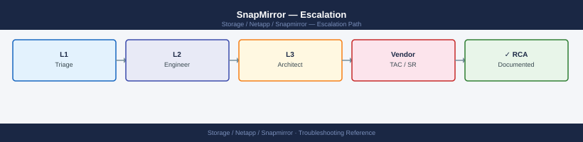
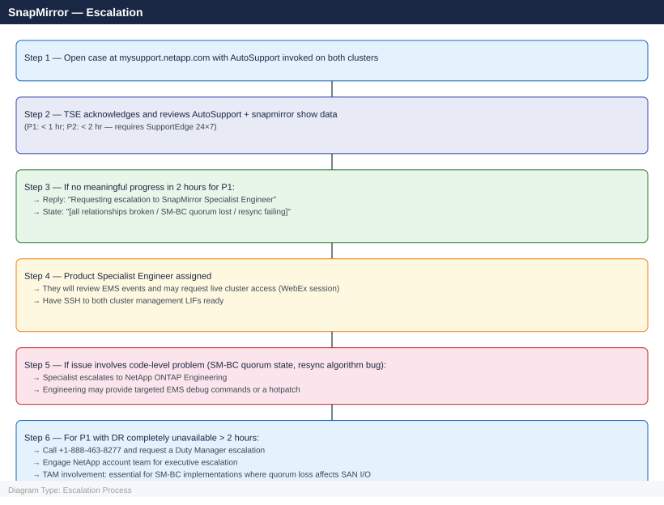

---
tags:
  - netapp
  - troubleshooting
search:
  boost: 1.5
description: "How to escalate NetApp SnapMirror replication issues to NetApp support: what data to collect, how to invoke AutoSupport on both clusters, step-by-step..."
---
# SnapMirror — Escalation

<div class="kb-summary">
How to escalate NetApp SnapMirror replication issues to NetApp support: what data to collect, how to invoke AutoSupport on both clusters, step-by-step case creation on mysupport.netapp.com, and the escalation path when progress stalls.

*Applies to: SnapMirror Async, Sync, SM-BC, SVM-DR on ONTAP 9.x*
</div>



---

```d2
direction: down

symptom: Identify Symptom {shape: diamond}
preescalation_selfcheck: "Pre-Escalation Self-Check" {shape: rectangle}
stepbystep_data_collection: "Step-by-Step Data Collection" {shape: rectangle}
how_to_open_the_sr_on_mysupportnetap: "How to Open the SR on mysupport.netapp.com" {shape: rectangle}
escalation_path: "Escalation Path" {shape: rectangle}
what_not_to_do: "What NOT to Do" {shape: rectangle}
useful_commands_for_case_updates: "Useful Commands for Case Updates" {shape: rectangle}
resolution: Resolve or Escalate {shape: oval}

symptom -> preescalation_selfcheck: investigate
symptom -> stepbystep_data_collection: investigate
symptom -> how_to_open_the_sr_on_mysupportnetap: investigate
symptom -> escalation_path: investigate
symptom -> what_not_to_do: investigate
symptom -> useful_commands_for_case_updates: investigate
preescalation_selfcheck -> resolution
stepbystep_data_collection -> resolution
how_to_open_the_sr_on_mysupportnetap -> resolution
escalation_path -> resolution
what_not_to_do -> resolution
useful_commands_for_case_updates -> resolution
```

## Before you begin

- **Access required:** Cluster admin SSH access to both source and destination ONTAP clusters; NetApp support account at mysupport.netapp.com with both cluster serial numbers registered and active support contracts
- **Both clusters required:** SnapMirror issues require data from both sides — NetApp will need AutoSupport, EMS logs, and the `snapmirror show` output from both the source and destination cluster
- **Do NOT run `snapmirror break`** without NetApp guidance — breaking a SnapMirror relationship in an error state (rather than a clean break) may leave the destination in an inconsistent state, requiring a full baseline resync
- **Do NOT delete snapshots on the destination** — the common base snapshot is the only recovery point for the resync after the relationship is restored; deleting it forces a full baseline transfer

---

## Pre-Escalation Self-Check

Run these on both clusters before opening the case.

| Check | Command | Expected result |
|---|---|---|
| Relationship health | `snapmirror show -fields healthy` | All relationships show `true` |
| Relationship state | `snapmirror show -fields state,status` | State: SnapMirrored; Status: Idle or Transferring |
| Lag time | `snapmirror show -fields lag-time` | Below RPO target for each relationship |
| Last transfer success | `snapmirror show -fields last-transfer-end-timestamp` | Recent timestamp (within RPO window) |
| Intercluster LIFs | `network interface show -role intercluster` | All intercluster LIFs are `up` |
| Intercluster connectivity | `network interface show -role intercluster -fields address` then ping each peer LIF | Reachable |
| Mediator (SM-BC only) | `snapmirror mediator show` | Mediator reachable; quorum active |
| AutoSupport delivery | `system node autosupport history show -node * -most-recent 3` | Recent successful deliveries |

---

## Step-by-Step Data Collection

### 1. Get ONTAP versions and cluster serial numbers (both clusters)

```bash
# Run on BOTH the source and destination clusters

# ONTAP version and node serial numbers
system node show -fields model,ontap-version,serial-number

# Cluster name
cluster identity show
```


```text title="Expected output"
Node           Model            ONTAP Version  Serial Number
-------------- ---------------- -------------- ----------------
cluster1-01    A220-24G         9.12.1         4069611000123
cluster1-02    A220-24G         9.12.1         4069611000124

Cluster UUID: 1a2b3c4d-5e6f-7g8h-9i0j-1k2l3m4n5o6p
Cluster Name: cluster1-prod
```

(Running same commands on destination cluster)

Node           Model            ONTAP Version  Serial Number
-------------- ---------------- -------------- ----------------
cluster2-01    A300-48G         9.13.0         4069622000456
cluster2-02    A300-48G         9.13.0         4069622000457

Cluster UUID: 9z8y7x6w-5v4u-3t2s-1r0q-9p8o7n6m5l4k
Cluster Name: cluster2-dr

!!! warning "Common errors"
    **`Error: command failed: permission denied`** — Verify you have cluster admin credentials and are logged in with `security login show`.
    **`Error: This command is not supported on this release of Data ONTAP`** — Confirm both clusters are running ONTAP 9.6 or later, as SnapMirror requires minimum version compatibility.
### 2. Invoke AutoSupport on both clusters

```bash
# Run on BOTH clusters before opening the case
# This sends full diagnostic data to NetApp and links it to your case

system node autosupport invoke \
  -node * \
  -type all \
  -message "SnapMirror P1 incident: [brief description e.g. async relationship broken, DR unavailable]"

# Verify delivery (wait 5 minutes)
system node autosupport history show -node * -most-recent 5
# Look for "sent-successful" status
```


```text title="Expected output"
cluster1::> system node autosupport invoke \
  -node * \
  -type all \
  -message "SnapMirror P1 incident: async relationship broken, DR unavailable"

cluster1-01: Autosupport message queued successfully.
cluster1-02: Autosupport message queued successfully.

cluster1::> system node autosupport history show -node * -most-recent 5
Node: cluster1-01
Index  Timestamp                   Subject                          Status
-----  --------------------------  -------------------------------- ----------------
5      11/22/2024 14:32:15 +00:00  AutoSupport WEEKLY REPORT        sent-successful
4      11/21/2024 09:18:42 +00:00  SnapMirror P1 incident: async...  sent-successful
3      11/20/2024 14:15:03 +00:00  AutoSupport DAILY REPORT         sent-successful
2      11/19/2024 08:45:27 +00:00  AutoSupport DAILY REPORT         sent-successful
1      11/18/2024 14:22:51 +00:00  AutoSupport DAILY REPORT         sent-successful

Node: cluster1-02
Index  Timestamp                   Subject                          Status
-----  --------------------------  -------------------------------- ----------------
5      11/22/2024 14:33:02 +00:00  AutoSupport WEEKLY REPORT        sent-successful
4      11/21/2024 09:19:15 +00:00  SnapMirror P1 incident: async...  sent-successful
3      11/20/2024 14:16:08 +00:00  AutoSupport DAILY REPORT         sent-successful
2      11/19/2024 08:46:12 +00:00  AutoSupport DAILY REPORT         sent-successful
1      11/18/2024 14:23:44 +00:00  AutoSupport DAILY REPORT         sent-successful
```

!!! warning "Common errors"
    **`Error: command not found: system node autosupport`** — Ensure you are connected to the NetApp cluster CLI (not the host shell); use `ssh admin@<cluster-mgmt-ip>` to access the ONTAP CLI.
    **`cluster1::> Error: "sent-failed" status in autosupport history show`** — Verify network connectivity to NetApp support servers with `network ping -destination support.netapp.com` and check firewall rules allowing HTTPS outbound on port 443.
    **`Error: This operation is not permitted: Insufficient privileges`** — Confirm your user account has admin or autosupport privileges; contact your cluster administrator to grant the required role.
### 3. Capture the SnapMirror relationship state

```bash
# Run on the DESTINATION cluster (most complete view)

# Full relationship details including error message
snapmirror show -expanded > /tmp/sm-show-$(date +%Y%m%d%H%M).txt

# Relationship status with lag and last transfer info
snapmirror show -fields state,status,lag-time,healthy,last-transfer-end-timestamp,unhealthy-reason

# Transfer history for affected relationships
snapmirror show-history -destination-path <svm>:<volume>

# Current active transfers
snapmirror show -fields state | grep "Transferring"
```


```text title="Expected output"
cluster1::> snapmirror show -expanded > /tmp/sm-show-20240215143022.txt
cluster1::> snapmirror show -fields state,status,lag-time,healthy,last-transfer-end-timestamp,unhealthy-reason
Source Destination State Status Lag-time Healthy Last-transfer-end-timestamp Unhealthy-reason
------ ----------- ----- ------ -------- ------- --------------------------- -----------------
svm1:vol_prod svm2:vol_prod Snapmirrored Idle 00:15:32 true 2/15/2024 14:15:22 -
svm1:vol_data svm2:vol_data Snapmirrored Idle 00:22:18 false 2/15/2024 13:52:10 Transfer aborted by user
svm3:vol_logs svm4:vol_logs Uninitialized - - false - Initialization not started
svm1:vol_archive svm2:vol_archive Snapmirrored Idle 00:08:45 true 2/15/2024 14:22:33 -

cluster1::> snapmirror show-history -destination-path svm2:vol_data
Source Destination Snapshot Start-time End-time Duration Transfer-size Result
------ ----------- -------- ---------- -------- -------- ------------- ------
svm1:vol_data svm2:vol_data sm_daily_001 2/15/2024 13:45:10 2/15/2024 13:52:10 00:07:00 2.3GB Success
svm1:vol_data svm2:vol_data sm_daily_002 2/14/2024 13:45:05 2/14/2024 14:12:33 00:27:28 8.7GB Success
svm1:vol_data svm2:vol_data sm_daily_003 2/13/2024 13:45:02 2/13/2024 13:58:45 00:13:43 4.1GB Success

cluster1::> snapmirror show -fields state | grep "Transferring"
svm1:vol_prod svm2:vol_prod Transferring
```

!!! warning "Common errors"
    **`Error: command failed: More than one match found for destination-path <svm>:<volume>`** — Specify the full source and destination paths in the format `snapmirror show-history -destination-path svm:volume` or use `-source-path` to disambiguate.
    **`Error: There is no data to display`** — The relationship does not exist or has not completed initialization; verify the relationship exists with `snapmirror show` first.
### 4. Capture EMS events related to SnapMirror

```bash
# Run on BOTH clusters

# SnapMirror-specific EMS events (most relevant)
event log show -message-name snapmirror.* -time-range 24h

# All error events in the last 24 hours
event log show -severity error -time-range 24h

# For SM-BC: Mediator events
event log show -message-name smbc.* -time-range 24h
event log show -message-name mediator.* -time-range 24h
```


```text title="Expected output"
cluster1::> event log show -message-name snapmirror.* -time-range 24h
Time                Node             Severity      Event
------------------ ---------------- ------------- ----------------------------------------
01/15/2025 14:32:18 cluster1-01       NOTICE        snapmirror.update.end
01/15/2025 13:47:52 cluster1-02       NOTICE        snapmirror.update.end
01/15/2025 12:15:33 cluster1-01       INFORMATIONAL snapmirror.initialize.end
01/15/2025 11:22:09 cluster1-02       WARNING       snapmirror.lag.warning
01/15/2025 09:18:44 cluster1-01       NOTICE        snapmirror.update.start

cluster1::> event log show -severity error -time-range 24h
Time                Node             Severity      Event
------------------ ---------------- ------------- ----------------------------------------
01/15/2025 10:05:22 cluster1-02       ERROR         snapmirror.update.failed
01/15/2025 08:33:15 cluster1-01       ERROR         wafl.inconsistent.inode

cluster1::> event log show -message-name smbc.* -time-range 24h
Time                Node             Severity      Event
------------------ ---------------- ------------- ----------------------------------------
01/15/2025 15:10:44 cluster1-01       NOTICE        smbc.consistency.group.sync
01/15/2025 14:28:19 cluster1-02       INFORMATIONAL smbc.failover.completed

cluster1::> event log show -message-name mediator.* -time-range 24h
Time                Node             Severity      Event
------------------ ---------------- ------------- ----------------------------------------
01/15/2025 13:55:07 cluster1-01       NOTICE        mediator.connection.established
```

!!! warning "Common errors"
    **`Error: unexpected operator "-message-name"`** — Verify ONTAP version supports event log filtering syntax; use `event log show | grep snapmirror` as fallback on older releases.
    **`Error: time-range "24h" is not valid`** — Replace with valid time range format such as `-time-range 24h` or use `-start-time "01/14/2025 00:00:00"` depending on ONTAP version.
    **`No events found`** — Confirm SnapMirror relationships exist with `snapmirror show` and verify the time range overlaps with actual activity; check both source and destination cluster logs.
### 5. Check intercluster network and Mediator state

```bash
# Intercluster LIF states and addresses
network interface show -role intercluster

# Cluster peer status
cluster peer show -instance

# Connectivity test between clusters (run from both sides)
cluster peer ping -originating-node <node> -destination-cluster <peer-cluster-name>

# SM-BC Mediator status (if SM-BC is affected)
snapmirror mediator show
```


```text title="Expected output"
Vserver Name: cluster1
    Logical Interface: cluster1_icl1
         IP Address: 192.168.100.45
      Netmask: 255.255.255.0
    Status: up
    Role: intercluster

  Vserver Name: cluster1
    Logical Interface: cluster1_icl2
         IP Address: 192.168.100.46
      Netmask: 255.255.255.0
    Status: up
    Role: intercluster

Cluster Peer UUID: 4a1b9c2d-5e8f-47a3-b6c1-9d2e3f4a5b6c
Cluster Peer Name: cluster2
Availability: available
Authentication Status: ok
Outbound Connections: healthy
Inbound Connections: healthy
IPspace Name: Default
Peer Addresses: 192.168.100.50, 192.168.100.51

Ping to cluster peer cluster2 succeeded.
Round-trip time: 2.341 ms

Mediator Address: 192.168.50.100
Mediator Status: connected
Quorum Status: true
```

!!! warning "Common errors"
    **`Error: command failed: Intercluster LIFs are not configured.`** — Create intercluster LIFs on both clusters using `network interface create -vserver <cluster> -lif <name> -role intercluster -home-node <node> -home-port <port> -address <ip> -netmask <mask>`.
    **`Error: cluster peer ping failed: no route to host`** — Verify network connectivity between clusters and confirm firewall rules allow ICMP and port 11104 (TCP/UDP) for intercluster communication.
    **`Error: Mediator status is 'unreachable'`** — Check mediator IP address configuration with `snapmirror mediator show` and verify network connectivity from both clusters to the mediator IP address.
### 6. Write the timeline

```text title="Timeline template"
Source cluster: src-cluster-01 (AFF A400, ONTAP 9.13.1P5, SN: XXXXXXXX)
Destination cluster: dst-cluster-01 (FAS2820, ONTAP 9.13.1P5, SN: XXXXXXXX)
Relationship type: Async XDP (MirrorAllSnapshots policy)
Protected volumes: 12 volumes across 3 SVMs (SVM-ORACLE, SVM-SAP, SVM-SQLSERVER)
Replication link: 1 Gbps WAN MPLS between Site A and Site B
Issue first observed: 2026-06-15 10:00 UTC
Last successful transfer: 2026-06-15 08:00 UTC (RPO = 2 hours behind)
Changes in 24h before the issue:
  - 08:00: Network maintenance on MPLS circuit; 15-minute outage
  - 08:30: MPLS restored; SnapMirror transfers expected to resume
  - 10:00: snapmirror show: all 12 relationships in "Broken-Off" state, error "network layer error"
AutoSupport invoked: Yes — src-cluster-01 at 10:05 UTC, dst-cluster-01 at 10:07 UTC
Steps already taken:
  - Verified MPLS circuit is restored; inter-cluster LIFs can ping each other
  - Did NOT run snapmirror resync (awaiting NetApp guidance on common snapshot state)
  - Did NOT delete any destination snapshots
Blast radius: DR capability lost for 12 volumes; RPO currently 2 hours and growing; DBA alerted
```

---

## How to Open the SR on mysupport.netapp.com

1. Go to **mysupport.netapp.com** and sign in with your NetApp SSO account.

2. Click **Support** → **Cases & Claims** → **Create a New Case**.

3. Under **Product**, choose **ONTAP** for FAS/AFF hardware.

4. Under **Serial Number**, enter the source cluster node serial number. Repeat for the destination cluster in the case description.

5. Under **Priority**, select:
   - **P1 — Critical**: SM-BC quorum lost and host I/O is failing; all SnapMirror relationships are broken and DR is completely unavailable; a restore is failing during an active disaster recovery
   - **P2 — High**: SnapMirror relationship broken with lag growing; resync failing after a planned maintenance window; SM-BC Mediator unreachable but I/O is continuing; RPO violation imminent
   - **P3 — Medium**: A single relationship is broken; others are healthy; workaround available; no immediate DR risk
   - **P4 — Low**: How-to, SnapMirror design review, pre-migration planning, SVM-DR configuration question

6. In the **Summary** field: relationship type + symptom. Example: `ONTAP 9.13.1P5 — 12 Async XDP SnapMirror relationships Broken-Off after MPLS maintenance, DR unavailable, RPO 2h and growing`.

7. In the **Description** field, paste:
   - ONTAP versions from both clusters (Step 1)
   - AutoSupport invocation confirmation from both clusters (Step 2)
   - `snapmirror show` output for affected relationships (Step 3)
   - SnapMirror EMS events from both clusters (Step 4)
   - Intercluster LIF and cluster peer state (Step 5)
   - The timeline (Step 6)

8. Under **Attachments**, upload any large files not captured by AutoSupport.

9. Click **Submit**. You receive a case number immediately.

10. **P1 only:** call NetApp support after submission:
    - North America: +1-888-463-8277 (24×7 with SupportEdge 24×7)
    - State "P1 — SnapMirror DR unavailable, [X] relationships broken, RPO growing, case XXXXXXXX" at the start of the call.

---

## Escalation Path



---

## What NOT to Do

| Do NOT do this | Why | What to do instead |
|---|---|---|
| Run `snapmirror break` on a relationship in an error state | Breaking in an error state may leave the destination volume in an inconsistent state; the relationship can only be restored via a full resync | Let NetApp confirm the destination state before any break; a controlled break should only happen in a clean state |
| Delete destination snapshots | The common base snapshot is the only anchor for the resync after the relationship is restored; deleting it forces a full baseline transfer that may take hours or days | Leave all destination snapshots intact; only delete after NetApp confirms all common snapshots are no longer needed |
| Run `snapmirror resync` without NetApp confirmation of the common snapshot | A resync without a common snapshot triggers a full baseline; on large volumes this can take days and extends the DR gap | Confirm with NetApp which common snapshot exists before attempting any resync |
| Upgrade ONTAP mid-incident | Adding a new ONTAP version to an already-broken replication state creates additional variables | Freeze all ONTAP upgrades until the SnapMirror relationship is restored and confirmed healthy |
| Delete and recreate the SnapMirror relationship | Recreating the relationship also destroys all existing destination data and requires a full baseline | Only delete and recreate on explicit NetApp instruction, after confirming that no resync from the existing state is possible |
| Modify intercluster LIF configurations during the incident | Changing LIF IPs or routing mid-incident changes the network state NetApp is diagnosing | Freeze all network changes on the intercluster network until NetApp confirms the root cause |

---

## Useful Commands for Case Updates

```bash
# Run on DESTINATION cluster — paste into every case update

# Relationship health and lag
snapmirror show -fields state,status,lag-time,healthy,unhealthy-reason

# Active SnapMirror EMS events (last 2 hours)
event log show -message-name snapmirror.* -time-range 2h

# Intercluster LIF states
network interface show -role intercluster

# Cluster peer connectivity
cluster peer show

# Mediator status (SM-BC only)
snapmirror mediator show
```


```text title="Expected output"
Destination:svm1 Source:svm2 State:snapmirrored Status:idle Lag-time:00:00:00 Healthy:true
Destination:svm3 Source:svm4 State:snapmirrored Status:transferring Lag-time:00:15:32 Healthy:false Unhealthy-reason:transfer-in-progress

Time                Severity Message
2024-01-15 14:32:18 NOTICE   snapmirror.transfer.end: SnapMirror transfer completed for "svm1:vol_data"
2024-01-15 14:28:45 WARNING  snapmirror.lag.threshold: Replication lag exceeded threshold for relationship "svm2:vol_backup"
2024-01-15 14:15:22 ERROR    snapmirror.transfer.failed: Transfer failed for "svm3:vol_critical" - Network timeout

Vserver         LIF                Status  Role
cluster1        cluster1_ic_lif_01 up      intercluster
cluster1        cluster1_ic_lif_02 up      intercluster
cluster2        cluster2_ic_lif_01 down    intercluster

Peer Cluster Name          Peer Address      Status
cluster2-prod              192.168.1.50      peered
cluster3-dr                192.168.1.75      peered

Mediator Address          Mediator Status   Quorum Status
192.168.100.10            connected         true
...
```

!!! warning "Common errors"
    **`snapmirror show: command not found`** — Ensure you are running commands on the destination ONTAP cluster, not a Linux host; SSH into the cluster management IP first.
    **`Error: entry doesn't have a value for this field "lag-time"`** — Remove the `lag-time` field for asynchronous SnapMirror relationships that don't report lag; use `snapmirror show -fields state,status,healthy` instead.
    **`cluster peer show: command not found`** — Verify cluster peer relationships exist before troubleshooting; run `cluster peer show` only if at least one peer cluster is configured.
---

## Support SLA Reference

| Priority | Definition | Initial Response SLA |
|---|---|---|
| P1 — Critical | SM-BC quorum lost; all DR relationships broken; restore failing; DR unavailable | < 1 hour (24×7 — SupportEdge 24×7 required) |
| P2 — High | Relationship broken with growing lag; resync failing; RPO at risk | < 2 hours (24×7 — SupportEdge 24×7 required) |
| P3 — Medium | Single relationship broken; others healthy; workaround available | < 4 hours (business hours) |
| P4 — Low | How-to, design review, migration planning | Next business day |

---

## See also

- [SnapMirror — Diagnostics](../diagnostics/)
- [SnapMirror — Common Issues](../common-issues/)

---

## Verify resolution

- Run `snapmirror show -fields healthy` on the destination cluster and confirm all relationships show `true`
- Run `snapmirror show -fields lag-time` and confirm lag is within the RPO target for each relationship
- Run `snapmirror show -fields last-transfer-end-timestamp` and confirm recent successful transfers
- Run `event log show -message-name snapmirror.* -time-range 2h` on both clusters and confirm no new error events
- Run `cluster peer show` and confirm all cluster peers are reachable
- For SM-BC: run `snapmirror mediator show` and confirm the Mediator is reachable and quorum is active
- Invoke a final AutoSupport tied to the case: `system node autosupport invoke -node * -type all -message "case XXXXXXXX resolved"`
- Monitor the relationship lag for 30 minutes to confirm transfers are completing within the RPO target
