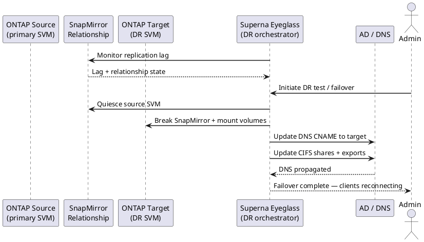

---
tags:
  - architecture
  - netapp
description: "How It Works reference covering Overview, Component Topology, Connectivity, Key CLI Commands, Sizing and 1 more sections."
---
# Superna Eyeglass — How It Works

<div class="kb-summary">
How It Works reference covering Overview, Component Topology, Connectivity, Key CLI Commands, Sizing and 1 more sections.

*Applies to: Superna Eyeglass*
</div>




## Overview

Superna Eyeglass is a DR orchestration platform purpose-built for NetApp PowerScale (Isilon). It automates the share, quota, and DNS reconfiguration steps that previously required hours of manual work during a SyncIQ failover. Eyeglass continuously monitors DR readiness and scores it at 100% only when all shares, exports, quotas, and DNS zones are aligned between primary and DR clusters.

## Component Topology

```d2
direction: right

PS_A: "PowerScale Cluster A\n(production" {shape: rectangle}
PS_B: "PowerScale Cluster B\n(DR" {shape: rectangle}
EG: "Superna Eyeglass\nDR Assistant" {shape: rectangle}
ADMIN: "Admin" {shape: rectangle}
DNS: "DNS / AD\naccess zone cutover" {shape: rectangle}

PS_A -> PS_B
EG -> PS_A
EG -> PS_B
ADMIN -> EG
DNS -> EG
```

## Sizing

| Environment | Eyeglass VM Size |
|---|---|
| < 500 shares | 4 vCPU, 8 GB RAM |
| 500–2,000 shares | 8 vCPU, 16 GB RAM |
| > 2,000 shares | 8 vCPU, 32 GB RAM |

## RPO Tiers

| Data Tier | SyncIQ Schedule | RPO Target | Alert Threshold |
|---|---|---|---|
| Tier 1 (critical file services) | Continuous | < 15 minutes | > 10 minutes lag |
| Tier 2 (departmental shares) | Every 4 hours | < 4 hours | > 3.5 hours lag |
| Tier 3 (archival) | Daily | < 24 hours | > 20 hours lag |

---

## See also

- [Superna Eyeglass — Design Standards](../design-standards/)
- [Superna Eyeglass — Integrations](../integrations/)
- [Superna Eyeglass — Deploy](../../deploy/)
