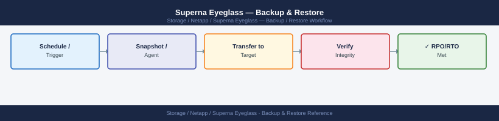
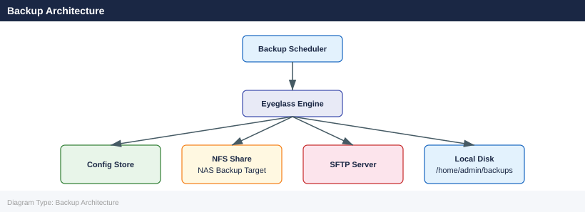

---
tags:
  - netapp
  - operations
---
# Superna Eyeglass — Backup & Restore

<div class="kb-summary">
Eyeglass configuration backup preserves replication policies, SyncIQ jobs, share/export configurations, access zone mappings, and SmartConnect zone settings. Without a current backup, DR failover configuration must be manually re-created.

*Applies to: Superna Eyeglass*
</div>


---

## Before you begin

- **Access:** Storage admin credentials (cluster admin or equivalent)
- **Timing:** safe to run during business hours unless a step is marked ⚠ (causes interruption)
- **Dependencies:** no active upgrades or migrations on the same infrastructure
- **Logging:** capture command output — paste into the change record on completion

---

## What Eyeglass Backs Up

| Category | Backed Up | Notes |
|---|---|---|
| Replication policies (SyncIQ) | Yes | Policy rules, schedules, paths |
| Share/export configuration | Yes | SMB shares, NFS exports, ACLs |
| Access zone mappings | Yes | Source → target zone mapping |
| SmartConnect zone configuration | Yes | DNS zone, subnet, pool mapping |
| DFS namespace configuration | Yes | DFS targets and referrals |
| Quota configuration | Yes | Quota policies and alerts |
| Eyeglass appliance config | Yes | Clusters, credentials, settings |
| PowerScale data | No | Data is replicated by SyncIQ, not Eyeglass |

---

## Backup Architecture



### Restore to New/Replacement Appliance

```bash
# 1. Deploy new Eyeglass OVA (same version as backup)
# 2. Complete initial setup wizard (network, hostname)

# 3. Copy backup file to new appliance
scp eyeglass-backup-<date>.tar.gz admin@<new-eyeglass-ip>:/home/admin/

# 4. SSH to new appliance
ssh admin@<new-eyeglass-ip>

# 5. Import and restore the backup
igls backup import --file /home/admin/eyeglass-backup-<date>.tar.gz
igls backup restore --id <imported-backup-id>

# 6. Verify cluster connections
igls clusters list

# 7. Re-enter cluster credentials (passwords are not stored in backup)
igls clusters update-credentials --cluster <cluster-name>
```


```text title="Expected output"
admin@eyeglass-02:~$ scp eyeglass-backup-2024-01-15.tar.gz admin@192.168.1.45:/home/admin/
eyeglass-backup-2024-01-15.tar.gz                    100%  2847MB   45.2MB/s   01:03

admin@eyeglass-02:~$ ssh admin@192.168.1.45
Last login: Mon Jan 15 14:22:33 2024 from 192.168.1.10
admin@eyeglass-01:~$ igls backup import --file /home/admin/eyeglass-backup-2024-01-15.tar.gz
Backup import started...
Import completed successfully
Backup ID: backup-20240115-prod-001

admin@eyeglass-01:~$ igls backup restore --id backup-20240115-prod-001
Restoring backup backup-20240115-prod-001...
Restore in progress: 45%
Restore in progress: 90%
Restore completed successfully

admin@eyeglass-01:~$ igls clusters list
Cluster Name          Status      Version      Last Seen
netapp-prod-01        DISCONNECTED  9.13.1      2024-01-15 14:18:22
netapp-prod-02        DISCONNECTED  9.13.1      2024-01-15 14:19:05
netapp-dr-01          DISCONNECTED  9.13.1      2024-01-15 14:17:45

admin@eyeglass-01:~$ igls clusters update-credentials --cluster netapp-prod-01
Enter cluster admin username: admin
Enter cluster admin password: 
Credentials updated successfully for netapp-prod-01
```

!!! warning "Common errors"
    **`scp: command not found`** — Install OpenSSH client tools or use `apt-get install openssh-client` on the source system.
    **`igls backup restore: backup ID not found`** — Verify the backup ID from the import output matches exactly, or re-run `igls backup import` to get the correct ID.
    **`Connection refused: Unable to reach cluster netapp-prod-01`** — Confirm network connectivity and cluster IP addresses are correct by running `igls clusters show-config --cluster netapp-prod-01`.
**Note:** Cluster passwords and API tokens are not included in backups for security. After restore, re-enter credentials for each managed PowerScale cluster.

---

## Post-Restore Validation

```bash
# Check Eyeglass service health
igls status

# Verify all clusters are connected
igls clusters list

# Verify replication jobs are visible
igls jobs list

# Check share/export configuration loaded correctly
igls shares list
igls exports list

# Run a configuration sync to verify policies are intact
igls sync run --cluster <cluster-name>
```


```text title="Expected output"
Service Status: RUNNING
Version: 5.2.1
Uptime: 42 days 3 hours
Last Health Check: 2024-01-15 14:32:18 UTC

Cluster Name          Status    Connected Nodes    Last Sync
prod-cluster-01       HEALTHY   3/3                2024-01-15 14:30:22
prod-cluster-02       HEALTHY   4/4                2024-01-15 14:31:05
dr-cluster-03         HEALTHY   2/2                2024-01-15 14:29:44

Job ID                          Status      Progress    Source              Destination
rep-job-2024-01-15-001         RUNNING     67%         prod-cluster-01     prod-cluster-02
rep-job-2024-01-15-002         COMPLETED   100%        prod-cluster-02     dr-cluster-03
rep-job-2024-01-14-045         IDLE        0%          prod-cluster-01     dr-cluster-03

Share Name                      Cluster           Protocol    Status
finance_data                    prod-cluster-01   SMB        ACTIVE
engineering_projects            prod-cluster-02   NFS        ACTIVE
archive_2023                     dr-cluster-03     SMB        ACTIVE

Export Path                     Cluster           Clients    Status
/vol/nfs_export_01              prod-cluster-01   5          ACTIVE
/vol/nfs_export_02              prod-cluster-02   12         ACTIVE

Sync run initiated for cluster: prod-cluster-01
Sync ID: sync-20240115-143245-a7f2e9d1
Status: IN_PROGRESS
Policies validated: 47
Policies updated: 3
Completion time: ~2 minutes remaining
```

!!! warning "Common errors"
    **`Error: Unable to connect to cluster <cluster-name>: Connection refused`** — Verify the cluster hostname/IP is correct and the Eyeglass management network can reach the cluster's management interface.
    **`Error: Sync failed - Policy validation error on cluster <cluster-name>`** — Check cluster logs for policy conflicts and ensure all replication policies are compatible with the target cluster's NetApp version.
    **`Error: igls: command not found`** — Verify Eyeglass is installed and the igls binary is in your PATH, or source the Eyeglass environment setup script.
**GUI validation:**

- [ ] All clusters show as Connected (green)
- [ ] Replication policies visible under DR → Replication
- [ ] Share configurations visible under Configuration → Shares
- [ ] SmartConnect zones mapped correctly
- [ ] Scheduled jobs appear in job monitor

---

## Policy Backup Export (Manual)

For additional protection, export individual policy configurations:

```bash
# Export all SyncIQ policy mappings
igls dr export --format json > eyeglass-policy-export-$(date +%Y%m%d).json

# Export DFS configuration
igls dfs export > eyeglass-dfs-export-$(date +%Y%m%d).json

# Store exports off-appliance
scp eyeglass-policy-export-*.json admin@nas:/backups/eyeglass/
```


```text title="Expected output"
Exporting SyncIQ policy mappings...
Export completed successfully: 847 policies processed
Exporting DFS configuration...
Export completed successfully: 12 DFS shares exported
eyeglass-policy-export-20240115.json                    100%  2.3MB   1.2MB/s   00:02
eyeglass-dfs-export-20240115.json                       100%  456KB   892KB/s   00:01
```

!!! warning "Common errors"
    **`igls: command not found`** — Ensure you are logged into the Eyeglass appliance CLI or source the appropriate environment initialization script.
    **`Permission denied (publickey,password)`** — Verify SSH credentials and that the NAS backup user has write permissions to `/backups/eyeglass/` directory.
    **`No such file or directory`** — Confirm the export commands completed successfully and files exist in the current working directory before attempting the SCP transfer.
---

## Backup Verification Testing

Test backup integrity quarterly:

1. Identify a non-production or DR Eyeglass appliance
2. Restore the latest production backup
3. Verify cluster connectivity (with read-only credentials)
4. Confirm all replication policies, shares, and access zone mappings load correctly
5. Document test result in ITSM

---

## Related Pages

- [Superna Eyeglass — Architecture](../architecture/how-it-works.md)
- [Superna Eyeglass — Health Checks](health-checks.md)

---

## Verify

- Confirm the operation completed without errors in the log or management UI
- Verify the expected state change is visible (service running, object created, config applied)
- Document the outcome in the change record

---

## See also

- [Superna Eyeglass — Procedures](../procedures/)
- [Superna Eyeglass — Health Checks](../health-checks/)
- [Superna Eyeglass — Common Issues](../../troubleshooting/common-issues/)
