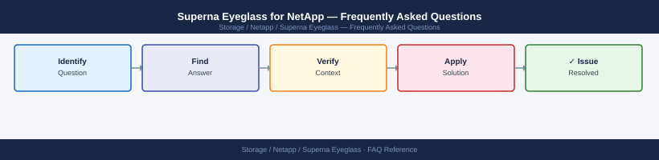

---
tags:
  - netapp-superna-eyeglass
  - faq
  - operations
description: "Common questions about Superna Eyeglass for NetApp operations, configuration, and troubleshooting. For step-by-step procedures, see the Operations section."
---
# Superna Eyeglass for NetApp — Frequently Asked Questions

*Applies to: NetApp ONTAP 9.x*

Common questions about Superna Eyeglass for NetApp operations, configuration, and troubleshooting. For step-by-step procedures, see the <a href="index.md">Operations</a> section.

## General

**Q: What Superna Eyeglass version is recommended?**
A: Eyeglass 2.9.x is the current recommendation. Check via Eyeglass Admin UI → Help → About. Eyeglass runs as a virtual appliance — update via the Eyeglass update mechanism.

**Q: How do I check the current Superna Eyeglass for NetApp version?**
A: `Eyeglass Admin UI → Help → About`

## Configuration

**Q: What is the default configuration replication interval?**
A: Eyeglass replicates CIFS/SMB share and export configurations between clusters every 15 minutes by default. Increase to 5 minutes for environments requiring tighter config sync. Decrease frequency for stable environments to reduce overhead.

**Q: How do I enable Eyeglass ransomware detector?**
A: Eyeglass Ransomware Defender is a licensed add-on. Enable via Eyeglass → Settings → Ransomware → Enable. Configure FPolicy integration on PowerScale. Set entropy threshold and alert recipients.

## Operations

**Q: How do I upgrade Eyeglass without interrupting configuration replication?**
A: Eyeglass upgrades require a brief restart of the appliance. Configuration replication pauses during upgrade (typically 5-10 minutes). After upgrade, verify all managed clusters reconnect via Eyeglass → Inventory.

**Q: What is the correct procedure to add a new PowerScale cluster to Eyeglass?**
A: Eyeglass UI → Inventory → Add Cluster. Provide management IP, API credentials, and cluster name. Eyeglass discovers all SVMs and begins monitoring share/export configurations.

## Troubleshooting

**Q: Eyeglass shows 'Configuration Sync Error' for a cluster pair. What does it mean?**
A: Eyeglass cannot push configuration changes to the destination cluster. Check API connectivity to the destination cluster. Verify credentials have not expired. Review Eyeglass logs under Administration → Logs.

**Q: Eyeglass is slow to reflect configuration changes — where do I start?**
A: Check the replication interval setting. Verify network connectivity between Eyeglass and all clusters. Review the Eyeglass task queue — large configuration changes (many shares) may queue. Increase Eyeglass VM resources if needed.

## Backup and Recovery

**Q: How often should I back up Eyeglass configuration?**
A: Weekly via Eyeglass → Administration → Backup. Backup includes all cluster registrations, replication policies, and alert settings. Store off-appliance.

**Q: Can I restore Eyeglass configuration after appliance failure?**
A: Yes — deploy a new Eyeglass OVA, apply the backup via the Eyeglass restore wizard. All cluster registrations and policies are restored. Re-authenticate any expired cluster credentials after restore.

## See Also

- [Superna Eyeglass for NetApp Operations](index.md)
- [Superna Eyeglass for NetApp Troubleshooting](../../../../troubleshooting/index.md)
