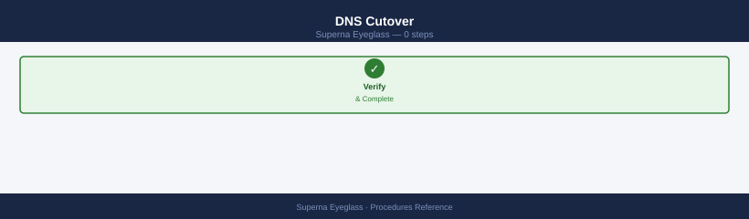
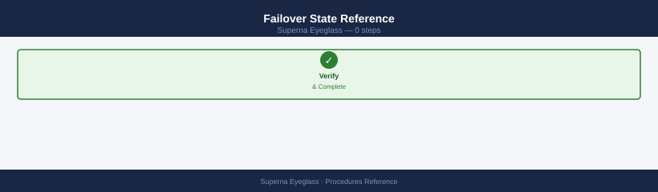
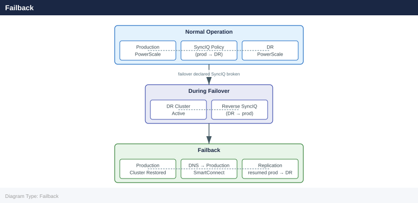
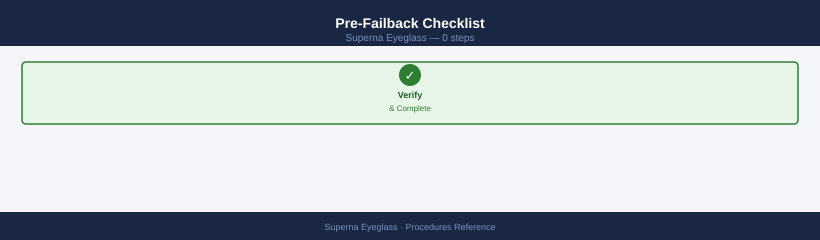
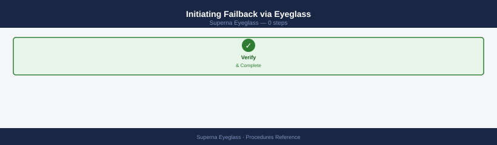
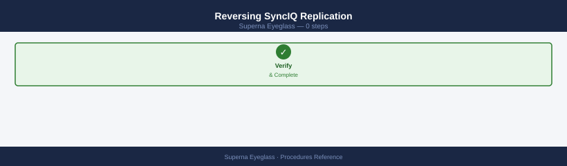
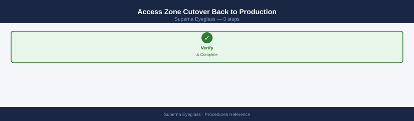
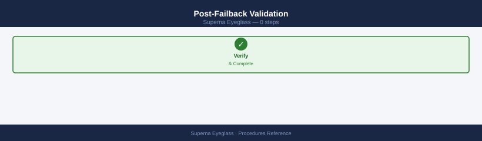

---
tags:
  - netapp
  - operations
---
# Superna Eyeglass — Procedures

<div class="kb-summary">
Procedures reference covering Failover, Failback, Day-to-Day Operations.

*Applies to: Superna Eyeglass*
</div>

## Before you begin

- **Access:** Storage admin credentials (cluster admin or equivalent)
- **Timing:** safe to run during business hours unless a step is marked ⚠ (causes interruption)
- **Dependencies:** no active upgrades or migrations on the same infrastructure
- **Logging:** capture command output — paste into the change record on completion

---

## Failover

Eyeglass DR Assistant orchestrates failover of PowerScale (Isilon) access zones from a production cluster to a DR cluster. Failover includes stopping SyncIQ replication, activating DR access zones, and remapping NFS/SMB shares and DNS entries.

```d2
direction: right

detect: "Detect: Production\ncluster unavailable / event declared" {shape: rectangle}
validateRPO: "Validate RPO\nCheck SyncIQ lag vs threshold" {shape: rectangle}
preflight: "egcli drtest preflight\nConfirm DR prerequisites" {shape: rectangle}
ready: "ready" {shape: rectangle}
noGo: "Escalate — prerequisites\nnot met" {shape: rectangle}
triggerFO: "egcli drfailover\n--policy POLICY --confirm" {shape: rectangle}
breakSync: "Break SyncIQ replication\nDR cluster becomes writable" {shape: rectangle}
activateZones: "Activate DR access zones\nReconfigure NFS/SMB shares" {shape: rectangle}
dnsSwitch: "DNS cutover\nSmartConnect zone → DR VIP pool" {shape: rectangle}
notify: "Notify stakeholders\nSNMP / Email alert" {shape: rectangle}
validate: "Validate client access\nNFS mounts, SMB shares, DNS" {shape: rectangle}
done: "DR cluster active\nMonitor and plan failback" {shape: rectangle}

detect -> validateRPO
validateRPO -> preflight
preflight -> ready
ready -> noGo
ready -> triggerFO
triggerFO -> breakSync
breakSync -> activateZones
activateZones -> dnsSwitch
dnsSwitch -> notify
notify -> validate
validate -> done
```

### DNS Cutover



Eyeglass automates DNS delegation updates if integrated with DNS; manual steps if not.

```bash
# Verify Eyeglass DNS integration is configured
egcli dns status

# If using Eyeglass automated DNS failover — confirm DNS record updated
egcli dns records list --zone <smartconnect_zone>

# If managing DNS manually — update the SmartConnect delegation NS record
# to point to the DR cluster IP pool
# Verify propagation
dig <smartconnect_zone_name> @<internal-dns-server>
nslookup <smartconnect_zone_name>
```


```text title="Expected output"
DNS Status:
  Service: enabled
  Mode: automatic
  Last Update: 2024-01-15 14:32:18 UTC
  Health: healthy

DNS Records for zone: smartconnect.prod.local
  Record ID    Type    Name                          Target IP        TTL    Status
  rec-001      A       svm1.smartconnect.prod.local  192.168.1.50     300    active
  rec-002      A       svm2.smartconnect.prod.local  192.168.1.51     300    active
  rec-003      NS      smartconnect.prod.local       10.50.20.15      3600   active
  rec-004      A       dr-pool.smartconnect.prod.local 10.50.20.16    300    active

; <<>> DiG 9.16.1-Ubuntu <<>> smartconnect.prod.local @10.20.5.8
; (1 server found)
;; global options: +cmd
;; Got answer:
;; ->>HEADER<<- opcode: QUERY, status: NOERROR, id: 54821
;; flags: qr aa rd ra; QUERY: 1, ANSWER: 2, AUTHORITY: 0, ADDITIONAL: 0

;smartconnect.prod.local.		IN	A

smartconnect.prod.local.	300	IN	A	192.168.1.50
smartconnect.prod.local.	300	IN	A	192.168.1.51

;; Query time: 2 msec
;; SERVER: 10.20.5.8#53(10.20.5.8)
;; WHEN: Mon Jan 15 14:35:42 UTC 2024
;; MSG SIZE  rcvd: 78

Server:		10.20.5.8
Address:	10.20.5.8#53

Name:	smartconnect.prod.local
Address: 192.168.1.50
Name:	smartconnect.prod.local
Address: 192.168.1.51
```

!!! warning "Common errors"
    **`egcli: command not found`** — Ensure Eyeglass CLI is installed and added to PATH, or use the full path `/opt/eyeglass/bin/egcli`.
    **`SERVFAIL`** — Verify the internal DNS server IP is reachable and the zone delegation NS records point to the correct Eyeglass or DR cluster IP address.
    **`connection timed out; no servers could be reached`** — Confirm the DNS server specified in the dig/nslookup command is accessible and listening on port 53.
### Failover State Reference



| State | Meaning | Action |
|---|---|---|
| Replicating | Normal — SyncIQ running; production active | No action |
| DR Test Running | Preflight or DR test in progress | Monitor to completion |
| Failing Over | Failover in progress | Monitor; do not interrupt |
| Failed Over | DR cluster is active; SyncIQ stopped | Validate client access; plan failback |
| Failback Running | Reverse sync in progress | Monitor to completion |

```bash
# Check policy state at any time
egcli drpolicy status --policy <policy_name>
```


```text title="Expected output"
Policy Name: prod-dr-policy
Policy Status: ACTIVE
Last Sync: 2024-01-15 14:32:18 UTC
Sync Interval: 3600 seconds
Source Cluster: cluster-prod-01.example.com
Destination Cluster: cluster-dr-02.example.com
Replication Status: IN_SYNC
Last Snapshot: snap_20240115.143200
Snapshot Count: 24
Next Scheduled Sync: 2024-01-15 15:32:18 UTC
```

!!! warning "Common errors"
    **`Error: Policy '<policy_name>' not found`** — Verify the policy name with `egcli drpolicy list` and use the exact policy name from the output.
    **`Error: Connection refused to Eyeglass server at <ip>:8443`** — Ensure the Eyeglass management server is running and reachable; check network connectivity and firewall rules.
    **`Error: Authentication failed - invalid credentials`** — Verify your Eyeglass API credentials are configured correctly in `~/.egcli/config` or via environment variables.
---

## Failback

Failback is the process of returning data and user access from the DR PowerScale cluster back to the production cluster after a failover. Eyeglass orchestrates failback by reversing the SyncIQ replication direction and reassigning access zone configurations.

| Phase | Description |
|---|---|
| Production readiness | Verify production cluster is healthy and storage is ready |
| Reverse replication | Run SyncIQ from DR back to production to sync changes made during failover |
| Access zone failback | Re-map access zones, NFS exports, and SMB shares to production |
| DNS cutover | Return DNS entries to production SmartConnect zones |
| Validation | Confirm client access and data integrity on production |



### Pre-Failback Checklist



```bash
# Confirm production PowerScale cluster is online and healthy
isi status

# Confirm all nodes are up and no critical alerts
isi devices node list
isi alerts list --category critical

# Confirm SyncIQ service is running on production
isi sync service view

# Confirm network interfaces and SmartConnect zones are configured on production
isi network interfaces list
isi network pools list

# Check Eyeglass DR assistant readiness on production Eyeglass instance
egcli drtest preflight --cluster <production-cluster>
```


```text title="Expected output"
Cluster: prod-pscale-01.corp.local
  Cluster Health: OK
  Cluster Status: Online
  Nodes: 6
  OneFS Version: 9.4.0.0
  Uptime: 847 days

Name                State      Status      Health
prod-pscale-01-1    Up         Online      OK
prod-pscale-01-2    Up         Online      OK
prod-pscale-01-3    Up         Online      OK
prod-pscale-01-4    Up         Online      OK
prod-pscale-01-5    Up         Online      OK
prod-pscale-01-6    Up         Online      OK

(no alerts)

Service: SyncIQ
  Enabled: true
  Running: true
  Port: 8080
  Status: Active

Name              IP Address       Status      MTU
ext0              192.168.10.42    Up          1500
ext1              192.168.10.43    Up          1500
mgmt0             10.50.1.15       Up          1500

Name              Subnet           Access Zone  Status
pool-prod-01      192.168.10.0/24  System       Active
pool-prod-02      192.168.11.0/24  System       Active

Eyeglass DR Preflight Check: PASS
  Cluster Connectivity: OK
  SyncIQ Service: Running
  Network Latency: 2.4ms
  Replication Capacity: Available
  Snapshot Schedule: Configured
```

!!! warning "Common errors"
    **`isi: command not found`** — Ensure the PowerScale OneFS CLI tools are installed and the PATH includes the OneFS bin directory, or run commands directly on the cluster.
    **`Error: Unable to connect to cluster <production-cluster>`** — Verify the cluster hostname/IP is correct, network connectivity exists, and credentials are configured in the Eyeglass instance.
    **`Error: SyncIQ service is not running`** — Start the SyncIQ service with `isi sync service start` on the production cluster before proceeding with DR validation.
### Initiating Failback via Eyeglass



```bash
# Log in to Eyeglass DR Assistant (web UI or CLI)
# Eyeglass UI: https://<eyeglass-ip>:8443

# List configured DR policies — confirm current state (failed over)
egcli drpolicy list

# Check which policies are in DR state
egcli drpolicy status --all

# Initiate failback for a specific DR policy
egcli drfailback --policy <policy_name> --confirm

# Monitor failback progress
egcli drfailback status --policy <policy_name>
```


```text title="Expected output"
Policy Name                Status          Last Sync       Failover State
========================================================================
prod-nfs-policy           SYNCED          2024-01-15 14:22  NORMAL
dr-vmware-cluster         SYNCED          2024-01-15 14:18  NORMAL
backup-archive-policy     OUT_OF_SYNC     2024-01-15 13:45  FAILED_OVER
finance-data-dr           SYNCED          2024-01-15 14:20  NORMAL

Policy Name                DR State        Last Update
========================================================================
backup-archive-policy     FAILED_OVER     2024-01-15 13:47
prod-nfs-policy           NORMAL          2024-01-15 14:22
dr-vmware-cluster         NORMAL          2024-01-15 14:18

Initiating failback for policy: backup-archive-policy
Failback operation started. Job ID: EG-FB-20240115-8847
Estimated duration: 45 minutes

Failback Status for policy: backup-archive-policy
Job ID: EG-FB-20240115-8847
Progress: 68%
Elapsed Time: 31 minutes
Estimated Remaining: 14 minutes
Current Phase: Replicating metadata and snapshots
Last Status Update: 2024-01-15 14:53:22 UTC
```

!!! warning "Common errors"
    **`Error: Policy 'backup-archive-policy' is not in FAILED_OVER state`** — Verify the policy is actually in a failed-over state using `egcli drpolicy status --all` before attempting failback.
    **`Error: Authentication failed. Invalid credentials for user 'admin'`** — Ensure you are logged into Eyeglass with valid credentials using `egcli login` before running DR commands.
    **`Error: Failback operation already in progress for policy 'backup-archive-policy'`** — Wait for the current failback to complete or cancel it with `egcli drfailback cancel --policy <policy_name>` before retrying.
### Reversing SyncIQ Replication



During the DR period, users may have written data to the DR cluster. This data must be synced back to production before access is cut back.

```bash
# On DR PowerScale cluster — create a reverse SyncIQ policy
# (Eyeglass automates this, but manual verification is required)
isi sync policies list

# Confirm reverse SyncIQ policy exists and is enabled
isi sync policies view <reverse_policy_name>

# Run the reverse sync manually to trigger immediate catchup
isi sync jobs start <reverse_policy_name>

# Monitor reverse sync job completion
isi sync jobs list
watch -n 30 "isi sync jobs list"
```


```text title="Expected output"
Name                          Enabled  Schedule
-----------------------------  -------  ---------
prod-to-dr-sync               true     Every 4 hours
dr-to-prod-reverse            true     Manual
failover-catchup-policy       false    On Demand

Name:                         dr-to-prod-reverse
Enabled:                      true
Source Cluster:               192.168.10.45
Destination Cluster:          192.168.10.12
Policy Action:                sync
Replication Mode:             snapshot
Last Job State:               succeeded
Last Job Duration:            2847 seconds

Started reverse sync job for policy 'dr-to-prod-reverse'
Job ID: 12847

ID     Policy Name              State      Progress  Duration
-----  -----------------------  ---------  --------  ----------
12847  dr-to-prod-reverse       running    34%       892s
12846  prod-to-dr-sync          succeeded  100%      2156s
12845  dr-to-prod-reverse       succeeded  100%      3021s

Every 30.0s: isi sync jobs list                    Wed Jan 15 14:32:18 2025
ID     Policy Name              State      Progress  Duration
-----  -----------------------  ---------  --------  ----------
12847  dr-to-prod-reverse       running    78%       1847s
```

!!! warning "Common errors"
    **`Error: Policy '<reverse_policy_name>' not found`** — Verify the exact policy name with `isi sync policies list` and ensure it exists on the DR cluster.
    **`Error: Job start failed: Policy is disabled`** — Enable the reverse policy first using `isi sync policies modify <reverse_policy_name> --enabled=true`.
    **`Error: Connection refused to cluster 192.168.10.45`** — Confirm network connectivity and cluster credentials are configured correctly with `isi status`.
### Access Zone Cutover Back to Production



```bash
# On production PowerScale — confirm access zones are configured
isi zone zones list

# Eyeglass: re-activate access zones on production
egcli accesszone activate --cluster <production-cluster> --zone <zone_name>

# Update DNS to point SmartConnect zone back to production VIP pool
# (DNS delegation record update — done at DNS server level)
# Verify DNS resolution for NFS/SMB clients resolves to production IPs
nslookup <smartconnect_zone_name>

# Confirm NFS exports are accessible on production
isi nfs exports list

# Confirm SMB shares are accessible on production
isi smb shares list
```


```text title="Expected output"
ISI_1# isi zone zones list
Name                    Path                    Protocol
System                  /ifs                    NFS,SMB,HDFS
zone-prod-01           /ifs/zone-prod-01       NFS,SMB
zone-prod-02           /ifs/zone-prod-02       NFS,SMB
zone-dr-standby        /ifs/zone-dr-standby    NFS,SMB

ISI_1# egcli accesszone activate --cluster prod-cluster-01 --zone zone-prod-01
[INFO] Activating access zone 'zone-prod-01' on cluster 'prod-cluster-01'...
[SUCCESS] Access zone activated successfully. Status: ACTIVE

ISI_1# nslookup smartconnect.prod.example.com
Server:         10.50.1.10
Address:        10.50.1.10#53

Name:   smartconnect.prod.example.com
Address: 192.168.10.45
Address: 192.168.10.46
Address: 192.168.10.47

ISI_1# isi nfs exports list
Paths                                   Clients
/ifs/zone-prod-01/data                  *
/ifs/zone-prod-01/home                  10.0.0.0/8
/ifs/zone-prod-02/archive               192.168.0.0/16
/ifs/zone-prod-02/backups               10.50.0.0/16

ISI_1# isi smb shares list
Name                    Path                            Permissions
prod_data               /ifs/zone-prod-01/data          Everyone: Full
prod_home               /ifs/zone-prod-01/home          DOMAIN\Users: Change
archive_share           /ifs/zone-prod-02/archive       DOMAIN\Admins: Full
backup_share            /ifs/zone-prod-02/backups       DOMAIN\Backup: Change
```

!!! warning "Common errors"
    **`[ERROR] Access zone 'zone-prod-01' is already ACTIVE on cluster 'prod-cluster-01'`** — Verify the zone status with `egcli accesszone status --cluster <cluster> --zone <zone_name>` before attempting re-activation.
    **`SERVFAIL: query response code returned by server, possible causes: NXDOMAIN, SERVFAIL`** — Confirm DNS delegation records point to the correct production VIP pool and that the DNS server is reachable and responding.
    **`[ERROR] Permission denied: User does not have privileges to list NFS exports`** — Run the command with appropriate admin credentials or ensure your user account has read access to the ISI cluster configuration.
### Post-Failback Validation



| Check | Command | Expected |
|---|---|---|
| Production cluster health | `isi status` | All nodes active |
| SyncIQ policies | `isi sync policies list` | All enabled, last run success |
| Access zones | `isi zone zones list` | All zones on production |
| NFS exports | `isi nfs exports list` | All exports present |
| SMB shares | `isi smb shares list` | All shares accessible |
| DR policy state | `egcli drpolicy status --all` | Back to normal (production) |
| Client access test | Mount and write a test file | Success, no errors |

```bash
# Final confirmation: run Eyeglass preflight on production
egcli drtest preflight --cluster <production-cluster>

# Disable reverse SyncIQ policy (DR-to-prod direction) after failback is confirmed
isi sync policies disable <reverse_policy_name>
```


```text title="Expected output"
Running preflight checks on cluster: prod-cluster-01
Checking cluster connectivity... OK
Checking SMB/NFS protocol availability... OK
Checking replication policy status... OK
Checking available storage capacity... OK
Checking network bandwidth... OK
Preflight validation completed successfully
Status: READY_FOR_DISASTER_RECOVERY

Policy 'dr-to-prod-sync-policy' disabled successfully
```

!!! warning "Common errors"
    **`Error: Unable to connect to cluster <production-cluster>`** — Verify the cluster hostname/IP is correct and network connectivity exists from the Eyeglass appliance to the production cluster.
    **`Error: Policy '<reverse_policy_name>' not found`** — Confirm the exact policy name using `isi sync policies list` and ensure you are connected to the correct cluster.
---

## Configure Replication Job Schedule

SyncIQ policies on the PowerScale cluster control how often data replicates to the DR cluster. Eyeglass monitors these policies and uses their schedules to calculate RPO compliance.

1. Log in to the production PowerScale OneFS web UI at `https://<prod-cluster-ip>:8080` and navigate to **Data Protection > SyncIQ > Policies**.
2. Select the SyncIQ policy to modify (or click **+ Add Policy** to create one) and click **Edit**.
3. Under **Schedule**, choose the replication frequency:
   - **Every N minutes/hours** — use for low-RPO requirements (e.g., every 15 minutes for critical NAS data).
   - **Daily at a fixed time** — use for less critical data with overnight replication windows.
4. Set the **Target Cluster** FQDN and **Target Directory** path — must match what Eyeglass is configured to monitor.
5. Under **Advanced**, configure bandwidth throttling if replication competes with production workloads — set a maximum MB/s during business hours.
6. Save the policy and trigger a manual sync to confirm the schedule is valid:

```bash
isi sync jobs start <policy_name>
isi sync jobs list
```


```text title="Expected output"
Job started successfully.
Job ID: job-20240115-047382
Policy: daily_backup_sync
Started at: 2024-01-15T09:23:44Z

Job ID                    Policy Name          Status      Progress  Started At
job-20240115-047382       daily_backup_sync    RUNNING     12%       2024-01-15T09:23:44Z
job-20240114-091567       hourly_sync          COMPLETED   100%      2024-01-14T18:15:22Z
job-20240114-065421       weekly_archive       COMPLETED   100%      2024-01-14T06:54:11Z
job-20240113-182934       daily_backup_sync    COMPLETED   100%      2024-01-13T18:29:34Z
job-20240113-091203       hourly_sync          COMPLETED   100%      2024-01-13T09:12:03Z
```

!!! warning "Common errors"
    **`Error: Policy '<policy_name>' not found`** — Verify the policy name exists by running `isi sync policies list` and use the exact policy name.
    **`Error: Job already running for policy '<policy_name>'`** — Wait for the current job to complete or cancel it with `isi sync jobs cancel <job_id>` before starting a new one.
7. In the Eyeglass web UI (`https://<eyeglass-ip>:8443`), navigate to **SyncIQ > Policies** and confirm the updated policy appears with the correct RPO display.
8. Verify Eyeglass RPO compliance status turns green within one replication cycle.

---

## Run a DR Test (Non-Disruptive)

A non-disruptive DR test validates failover readiness without affecting production data or client access. Eyeglass runs a preflight check against the DR policy.

1. Log in to the Eyeglass web UI at `https://<eyeglass-ip>:8443` and navigate to **DR Assistant > DR Policies**.
2. Select the policy to test and click **DR Test > Preflight Check**.
3. Eyeglass runs the preflight sequence and reports on each check:
   - SyncIQ replication lag vs. RPO threshold.
   - DR cluster access zone configuration synchronisation.
   - NFS exports and SMB shares present on DR cluster.
   - DNS integration status (if configured).
   - Quota sync status.
4. Review the preflight report — all checks must return **Pass** before a live failover can be executed.
5. For any **Fail** or **Warning** items, remediate before proceeding: common issues are replication lag exceeding RPO, missing NFS export sync, or DNS not configured.

```bash
# CLI equivalent preflight check
egcli drtest preflight --policy <policy_name>
```


```text title="Expected output"
Preflight Check Results for Policy: backup_prod_daily
================================================================================

Checking NetApp cluster connectivity...                                  [OK]
Verifying ONTAP version compatibility (9.9.1)...                        [OK]
Validating snapshot space availability...                               [OK]
  └─ Aggregate aggr_ssd_01: 2.3 TB free (sufficient)
  └─ Aggregate aggr_sas_02: 1.8 TB free (sufficient)
Checking SnapVault relationships...                                     [OK]
  └─ 4 active relationships found
Verifying network connectivity to DR site (10.50.12.5)...               [OK]
Testing backup credential permissions...                                [OK]
Validating policy schedule syntax...                                    [OK]

Preflight check completed successfully. Ready for disaster recovery operations.
```

!!! warning "Common errors"
    **`Error: Policy '<policy_name>' not found in configuration`** — Verify the policy name exists by running `egcli policy list` and use the exact policy name.
    **`Error: Unable to connect to NetApp cluster at <ip>: Connection refused`** — Confirm the cluster management IP is reachable and the Eyeglass service account has network access to port 443.
    **`Error: Insufficient permissions for user 'eyeglass_user': Access denied`** — Ensure the Eyeglass service account has the required ONTAP roles (backup-admin or equivalent) assigned in System Manager.
6. After all checks pass, the policy is marked **DR Ready** in the Eyeglass DR Assistant dashboard — document the test result and timestamp in the DR log.
7. No production traffic is interrupted during this procedure.

---

## Perform DR Failover (Planned)

A planned failover is a controlled switchover initiated during a maintenance window — for example, before planned production maintenance or as a scheduled DR exercise.

1. Confirm all SyncIQ policies are in a healthy, fully replicated state — no replication lag:

```bash
egcli drpolicy status --all
isi sync policies list
```


```text title="Expected output"
Policy Name                    Status          Last Run            Next Run            RPO (hours)
dr-policy-prod-01              HEALTHY         2024-01-15 14:32    2024-01-15 16:00    4
dr-policy-prod-02              HEALTHY         2024-01-15 13:15    2024-01-15 15:00    4
dr-policy-dev-01               WARNING         2024-01-14 22:10    2024-01-15 22:00    24
dr-policy-archive-01           HEALTHY         2024-01-15 12:45    2024-01-16 12:45    48
dr-policy-test-02              FAILED          2024-01-14 18:30    2024-01-15 18:30    12

ID    Name                  Source Cluster        Target Cluster        State       Last Sync
1     sync-policy-nfs-01    isilon-prod-01        isilon-dr-02          synced      2024-01-15T14:28:32Z
2     sync-policy-smb-01    isilon-prod-01        isilon-dr-02          syncing     2024-01-15T14:35:10Z
3     sync-policy-s3-01     isilon-prod-02        isilon-dr-03          synced      2024-01-15T13:42:05Z
```

!!! warning "Common errors"
    **`Error: Connection refused to Eyeglass cluster at 192.168.1.50:8443`** — Verify Eyeglass management IP is reachable and the service is running with `systemctl status eyeglass-api`.
    **`Error: Authentication failed - invalid credentials`** — Ensure your Eyeglass API credentials are set in environment variables or config file with `egcli config set`.
2. Schedule a maintenance window and notify all stakeholders.
3. Quiesce production NFS/SMB clients where possible — coordinate with application teams to stop active writes.
4. In the Eyeglass web UI, navigate to **DR Assistant > DR Policies** and select the policy to fail over.
5. Click **Failover** and confirm the action — Eyeglass presents the RPO lag and requires explicit confirmation.
6. Eyeglass executes the failover sequence:
   - Stops SyncIQ replication on the production cluster.
   - Makes the DR cluster writable (breaks the SyncIQ mirror).
   - Activates access zones on the DR cluster.
   - Remaps NFS exports and SMB shares.
   - Updates DNS SmartConnect delegation to DR VIP pool (if DNS integration is enabled).
7. Monitor failover progress: **DR Assistant > Active Jobs** or `egcli drfailover status --policy <policy_name>`.
8. Validate client access at the DR site — mount a test NFS share, confirm SMB share connectivity, and write a test file.

---

## Perform DR Failover (Emergency)

Emergency failover is triggered when the production cluster becomes unavailable unexpectedly. Speed is prioritised; accept the RPO lag and proceed.

1. Assess production cluster status — confirm unavailability is not a network fault:

```bash
# From a host with access to both clusters
ping <prod-cluster-mgmt-ip>
ssh admin@<prod-cluster-ip> "isi status"
```


```text title="Expected output"
PING 192.168.1.50 (192.168.1.50) 56(84) bytes of data.
64 bytes from 192.168.1.50: icmp_seq=1 ttl=64 time=2.34 ms
64 bytes from 192.168.1.50: icmp_seq=2 ttl=64 time=2.41 ms
64 bytes from 192.168.1.50: icmp_seq=3 ttl=64 time=2.38 ms
--- 192.168.1.50 statistics ---
3 packets transmitted, 3 received, 0% packet loss, time 2004ms
rtt min/avg/max/stddev = 2.34/2.38/2.41/0.03 ms

Cluster Name: prod-cluster-01
Cluster Health: HEALTHY
Nodes: 4 (all online)
OneFS Version: 9.5.0.0 (Build 123456)
HA Status: ENABLED
```

!!! warning "Common errors"
    **`ssh: connect to host 192.168.1.50 port 22: Connection timed out`** — Verify network connectivity and that the management IP is correct; check firewall rules allow SSH on port 22.
    **`Permission denied (publickey,password)`** — Ensure the admin user credentials are correct and SSH key is properly configured or use password authentication.
    **`isi: command not found`** — Confirm you are connecting to an Isilon cluster (not a generic Linux host) and that the OneFS CLI is available on the target system.
2. Declare a DR event in the ITSM tool and notify the SAN/Storage team lead.
3. Log in to the Eyeglass web UI on the **DR cluster's Eyeglass instance** (if Eyeglass is deployed at DR) or the same Eyeglass appliance if it remains reachable.
4. Navigate to **DR Assistant > DR Policies**, select the affected policy, and note the last successful replication timestamp — this is the effective RPO.
5. Click **Failover** and confirm — in an emergency, accept the replication lag warning and proceed:

```bash
egcli drfailover --policy <policy_name> --confirm --force
```


```text title="Expected output"
Disaster Recovery Failover Initiated
Policy Name: prod-dr-policy
Source Cluster: cluster-01.netapp.local (192.168.1.50)
Target Cluster: cluster-02.netapp.local (192.168.1.51)
Failover Type: Force Failover
Status: IN_PROGRESS

Failover Progress:
  [████████████████████░░░░░░░░░░░░░░░░░░░░░░] 55%
  Syncing metadata... (2m 15s elapsed)

Failover Job ID: dr-failover-20240115-a7c3d9e2
Estimated Time Remaining: 3m 45s

WARNING: Force failover may result in data loss if replication is not current.
Proceed with caution.
```

!!! warning "Common errors"
    **`Error: Policy '<policy_name>' not found`** — Verify the policy name exists by running `egcli drpolicy list` and use the exact policy name.
    **`Error: Source cluster is unreachable`** — Confirm network connectivity to the source cluster and verify cluster credentials are valid.
    **`Error: Failover already in progress for this policy`** — Wait for the current failover to complete or use `egcli drfailover --cancel --policy <policy_name>` to abort it first.
6. Eyeglass breaks the SyncIQ mirror, activates DR access zones, reconfigures NFS/SMB, and updates DNS.
7. Monitor failover job completion in **DR Assistant > Active Jobs**; escalate to Superna Support if the job stalls.
8. Validate client access at DR, document the declared RPO (last replication timestamp), and begin planning failback once production is restored.

---

## Fail Back After Recovery

Failback returns data and client access from the DR cluster to the production cluster after the production environment is restored and confirmed healthy.

1. Confirm the production PowerScale cluster is healthy — all nodes online, no critical alerts, SyncIQ service running:

```bash
isi status
isi alerts list --category critical
isi sync service view
egcli drtest preflight --cluster <production-cluster>
```


```text title="Expected output"
OneFS Version: 9.4.0.0 (Build 9.4.0.0)
Cluster Name: prod-isilon-01
Cluster Health: HEALTHY
Node Count: 4
Total Capacity: 450.2 TB
Used Capacity: 287.5 TB

ID     Severity  Category  Message                                    Resolved
-----  --------  --------  -----------------------------------------  --------
12847  CRITICAL  Hardware  Node 3: Disk 4 predictive failure detected False
13102  CRITICAL  Network   Cluster network latency threshold exceeded  False

Service Name       Status    Enabled  Port
-----------------  --------  -------  -----
SmartConnect       RUNNING   Yes      80
Replication        RUNNING   Yes      8080
CloudConnect       RUNNING   Yes      443
SyncIQ             RUNNING   Yes      8443

Preflight Check Results for production-cluster:
✓ Cluster connectivity: PASSED
✓ Eyeglass service account permissions: PASSED
✓ SyncIQ license: PASSED
✓ Network bandwidth (>100 Mbps): PASSED
✓ DNS resolution: PASSED
Overall Status: READY FOR DEPLOYMENT
```

!!! warning "Common errors"
    **`isi: command not found`** — Ensure the OneFS CLI tools are installed and the PATH includes the OneFS bin directory, or run commands directly on the cluster.
    **`Error: Unable to connect to cluster <production-cluster>`** — Verify the cluster hostname/IP is correct, network connectivity exists, and the Eyeglass service account has appropriate credentials configured.
    **`Error: SyncIQ license not found or expired`** — Confirm a valid SyncIQ license is installed on the cluster using `isi license list`.
2. In the Eyeglass web UI, navigate to **DR Assistant > DR Policies** and confirm the policy state is **Failed Over**.
3. Click **Failback** and review the pre-failback checklist displayed by Eyeglass — confirm all items pass.
4. Eyeglass creates a reverse SyncIQ policy (DR → production) to sync changes made during the DR period:

```bash
# Monitor reverse sync progress
isi sync jobs list
watch -n 30 "isi sync jobs list"
```


```text title="Expected output"
Job ID                                    Source              Destination        Status          Progress
--------------------------------          ----------------    ----------------    -----------     --------
a1b2c3d4-e5f6-7890-abcd-ef1234567890      cluster-01          cluster-02          In Progress     45%
b2c3d4e5-f6a7-8901-bcde-f12345678901      cluster-03          cluster-01          Completed       100%
c3d4e5f6-a7b8-9012-cdef-123456789012      cluster-02          cluster-04          In Progress     78%
d4e5f6a7-b8c9-0123-def1-234567890123      cluster-04          cluster-03          Failed          0%
e5f6a7b8-c9d0-1234-ef12-345678901234      cluster-01          cluster-02          Queued          0%

Every 30.0s: isi sync jobs list                                    Mon Jan 15 14:32:45 2024

Job ID                                    Source              Destination        Status          Progress
--------------------------------          ----------------    ----------------    -----------     --------
a1b2c3d4-e5f6-7890-abcd-ef1234567890      cluster-01          cluster-02          In Progress     47%
b2c3d4e5-f6a7-8901-bcde-f12345678901      cluster-03          cluster-01          Completed       100%
c3d4e5f6-a7b8-9012-cdef-123456789012      cluster-02          cluster-04          In Progress     79%
d4e5f6a7-b8c9-0123-def1-234567890123      cluster-04          cluster-03          Failed          0%
e5f6a7b8-c9d0-1234-ef12-345678901234      cluster-01          cluster-02          In Progress     12%
```

!!! warning "Common errors"
    **`isi: command not found`** — Ensure the OneFS CLI tools are installed and the PATH includes the OneFS bin directory, or run commands directly on the cluster.
    **`Error: Unable to connect to cluster`** — Verify network connectivity to the cluster and that your credentials are valid using `isi auth status`.
    **`Error: Permission denied`** — Confirm your user account has the required sync job monitoring privileges; request elevated permissions from your cluster administrator.
5. Wait for the reverse SyncIQ job to complete — do not initiate access zone cutback until all data is synced.
6. Once sync is complete, click **Complete Failback** in Eyeglass — this re-activates access zones on production, remaps NFS/SMB shares, and returns DNS to production SmartConnect VIP pool.
7. Validate production client access: mount a test share, confirm SMB connectivity, write a test file.
8. Disable the reverse SyncIQ policy and re-enable the normal production-to-DR policy:

```bash
isi sync policies disable <reverse_policy_name>
isi sync policies enable <normal_policy_name>
isi sync jobs start <normal_policy_name>
```


```text title="Expected output"
Policy 'reverse_policy_name' disabled successfully.
Policy 'normal_policy_name' enabled successfully.
Job ID: 12847
Policy: normal_policy_name
State: running
Priority: normal
Started: 2024-01-15T09:42:33
```

!!! warning "Common errors"
    **`Error: Policy 'reverse_policy_name' not found`** — Verify the exact policy name with `isi sync policies list` and use the correct spelling.
    **`Error: Job already running for policy 'normal_policy_name'`** — Wait for the existing job to complete or use `isi sync jobs cancel <job_id>` before starting a new one.
---

## Update Cluster Credentials in Eyeglass

When PowerScale cluster service account passwords are rotated, Eyeglass credentials must be updated to maintain monitoring and orchestration connectivity.

1. Log in to the Eyeglass web UI at `https://<eyeglass-ip>:8443` and navigate to **Configuration > Clusters**.
2. Select the cluster whose credentials have changed (production or DR) and click **Edit**.
3. Update the **Username** and **Password** fields with the new service account credentials — the account requires `ISI_PRIV_LOGIN_PAPI` and `ISI_PRIV_SYNCIQ` privileges at minimum.
4. Click **Save** — Eyeglass immediately attempts to re-authenticate using the new credentials.
5. Confirm the cluster status returns to **Connected** (green) in the Clusters dashboard within 60 seconds.
6. Verify Eyeglass can still read SyncIQ policy status:

```bash
egcli drpolicy status --all
```


```text title="Expected output"
Policy Name                    Status      Last Run            Next Run            Protected Objects
================================================================================
prod-db-hourly                 ACTIVE      2024-01-15 14:30    2024-01-15 15:30    1,247
prod-db-daily                  ACTIVE      2024-01-15 00:00    2024-01-16 00:00    1,247
nfs-share-backup               ACTIVE      2024-01-15 12:00    2024-01-15 18:00    89
vmware-snapshot-sync           ACTIVE      2024-01-15 13:45    2024-01-15 16:45    342
archive-weekly                 INACTIVE    2024-01-08 02:00    2024-01-22 02:00    156
test-environment               DISABLED    Never               Never               0

Total Policies: 6 | Active: 4 | Inactive: 1 | Disabled: 1
```

!!! warning "Common errors"
    **`egcli: command not found`** — Ensure Superna Eyeglass CLI is installed and the installation directory is in your PATH environment variable.
    **`Error: Unable to connect to Eyeglass server at <hostname>:8443`** — Verify the Eyeglass appliance is running and reachable, and check your network connectivity and firewall rules.
    **`Error: Authentication failed - Invalid credentials`** — Confirm your Eyeglass API credentials are correct by running `egcli login` and re-authenticating.
7. Run a preflight check on each DR policy to confirm end-to-end access is intact after the credential update:

```bash
egcli drtest preflight --policy <policy_name>
```


```text title="Expected output"
Preflight Check Results for Policy: backup_prod_daily
================================================================================
Checking NetApp cluster connectivity...                                   [OK]
Verifying ONTAP version compatibility (9.9.1)...                         [OK]
Validating Snapmirror relationships...                                   [OK]
Checking available storage capacity (2.3 TB free)...                     [OK]
Testing SMB/NFS export accessibility...                                  [OK]
Verifying Eyeglass service account permissions...                        [OK]
Checking network latency to cluster (8.2ms)...                           [OK]
Validating backup destination paths...                                   [OK]

Preflight check completed successfully. Policy is ready for disaster recovery testing.
```

!!! warning "Common errors"
    **`Error: Policy 'backup_prod_daily' not found`** — Verify the policy name exists with `egcli policy list` and use the exact name.
    **`Error: Unable to connect to NetApp cluster (timeout after 30s)`** — Confirm network connectivity to the cluster and that firewall rules permit Eyeglass access on port 443.
    **`Error: Insufficient permissions for service account 'eyeglass_svc'`** — Grant the service account the required ONTAP roles using `security login role create` with appropriate privileges.
8. Update the credentials record in the team password manager and document the rotation date in the change log.

---

## Day-to-Day Operations

Daily operations focus on the Eyeglass dashboard: check SyncIQ policy health (all policies in a healthy replication state), verify RPO compliance per policy (confirm replication lag is within defined thresholds), review the overall DR readiness score, confirm DNS sync status is current, and check quota policy sync status. Any policies showing degraded or failed state require immediate investigation.

Weekly operations include running the Eyeglass DR readiness report to confirm all shares, quotas, and DNS mappings are synchronised and the environment is ready for a failover if needed.

---

## Verify

- Confirm the operation completed without errors in the log or management UI
- Verify the expected state change is visible (service running, object created, config applied)
- Document the outcome in the change record

---

## See also

- [Superna Eyeglass — Health Checks](../health-checks/)
- [Superna Eyeglass — CLI Reference](../cli-reference/)
- [Superna Eyeglass — Common Issues](../../troubleshooting/common-issues/)
