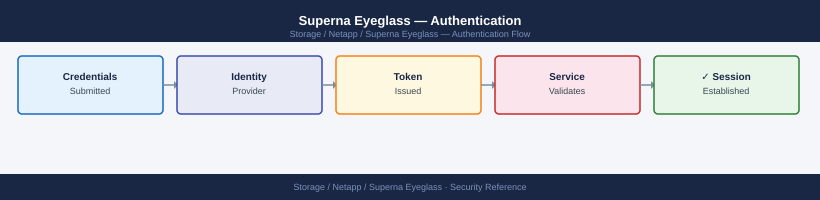

---
tags:
  - netapp
  - security
---
# Superna Eyeglass — Authentication

Superna Eyeglass authentication — LDAP/AD integration, SSO configuration, and MFA enforcement.

*Applies to: Superna Eyeglass*

Eyeglass admin access is controlled through built-in roles: **admin** (full access including failover initiation) and **read-only** (dashboard and reporting access only).

| Role | Access Level |
|---|---|
| admin | Full access including failover initiation and configuration changes |
| read-only | Dashboard and reporting access only |

Enforce least privilege — assign read-only to personnel who only require visibility into DR state without the ability to trigger failover actions.

OneFS API credentials stored in Eyeglass for cluster connectivity should use dedicated service accounts with the minimum required OneFS privileges. See the [Integrations](../architecture/integrations.md) page for the required PowerScale role configuration.

## Before you begin

- **Access:** Storage admin credentials (cluster admin or equivalent)
- **Change management:** security changes require CAB approval in most environments
- **Rollback plan:** document current state before any security control change
- **Testing:** validate in a non-production environment first where possible

---

---

## See also

- [Superna Eyeglass — Access Control](../access-control/)
- [Superna Eyeglass — Hardening](../hardening/)
- [Superna Eyeglass — Encryption](../encryption/)
