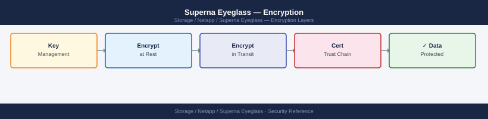

---
tags:
  - netapp
  - security
description: "Superna Eyeglass encryption — TLS configuration and data-in-transit security for Eyeglass management communications."
---
# Superna Eyeglass — Encryption

Superna Eyeglass encryption — TLS configuration and data-in-transit security for Eyeglass management communications.

*Applies to: Superna Eyeglass*

The Eyeglass management console must be accessible only via HTTPS — HTTP access should be disabled or redirected. All communication between Eyeglass and the PowerScale OneFS API uses HTTPS (ports 8080/443).

| Control | Detail |
|---|---|
| Console access | HTTPS only; HTTP access disabled or redirected |
| API token management | Store in secrets manager; rotate on schedule and on personnel change |

API tokens used by automation scripts must be stored in a secrets manager (e.g. CyberArk, HashiCorp Vault) and rotated on a defined schedule. Tokens should not be stored in plaintext in scripts or version control.

## Before you begin

- **Access:** Storage admin credentials (cluster admin or equivalent)
- **Change management:** security changes require CAB approval in most environments
- **Rollback plan:** document current state before any security control change
- **Testing:** validate in a non-production environment first where possible

---

---

## See also

- [Superna Eyeglass — Hardening](../hardening/)
- [Superna Eyeglass — Authentication](../authentication/)
- [Superna Eyeglass — Access Control](../access-control/)
