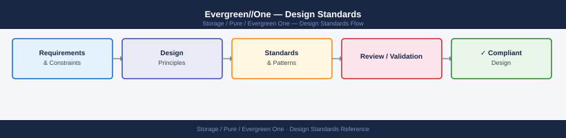
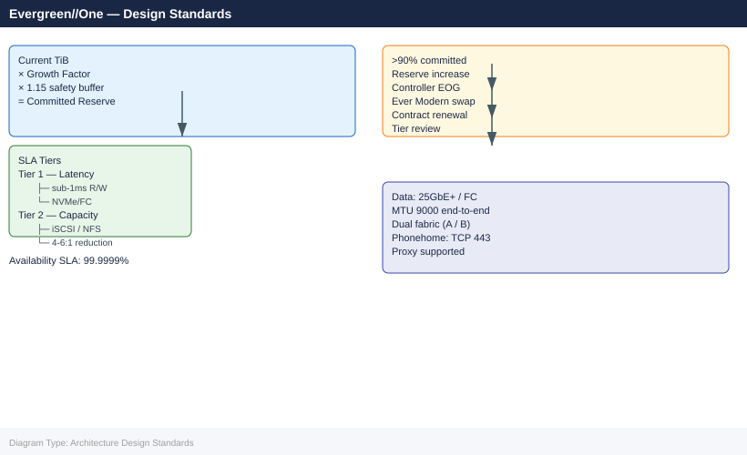

---
tags:
  - architecture
  - pure
description: "Design Standards reference covering Committed Reserve Sizing, Network Requirements, Protocol Selection, SLA Compliance Requirements, Naming Standards and..."
---
# Evergreen//One — Design Standards

<div class="kb-summary">
Design Standards reference covering Committed Reserve Sizing, Network Requirements, Protocol Selection, SLA Compliance Requirements, Naming Standards and 1 more sections.

*Applies to: Evergreen//One*
</div>




---

## Committed Reserve Sizing

The committed reserve is the minimum monthly TiB the customer commits to pay for. Size it based on current workload capacity plus expected growth within the contract term.

### Sizing Inputs

| Input | Source | Notes |
|---|---|---|
| Current host-written TiB | Pure1 capacity report | Raw consumed before data reduction |
| Data reduction ratio | Pure1 array view | Typical FlashArray: 3–5:1; FlashBlade: 2–4:1 |
| Growth rate | Historical trend (12 months minimum) | Compound monthly growth rate |
| Contract term | Service agreement | Typically 3 or 5 years |
| Performance tier | Workload IOPS/latency requirements | Defines hardware selection |

### Reserve Calculation

```text
Committed Reserve (TiB) = (Current TiB × Growth Factor) × Safety Buffer
Growth Factor = (1 + Monthly Growth Rate) ^ Contract Months
Safety Buffer = 1.15 (15% above projected needs)
```

Example:
```yaml
Current: 50 TiB consumed
Monthly growth rate: 2%
Contract: 36 months
Growth Factor: (1.02)^36 = 2.04
Reserve: 50 × 2.04 × 1.15 = 117 TiB committed
```

### Burst Headroom

The burst headroom defines the maximum TiB above reserve the array can serve before a capacity increase order is required. Set to at least 20% above the expected peak:

```text
Burst Headroom = Committed Reserve × 0.20
```

Burst capacity is billed at a higher per-TiB rate. Monitor Pure1 burst utilisation weekly — sustained burst above 10% of the committed reserve is a signal to renegotiate the reserve tier.

---

## Network Requirements

### Phonehome / Pure1 Connectivity

Phonehome is mandatory for all Evergreen//One installations. Without it, Pure cannot monitor SLA compliance.

| Requirement | Specification |
|---|---|
| Destination | `api.pure1.purestorage.com` — TCP 443 (HTTPS) |
| Firewall rule | Allow from FlashArray management IPs to internet on TCP 443 |
| Proxy support | HTTP proxy supported (configure in FlashArray settings) |
| Bandwidth | Minimal — telemetry uploads are typically < 10 MB/day |
| Availability | 99.9% uptime required for SLA monitoring; alert if disconnected > 4 hours |

```bash
# Configure HTTP proxy on FlashArray (if required by corporate policy)
# Pure1 portal → Administration → Phonehome → Proxy Settings
# Or via CLI:
puresetting set --proxy http://proxy.example.local:8080
```


```text title="Expected output"
(no output — command completes silently)
```

!!! warning "Common errors"
    | Error | Fix |
    |---|---|
    | `Error: Invalid proxy URL format` | Ensure the proxy URL follows the format `http://hostname:port` or `https://hostname:port` without trailing slashes. |
    | `Error: Connection refused to proxy server` | Verify the proxy server is reachable from the FlashArray management network by testing connectivity to the proxy host and port first. |
### Host Data Network (iSCSI / NVMe-TCP)

| Requirement | Specification |
|---|---|
| Port speed | 25 GbE minimum per host HBA; 100 GbE recommended for NVMe-TCP |
| Dedicated VLAN | Separate VLAN for storage traffic — do not share with VM or management traffic |
| MTU | Jumbo frames (MTU 9000) end-to-end including switch and host vNIC |
| Multipath | Round Robin PSP with minimum 2 paths per host |
| Redundancy | Dual-homed to separate TOR switches (A/B fabric) |

```bash
# Verify MTU on ESXi storage VMkernel
esxcli network ip interface list | grep iscsi
esxcli network ip interface ipv4 get --interface-name vmk1

# Test MTU end-to-end (from ESXi to FlashArray iSCSI port)
vmkping -I vmk1 -d -s 8972 192.168.100.10
# -d = don't fragment; -s 8972 = 8972 bytes payload (9000 MTU - 28 byte header)
# Should succeed without fragmentation
```


```text title="Expected output"
Name  Port  Portset      Active  MAC Address        IPv4 Address      IPv6 Address  MTU  TSO MSS  Enabled
vmk0  0     Management   true    00:50:56:a9:12:34  192.168.1.100     ::1           1500 65535   true
vmk1  0     iSCSI        true    00:50:56:a9:56:78  192.168.100.50    ::1           9000 65535   true
vmk2  0     vMotion      true    00:50:56:a9:9a:bc  192.168.2.100     ::1           1500 65535   true

IPv4 Address: 192.168.100.50
Netmask: 255.255.255.0
Broadcast: 192.168.100.255
Gateway: 192.168.100.1
DHCP: false

PING 192.168.100.10 (192.168.100.10): 8972 data bytes
8980 bytes from 192.168.100.10: icmp_seq=0 ttl=64 time=2.341 ms
8980 bytes from 192.168.100.10: icmp_seq=1 ttl=64 time=2.156 ms
8980 bytes from 192.168.100.10: icmp_seq=2 ttl=64 time=2.298 ms
```

!!! warning "Common errors"
    | Error | Fix |
    |---|---|
    | `Connect: Network is unreachable` | Verify vmk1 is on the correct VLAN and has a route to 192.168.100.10 using `esxcli network ip route ipv4 list`. |
    | `PING 192.168.100.10 (192.168.100.10): sendto: Message too long` | Confirm MTU is set to 9000 on vmk1 with `esxcli network ip interface ipv4 set --interface-name vmk1 --mtu=9000` and verify the switch port supports jumbo frames. |
    | `100% packet loss` | Check that the FlashArray iSCSI port 192.168.100.10 is online and reachable by testing connectivity from a different ESXi host or pinging the array management IP first. |
### Host Data Network (FC)

| Requirement | Specification |
|---|---|
| Speed | 16 Gb FC minimum; 32 Gb FC recommended |
| Zoning | Single initiator, single target zoning (WWPN-based) |
| Fabric | Dual fabric (A and B) — each HBA port to a separate fabric |
| FlashArray FC ports | 2 ports per controller minimum; typically 4 (2 per fabric) |

---

## Protocol Selection

| Workload Type | Recommended Protocol | Notes |
|---|---|---|
| Block — general purpose | iSCSI (10/25 GbE) | Simplest operational model; runs over existing Ethernet |
| Block — high performance | NVMe/FC or NVMe/TCP | Lower latency than SCSI; requires NVMe-capable HBAs |
| Block — mission critical | FC (16/32 Gb) | Deterministic latency; separate physical fabric |
| File | NFS v3/v4.1 (FlashBlade) | vSphere NFS datastores or direct application NFS mounts |
| Object | S3 (FlashBlade) | Backup targets, cloud-native applications |
| Mixed block+file | iSCSI (FlashArray) + NFS (FlashBlade) | Common in enterprise deployments |

---

## SLA Compliance Requirements

Evergreen//One provides a 99.9999% availability SLA (approximately 32 seconds downtime per year). Meeting this SLA requires the customer to maintain their side of the dependency chain:

| Customer Responsibility | Requirement |
|---|---|
| Multipathing | At least 2 active paths per host at all times |
| Network redundancy | Dual fabric / dual switch — no single switch failure should isolate a host |
| Host maintenance | Coordinate host patching windows with Pure for any array-touching procedures |
| Phonehome | Must remain connected; notify Pure if firewall changes affect phonehome |
| Environmental | UPS, cooling, and power A/B feeds per Dell/Pure site requirements |
| Change notification | Notify Pure account team of major changes (host additions, replication changes, protocol changes) |

---

## Naming Standards

### Array Names

```text
<site>-fa-<number>       # FlashArray
<site>-fb-<number>       # FlashBlade
```

Examples: `lon-fa-01`, `ams-fb-01`

### Volume Names

```text
<host>-<purpose>-<number>
```

Examples: `esxi-01-boot-01`, `sql-prod-data-01`, `oracle-asm-01`

### Host and Host Group Names

```text
<hostname>               # Host: match the actual server hostname
<cluster>-hg             # Host Group: cluster name + -hg
```

Examples: `esxi-01`, `vsan-cluster-hg`, `sql-prod-hg`

### Protection Group Names

```text
<workload>-pg            # Protection group
<source-site>-to-<dest-site>-pg   # Replication protection group
```

Examples: `sql-prod-pg`, `lon-to-ams-pg`

---

## Change Management

Pure manages all hardware changes. The customer manages all host-side and configuration changes.

| Change Type | Owner | Advance Notice |
|---|---|---|
| FlashArray firmware update | Pure | 5 business days notification from Pure |
| Controller replacement | Pure | Coordinated with customer during business hours |
| Capacity increase (new shelf) | Pure | 30-day lead time for ordering and scheduling |
| Host addition | Customer | Notify Pure account team; Pure verifies capacity impact |
| Replication link changes | Customer | Notify Pure; can affect burst headroom calculations |
| Protocol changes (e.g., add NVMe/FC) | Customer + Pure | Requires Pure involvement for FlashArray-side port configuration |

All Pure-initiated changes arrive with prior notification. Customer should not accept unscheduled on-site visits or remote sessions without validation through the Pure support portal.

---

## See also

- [Evergreen//One — How It Works](../how-it-works/)
- [Evergreen//One — Integrations](../integrations/)
