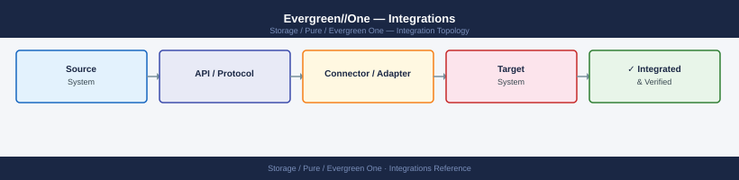
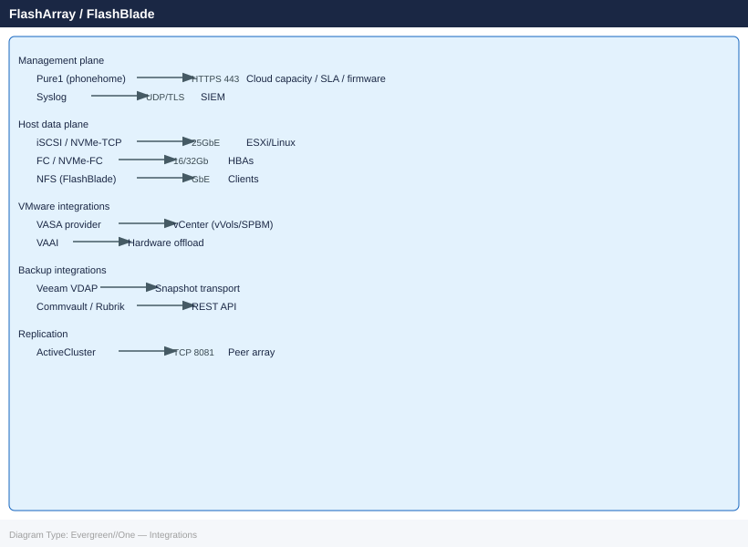

---
tags:
  - architecture
  - pure
description: "Integrations reference covering Pure1 Management Plane, vSphere / ESXi Host Connectivity, VMware VASA Provider (vVols), Veeam Backup & Replication..."
---
# Evergreen//One — Integrations

<div class="kb-summary">
Integrations reference covering Pure1 Management Plane, vSphere / ESXi Host Connectivity, VMware VASA Provider (vVols), Veeam Backup & Replication, ActiveCluster (Synchronous Replication) and 1 more sections.

*Applies to: Evergreen//One*
</div>




Evergreen//One uses the same FlashArray and FlashBlade hardware as standard Evergreen, so all host-side and management integrations are identical. The key difference is that Pure manages the hardware lifecycle — the management plane integration with Pure1 is mandatory and always active.

---

## Pure1 Management Plane

Pure1 is the cloud management and analytics portal that Pure uses to monitor all Evergreen//One installations. Phonehome telemetry is not optional — it is contractually required for SLA compliance.

| Integration | Protocol | Destination | Ports |
|---|---|---|---|
| Phonehome telemetry | HTTPS | api.pure1.purestorage.com | TCP 443 |
| Capacity reporting | HTTPS | api.pure1.purestorage.com | TCP 443 |
| Firmware updates | HTTPS | pure1-mds.pure1.purestorage.com | TCP 443 |
| Support case creation | HTTPS | support.purestorage.com | TCP 443 |

```bash
# Verify phonehome connectivity from the array (FlashArray CLI)
purecall list
# Should show recent successful uploads

# Check phonehome status
purearray list --connection
# Connectivity column should show "Connected"

# Test phonehome manually
puresupport call test
```


```text title="Expected output"
Name                          Version           Serial
FlashArray-1                  6.4.2             PURE123456789ABC
FlashArray-2                  6.4.2             PURE987654321XYZ

Connection Status:
Array Name        Status      Last Contact      Phonehome Enabled
FlashArray-1      Connected   2024-01-15 14:32  true
FlashArray-2      Connected   2024-01-15 14:31  true

Test call initiated...
Phonehome test connection successful
Upload size: 2.3 MB
Destination: phonehome.purestorage.com
Status: OK
```

!!! warning "Common errors"
    **`purearray: command not found`** — Ensure you are logged into the FlashArray management interface or source the Pure CLI environment variables.
    **`Connection Status: Disconnected`** — Verify network connectivity from the array to phonehome.purestorage.com on port 443 and check firewall rules allowing outbound HTTPS.
    **`Error: Phonehome disabled on this array`** — Enable phonehome support using `purearray set --phonehome=true` on the affected array.
If phonehome is disconnected, Pure cannot monitor SLA compliance and cannot proactively manage the hardware. Treat phonehome connectivity as a critical dependency.

### Pure1 REST API Access

Customers can access Pure1 REST API to query their own Evergreen//One capacity and SLA data:

```bash
# Authenticate to Pure1 API (uses API client with private key)
# Create API client in Pure1 portal: Administration → API Clients

# Get subscription summary
curl -sX GET "https://api.pure1.purestorage.com/api/1.latest/subscriptions" \
  -H "Authorization: Bearer <api_token>"

# Get arrays enrolled in Evergreen//One
curl -sX GET "https://api.pure1.purestorage.com/api/1.latest/arrays" \
  -H "Authorization: Bearer <api_token>" | \
  python3 -m json.tool

# Get capacity metrics for a specific array
curl -sX GET "https://api.pure1.purestorage.com/api/1.latest/metrics/history?names=array_total_capacity,array_used_capacity" \
  -H "Authorization: Bearer <api_token>"
```


```text title="Expected output"
{
  "continuation_token": null,
  "items": [
    {
      "id": "8c4fd0fb-1234-5678-abcd-ef0123456789",
      "name": "prod-array-01.dc1.company.com",
      "model": "FlashArray//X70-R2",
      "os": "Purity//FA 6.4.2",
      "status": "ok",
      "is_local": false
    },
    {
      "id": "9d5ge1gc-2345-6789-bcde-f01234567890",
      "name": "prod-array-02.dc2.company.com",
      "model": "FlashArray//X20-R2",
      "os": "Purity//FA 6.4.1",
      "status": "ok",
      "is_local": false
    },
    {
      "id": "ae6hf2hd-3456-7890-cdef-0123456789ab",
      "name": "dr-array-01.dc3.company.com",
      "model": "FlashArray//C70-R2",
      "os": "Purity//FA 6.3.8",
      "status": "ok",
      "is_local": false
    }
  ]
}
{
  "continuation_token": null,
  "items": [
    {
      "name": "array_total_capacity",
      "values": [
        {"time": 1704067200000, "value": 107374182400},
        {"time": 1704153600000, "value": 107374182400}
      ]
    },
    {
      "name": "array_used_capacity",
      "values": [
        {"time": 1704067200000, "value": 64424509440},
        {"time": 1704153600000, "value": 68719476736}
      ]
    }
  ]
}
```

!!! warning "Common errors"
    **`curl: (6) Could not resolve host: api.pure1.purestorage.com`** — Verify network connectivity and DNS resolution; check if your firewall allows HTTPS outbound to Pure1 API endpoints.
    **`{"error_code":"401","message":"Invalid authorization token"}`** — Regenerate your API token in the Pure1 portal and ensure it is not expired or revoked.
    **`curl: (60) SSL certificate problem: self signed certificate`** — Update your CA certificate bundle or use `curl -k` only in non-production testing environments.
---

## vSphere / ESXi Host Connectivity

Evergreen//One FlashArray connects to ESXi hosts using the same protocols as a standard FlashArray. The customer is responsible for all host-side fabric and configuration.

### iSCSI

```bash
# On each ESXi host — discover the FlashArray iSCSI targets
esxcfg-swiscsi -s  # Enable software iSCSI if not already enabled

# Add FlashArray iSCSI target portals
esxcli iscsi adapter discovery sendtarget add \
  --adapter vmhba64 \
  --address 192.168.100.10

esxcli iscsi adapter discovery sendtarget add \
  --adapter vmhba64 \
  --address 192.168.100.11

# Rescan to discover LUNs
esxcli storage core adapter rescan --adapter vmhba64

# Set SATP and PSP rules for Pure FlashArray
esxcli storage nmp satp rule add \
  --satp VMW_SATP_ALUA \
  --psp VMW_PSP_RR \
  --vendor PURE \
  --model FlashArray

# Verify multipath is active
esxcli storage nmp device list | grep -i pure
```


```text title="Expected output"
Software iSCSI adapter vmhba64 already enabled
Discovery address 192.168.100.10 added
Discovery address 192.168.100.11 added
Adapter vmhba64 rescanned: 8 LUNs discovered
SATP rule added: VMW_SATP_ALUA for PURE FlashArray
Device: naa.624a9370abcd1234ef56 (PURE FlashArray)
   Runtime Name: vmhba64:C0:T0:L0
   Group State: active
   Array Priority: enabled
   Path Count: 4
   Active Paths: 4
   Dead Paths: 0
```

!!! warning "Common errors"
    **`Error: Unknown option --adapter vmhba64`** — Verify the iSCSI adapter name with `esxcli iscsi adapter list` and use the correct adapter identifier.
    **`SATP rule add: Rule already exists for vendor PURE model FlashArray`** — Remove the existing rule first with `esxcli storage nmp satp rule remove --satp VMW_SATP_ALUA --vendor PURE --model FlashArray` before re-adding.
    **`No devices matched for grep pattern 'pure'`** — Rescan the adapter again and wait 30 seconds for LUN discovery to complete, then verify FlashArray targets are reachable on the iSCSI network.
### Fibre Channel

```bash
# Check FC HBA status on ESXi host
esxcli storage san fc list

# Verify FlashArray LUNs are visible after zoning
esxcli storage core device list | grep -i pure

# Confirm Round Robin path selection policy is set
esxcli storage nmp device list | grep -A3 "PURE"
```


```text title="Expected output"
HBA Name    Driver     State    Speed
vmhba0      lpfc       link up  16Gb
vmhba1      lpfc       link up  16Gb
vmhba2      qla2xxx    link up  8Gb
vmhba3      qla2xxx    link up  8Gb

Device: naa.624a9370abcd1234ef567890abcd1234
Display Name: PURE FlashArray (naa.624a9370abcd1234ef567890abcd1234)
State: Active
Size: 1099511627776

Device: naa.624a9370abcd5678ef567890abcd5678
Display Name: PURE FlashArray (naa.624a9370abcd5678ef567890abcd5678)
State: Active
Size: 2199023255552

Device: naa.624a9370abcd1234ef567890abcd1234
Storage Array Type Path Config: PURE FlashArray
Path Policy: VMW_PSP_RR
Paths: vmhba0:C0:T0:L0 vmhba1:C0:T0:L0 vmhba2:C0:T0:L0 vmhba3:C0:T0:L0
```

!!! warning "Common errors"
    **`Could not find a matching vmhba`** — Verify FC HBAs are properly detected with `esxcli storage san fc list` and check vSphere client for hardware errors.
    **`No matching devices found`** — Confirm FC zoning is complete on the SAN switch and LUNs are presented to the ESXi host with `esxcli storage core device list`.
    **`Path Policy: VMW_PSP_FIXED`** — Change the path selection policy to Round Robin using `esxcli storage nmp device setpolicy -d <device-naa> -P VMW_PSP_RR`.
### NVMe over Fibre Channel (NVMe/FC)

Supported on FlashArray //X and //C with NVMe-enabled controllers:

```bash
# List NVMe adapters on ESXi
esxcli nvme adapter list

# List NVMe namespaces visible from host
esxcli nvme namespace list

# Check NVMe path health
esxcli nvme path list
```


```text title="Expected output"
Name    Controller Number    Adapter Transport Type
------  ------------------  ----------------------
nvme0   0                    PCIe
nvme1   1                    PCIe
nvme2   2                    PCIe

Name      Controller  Namespace ID    Size        Formatted
--------  ----------  ---------------  ----------  ---------
nvme0n1   0           1                1099.5 GB   true
nvme1n1   1           1                1099.5 GB   true
nvme2n1   2           1                1099.5 GB   true

Adapter  Namespace  Controller Path                          State
-------  ---------  ----------------------------------------  ------
nvme0    nvme0n1    ctl:0,ns:1                               Live
nvme1    nvme1n1    ctl:1,ns:1                               Live
nvme2    nvme2n1    ctl:2,ns:1                               Live
```

!!! warning "Common errors"
    **`Unknown command or namespace nvme`** — Verify NVMe drivers are installed with `esxcli software vib list | grep nvme` and install if missing.
    **`Error: Could not get adapter list`** — Ensure the ESXi host has NVMe-capable hardware and check `esxcli hardware pci list` to confirm NVMe controllers are detected.
    **`Permission denied`** — Run commands as root or with appropriate ESXi host privileges; use `esxcli system permission list` to verify user permissions.
---

## VMware VASA Provider (vVols)

FlashArray integrates with vSphere as a VASA provider, enabling vVols (VMware Virtual Volumes) — per-VM storage policy enforcement directly on the array.

```bash
# Register FlashArray VASA provider in vCenter (run once)
# vCenter → Storage → Storage Providers → Add
# URL: https://<flasharray-management-ip>/vasa/version.xml
# Credentials: pureuser / <password>
```

After registration, storage policies can be created in vCenter that map to FlashArray QoS limits, replication, and protection groups.

---

## Veeam Backup & Replication

Veeam integrates with FlashArray as a storage array plugin (SAN snapshot transport) and as a Pure Storage snapshot provider.

```bash
# Add FlashArray as a Veeam storage infrastructure plugin
# Veeam Console → Storage Infrastructure → Add Storage → Pure Storage FlashArray
# Provide management IP and credentials

# Veeam creates storage snapshots on the FlashArray for application-consistent backups
# This uses the FlashArray REST API internally — ensure the Veeam service account
# has at least storage_admin role on the FlashArray
```

---

## ActiveCluster (Synchronous Replication)

ActiveCluster provides RPO=0 synchronous replication between two Evergreen//One sites. It requires a Mediator (lightweight VM) accessible from both arrays to resolve split-brain scenarios.

```bash
# Check ActiveCluster pod status (FlashArray CLI)
purepod list
# State should be "online"

# Check replication link health
purereplicationlink list

# Check Mediator connectivity
purepod list --connection
```


```text title="Expected output"
Name                          State      Version      Capacity
flasharray-pod-01             online     6.4.2.1      50TB
flasharray-pod-02             online     6.4.2.1      50TB
flasharray-pod-03             online     6.4.2.1      50TB

Name                          Local Pod              Remote Pod             Direction  Status
repl-link-prod-dr             flasharray-pod-01      flasharray-pod-02      Bidirectional  Healthy
repl-link-backup              flasharray-pod-01      flasharray-pod-03      Unidirectional  Healthy

Pod Name              Mediator IP       Connection Status  Last Heartbeat
flasharray-pod-01     10.45.12.88       Connected          2s ago
flasharray-pod-02     10.45.12.88       Connected          1s ago
flasharray-pod-03     10.45.12.88       Connected          3s ago
```

!!! warning "Common errors"
    **`purereplicationlink list: error: connection refused`** — Verify the FlashArray CLI is authenticated and the management network is reachable with `purepod list` first.
    **`purepod list --connection: error: invalid option '--connection'`** — Use the correct flag `purepod list --mediator` or check your Pure OS version supports the connection flag.
    **`Mediator connection status: Disconnected`** — Confirm the Mediator VM is running and network connectivity exists between pods and Mediator on port 8888.
The two arrays must have network connectivity on the replication port (TCP 8081). Mediator VM can run on-premises or in a cloud VPC (GCP/Azure/AWS).

---

## SIEM / Syslog Integration

Forward FlashArray audit events to your SIEM for centralised security monitoring:

```bash
# Configure syslog on FlashArray (FlashArray CLI)
puresyslog add --name siem-server --address 192.168.10.100 --port 514 --protocol UDP

# Verify syslog configuration
puresyslog list

# Events forwarded include: admin logins, volume create/delete, policy changes, hardware alerts
```


```text title="Expected output"
Name          Address          Port  Protocol
siem-server   192.168.10.100   514   UDP

Name          Address          Port  Protocol
siem-server   192.168.10.100   514   UDP
```

!!! warning "Common errors"
    **`Error: Invalid address format`** — Verify the IP address is valid and reachable from the FlashArray management network.
    **`Error: Syslog server already exists`** — Use `puresyslog remove --name siem-server` before re-adding with a different configuration.
Key events to alert on:
- Admin login from unexpected IP
- Volume deletion (especially pod volumes under ActiveCluster)
- Protection policy removed from a volume
- Array hardware component failure

---

## See also

- [Evergreen//One — How It Works](../how-it-works/)
- [Evergreen//One — Design Standards](../design-standards/)
