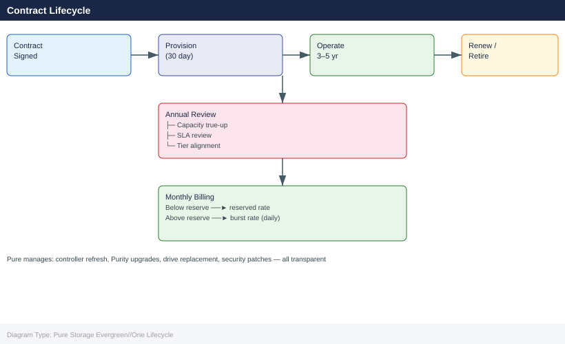

---
tags:
  - pure
description: "Pure Storage Evergreen//One Lifecycle reference covering Overview, Service Agreement Lifecycle, Monthly Capacity True-Up, Hardware and Software Upgrade..."
---
# Pure Storage Evergreen//One Lifecycle

<div class="kb-summary">
Pure Storage Evergreen//One Lifecycle reference covering Overview, Service Agreement Lifecycle, Monthly Capacity True-Up, Hardware and Software Upgrade Lifecycle, Service Level Commitments and 1 more sections.

*Applies to: Evergreen//One*
</div>



```d2
direction: right

plan: "Plan" {shape: oval}
service_agreement_lifecycle: "Service Agreement Lifecycle" {shape: rectangle}
monthly_capacity_trueup: "Monthly Capacity True-Up" {shape: rectangle}
hardware_and_software_upgrade_lifecy: "Hardware and Software Upgrade Lifecycle" {shape: rectangle}
service_level_commitments: "Service Level Commitments" {shape: rectangle}
end_of_service: "End of Service" {shape: rectangle}
validate: "Validate" {shape: oval}

plan -> service_agreement_lifecycle
service_agreement_lifecycle -> monthly_capacity_trueup
monthly_capacity_trueup -> hardware_and_software_upgrade_lifecy
hardware_and_software_upgrade_lifecy -> service_level_commitments
service_level_commitments -> end_of_service
end_of_service -> validate
```

## Overview

Because Pure owns and manages the hardware in an Evergreen//One deployment, the customer has no hardware procurement, refresh, or disposal lifecycle to manage. Pure handles all hardware upgrades, Purity software upgrades, firmware patches, and failed component replacement. The customer lifecycle responsibilities centre on the **service agreement** itself: renewal, capacity true-up, and performance tier review.

## Service Agreement Lifecycle

**Initial Term**

Evergreen//One service agreements are typically structured as a 3–5 year initial term with a committed reserve tier, burst headroom, and performance SLA defined at signing. Hardware is installed by Pure at the agreed location within the provisioning lead time specified in the contract.

**Annual Service Review**

Pure and the customer conduct an annual service review covering:

- Actual capacity consumed vs. committed reserve — if usage has grown materially, the committed reserve should be adjusted to avoid persistent burst billing
- Performance SLA compliance — review Pure1 SLA reports for any breach events and confirm credits were applied where applicable
- Workload tier alignment — confirm that the performance tier in the agreement still matches the actual workload characteristics
- Capacity growth projection for the next 12 months — Pure uses this to plan hardware provisioning ahead of demand

**Renewal**

Service agreement renewal should be initiated at least 90 days before the current term ends. At renewal:

- Review committed reserve and burst headroom against current and projected usage
- Review performance tier — upgrades to a higher tier (e.g., from capacity to latency-optimised) may be accommodated at renewal
- Confirm the physical location of the hardware and any planned site changes
- Confirm the CSM and account team contacts are current

If the service is not renewed, Pure will decommission and remove the hardware from the customer site. The customer must ensure data migration to alternative storage is completed before the service end date.

## Monthly Capacity True-Up

Monthly billing is based on actual consumed capacity against the committed reserve:

| Consumption | Billing |
|---|---|
| Below committed reserve | Reserved rate applies; unused capacity is not credited (reserve is a commitment, not a maximum) |
| At committed reserve | Standard monthly invoice at reserved rate |
| Above committed reserve (burst) | Burst rate applies to the overage; burst billing accrues daily and is invoiced monthly |

**True-up process:**

1. Pure1 generates a monthly consumption report showing daily and average consumed capacity
2. Customer reviews the report within the first week of the following month
3. Any billing discrepancies are raised with the Pure account team before the invoice is finalised
4. If sustained burst usage is observed, initiate a committed reserve increase before the next billing period

## Hardware and Software Upgrade Lifecycle

All hardware and Purity software upgrades are Pure-managed and transparent to the customer:

- **Controller refresh** — Pure replaces controllers when they reach end of generation, non-disruptively; customer receives advance notification via Pure1 and email
- **Purity software upgrades** — Pure schedules and executes upgrades; customer receives advance notification and can request a specific maintenance window
- **Security patches** — applied as part of Purity software upgrades; Pure will escalate to out-of-cycle patching for critical security advisories
- **Drive replacement** — Pure replaces failed or degraded drives; phonehome telemetry enables predictive replacement before failure in most cases

Customer responsibilities during upgrade events:
- Confirm no change freezes conflict with Pure's scheduled upgrade date
- Ensure host multipathing is valid before the upgrade window (Pure will validate, but customer confirmation is expected)
- Review Pure1 post-upgrade to confirm no new alerts and SLA compliance report shows no events

## Service Level Commitments

| SLA Metric | Commitment |
|---|---|
| Availability | 99.9999% (approximately 32 seconds downtime per year) |
| Performance | IOPS, bandwidth, and latency targets defined per workload tier in the service agreement |
| Response to hardware failure | Pure dispatches replacement parts within the response time defined in the service agreement (typically same-business-day for P1 component failures) |
| Capacity provisioning lead time | Typically 30 days for capacity expansion requests above the current burst headroom |

**SLA breach credits** — if Pure fails to meet the availability or performance SLA in any month, the customer is entitled to a service credit as defined in the agreement. Monitor Pure1 SLA compliance reports monthly and raise breach events with the Pure account team before the billing close to ensure credits are applied to the correct invoice period.

## End of Service

If the service agreement is not renewed or is terminated:

1. Customer must migrate all data off the Pure-owned hardware before the service end date
2. Coordinate with the Pure account team on a decommission schedule — Pure will need access to the site to remove hardware
3. Pure provides cryptographic erasure certificates for all drive media removed from the site
4. Confirm data migration completion before the decommission date — Pure is not liable for data loss after the service end date
