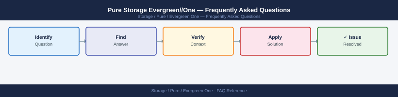

---
tags:
  - pure-evergreen-one
  - faq
  - operations
description: "Common questions about Pure Storage Evergreen//One operations, configuration, and troubleshooting. For step-by-step procedures, see the Operations section."
---
# Pure Storage Evergreen//One — Frequently Asked Questions

*Applies to: Pure Storage*

Common questions about Pure Storage Evergreen//One operations, configuration, and troubleshooting. For step-by-step procedures, see the <a href="index.md">Operations</a> section.

## General

**Q: How do I check my Evergreen//One consumption and service level?**
A: Log in to Pure1 (pure1.purestorage.com) → Evergreen//One → Subscriptions. View consumed capacity vs committed, performance tier, and burst usage.

**Q: How do I check the current Pure Storage Evergreen//One version?**
A: `Pure1 → Evergreen//One → Subscriptions`

## Configuration

**Q: What is the default burst tolerance for Evergreen//One?**
A: Evergreen//One includes burst capacity as part of the subscription model. The specific burst allowance depends on your contract (typically 20-30% above committed). Review your SOW for exact terms.

**Q: How do I enable Pure Evergreen//One capacity reporting notifications?**
A: In Pure1 → Evergreen//One → Alerts, configure consumption threshold alerts. Set notifications at 80% and 95% of committed capacity. Alerts are sent via email to the subscription contacts.

## Operations

**Q: How does Pure manage hardware and software upgrades under Evergreen//One?**
A: Pure handles all hardware and software upgrades proactively as part of the service. Upgrades are scheduled with the customer and performed non-disruptively. You receive Purity//FA or Purity//FB upgrades automatically.

**Q: What is the correct procedure to add capacity to an Evergreen//One subscription?**
A: Contact your Pure account team or submit a request via Pure1. Capacity additions under Evergreen//One are provisioned by Pure — no hardware procurement required. Changes take effect at the next billing period.

## Troubleshooting

**Q: Pure1 shows 'Evergreen//One capacity at risk'. What does it mean?**
A: Projected growth will exceed committed capacity before the next renewal. Contact your Pure account team immediately to adjust the subscription. Evergreen//One includes proactive capacity management from Pure.

**Q: Evergreen//One performance is below the contracted SLA tier — where do I start?**
A: Open a case with Pure Support. Evergreen//One SLAs are contractually backed — Pure is responsible for delivering the contracted performance tier. Pure1 analytics will be used to investigate.

## Backup and Recovery

**Q: How is Evergreen//One data protected?**
A: Evergreen//One includes the underlying FlashArray or FlashBlade platform redundancy. Application-level backup (Veeam, SnapCenter) is the customer's responsibility. SafeMode snapshots are available as an add-on.

**Q: Can I restore from a snapshot under Evergreen//One?**
A: Yes — snapshots are managed on the underlying FlashArray/FlashBlade platform. Restore via Pure1, the array CLI, or the Pure Storage vSphere plugin. Evergreen//One does not change the snapshot restore mechanism.

## See Also

- [Pure Storage Evergreen//One Operations](index.md)
- [Pure Storage Evergreen//One Troubleshooting](../../../../troubleshooting/index.md)
