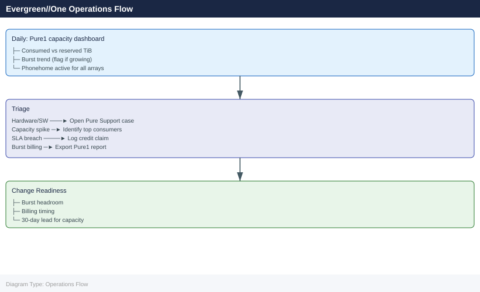

---
tags:
  - operations
  - pure
description: "Evergreen//One operations: subscription usage monitoring, controller upgrade scheduling, capacity tier activation, and health status via Pure1 portal..."
---
# Evergreen//One — Operations

<div class="kb-summary">
Evergreen//One operations: subscription usage monitoring, controller upgrade scheduling, capacity tier activation, and health status via Pure1 portal.

*Applies to: Evergreen//One*
  <a class="kb-card" href="faq/"><strong>FAQ</strong><span>Frequently asked questions, common issues, and quick answers for day-to-day operations.</span></a>
</div>

---



## Before you begin

- **Access:** Storage admin credentials (cluster admin or equivalent)
- **Timing:** safe to run during business hours unless a step is marked ⚠ (causes interruption)
- **Dependencies:** no active upgrades or migrations on the same infrastructure
- **Logging:** capture command output — paste into the change record on completion

---

## Daily Checks

| Check | Command | Notes |
|---|---|---|
| [ ] Open Pure1 portal (pure1.purestorage.com) → Evergreen//One → Consumption |  |  |
| [ ] Check burst usage trend |  | confirm burst capacity is not being consumed unexpectedly or accelerating |
| [ ] Review SLA compliance metrics in Pure1 → Evergreen//One → SLA |  |  |
| [ ] Check for any open support cases or Pure-initiated action items in |  |  |
| [ ] Review Pure1 capacity forecasting |  | flag if growth rate puts the subscription on track to exceed the committed tier within the next 30 days |
| [ ] Confirm Pure1 phone-home is active for all arrays under the subscr |  |  |

## Health Check

- [ ] No active SLA breach events in the Pure1 Evergreen//One dashboard
- [ ] No open hardware alerts for arrays under the subscription in Pure1
- [ ] Consumed capacity is below the committed tier (no unintended burst billing)
- [ ] Pure1 availability metrics show no events in the last 24 hours
- [ ] Pure1 phone-home is active — Pure's SLA monitoring and proactive support depend on continuous telemetry
- [ ] No unresolved support cases with critical or high priority outstanding

```bash
# All monitoring is performed through the Pure1 portal
# Pure1: https://pure1.purestorage.com

# Pure1 > Arrays — array health, Purity version, and hardware status
# Pure1 > Evergreen//One > Consumption — used TB vs. committed vs. burst
# Pure1 > Evergreen//One > SLA — availability and latency SLA compliance reports
# Pure1 > Evergreen//One > Capacity — capacity growth trends and forecasting

# For CLI access (if granted by Pure Support for the managed array):
purearray list --space         # capacity and data reduction summary
purealert list                 # active hardware or software alerts
purepod list                   # replication pod and ActiveCluster status
purevol list --space           # per-volume space usage
```


```text title="Expected output"
Name             Capacity    Data Reduction    Used Space    Available
pure-esg-01      100.0 TB    2.5x              45.2 TB       54.8 TB

AlertId    Severity    Component        Message                              Timestamp
1847       warning     controller-1     Temperature threshold approaching    2024-01-15 14:32:18
1846       info        disk-shelf-3     Predictive failure detected on SSD   2024-01-15 13:18:45

Name                 Role              Status    Replication_Lag
pod-us-east-01       primary           online    0.2 ms
pod-us-west-02       secondary         online    12.4 ms

Name                 Size      Used       Data_Reduction    Snapshots
vol-prod-db-01       5.0 TB    3.2 TB     1.8x              8
vol-prod-db-02       2.0 TB    1.1 TB     2.1x              5
vol-backup-daily     10.0 TB   6.7 TB     3.2x              28
```

!!! warning "Common errors"
    **`purearray: command not found`** — Install the Pure Storage CLI tools or verify the PATH includes the Pure bin directory; contact Pure Support for CLI access credentials.
    **`Error: Invalid credentials or array unreachable`** — Verify network connectivity to the array management IP and confirm API token/credentials are valid and not expired.
## Change Readiness

- [ ] Review billing period timing before any large provisioning change — avoid large capacity spikes immediately before the monthly billing close
- [ ] Confirm burst capacity is available in the subscription if the change will temporarily increase consumption (e.g., large data migration, bulk snapshot creation)
- [ ] For significant provisioning increases: contact Pure account team or submit a capacity request through the Pure portal with at least 30 days of lead time
- [ ] Confirm applications can tolerate a brief I/O suspension during any Pure-managed hardware maintenance (Pure will coordinate, but application teams should be notified)
- [ ] If new workloads are being added: validate the consumption tier assignment aligns with the workload's performance tier in the subscription contract
- [ ] Document baseline consumed capacity from Pure1 before the change for billing reconciliation

| Item | Status | Notes |
|---|---|---|
| Billing period reviewed — not at month close | | |
| Burst capacity available if needed | | |
| Large capacity changes submitted to Pure team | | |
| Application teams notified of maintenance | | |
| Baseline consumption documented in Pure1 | | |

## Incident Triage

- [ ] For performance issues (latency, IOPS): open a support case with Pure — Pure owns the hardware and Purity software; do not attempt hardware-level diagnosis without Pure Support involvement
- [ ] For availability issues: check Pure1 for active incidents or hardware events; contact Pure Support immediately with the array name and incident description
- [ ] For unexpected capacity spike: check Pure1 Consumption to identify which volumes or snapshots are consuming burst; engage application teams to reduce if possible
- [ ] For burst billing concerns: export a consumption report from Pure1; compare against provisioned volumes and snapshots; raise with the Pure account team before billing close
- [ ] For SLA breach events: document the event from the Pure1 SLA report; log a credit claim with the Pure account team if the breach is confirmed
- [ ] If Pure1 phone-home goes offline: confirm outbound HTTPS to Pure1 endpoints from the site network; review proxy settings with Pure Support

| Question | Answer |
|---|---|
| Is this a hardware, software, or billing issue? | |
| What does the Pure1 SLA dashboard show? | |
| Is Pure Support already aware of the incident? | |
| What is the burst consumption level? | |
| Is there a credit obligation from an SLA breach? | |

## Maintenance Window

1. Coordinate the maintenance window timing with the Pure account team or support — Pure manages all hardware and Purity upgrades; customers do not execute these independently
2. Confirm applications can tolerate a brief I/O suspension if Pure schedules a controller maintenance event; notify application owners and change management
3. Validate that no change freezes or code freezes conflict with Pure's scheduled maintenance date — raise a conflict to the Pure account team at least 2 weeks in advance
4. Confirm all host paths are redundant before Pure executes any upgrade (Pure will validate, but customer confirmation is good practice): `purehost list --connection` if CLI access is available
5. After Pure completes the maintenance, confirm Pure1 shows the new Purity software version and no new alerts are open
6. Review the SLA compliance report post-maintenance to confirm no availability events were recorded against the SLA

## Post-Change Validation

- [ ] Pure1 → Evergreen//One → Consumption: consumed capacity is reporting correctly and matches expected provisioned volumes
- [ ] Pure1 → Evergreen//One → SLA: no new availability or latency breach events recorded during the maintenance window
- [ ] Pure1 shows the updated Purity software version for all arrays (if this was a Pure-managed upgrade)
- [ ] No active alerts in Pure1 for arrays under the subscription
- [ ] Pure1 phone-home is active for all arrays — telemetry is flowing to Pure Support
- [ ] Confirm with application teams that I/O is serving normally and latency is within expected thresholds
- [ ] If a capacity change was made: verify consumed TB in Pure1 reflects the new provisioning accurately and burst is not inadvertently triggered

---

## Verify

- Confirm the operation completed without errors in the log or management UI
- Verify the expected state change is visible (service running, object created, config applied)
- Document the outcome in the change record

## See also

- [Architecture](../architecture/)
- [Cli Reference](../cli-reference/)
- [Integration](../integration/)
- [Learning Path](../learning-path/)
- [Lifecycle](../lifecycle/)
- [Scripts](../scripts/)
- [Security](../security/)
- [Standards](../standards/)
- [Troubleshooting](../troubleshooting/)
- [Vendor Support](../vendor-support/)
- [Evergreen//ONE — Overview](../)
