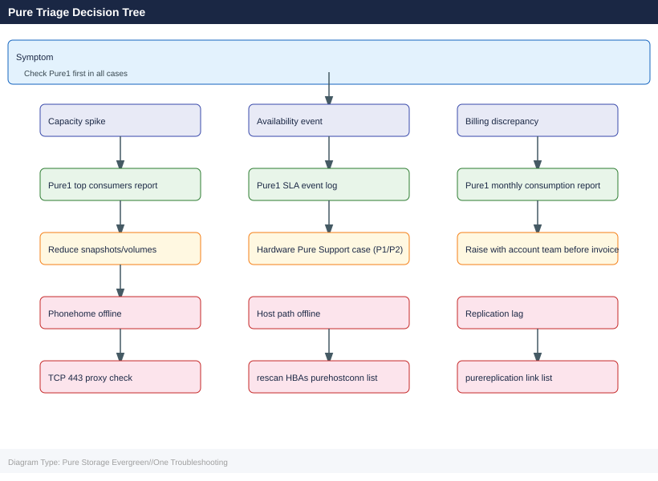

---
tags:
  - pure
  - troubleshooting
search:
  boost: 1.5
description: "Pure Storage Evergreen//One Troubleshooting reference covering Common Issues, Diagnostic Commands, Log Locations, Before Calling Support."
---
# Pure Storage Evergreen//One Troubleshooting

<div class="kb-summary">
Pure Storage Evergreen//One Troubleshooting reference covering Common Issues, Diagnostic Commands, Log Locations, Before Calling Support.

*Applies to: Evergreen//One*
</div>



```d2
direction: down

symptom: Identify Symptom {shape: diamond}
common_issues: "Common Issues" {shape: rectangle}
diagnostic_commands: "Diagnostic Commands" {shape: rectangle}
log_locations: "Log Locations" {shape: rectangle}
before_calling_support: "Before Calling Support" {shape: rectangle}
verify_resolution: "Verify resolution" {shape: rectangle}
resolution: Resolve or Escalate {shape: oval}

symptom -> common_issues: investigate
symptom -> diagnostic_commands: investigate
symptom -> log_locations: investigate
symptom -> before_calling_support: investigate
symptom -> verify_resolution: investigate
common_issues -> resolution
diagnostic_commands -> resolution
log_locations -> resolution
before_calling_support -> resolution
verify_resolution -> resolution
```

## Before you begin

- **Access:** Storage admin credentials (cluster admin or equivalent)
- **Gather first:** recent error message text, event timestamps, and affected object names
- **Scope:** confirm whether the issue affects a single object, host, cluster, or site
- **Escalation:** open a vendor support ticket before running any destructive step
- **Logging:** document each command and output — required if escalation is needed

---

## Common Issues

| Symptom | Likely Cause | Action |
|---|---|---|
| Burst capacity consumed unexpectedly | Rapid snapshot accumulation, volume growth, or unplanned workload onboarding | Review Pure1 consumption dashboard; identify top capacity consumers with `purearray list --space`; engage application teams to reduce snapshot retention or volume usage; contact Pure account team if the committed reserve needs adjusting |
| SLA compliance report shows an availability event | Unplanned array component failure, network disruption, or host-side multipath failure | Review the Pure1 SLA event details for root cause; if the failure was on Pure's hardware, a credit should be applied automatically — confirm with the account team; if failure was host-side (fabric, HBA), remediate on the host |
| SLA report shows latency breach | Workload pattern change, resource contention, or performance tier under-sized for actual demand | Review Pure1 performance dashboards for the affected period; engage the Pure account team to assess whether a tier upgrade is required; open a support case if latency is still elevated |
| Billing discrepancy vs. invoice | Burst usage not accounted for in the monthly review, or committed reserve was adjusted mid-period | Compare Pure1 monthly consumption report with invoice line items day by day; raise discrepancies with the Pure account team before the invoice is finalled |
| Capacity increase request not fulfilled on time | Insufficient lead time given to Pure for hardware provisioning | Submit capacity increase requests at least 30 days in advance; for burst-heavy workloads, set a Pure1 alert at 80% of committed reserve to trigger requests proactively |
| Controller upgrade notification missed | Pure1 alert not actioned or email notification went to wrong recipient | Check Pure1 for pending upgrade notifications; confirm Pure1 alert email recipients are current — update in Pure1 under account settings |
| Pure1 phonehome connectivity lost | Proxy change, firewall rule update, or network reconfiguration | Confirm outbound HTTPS port 443 to Pure1 endpoints; check proxy settings in array management GUI; restore phonehome immediately — Pure's SLA monitoring depends on continuous telemetry |
| Host path offline after Pure-managed upgrade | Multipath not restored on host side after controller swap | Run `purehostconnection list` to confirm path state; rescan HBAs or iSCSI initiators on affected hosts; contact Pure Support if paths do not restore after rescan |

## Diagnostic Commands

For Evergreen//One, the primary monitoring interface is Pure1. Array-level CLI access may be limited or provided via Pure Support — confirm CLI access entitlements in the service agreement.

```bash
# Capacity usage breakdown
purearray list --space

# Controller and hardware component status
purearray list --controller

# All active alerts
purealert list

# Replication pod status and ActiveCluster health
purepod list

# Recent snapshots
puresnap list | head -20

# Host connection and path status
purehostconnection list

# Volume space and provisioned size
purevol list --space

# Protection group schedules
purepgroup list --schedule
```


```text title="Expected output"
Name                          Capacity(GB)  Used(GB)  Reserved(GB)  Snapshots(GB)
pure-array-01                 102400        45230     8192          12450
Data Reduction Ratio: 2.3:1
Thin Provisioning Savings: 34%

Name       Status   Model              Version
ct0        Online   FlashArray//X70    6.4.2
ct1        Online   FlashArray//X70    6.4.2

Severity  Code      Message                                    Timestamp
warning   PUR-CONN  Replication link latency high (>50ms)     2024-01-15T09:23:14Z
info      PUR-CAP   Capacity threshold at 78%                 2024-01-15T08:45:22Z

Name              Status      Replication_Status
pod-prod-01       Healthy     Synced
pod-prod-02       Healthy     Synced

Snapshot_Name                 Created                Volume        Size(GB)
prod-db-snap-20240115-0200   2024-01-15T02:00:12Z  prod-database  2340
prod-db-snap-20240114-0200   2024-01-15T02:00:08Z  prod-database  2340
prod-app-snap-20240115-0100  2024-01-15T01:00:45Z  prod-app       1850
...

Host              Volume         Status   Paths
host-app-01       prod-database  Active   4/4
host-app-02       prod-database  Active   4/4
host-db-01        prod-app       Active   2/2

Volume            Provisioned(GB)  Used(GB)  Snapshots(GB)
prod-database     5120             3240      890
prod-app          2048             1560      340
backup-vol        10240            8900      1200

Name              Schedule_Type  Frequency  Status
pg-prod-daily     Snapshot       Daily      Active
pg-prod-hourly    Snapshot       Hourly     Active
pg-repl-4h        Replication    4 hours    Active
```

!!! warning "Common errors"
    | Error | Fix |
    |---|---|
    | `Error: Connection refused` | Verify the array management IP is reachable and the Pure1 REST API service is running with `systemctl status pure-rest-api`. |
    | `Error: Authentication failed` | Ensure your Pure credentials are configured in `~/.purerc` or via environment variables `PURE_API_TOKEN` and `PURE_MGMT_IP`. |
    | `Error: Command not found: purearray` | Install the Pure Storage Python SDK with `pip install purestorage` or verify the CLI tools are in your PATH. |
For issues related to the service agreement, SLA compliance, or capacity billing, all investigation starts in Pure1 — not the array CLI.

## Log Locations

| Log Source | Location / Access |
|---|---|
| Pure1 consumption reports | Pure1 > Evergreen//One > Consumption — daily and monthly capacity consumed vs. reserved vs. burst |
| Pure1 SLA compliance reports | Pure1 > Evergreen//One > SLA — availability and performance SLA events, breach history, and credits |
| Pure1 health alerts | Pure1 > Alerts — all hardware and software alerts across the fleet |
| Pure1 phonehome log | Pure1 > Arrays > select array > Support > Phone Home — phonehome session history |
| Array audit log | Purity GUI > Settings > Audit Log — admin action history; also forwarded to syslog if configured |
| `purediag` output | Run on array; Pure Support can pull via phonehome if tunnel is active |

## Before Calling Support

For hardware or Purity issues:

1. **Pure1 health score and alerts** — screenshot or note the current score and any open alerts
2. **`purediag` bundle** — run `purediag` on the array; confirm phonehome is active for remote pull
3. **Current Purity version** — `purearray list`
4. **Symptom timeline** — when the issue started, what changed, what has been attempted

For service agreement, billing, or SLA issues:

1. **Pure1 consumption report** — download the monthly report for the affected billing period
2. **Pure1 SLA compliance report** — download the SLA report for the affected period
3. **Service agreement reference** — subscription or contract number from the Pure1 portal
4. **CSM contact** — Evergreen//One includes a dedicated CSM; contact the CSM directly for subscription and billing issues rather than routing through the support portal

Having consumption reports and SLA reports downloaded before contacting Pure significantly reduces time to resolution for billing and SLA credit disputes.

---

## Verify resolution

- Confirm the original symptom no longer occurs
- Check logs for any residual errors related to the issue
- Monitor for 10–15 minutes to confirm the fix is stable

## See also

- [Architecture](../architecture/)
- [Cli Reference](../cli-reference/)
- [Integration](../integration/)
- [Learning Path](../learning-path/)
- [Lifecycle](../lifecycle/)
- [Operations](../operations/)
- [Scripts](../scripts/)
- [Security](../security/)
- [Standards](../standards/)
- [Vendor Support](../vendor-support/)
- [Evergreen//ONE — Overview](../)
