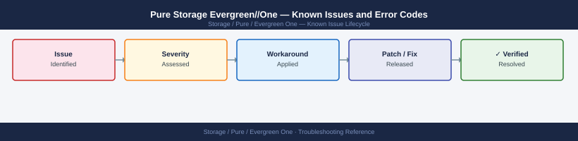

---
tags:
  - troubleshooting
  - evergreen-one
  - pure-storage
  - known-issues
description: "Evergreen//One is Pure Storage's STaaS offering — on-premises Pure hardware managed by Pure. Operational issues are handled by Pure support directly. This..."
---
# Pure Storage Evergreen//One — Known Issues and Error Codes

<div class="kb-summary">
Evergreen//One is Pure Storage's STaaS offering — on-premises Pure hardware managed by Pure. Operational issues are handled by Pure support directly. This page covers tenant-side issues such as capacity overages and connectivity requirements.

*Applies to: Evergreen//One STaaS*
</div>



```d2
direction: down

symptom: Identify Symptom {shape: diamond}
connectivity_and_metering: "Connectivity and Metering" {shape: rectangle}
resolution: Resolve or Escalate {shape: oval}

symptom -> connectivity_and_metering: investigate
connectivity_and_metering -> resolution
```

## Before you begin

- For hardware faults or array operational issues, contact **Pure Storage support directly** — the array is Pure-managed under Evergreen//One.
- Tenant responsibilities: maintain network connectivity (TCP 443 to pure1.purestorage.com), manage data access credentials, and track consumed capacity vs. committed tier.

## Connectivity and Metering

| Error / Symptom | Affected Versions | Cause | Workaround / Fix | Fixed In |
|---|---|---|---|---|
| Pure reports `Array offline` for Evergreen//One array | Any | TCP 443 to pure1.purestorage.com blocked by tenant firewall | Open TCP 443 outbound from array management IP; Evergreen//One SLA requires continuous connectivity | N/A |
| Capacity overage notification despite low usage | Any | Thin provisioning and snapshot reserve counted toward consumed | Review effective capacity in Pure1 portal; contact Pure for tier adjustment | N/A |

## See also

- [Pure Storage FlashArray — Known Issues](../../flasharray/troubleshooting/known-issues.md)
- [Pure Storage FlashBlade — Known Issues](../../flashblade/troubleshooting/known-issues.md)
- [Pure1 — Known Issues](../../pure1/troubleshooting/known-issues.md)
