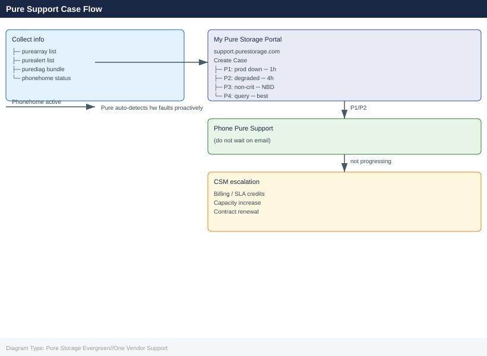
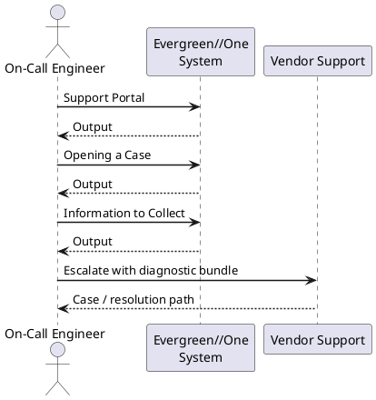

---
tags:
  - pure
description: "Pure Storage Evergreen//One Vendor Support reference covering Support Portal, Opening a Case, Information to Collect, SLA Tiers, Escalation Path."
---
# Pure Storage Evergreen//One Vendor Support

<div class="kb-summary">
Pure Storage Evergreen//One Vendor Support reference covering Support Portal, Opening a Case, Information to Collect, SLA Tiers, Escalation Path.

*Applies to: Evergreen//One*
</div>





## Support Portal

Pure Storage support is accessed through the support portal at **https://support.purestorage.com**.

For Evergreen//One, Pure1 (https://pure1.purestorage.com) is also the primary interface for SLA compliance reporting and service-level issues. Many hardware faults are resolved before the customer is aware: Pure1 phonehome telemetry allows Pure to detect impending failures and dispatch replacement parts proactively, often completing the replacement without customer action.

Ensure phonehome is active at all times. To verify array phonehome status:

```bash
purearray phonehome --status
```


```text title="Expected output"
Phone Home Status Report
========================
Status: ENABLED
Last Phone Home: 2024-01-15 14:32:18 UTC
Next Scheduled Phone Home: 2024-01-22 14:32:18 UTC
Phone Home Proxy: proxy.internal.corp:8080
Connectivity: ONLINE
Last Successful Transmission: 2024-01-15 14:32:18 UTC
Data Collected: 2.3 GB
Encryption: TLS 1.2
Certificate Valid Until: 2025-06-10
```

!!! warning "Common errors"
    | Error | Fix |
    |---|---|
    | `purearray: command not found` | Ensure the Pure Storage management tools are installed and the PATH includes the Pure bin directory, or use the full path `/opt/purearray/bin/purearray`. |
    | `Error: Unable to connect to array management interface` | Verify network connectivity to the array's management IP and confirm the array hostname/IP is correctly configured in your management client settings. |
    | `Certificate verification failed: CERTIFICATE_EXPIRED` | Renew the SSL certificate on the Pure array by contacting Pure Storage support or regenerating the certificate through the management console. |
Any disruption to phonehome connectivity should be treated as urgent — Pure's SLA monitoring, proactive maintenance, and automatic case creation all depend on continuous telemetry.

## Opening a Case

When opening a case manually through the support portal or by phone:

| Field | How to Obtain |
|---|---|
| Array serial number | `purearray list` or Purity GUI > System > Array |
| Purity//FA or Purity//FB version | `purearray list` |
| Subscription entitlement ID | Pure1 > Subscription dashboard — the Evergreen//One contract reference |
| Symptom description | What is failing, when it started, and any relevant recent changes |
| Impact severity | Production down, degraded, or non-critical — set accurately for correct SLA response |

For billing, capacity, or SLA credit disputes, contact your CSM (Customer Success Manager) directly rather than the technical support portal — subscription and billing issues are handled by the account team, not support engineering.

## Information to Collect

```bash
# Array identity and Purity version
purearray list

# Full diagnostic bundle
purediag

# All active alerts
purealert list

# Drive health and status
puredrive list

# Capacity summary
purearray list --space

# Hardware component status
purearray list --hardware

# Host path status
purehostconnection list

# Replication pod and ActiveCluster status
purepod list
```


```text title="Expected output"
Name             Address          Version          Serial           
Evergreen-One    192.168.1.42     6.4.2.1234       ABC123DEF456GHI  

Diagnostic bundle created: /var/log/pure/diag_20240115_143022.tar.gz (2.3 GB)

ID     Severity  Component        Message                              Timestamp            
1847   warning   controller-1     Temperature threshold approaching    2024-01-15 14:28:33  
2104   critical  shelf-2-slot-8   Drive predictive failure detected    2024-01-15 14:15:12  
3021   info      replication      Async replication lag: 245ms         2024-01-15 14:30:01  

Name       Status   Capacity(GB)  Serial          
SSD-1-1    healthy  1920          PD123456789ABC  
SSD-1-2    healthy  1920          PD123456789ABD  
SSD-2-8    failed   1920          PD123456789ABE  
...

Total(GB)  Used(GB)  Available(GB)  Provisioned(GB)  
51200      38720    12480          45056            

Component              Status      Temperature(C)  
Controller-1           healthy     42              
Controller-2           healthy     41              
PSU-1                  healthy     —               
PSU-2                  healthy     —               
Shelf-2-Slot-8         failed      —               

Host                   Connection   Status    
esx-prod-01.local      FC-0         active    
esx-prod-02.local      FC-1         active    
db-server-03.local     iSCSI-0      degraded  

Pod                    Status       Replication-Lag(ms)  
ActiveCluster-DC1      synced       12                   
ActiveCluster-DC2      synced       18
```

!!! warning "Common errors"
    | Error | Fix |
    |---|---|
    | `purearray: command not found` | Install the Pure Storage CLI tools or ensure the PATH includes the Pure management tools directory. |
    | `Error: Array unreachable at 192.168.1.42` | Verify network connectivity to the array management IP and confirm credentials are set via `pureauth login`. |
    | `Error: Insufficient permissions for operation` | Ensure your Pure user account has the required role; contact your Pure administrator to grant API access. |
For service-level issues, also download from Pure1:
- Monthly consumption report (Pure1 > Evergreen//One > Consumption > Export)
- SLA compliance report (Pure1 > Evergreen//One > SLA > Export)

Attach the relevant reports to any billing or SLA credit case.

## SLA Tiers

| Priority | Response Time | Description |
|---|---|---|
| P1 | 1 hour, 24x7 | Production system down or critically impaired; no workaround available |
| P2 | 4 hours, 24x7 | Production system degraded; workaround in place but operation is impacted |
| P3 | Next business day | Non-critical issue; system operational with minor impact |
| P4 | Best effort | General enquiry, feature request, or documentation question |

For P1 and P2 cases, follow up the portal submission with a direct phone call to the Pure Support line. The Evergreen//One availability SLA (99.9999%) means Pure has strong contractual motivation to resolve P1 incidents within the response window — escalate immediately if response is not received within the SLA.

## Escalation Path

**Dedicated CSM (Customer Success Manager)**

Every Evergreen//One customer has a dedicated CSM. The CSM is the first point of escalation for all subscription issues:

- Monthly and annual billing disputes
- Committed reserve adjustments and capacity increase coordination
- SLA credit claims — the CSM confirms credits are applied to the correct invoice period
- Escalating unresolved support cases to Pure engineering or management
- Annual service reviews and contract renewal negotiation

Contact the CSM directly for any issue that is not purely a technical hardware or software incident. Do not route subscription, billing, or SLA credit issues through the technical support portal.

**Technical Support Escalation**

For technical incidents not progressing at the expected pace:

1. Request escalation to a duty manager via the support portal or through the support engineer
2. Ask the support engineer to engage a Pure Solutions Architect for complex technical issues
3. Contact your CSM to apply account-level pressure for major incidents affecting the SLA

**Executive Escalation**

For sustained outages or repeated SLA breaches, the CSM can initiate executive escalation within Pure, engaging senior management and engineering to prioritise resolution. Document all breach events and credits in the service record for use in escalation and renewal negotiations.
