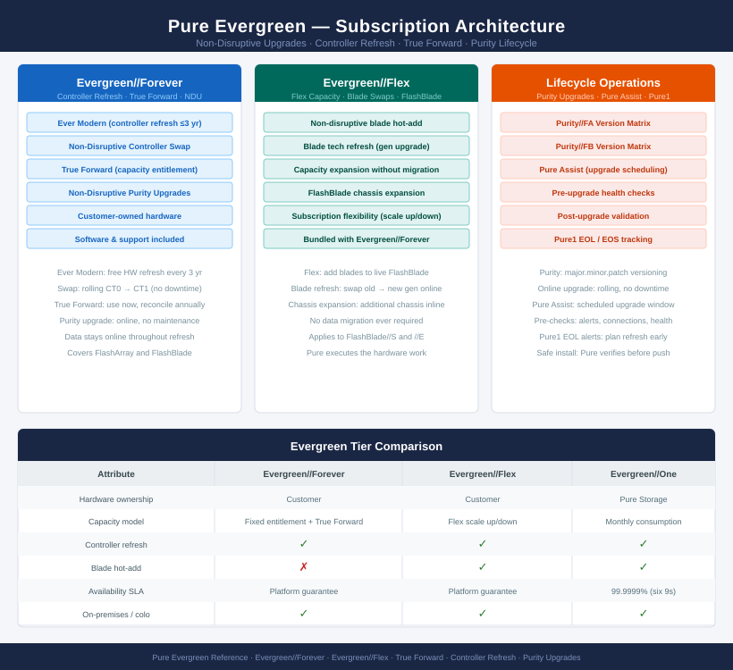
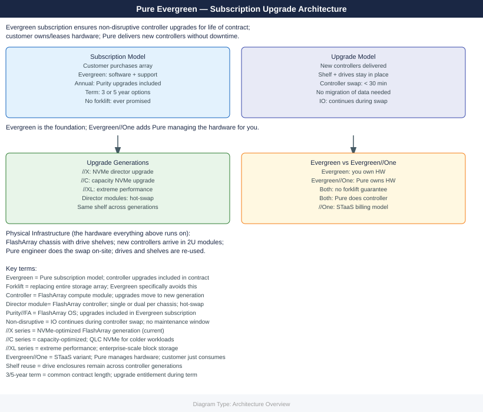

---
tags:
  - architecture
  - pure
---
# Evergreen — Architecture

<div class="kb-summary">
Architecture reference for Pure Storage Evergreen. Covers the non-disruptive controller refresh model, active-active HA, DirectFlash Modules, host connectivity, replication options, and subscription design standards.

*Applies to: Evergreen*
</div>





<div class="kb-grid kb-grid-3">
<a class="kb-card" href="how-it-works/"><strong>How It Works</strong><span>Controller refresh model, HA topology, DFMs, NVRAM, and connectivity.</span></a>
<a class="kb-card" href="integrations/"><strong>Integrations</strong><span>Pure1, True Forward capacity, VMware, backup tools, and REST API.</span></a>
<a class="kb-card" href="design-standards/"><strong>Design Standards</strong><span>Naming conventions, build baseline, and subscription checklist.</span></a>
</div>

| Tier | Description |
|---|---|
| Evergreen//Forever | Base subscription — non-disruptive Ever Modern controller refresh every 3 years, Purity upgrades, and support |
| Evergreen//Flex | Adds non-disruptive capacity and blade swap flexibility for FlashBlade |
| Evergreen//One | STaaS consumption model — Pure owns the hardware; covered separately |

```d2
direction: right

A: "FlashArray Gen N\n(current" {shape: rectangle}
B: "FlashArray Gen N+1\n(upgraded controllers" {shape: rectangle}
C: "FlashArray Gen N+2" {shape: rectangle}
DATA: "Data — always online\nno migration required" {shape: rectangle}

A -> B
B -> C
C -> DATA
```
