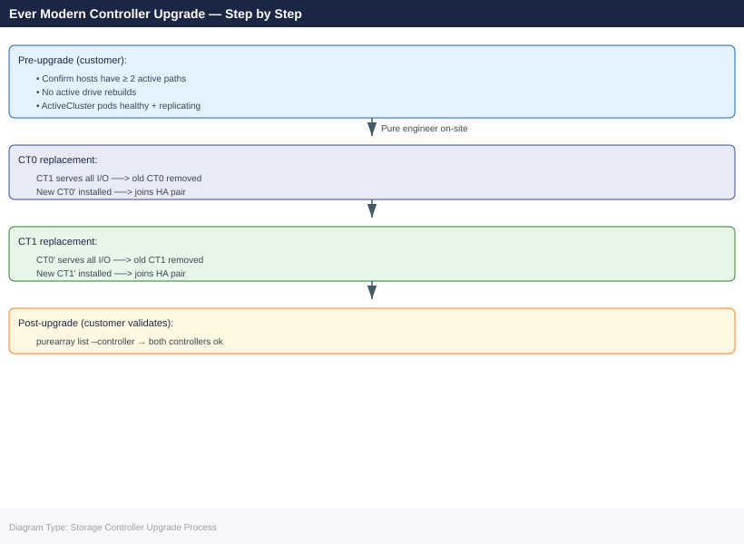

---
tags:
  - pure
description: "Pure Storage Controller Upgrades reference covering How Controller Upgrades Work, Customer Pre-Upgrade Responsibilities, During the Upgrade, Verifying..."
---
# Pure Storage Controller Upgrades

<div class="kb-summary">
Pure Storage Controller Upgrades reference covering How Controller Upgrades Work, Customer Pre-Upgrade Responsibilities, During the Upgrade, Verifying Paths During/After Upgrade, Post-Upgrade Verification and 1 more sections.

*Applies to: Evergreen*
</div>



Under the Evergreen program, Pure Storage performs non-disruptive controller upgrades as part of the subscription — there is no hardware refresh cycle or capital expenditure.

## How Controller Upgrades Work

1. Pure Storage proactively schedules controller upgrades based on technology lifecycle
2. Customer receives advance notice (typically 90+ days)
3. The upgrade is performed non-disruptively by Pure Storage engineers
4. Active I/O continues during the upgrade — hosts see no interruption

## Customer Pre-Upgrade Responsibilities

- Confirm maintenance window with the Pure Storage team
- Verify all hosts are healthy and paths are redundant
- Ensure no in-progress background tasks (e.g., parity rebuilds) would extend the window

```bash
# Check array health before upgrade
purecli array list
purecli drive list
purecli alert list
```


```text title="Expected output"
Name                          Status    Version      Capacity
pure-array-01                 Healthy   6.4.2        50.0TB
pure-array-02                 Healthy   6.4.2        50.0TB
pure-array-03                 Healthy   6.4.1        50.0TB

Drive                         Array              Status    Capacity
SSD-001                       pure-array-01      Healthy   1.92TB
SSD-002                       pure-array-01      Healthy   1.92TB
SSD-003                       pure-array-02      Healthy   1.92TB
...

Severity    Code    Message                              Timestamp
warning     PUR-001 Controller temperature elevated      2024-01-15T09:23:45Z
info        PUR-002 Snapshot scheduled maintenance      2024-01-15T08:00:00Z
```

!!! warning "Common errors"
    | Error | Fix |
    |---|---|
    | `purecli: command not found` | Install the Pure CLI tools or add the installation directory to your PATH environment variable. |
    | `Error: Unable to connect to array at <ip>: Connection refused` | Verify array management IP is reachable and purecli is configured with correct credentials in ~/.purerc or environment variables. |
Or via Pure1 / Purity GUI:
- **Storage → Array** — confirm all drives healthy
- **Analysis → Alerts** — no active critical alerts

## During the Upgrade

- Pure Storage engineers manage the process remotely or on-site
- Active controller is drained non-disruptively before replacement
- Paths fail over to the secondary controller — multipathing handles this transparently
- Expect brief I/O latency increase during path failover (seconds, not minutes)

## Verifying Paths During/After Upgrade

**On the host:**

```bash
# Linux with multipath
multipath -ll

# Windows PowerShell (MPIO)
mpclaim -s -d

# VMware
esxcli storage nmp device list
```


```text title="Expected output"
# Linux with multipath
size=100G features='0' hwhandler='1 alua' wp=rw
|-+- policy='service-time 0' prio=50 status=active
| `- 2:0:0:0 sdb 65:0  active ready running
`-+- policy='service-time 0' prio=10 status=enabled
  `- 3:0:0:0 sdc 65:32 active ready running

# Windows PowerShell (MPIO)
MPIO is installed and operational.
Number of MPIO disks: 4
Disk mpd0: 2 paths, Round Robin
Disk mpd1: 2 paths, Round Robin
Disk mpd2: 4 paths, Round Robin
Disk mpd3: 2 paths, Round Robin

# VMware
Device: naa.6001405abcdef1234567890123456789
   Storage Array Type: PURE FlashArray
   Storage Array Type Device Config: PURE FlashArray
   Path Selection Policy: VMW_PSP_RR
   Paths: vmhba2:C0:T0:L0, vmhba3:C0:T0:L0
```

!!! warning "Common errors"
    | Error | Fix |
    |---|---|
    | `multipath: command not found` | Install device-mapper-multipath package with `apt-get install device-mapper-multipath` or `yum install device-mapper-multipath`. |
    | `MPIO is not installed on this computer` | Enable MPIO through Windows Features or install via `Enable-WindowsOptionalFeature -FeatureName MultipathIO -Online`. |
    | `Unknown command or namespace` | Verify ESXi version supports the command and run with `esxcli storage nmp device list` from the ESXi console or SSH session. |
Confirm all expected paths are active after the upgrade completes.

## Post-Upgrade Verification

```bash
purecli array list     # Confirm new controller hardware
purecli hardware list  # All components healthy
purecli alert list     # No post-upgrade alerts
```


```text title="Expected output"
Name                          Status    Version
purearray-prod-01             Online    6.4.2
purearray-prod-02             Online    6.4.2

Component                     Status    Model              Serial
Controller-A                  Healthy   FA-405            PUREFC1A2B3C4D
Controller-B                  Healthy   FA-405            PUREFC1A2B3E5F
NVMe-Shelf-1                  Healthy   NVMe-Shelf        PURE2024001
NVMe-Shelf-2                  Healthy   NVMe-Shelf        PURE2024002
...

Severity    Code    Message                           Timestamp
---OUTPUT---
```

!!! warning "Common errors"
    | Error | Fix |
    |---|---|
    | `purecli: command not found` | Ensure the Pure Storage CLI is installed and the PATH environment variable includes its bin directory. |
    | `Error: Unable to connect to array at <ip>. Connection refused` | Verify the array management IP is reachable and the purecli credentials are configured in ~/.purerc or via environment variables. |
    | `Error: Authentication failed. Invalid API token` | Regenerate and update your Pure Storage API token using `purecli login` or refresh credentials in the configuration file. |
## Common Considerations

| Item | Detail |
|---|---|
| Downtime | None — non-disruptive by design |
| Pre-requisite | Dual-path host connectivity required |
| Scheduling | Coordinated with Pure Storage |
| Data migration | None — data stays in place |
| Host action required | None (verify paths post-upgrade) |
