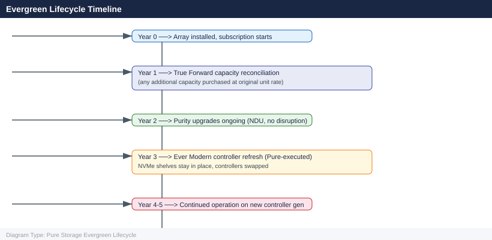

---
tags:
  - pure
description: "Pure Storage Evergreen Lifecycle reference covering Evergreen Program Tiers, Software Upgrade (Purity), Drive Replacement, Controller Refresh..."
---
# Pure Storage Evergreen Lifecycle

<div class="kb-summary">
Pure Storage Evergreen Lifecycle reference covering Evergreen Program Tiers, Software Upgrade (Purity), Drive Replacement, Controller Refresh (Evergreen//Forever), End-of-Life Considerations and 1 more sections.

*Applies to: Evergreen*
</div>



The Evergreen program guarantees that Pure FlashArray and FlashBlade platforms never become obsolete — hardware and software are refreshed non-disruptively as technology evolves.

```d2
direction: right

plan: "Plan" {shape: oval}
evergreen_program_tiers: "Evergreen Program Tiers" {shape: rectangle}
software_upgrade_purity: "Software Upgrade (Purity)" {shape: rectangle}
drive_replacement: "Drive Replacement" {shape: rectangle}
controller_refresh_evergreenforever: "Controller Refresh (Evergreen//Forever)" {shape: rectangle}
endoflife_considerations: "End-of-Life Considerations" {shape: rectangle}
lifecycle_timeline: "Lifecycle Timeline" {shape: rectangle}
validate: "Validate" {shape: oval}

plan -> evergreen_program_tiers
evergreen_program_tiers -> software_upgrade_purity
software_upgrade_purity -> drive_replacement
drive_replacement -> controller_refresh_evergreenforever
controller_refresh_evergreenforever -> endoflife_considerations
endoflife_considerations -> lifecycle_timeline
lifecycle_timeline -> validate
```

## Evergreen Program Tiers

| Program | Model | Refresh Included |
|---|---|---|
| Evergreen//Forever | Customer-owned (CapEx) | Controller upgrades; drives purchased |
| Evergreen//Flex | Subscription lease | Hardware within subscription term |
| Evergreen//One | STaaS (Pure-owned) | All hardware; pure manages lifecycle |

## Software Upgrade (Purity)

Purity (FlashArray OS) upgrades are non-disruptive and performed by Pure Storage:

1. Pure Storage schedules upgrade with advance notice
2. Customer confirms maintenance window
3. Pure upgrades both controllers sequentially — no I/O interruption
4. Purity version is validated post-upgrade

```bash
# Verify current Purity version
purecli array list | grep -i version
# or in GUI: System → Software
```


```text title="Expected output"
Name                          Version           Controller Model
array-prod-01                 6.4.2.1234        FA-m70
array-prod-02                 6.4.2.1234        FA-m70
array-dr-01                   6.3.8.998         FA-x70r2
```

!!! warning "Common errors"
    | Error | Fix |
    |---|---|
    | `purecli: command not found` | Install the Pure CLI tools or add the installation directory to your PATH environment variable. |
    | `Error: Unable to connect to array. Connection refused` | Verify the array management IP is reachable and purecli credentials are configured in ~/.purerc or via environment variables. |
## Drive Replacement

Drives are monitored by Pure1 and replaced proactively before failure:

- Pure Storage ships replacement drive
- Pure engineer (or guided remote process) swaps drive
- Parity rebuild begins automatically
- No host impact during rebuild

```bash
# Check drive health
purecli drive list
purecli drive list --filter "status!=healthy"
```


```text title="Expected output"
Name                Serial              Capacity  Status    Temperature
drive.0             SN-PUR-2847-A1K9    1.92TB    healthy   28°C
drive.1             SN-PUR-2848-B2L7    1.92TB    healthy   29°C
drive.2             SN-PUR-2849-C3M5    1.92TB    healthy   27°C
drive.3             SN-PUR-2850-D4N6    1.92TB    healthy   30°C
drive.4             SN-PUR-2851-E5P2    1.92TB    healthy   28°C
drive.5             SN-PUR-2852-F6Q8    1.92TB    degraded  45°C
drive.6             SN-PUR-2853-G7R3    1.92TB    healthy   29°C

Name                Serial              Capacity  Status    Temperature
drive.5             SN-PUR-2852-F6Q8    1.92TB    degraded  45°C
```

!!! warning "Common errors"
    | Error | Fix |
    |---|---|
    | `purecli: command not found` | Verify the Pure Storage CLI is installed and the PATH includes its bin directory, or use the full path to the purecli executable. |
    | `Error: Authentication failed. Invalid credentials.` | Ensure your Pure Storage array credentials are configured in ~/.purerc or set PURE_API_TOKEN environment variable with a valid token. |
## Controller Refresh (Evergreen//Forever)

Under Evergreen//Forever, controllers are refreshed when new generations are available:
- Customer purchases new controller shelf
- Pure performs non-disruptive controller swap
- Data remains in place (no migration required)

See the Pure Storage Evergreen//Forever documentation for controller upgrade procedures.

## End-of-Life Considerations

- Purity software is supported for all active subscriptions
- Pure Storage commits to NVM and drive compatibility across generations
- Customer-owned (Evergreen//Forever) arrays receive software support for the platform lifetime

## Lifecycle Timeline

| Activity | Trigger | Lead Time |
|---|---|---|
| Purity upgrade | Pure-scheduled or customer request | 30–90 days notice |
| Drive replacement | Proactive Pure1 alert | 5–14 days for parts |
| Controller upgrade | Generation availability | 90+ days notice |
| Platform EOL | Pure announcement | Multi-year notice |
