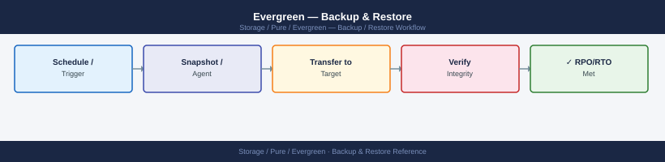
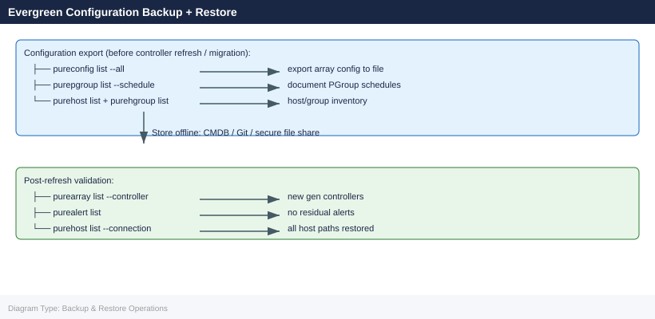

---
tags:
  - operations
  - pure
---
# Evergreen — Backup & Restore

<div class="kb-summary">
Backup & Restore reference covering Evergreen//Forever — No Traditional Backup Required, Export Array Configuration, Pre-Upgrade Configuration Snapshot, Restore After Model Swap, Pure1 Configuration Audit and 1 more sections.

*Applies to: Evergreen*
</div>




## Before you begin

- **Access:** Storage admin credentials (cluster admin or equivalent)
- **Timing:** safe to run during business hours unless a step is marked ⚠ (causes interruption)
- **Dependencies:** no active upgrades or migrations on the same infrastructure
- **Logging:** capture command output — paste into the change record on completion

---

## Evergreen//Forever — No Traditional Backup Required

Evergreen//Forever is a subscription model, not a product you reinstall. "Backup" here covers:

- Configuration export (alert policies, host connections, protection groups)
- Pure1 telemetry archive
- Array configuration snapshot before a model swap or controller upgrade

## Export Array Configuration

```bash
# Via purearray CLI — export support bundle (includes config snapshot)
purearray list --api-token <token> --address <array-ip>

# Via REST API — get array info
curl -s -k -H "x-auth-token: <token>" https://<array-ip>/api/2.16/arrays | jq .

# Export protection groups
curl -s -k -H "x-auth-token: <token>" https://<array-ip>/api/2.16/protection-groups | jq .

# Export host and host group mappings
curl -s -k -H "x-auth-token: <token>" https://<array-ip>/api/2.16/hosts | jq .
curl -s -k -H "x-auth-token: <token>" https://<array-ip>/api/2.16/host-groups | jq .
```


```text title="Expected output"
Name                          Status      Version
pure-fa-m20-prod-01           Optimal     6.4.2.1
Capacity (GB)                 Used (GB)   Available (GB)
102400                        45230       57170

[
  {
    "name": "pure-fa-m20-prod-01",
    "id": "a1b2c3d4-e5f6-4a7b-8c9d-0e1f2a3b4c5d",
    "version": "6.4.2.1",
    "revision": "201805021234",
    "status": "optimal"
  }
]

[
  {
    "name": "pg-prod-databases",
    "id": "b2c3d4e5-f6a7-4b8c-9d0e-1f2a3b4c5d6e",
    "source": {
      "name": "pure-fa-m20-prod-01"
    },
    "replication_schedule": "every 1h"
  },
  {
    "name": "pg-prod-vmware",
    "id": "c3d4e5f6-a7b8-4c9d-0e1f-2a3b4c5d6e7f",
    "source": {
      "name": "pure-fa-m20-prod-01"
    }
  }
]

[
  {
    "name": "esx-host-01.prod.local",
    "id": "d4e5f6a7-b8c9-4d0e-1f2a-3b4c5d6e7f8a",
    "iqn": "iqn.1998-01.com.vmware:esx-host-01-prod",
    "host_group": "vmware-cluster-prod"
  },
  {
    "name": "db-server-02.prod.local",
    "id": "e5f6a7b8-c9d0-4e1f-2a3b-4c5d6e7f8a9b",
    "iqn": "iqn.1998-01.com.vmware:db-server-02-prod"
  }
]

[
  {
    "name": "vmware-cluster-prod",
    "id": "f6a7b8c9-d0e1-4f2a-3b4c-5d6e7f8a9b0c",
    "host_count": 4,
    "hosts": [
      "esx-host-01.prod.local",
      "esx-host-02.prod.local",
      "esx-host-03.prod.local",
      "esx-host-04.prod.local"
    ]
  }
]
```

!!! warning "Common errors"
    **`curl: (60) SSL certificate problem: self signed certificate`** — Add `-k` flag to curl command to skip SSL verification (already present in examples; ensure it's not removed).
    **`jq: parse error: Invalid JSON at line 1`** — Verify the API token is valid and the array IP is reachable; an authentication failure returns HTML error pages instead of JSON.
## Pre-Upgrade Configuration Snapshot

Run before a scheduled controller or model swap to capture current state.

```bash
#!/usr/bin/env bash
# evergreen-config-snapshot.sh
ARRAY_IP="<array-ip>"
TOKEN="<api-token>"
OUT_DIR="./pure-config-$(date +%Y%m%d)"
mkdir -p "$OUT_DIR"

for endpoint in arrays hosts host-groups volumes protection-groups network-interfaces; do
    curl -s -k -H "x-auth-token: $TOKEN" \
        "https://$ARRAY_IP/api/2.16/$endpoint" | jq . > "$OUT_DIR/$endpoint.json"
    echo "Saved: $OUT_DIR/$endpoint.json"
done
echo "Config snapshot complete: $OUT_DIR"
```


```text title="Expected output"
Saved: ./pure-config-20240115/arrays.json
Saved: ./pure-config-20240115/hosts.json
Saved: ./pure-config-20240115/host-groups.json
Saved: ./pure-config-20240115/volumes.json
Saved: ./pure-config-20240115/protection-groups.json
Saved: ./pure-config-20240115/network-interfaces.json
Config snapshot complete: ./pure-config-20240115
```

!!! warning "Common errors"
    **`curl: (60) SSL certificate problem: self signed certificate`** — Add `-k` flag to curl (already present in script) or import the array's CA certificate into your system trust store.
    **`jq: parse error: Invalid JSON text at line 1`** — Verify the API token is valid and the array IP is reachable; an authentication failure returns HTML instead of JSON.
    **`mkdir: cannot create directory './pure-config-20240115': Permission denied`** — Run the script from a directory where you have write permissions or specify an absolute path for `OUT_DIR`.
## Restore After Model Swap

After a new controller ships under Evergreen//Forever:

1. Dell/Pure engineer connects new hardware and migrates shelf
2. Restore configuration from snapshot if custom settings were overwritten:
   - Re-apply alert email addresses
   - Re-apply SMTP relay settings
   - Re-verify host/host group mappings
   - Confirm protection group schedules

## Pure1 Configuration Audit

Use Pure1 to review historical configuration changes before a restore decision.

- **Pure1 Portal** → select array → **History** tab shows all config events
- Filter by date range to identify what changed before an issue occurred
- Use as reference when re-applying settings manually

## Checklist

- [ ] Export config snapshot before any controller swap
- [ ] Confirm protection group replication targets are intact post-upgrade
- [ ] Verify host connectivity (iSCSI/FC) after hardware replacement
- [ ] Re-register array in Pure1 if hardware serial number changed

---

## Verify

- Confirm the operation completed without errors in the log or management UI
- Verify the expected state change is visible (service running, object created, config applied)
- Document the outcome in the change record

---

## See also

- [Evergreen — Procedures](../procedures/)
- [Evergreen — Health Checks](../health-checks/)
