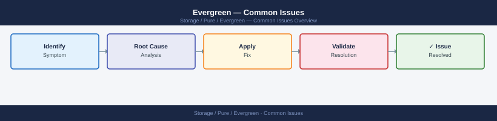
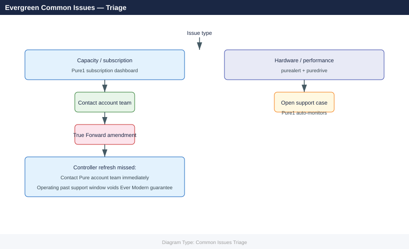

---
tags:
  - operations
  - pure
description: "Common Issues reference covering Incident Triage Checklist, Common Issues Reference, Controller Upgrade Issues in Detail, Capacity Management Issues..."
---
# Evergreen — Common Issues

<div class="kb-summary">
Common Issues reference covering Incident Triage Checklist, Common Issues Reference, Controller Upgrade Issues in Detail, Capacity Management Issues, Subscription and Lifecycle Issues and 2 more sections.

*Applies to: Evergreen*
</div>




> Part of the [Evergreen Operations](index.md) reference.

---

This page covers the most common operational issues encountered with arrays running under an Evergreen subscription — covering controller upgrade problems, host path failures, capacity concerns, subscription management issues, and replication incidents.

---

## Before you begin

- **Access:** Storage admin credentials (cluster admin or equivalent)
- **Timing:** safe to run during business hours unless a step is marked ⚠ (causes interruption)
- **Dependencies:** no active upgrades or migrations on the same infrastructure
- **Logging:** capture command output — paste into the change record on completion

---

## Incident Triage Checklist

Before diving into specific issues, run the following sequence to establish the failure domain:

- [ ] Check Pure1 for any open hardware or software alerts — Pure1 often has context on incidents before the customer is aware
- [ ] Run `purealert list` on the affected array — identify whether the alert is hardware, software, or capacity
- [ ] Run `purearray list --controller` — confirm both controllers are online and running the same Purity version
- [ ] Run `puredrive list` — check for failed or evacuating drives
- [ ] Run `purepod list` — check ActiveCluster pod status if replication is involved
- [ ] Run `purehostconnection list` — confirm host path states; single-path hosts are a risk factor
- [ ] Check the Pure1 subscription dashboard — confirm capacity consumed vs. entitled and that phonehome is active

| Question | Where to Find the Answer |
|---|---|
| Is this a hardware or software failure? | `purealert list` and Pure1 > Arrays |
| Are both controllers healthy? | `purearray list --controller` |
| Are any drives failed? | `puredrive list` |
| Is this capacity-related? | `purearray list --space` |
| Is this replication-related? | `purepod list` |
| Is phonehome active? | Pure1 > Arrays > select array > Support > Phone Home |

---

## Common Issues Reference

| Symptom | Likely Cause | Action |
|---|---|---|
| Controller upgrade window missed | Subscription renewal not tracked with sufficient lead time | Contact Pure account team immediately — operating past the controller support window risks voiding the Ever Modern guarantee; the Pure account team can assess options for rescheduling |
| Host path goes offline during controller upgrade | Host multipathing not validated before upgrade; single-path hosts | Identify affected hosts with `purehostconnection list`; rescan HBAs or iSCSI initiators on affected hosts; contact Pure Support for guidance on path recovery |
| ActiveCluster mediator unreachable during upgrade | Network change or mediator misconfiguration; mediator IP changed | Verify mediator connectivity: `curl -sk https://<mediator-ip>/mediator/version`; update mediator IP in pod configuration if it has changed |
| Replication pod not replicating after upgrade | Network interruption during upgrade; pod paused or lag too high | Run `purepod list` to identify pod status; resume a paused pod: `purepod resume --name <pod_name>`; allow time for the pod to re-sync — lag reduces as replication catches up |
| Pure1 phonehome offline | Proxy change, firewall rule update, or network reconfiguration | Confirm outbound HTTPS port 443 to `*.purestorage.com` from the management interface; check proxy settings in the array GUI under System > Support |
| Capacity alert at upgrade time | Snapshot growth or volume provisioning without corresponding cleanup | Review snapshot space with `puresnap list --space`; eradicate old destroyed snapshots: `purevol eradicate --destroyed`; review and clean protection group snapshots before the upgrade |
| Purity software version outside supported range | Upgrade deferred too long; now outside N-2 support window | Contact Pure account team and support to plan an expedited upgrade path; some version gaps require intermediate upgrades — do not attempt to skip without guidance |
| Data reduction ratio below contracted guarantee | Workload mix changed; incompressible data (video, encrypted files) now dominant | Run `purearray list --space` to confirm the current effective data reduction ratio; contact Pure account team — if the ratio is below the contracted guarantee, Pure should provide additional capacity at no charge |
| Volume not visible to host after provisioning | Host group membership not configured; HBA not logged in; fabric zoning missing | Confirm the volume is connected to the correct host group: `purevol list --connection`; verify the host IQN or WWPN is registered in Purity: `purehost list`; check SAN fabric zoning |
| Snapshot retention growing unexpectedly | Protection group schedule creating more snapshots than the retention policy expires | Audit protection group schedules: `purepgroup list --schedule`; confirm retention policy settings match intent; eradicate accumulated expired snapshots |
| Performance below SLA for specific volumes | QoS limit not set; wrong array series for workload type; noisy neighbour | Review QoS settings on the affected volumes: `purevol list --space`; run a Pure1 workload assessment; engage the Pure account team to assess whether the array series (//X vs //C) is appropriate |
| ActiveCluster pod in `degraded` state | One array of the pair is unreachable from the pod perspective | Run `purepod list` on both arrays; verify network connectivity between the two arrays and to the mediator; Pure Support should be engaged for pod degraded events on production |

---

## Controller Upgrade Issues in Detail

### Pre-Upgrade Validation Failures

Run the following before any controller upgrade window to identify blockers early:

```bash
# Confirm all drives are healthy — no rebuilding or failed drives
puredrive list
puredrive list --filter "status!='healthy'"

# Confirm both controllers are online
purearray list --controller

# Confirm no active critical alerts
purealert list --severity error

# Confirm all pods are online (if ActiveCluster is deployed)
purepod list

# Confirm all hosts have redundant paths (no single-path hosts)
purehostconnection list
# Look for any host with only 1 path shown
```


```text title="Expected output"
Name    Capacity  Used      Status    
drive0  1.6TB     892.3GB   healthy   
drive1  1.6TB     901.7GB   healthy   
drive2  1.6TB     885.2GB   healthy   
drive3  1.6TB     910.1GB   healthy   
(no output — no unhealthy drives found)

Name       Status   Version      
controller0 online  PureOS 6.4.2 
controller1 online  PureOS 6.4.2 

(no output — no critical alerts)

Name       Status  Mediator
pod-esx01  online  10.20.50.88
pod-esx02  online  10.20.50.88

Host          Port    Target  LUN  Status   
esx-host-01   fc.0    ct0.fc0 0    active   
esx-host-01   fc.1    ct1.fc0 0    active   
esx-host-02   fc.0    ct0.fc0 1    active   
esx-host-02   fc.1    ct1.fc0 1    active   
esx-host-03   fc.0    ct0.fc0 2    active
```

!!! warning "Common errors"
    | Error | Fix |
    |---|---|
    | `Error: No such command 'puredrive'` | Verify the Pure Storage CLI is installed and in your PATH; run `which pureadmin` to confirm. |
    | `Error: Connection refused (10.20.50.1:443)` | Ensure the array management IP is reachable and the array is online; check network connectivity with `ping 10.20.50.1`. |
    | `Error: Authentication failed` | Verify your Pure Storage API token or credentials are valid; re-authenticate with `pureadmin login`. |
**Common blockers and resolutions:**

| Blocker | Resolution |
|---|---|
| Drive rebuild in progress | Wait for the rebuild to complete before starting the upgrade window — `puredrive list` shows progress |
| Single-path host detected | Add a second path to the host before proceeding — do not upgrade with single-path hosts |
| Pod not online | Investigate and resolve pod health before upgrade — a degraded pod during upgrade may result in an extended outage |
| Snapshot count very high | Eradicate old destroyed snapshots to reduce upgrade duration: `puresnap eradicate --destroyed` |

### Path Recovery After Controller Upgrade

If host paths do not recover automatically after a controller swap:

**Linux (multipath):**

```bash
# On the affected Linux host
# Rescan the SCSI bus to detect new paths
for host in /sys/class/scsi_host/host*; do echo "- - -" > $host/scan; done

# Reload multipath to pick up new paths
multipathd reconfigure

# Confirm all expected paths are visible
multipath -ll
```


```text title="Expected output"
device-mapper-multipath-0.8.7 (1.1.2|UP)
size=2.0T features='0' hwhandler='1 alua' wp=rw
|-+- policy='service-time 0' prio=50 status=active
| |- 2:0:0:1 sdb 8:16  active ready running
| |- 3:0:0:1 sdc 8:32  active ready running
| `- 4:0:0:1 sdd 8:48  active ready running
`-+- policy='service-time 0' prio=10 status=enabled
  |- 5:0:0:1 sde 8:64  active ready running
  |- 6:0:0:1 sdf 8:80  active ready running
  `- 7:0:0:1 sdg 8:96  active ready running

mpatha (360001405a1b2c3d4e5f6g7h8i9j0k1l) dm-0 PURE,FlashArray-X70
size=2.0T features='0' hwhandler='1 alua' wp=rw
```

!!! warning "Common errors"
    | Error | Fix |
    |---|---|
    | `multipathd: command not found` | Install device-mapper-multipath package with `apt-get install multipath-tools` or `yum install device-mapper-multipath`. |
    | `open: /sys/class/scsi_host/host*/scan: No such file or directory` | Verify SCSI host controllers exist with `ls /sys/class/scsi_host/` and ensure the system has active storage adapters. |
    | `multipath: command not found` | Install multipath-tools with `apt-get install multipath-tools` or `yum install device-mapper-multipath` and start the multipathd service. |
**VMware ESXi:**

```bash
# Rescan storage adapters in ESXi
esxcli storage core adapter rescan --all

# Confirm paths are active for each device
esxcli storage nmp device list | grep -A 5 <device_naa>
```


```text title="Expected output"
Rescan of adapter vmhba0 started.
Rescan of adapter vmhba1 started.
Rescan of adapter vmhba2 started.
Rescan of adapter vmhba3 started.
Rescan of adapter vmhba4 started.

Device: naa.624a9370d1234567890abcdef012345
   Display Name: PURE FlashArray //m20 (naa.624a9370d1234567890abcdef012345)
   Multiplex Policy: round-robin
   Path Count: 4
   Work Load Model: Default
   PluginName: NMP
   State: active
   Paths:
      vmhba0:C0:T0:L0 Hostd.vmhba0:C0:T0:L0 naa.624a9370d1234567890abcdef012345 active ready
      vmhba1:C0:T0:L0 HostD.vmhba1:C0:T0:L0 naa.624a9370d1234567890abcdef012345 active ready
      vmhba2:C0:T0:L0 HostD.vmhba2:C0:T0:L0 naa.624a9370d1234567890abcdef012345 active ready
      vmhba3:C0:T0:L0 HostD.vmhba3:C0:T0:L0 naa.624a9370d1234567890abcdef012345 active ready
```

!!! warning "Common errors"
    | Error | Fix |
    |---|---|
    | `Error: Unknown command or namespace storage core adapter rescan` | Verify the ESXi host version supports this command (6.5+) and that you are connected to the correct host via SSH. |
    | `Error: Could not find device naa.624a9370d1234567890abcdef012345` | Confirm the NAA ID is correct by running `esxcli storage nmp device list` without grep to view all available devices. |
**Windows (MPIO):**

```powershell
# Rescan MPIO paths in PowerShell
mpclaim -r

# Confirm path state
mpclaim -s -d
```

---

## Capacity Management Issues

### Identifying Top Capacity Consumers

When capacity alerts fire or the subscription True Forward review is approaching:

```bash
# Overall capacity summary
purearray list --space

# Volume-level space usage — identify top consumers
purevol list --space | sort -k 2 -rh | head -20

# Snapshot space usage — identify snapshots consuming unexpected space
puresnap list --space | sort -k 3 -rh | head -20

# Protection group snapshot totals
purepgroup list --space

# Show space used by destroyed but not yet eradicated volumes
purevol list --destroyed --space
```


```text title="Expected output"
Name                          Capacity      Used    Available   %Used
pure-array-01                 100.0T        67.3T   32.7T       67.3%

Volume                        Used          Snapshots  Provisioned
prod-db-01                    18.5T         2.1T       20.0T
prod-db-02                    14.2T         1.8T       15.0T
backup-archive-vol            9.7T          3.4T       12.0T
dev-test-clone                6.3T          0.9T       8.0T
logs-retention-vol            4.1T          1.2T       5.0T
...

Snapshot                      Size          Volume             Created
prod-db-01.snap.20240115      2.1T          prod-db-01         2024-01-15T09:32:14Z
prod-db-02.snap.20240114      1.8T          prod-db-02         2024-01-14T14:22:08Z
backup-archive-vol.daily.001  1.5T          backup-archive-vol 2024-01-10T02:00:00Z
prod-db-01.snap.20240110      0.9T          prod-db-01         2024-01-10T09:15:22Z
dev-test-clone.snap.20240112  0.7T          dev-test-clone     2024-01-12T16:45:33Z
...

Name                          Snapshots     Used      Provisioned
prod-protection-group         12            8.3T      25.0T
backup-protection-group       8             4.2T      12.0T
dev-protection-group          5             2.1T      8.0T

Name                          Used          Snapshots  Destroyed
prod-db-old-01                3.2T          0.8T       yes
archive-vol-deprecated        1.9T          0.4T       yes
```

!!! warning "Common errors"
    | Error | Fix |
    |---|---|
    | `Error: Invalid credentials or API token expired` | Verify your Pure Storage API token is valid and re-authenticate using `purelogin`. |
    | `Error: Array not reachable at <hostname>` | Confirm the array hostname/IP is correct and network connectivity exists with `ping` or `nslookup`. |
### Freeing Capacity Before a True Forward Review

```bash
# Eradicate destroyed volumes that are past the eradication timer
purevol eradicate --destroyed

# Eradicate old destroyed snapshots
puresnap eradicate --destroyed

# Review and trim snapshot retention on protection groups that have excessive history
purepgroup list --schedule
# Use the GUI or CLI to reduce the retention period for non-critical protection groups
```


```text title="Expected output"
Eradicating destroyed volumes...
Volume 'vol-prod-db-01.destroyed' (3.2 TB) eradicated successfully
Volume 'vol-backup-archive.destroyed' (8.7 TB) eradicated successfully
Volume 'vol-test-ephemeral.destroyed' (1.1 TB) eradicated successfully
3 destroyed volumes eradicated. Recovered 13.0 TB of capacity.

Eradicating destroyed snapshots...
Snapshot 'snap-hourly.2024-01-15T08:00Z.destroyed' eradicated successfully
Snapshot 'snap-hourly.2024-01-15T09:00Z.destroyed' eradicated successfully
Snapshot 'snap-daily.2024-01-10.destroyed' eradicated successfully
47 destroyed snapshots eradicated. Recovered 2.3 TB of capacity.

Name                          Snapshots  Interval  Keep  Enabled
pg-database-prod              1847       hourly    168   true
pg-database-prod              892        daily     30    true
pg-database-prod              156        weekly    12    true
pg-fileserver-nightly         2341       hourly    72    true
pg-fileserver-nightly         445        daily     90    true
pg-archive-compliance         3156       daily     2555  true
...
```

!!! warning "Common errors"
    | Error | Fix |
    |---|---|
    | `Error: No destroyed volumes found to eradicate` | Verify that volumes have been destroyed and are within the eradication timer window; check `purevol list --destroyed` to confirm candidates exist. |
    | `Error: Insufficient permissions to eradicate snapshots` | Ensure your Pure Storage API token or user account has the `eradicate` privilege assigned in the Pure1 management console. |
### Confirming the Data Reduction Guarantee

```bash
# Check current effective data reduction ratio
purearray list --space
# Look for 'data_reduction' field — this is the current achieved ratio

# If the ratio is below the contracted guarantee:
# 1. Note the current ratio and contracted ratio
# 2. Contact the Pure account team — Pure should provide additional capacity at no charge
# 3. Identify the cause: incompressible data types, deduplication disabled on volumes
```


```text title="Expected output"
Name                          Capacity  Used      Snapshots Data Reduction
purearray-prod-01             100.0TB   67.3TB    12.4TB    3.2x
purearray-prod-02             100.0TB   71.8TB    8.9TB     2.8x
purearray-dr-01               50.0TB    22.1TB    4.2TB     2.1x
purearray-test-01             25.0TB    8.7TB     1.1TB     1.9x

Total                          275.0TB   169.9TB   26.6TB    2.7x
```

!!! warning "Common errors"
    | Error | Fix |
    |---|---|
    | `purearray: command not found` | Install the Pure Storage CLI tools or ensure the PATH includes the Pure management utilities directory. |
    | `Error: Unable to connect to array at <ip>. Connection refused.` | Verify the array management IP is reachable and the Pure REST API service is running with `ssh <array-ip> pureadmin list`. |
    | `Error: Invalid credentials. Authentication failed.` | Confirm your Pure API token or username/password is current and has sufficient permissions to query space metrics. |
---

## Subscription and Lifecycle Issues

### Scheduling a Missed Ever Modern Controller Upgrade

If the controller upgrade window has been missed or is approaching its deadline:

1. Log into Pure1 and navigate to **Subscription > Lifecycle** to see the current controller generation and upgrade window status
2. Contact the Pure account team directly — do not wait for Pure to initiate contact
3. Provide the Pure account team with available maintenance windows (at least 3 options, 4+ hours each)
4. Confirm Purity software version is within the supported range for the new controller generation before scheduling — Pure will validate, but confirm independently using the compatibility matrix

### Checking Subscription Status

```bash
# Confirm phonehome is active (prerequisite for subscription monitoring)
purearray phonehome --status

# Confirm the array is registered in Pure1 (array must appear in Pure1 portal)
# Pure1 > Arrays — the array should appear with a green health score

# Subscription tier, renewal date, and controller generation
# Pure1 > Subscription > Dashboard
```


```text title="Expected output"
phonehome is active
Phonehome Status: enabled
Last phonehome check-in: 2024-01-15 14:32:18 UTC
Next scheduled check-in: 2024-01-15 20:32:18 UTC

Array Registration Status: REGISTERED
Array Name: purearray-prod-01
Serial Number: 5b1234567890abcd
Pure1 Portal Status: Connected
Last sync with Pure1: 2024-01-15 14:35:02 UTC

Subscription Information:
  Tier: Evergreen Premium
  Renewal Date: 2025-06-30
  Controller Generation: //m70
  Support Level: 24/7 Premium
```

!!! warning "Common errors"
    | Error | Fix |
    |---|---|
    | `phonehome is inactive` | Enable phonehome with `purearray phonehome --enable` to restore Pure1 connectivity and subscription monitoring. |
    | `Array Registration Status: UNREGISTERED` | Register the array in Pure1 by navigating to Pure1 portal > Arrays > Register, or contact Pure support to link the serial number to your account. |
---

## Diagnostic Commands Summary

```bash
# Array health and version
purearray list
purearray list --controller
purearray list --hardware
purearray list --space

# All alerts
purealert list
purealert list --severity error

# Drive status
puredrive list
puredrive list --filter "status!='healthy'"

# Replication
purepod list
purepod list --replicating
purepod list --failover-preference

# Host paths
purehostconnection list
purehost list

# Snapshot space
puresnap list --space
purepgroup list --space

# Diagnostic bundle for Pure Support
purediag
```


```text title="Expected output"
Name                          Revision  Status
pure-array-01.dc1.local      T20231015a-84  Online
Controller A                  T20231015a-84  Online
Controller B                  T20231015a-84  Online

Hardware Summary:
  Drives: 48 x 1.92TB SSD (NVMe)
  Memory: 256GB
  Network: 4x 25GbE

Space Summary:
  Total Capacity: 92.16TB
  Used: 67.43TB
  Available: 24.73TB

Alert Summary: 23 total
  Error: 2
  Warning: 8
  Info: 13

Error Alerts:
  [2024-01-15 09:42:15] Drive slot 12 degraded — predictive failure
  [2024-01-15 08:17:03] Replication lag exceeding threshold on pod-dr-01

Unhealthy Drives:
  Slot 12  1.92TB  Degraded  predictive_failure
  Slot 34  1.92TB  Failed    media_error

Pod Replication Status:
  pod-prod-01  Replicating  Target: pure-array-02  Lag: 2.3s
  pod-dr-01    Replicating  Target: pure-array-03  Lag: 45.2s

Failover Preferences:
  pod-prod-01  Preferred: pure-array-02
  pod-dr-01    Preferred: pure-array-03

Host Connections: 12 active
  host-app-01  iSCSI  Connected  4 paths
  host-app-02  iSCSI  Connected  4 paths
  host-db-01   FC     Connected  8 paths

Snapshot Space Usage:
  Total Snapshots: 847
  Space Used: 18.92TB
  Oldest: prod-db-snap-20240101_0200

Protection Group Space:
  pg-prod-databases  Snapshots: 156  Space: 8.34TB
  pg-app-tier        Snapshots: 203  Space: 6.12TB

Diagnostic bundle generated: /var/log/pure/diag_pure-array-01_20240115_094215.tar.gz (2.1GB)
```

!!! warning "Common errors"
    | Error | Fix |
    |---|---|
    | `purearray: command not found` | Ensure the Pure Storage management CLI is installed and the PATH includes the Pure bin directory (typically `/opt/purearray/bin`). |
    | `Error: Authentication failed` | Verify credentials are set via `export PURE_APITOKEN=<token>` or configure `~/.purerc` with valid array management credentials. |
    | `purediag: Insufficient disk space (need 3GB, have 1.2GB available)` | Free up space on the management host or redirect the bundle to a mounted NFS share with `purediag --output /mnt/nfs/diags/`. |
---

## Before Calling Pure Support

Gather the following before opening a case to reduce time to resolution:

1. **Array serial number and Purity version** — `purearray list`
2. **Full alert output** — `purealert list`; copy the complete output
3. **Drive status** — `puredrive list`; copy the complete output
4. **Controller status** — `purearray list --controller`
5. **Pod status** (if replication is involved) — `purepod list`
6. **Host connection status** (if host I/O is affected) — `purehostconnection list`
7. **Diagnostic bundle** — `purediag`; Pure Support can pull this via phonehome if the support tunnel is active
8. **Symptom description** — what changed before the issue, when it started, and business impact
9. **Pure1 health score screenshot** — captures the fleet view context at time of incident

For controller upgrade or subscription issues, also have the Pure1 subscription dashboard available and the CSM contact details ready.

---

## Verify

- Confirm the operation completed without errors in the log or management UI
- Verify the expected state change is visible (service running, object created, config applied)
- Document the outcome in the change record

## See also

- [Evergreen — Backup & Restore](backup-restore.md)
- [Evergreen — CLI Reference](cli-reference.md)
- [Evergreen — Health Checks](health-checks.md)
- [Evergreen — Operations](index.md)
- [Evergreen — Architecture](../../architecture/)
- [Pure Storage Evergreen Security](../../security/)
- [Pure Storage Evergreen Troubleshooting](../../troubleshooting/)
