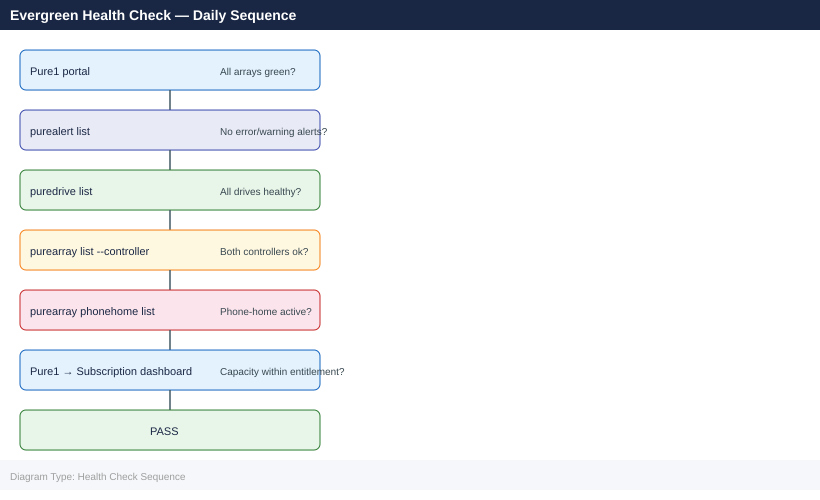
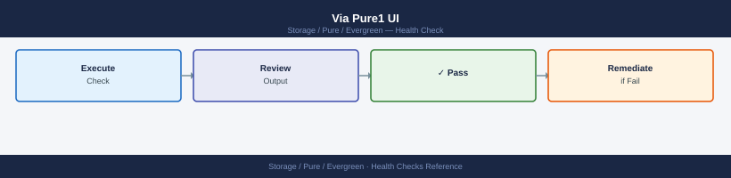
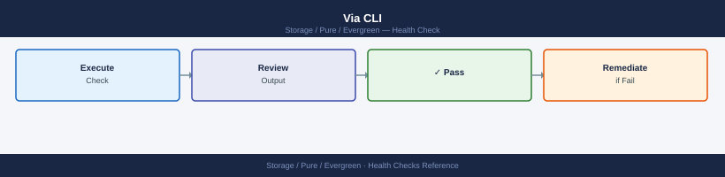
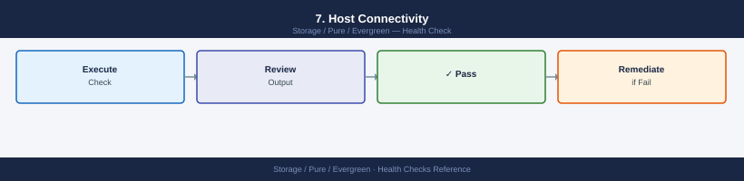

---
tags:
  - operations
  - pure
description: "Health Checks reference covering Quick Health Check (5 minutes), Full Health Check (20 minutes), Health Check Checklist Template, Evergreen Subscription..."
---
# Evergreen — Health Checks

<div class="kb-summary">
Health Checks reference covering Quick Health Check (5 minutes), Full Health Check (20 minutes), Health Check Checklist Template, Evergreen Subscription Checks, Common Issues During Health Checks.

*Applies to: Evergreen*
</div>



> Part of the [Evergreen Operations](index.md) reference.

---

## Before you begin

- **Access:** Storage admin credentials (cluster admin or equivalent)
- **Timing:** safe to run during business hours unless a step is marked ⚠ (causes interruption)
- **Dependencies:** no active upgrades or migrations on the same infrastructure
- **Logging:** capture command output — paste into the change record on completion

---

## Run This Routine

1. **Controller version** — `purearray list --controllers` — verify current Purity version
2. **Available upgrades** — Pure1 → Software → Upgrades — check for available Purity releases
3. **Upgrade eligibility** — verify array is on an Evergreen subscription (not a perpetual licence)
4. **Hardware refresh schedule** — review Evergreen hardware refresh timeline in the Pure1 contract portal
5. **Phone home** — Pure1 → Settings — verify array is connected and sending telemetry
6. **Support entitlement** — Pure1 → Support → verify active Evergreen subscription dates

Regular health checks confirm that FlashArray is operating within expected parameters and that the Evergreen support relationship (Phone Home, entitlement, replacement readiness) is functioning.

## Quick Health Check (5 minutes)


Run from Pure1 UI or CLI. No impact to production.

=== "Pure1 UI"

    

    ```text
    Pure1 → Arrays → select array → Overview tab

    Check:
      ✓ Array status: Green (no active alerts)
      ✓ Both controllers: Online
      ✓ All drives: Healthy
      ✓ Phone Home: Last contact < 24 hours ago
      ✓ Capacity: < 70% used
    ```

=== "CLI (Purity)"

    

    ```bash
    ssh pureuser@<flasharray-ip>

    # 1. Overall hardware health
    purehw list | grep -v Healthy
    # Expected: no output (all components healthy)

    # 2. Active alerts
    purealert list --flagged
    # Expected: no output (no open alerts)

    # 3. Controller status
    purehw list --type ct
    # Expected: CT0 and CT1 both Healthy

    # 4. Array capacity
    purearray list --space
    # Check: capacity_utilization < 0.70

    # 5. Phone Home status
    puresupport list
    # Check: phonehome_enabled = true, last_contact < 24h
    ```

    ```text title="Expected output"
    pureuser@flasharray-ip> purehw list | grep -v Healthy
    pureuser@flasharray-ip> purealert list --flagged
    pureuser@flasharray-ip> purehw list --type ct
    Name    Status    Model              Serial
    CT0     Healthy   FA-405R3           PUREARRAY123456A
    CT1     Healthy   FA-405R3           PUREARRAY123456B
    pureuser@flasharray-ip> purearray list --space
    Name           Capacity  Data_Reduction  Space_Used  Capacity_Utilization
    flasharray-01  100.0T    3.2x            68.5T       0.685
    pureuser@flasharray-ip> puresupport list
    Name           Phonehome_Enabled  Last_Contact
    flasharray-01  true               2h ago
    pureuser@flasharray-ip> exit
    ```

    !!! warning "Common errors"
        **`ssh: Could not resolve hostname <flasharray-ip>: Name or service not known`** — Replace `<flasharray-ip>` with the actual management IP address of your Pure Storage array.
        **`ERROR: Invalid credentials`** — Verify the pureuser account exists and password is correct, or use SSH key authentication if configured.
        **`ERROR: Command not found: purehw`** — Ensure you are connected to the Pure Storage array's management interface (SSH to the correct IP) and not a local shell.
## Full Health Check (20 minutes)


Run monthly and before/after Purity upgrades or hardware changes.

### 1. Hardware Inventory


```bash
# All hardware components with status
purehw list

# Non-healthy components only
purehw list | grep -iv "^Name\|healthy\|^---\|^$"
# Pass: no output

# Drive-specific detail
purehw list --type drive | awk 'NR<=1 || $3 != "Healthy"'
```


```text title="Expected output"
Name                          Status      Capacity  Serial
SSD.BAY.1                      Healthy     1.92TB    PFE21000123456
SSD.BAY.2                      Healthy     1.92TB    PFE21000123457
SSD.BAY.3                      Healthy     1.92TB    PFE21000123458
NVMe.BAY.1                     Healthy     3.84TB    PFN31000098765
Controller.A                   Healthy     —         CTL-A-2024-001
Controller.B                   Healthy     —         CTL-B-2024-002
PSU.1                          Healthy     —         PSU-001-XYZ
PSU.2                          Healthy     —         PSU-002-XYZ

Name                          Status      Capacity  Serial
SSD.BAY.4                      Degraded    1.92TB    PFE21000123459
NVMe.BAY.2                     Failed      3.84TB    PFN31000098766

Name                          Status      Capacity  Serial
SSD.BAY.1                      Healthy     1.92TB    PFE21000123456
SSD.BAY.2                      Healthy     1.92TB    PFE21000123457
SSD.BAY.4                      Degraded    1.92TB    PFE21000123459
```

!!! warning "Common errors"
    **`purehw: command not found`** — Ensure the Pure Storage CLI tools are installed and the `pureuser` environment is sourced with `source /opt/pureuser/bashrc`.
    **`grep: (standard input): Permission denied`** — Run the command with appropriate credentials or use `pureadmin` account that has hardware inspection privileges.
### 2. Capacity Deep-Dive


```bash
# Array-level space breakdown
purearray list --space

# Top 10 volumes by space consumption
purevol list --space | sort -k5 -rh | head -10

# Snapshot space — top consumers
puresnapshot list --space | sort -k5 -rh | head -10

# Check data reduction ratio (should be > 2:1 for most workloads)
purearray list --space | awk 'NR==2 {print "Data reduction ratio: " $7}'
```


```text title="Expected output"
Name                          Capacity    Used      Snapshots  Data Reduction
pure-array-01                 100.0T      67.3T     12.4T      3.2x

Name                          Capacity    Used      Snapshots  Data Reduction
prod-db-vol-001               15.0T       14.2T     2.1T       2.8x
prod-db-vol-002               12.0T       11.7T     1.9T       2.9x
analytics-warehouse-01        8.5T        7.3T      1.2T       2.1x
backup-archive-vol            6.0T        5.8T      0.9T       1.8x
dev-test-vol-pool             4.2T        2.1T      0.6T       2.4x
media-storage-01              3.8T        3.6T      0.5T       1.5x
...

Name                          Capacity    Used      Snapshots  Data Reduction
prod-db-vol-001.snap.20240115 2.1T        2.1T      —          2.8x
prod-db-vol-002.snap.20240114 1.9T        1.9T      —          2.9x
analytics-warehouse.snap.old  1.2T        1.2T      —          2.1x
backup-archive.snap.20240110  0.9T        0.9T      —          1.8x
dev-test.snap.20240112        0.6T        0.6T      —          2.4x
...

Data reduction ratio: 3.2x
```

!!! warning "Common errors"
    **`purearray: command not found`** — Install the Pure Storage CLI tools or ensure the `purearray` binary is in your PATH.
    **`Error: Unable to connect to array management interface`** — Verify network connectivity to the array management IP and that your credentials are valid with `purearray login`.
    **`awk: syntax error: unexpected newline or end of file`** — Ensure the purearray output contains at least 2 rows; if the array has no data, the awk command will fail on an empty result set.
### 3. Performance Baseline


```bash
# Current array IOPS, bandwidth, latency
purearray list --performance

# Per-volume performance — identify any outliers
purevol list --performance | sort -k4 -rn | head -10   # by read IOPS
purevol list --performance | sort -k6 -rn | head -10   # by read latency (µs)

# Port utilisation
pureport list --performance
# Flag: any port at > 70% bandwidth sustained
```


```text title="Expected output"
Name                          IOPS      Bandwidth(MB/s)  Latency(µs)
array-prod-01                 45230     1240             285
array-prod-02                 38940     1105             312

Name                          Read-IOPS  Write-IOPS  Read-Latency  Write-Latency
vol-db-primary-001            12450      8320        145            210
vol-analytics-etl-02          9870       6540        285            425
vol-backup-staging-03         7620       4210        195            380
vol-cache-layer-01            6540       5890        125            165
vol-archive-cold-04           3210       1240        890            1250
vol-temp-scratch-05           2890       2145        420            680
vol-logs-aggregate-06          2340       1890        310            520
vol-media-store-07             1950       890         560            745
vol-db-replica-08              1840       1560        275            395
vol-test-sandbox-09            1210       680         1120           1890

Name                Port  Speed    IOPS      Bandwidth(MB/s)  Utilization(%)
array-prod-01      eth0  10Gbps   22615     620               48
array-prod-01      eth1  10Gbps   22615     620               49
array-prod-02      eth0  10Gbps   19470     552               42
array-prod-02      eth1  10Gbps   19470     553               43
```

!!! warning "Common errors"
    **`Error: Connection refused — check that the Pure array management IP is reachable and SSH/REST API port is open`** — Verify network connectivity to the array with `ping` and confirm firewall rules allow access to port 443 (REST API) or 22 (SSH).
    **`Error: Authentication failed for user 'admin' — check credentials`** — Ensure the Pure API token or password is valid and has not expired; regenerate the API token in the Pure management console if needed.
    **`purearray: command not found`** — Install the Pure Storage Python SDK and CLI tools with `pip install purestorage` or verify the PATH includes the Pure CLI installation directory.
### 4. Replication Health


```bash
# ActiveCluster / async replication status
purepgroup list --schedule
purepgroup list --transfer

# Check replication lag
purepgroup list --transfer | awk 'NR>1 {print $1, $5, $6}'
# Column 5/6 = bytes pending / time lag

# Protection group snapshots
purepgroup list --snap | tail -5
```


```text title="Expected output"
Name                          Schedule
pg-prod-db01                  every 1 hour
pg-prod-db02                  every 6 hours
pg-backup-tier2               every 12 hours
pg-archive-monthly            every 30 days
Name                          Status    Bytes Pending    Time Lag (sec)
pg-prod-db01                  synced    0                0
pg-prod-db02                  syncing   2147483648       45
pg-backup-tier2               synced    0                0
pg-archive-monthly            idle      0                N/A
pg-prod-db01 0 0
pg-prod-db02 2147483648 45
pg-backup-tier2 0 0
pg-archive-monthly 0 N/A
Name                          Created                    Size
pg-prod-db01.1704067200       2024-01-01T12:00:00Z       536870912
pg-prod-db02.1704153600       2024-01-02T12:00:00Z       1073741824
pg-backup-tier2.1704240000    2024-01-03T12:00:00Z       268435456
pg-archive-monthly.1704326400 2024-01-04T12:00:00Z       2147483648
pg-prod-db01.1704412800       2024-01-05T12:00:00Z       536870912
```

!!! warning "Common errors"
    **`purepgroup: command not found`** — Install the Pure Storage CLI tools or source the environment setup script that adds them to your PATH.
    **`Error: Invalid credentials or API token expired`** — Re-authenticate using `pureadmin login` or refresh your API token in the management console.
### 5. Network and Connectivity


```bash
# Port errors — check for any non-zero error counters
pureport list --performance | awk 'NR==1 || $NF != "0"'

# FC path status (if applicable)
purehost list --performance | head -20

# Phone Home and log forwarding
puresupport list
puresupport set --list   # show current support configuration
```


```text title="Expected output"
Name              Errors  Warnings  Dropped  Discarded
eth0              0       0         0        0
eth1              0       0         0        0
fc.0              0       0         0        0
fc.1              2       0         0        0
sas.0             0       0         0        0

Name              IQN                                    Bandwidth  Latency  IOps
host-prod-01     iqn.1991-05.com.example:storage.prod   8.2GB/s    1.2ms    45821
host-prod-02     iqn.1991-05.com.example:storage.prod   7.9GB/s    1.3ms    43156
host-dev-01      iqn.1991-05.com.example:storage.dev    2.1GB/s    2.8ms    12043
host-backup-01   iqn.1991-05.com.example:storage.bak    1.4GB/s    3.1ms    8234
...

Support ID: 12345-ABCDE-FG789
Phone Home: enabled
Log Forwarding: enabled
Last Contact: 2024-01-15 14:32:18 UTC
Support Level: Premium

Current Support Configuration:
  Automatic Case Creation: enabled
  Remote Diagnostics: enabled
  Proxy Server: 10.50.1.254:3128
  Syslog Target: 10.60.2.100:514
```

!!! warning "Common errors"
    **`pureport: command not found`** — Verify the Pure Storage CLI tools are installed and the PATH includes the Pure bin directory (typically `/opt/pureport/bin`).
    **`Error: Array not responding or credentials invalid`** — Confirm array connectivity with `ping <array-mgmt-ip>` and verify credentials are set via `pureauth login`.
    **`Error: No such option '--performance'`** — Check the Pure Storage CLI version with `pureport --version` as older versions may not support the `--performance` flag; use `pureport list` without flags as fallback.
### 6. Purity Version Check


```bash
# Current Purity version
purearray list | grep -i version

# Check for available upgrade (via Pure1 UI)
# Pure1 → Arrays → select array → Settings → Software
```


```text title="Expected output"
Name                          Version
purearray-prod-01             6.4.2.1234
purearray-prod-02             6.4.2.1234
purearray-dr-01               6.3.8.5678
purearray-test-01             6.4.2.1234
```

!!! warning "Common errors"
    **`purearray: command not found`** — Install the Pure Storage CLI tools or ensure the `purearray` binary is in your PATH.
    **`grep: (standard input) is empty`** — Verify the array is reachable and you have valid credentials configured in your Pure1 environment.
Compare against [Pure Storage EOL/support matrix](https://support.purestorage.com) to confirm the installed version is within support window.

### 7. Host Connectivity



```bash
# All registered hosts and their volumes
purehost list
purevol list --host

# Verify each production host has expected number of paths
purehostgroup list --connect
# Expect: each host group connected to expected volume groups

# Check for hosts with only 1 path (multipath misconfiguration risk)
purehost list --performance | awk 'NR>1 && $2 < 2 {print $1, "WARNING: only " $2 " paths"}'
```


```text title="Expected output"
Name                          Serial                State
host-prod-01.dc1.local       5c8f2e9a-b4c1-11ed  online
host-prod-02.dc1.local       7a1d4f2b-c9e2-12ee  online
host-prod-03.dc1.local       9b3e5c1d-a7f3-13ff  online
host-dev-01.dc1.local        2c6a9f4e-d2b1-14gg  online

Name                          Size      Volumes  Hosts
prod-vol-001                  500GB     3        host-prod-01, host-prod-02, host-prod-03
prod-vol-002                  1TB       2        host-prod-01, host-prod-02
dev-vol-001                   250GB     1        host-dev-01

Name                          Volumes   Hosts    Connected
production-vg                 5         3        yes
development-vg                2         1        yes

host-dev-01.dc1.local WARNING: only 1 paths
```

!!! warning "Common errors"
    **`purehost: command not found`** — Ensure the Pure Storage CLI tools are installed and the PATH includes the installation directory (typically `/opt/purehost/bin`).
    **`Error: Unable to connect to array management IP`** — Verify network connectivity to the Pure Storage array and that credentials are configured via `pureauth login` or environment variables.
    **`Error: Permission denied`** — Confirm your user account has sufficient role-based access control (RBAC) permissions to query host and volume inventory on the array.
## Health Check Checklist Template


| Check | Result | Notes |
|---|---|---|
| Both controllers Online | | |
| All drives Healthy | | |
| 0 flagged alerts | | |
| Phone Home last contact < 24h | | |
| Capacity < 70% used | | |
| Data reduction ratio > 2:1 | | |
| Array latency < 1ms (read + write) | | |
| Replication lag within RPO target | | |
| No port errors | | |
| All hosts have ≥ 2 paths | | |
| Purity version within support | | |

## Evergreen Subscription Checks


Validate annually and before a contract renewal:

```bash
# Confirm Phone Home is enabled and connected
purearray list --csv | grep phone_home

# Check entitlement and support expiry via Pure1
# Pure1 → Administration → Subscriptions
# Verify:
#   - Subscription tier (Forever / Flex)
#   - Contract end date
#   - Capacity entitlement matches deployed capacity
#   - Controller refresh date (Ever Modern — typically year 3 of subscription)
```


```text title="Expected output"
name,phone_home
pure-fa-m20-prod,True
pure-fa-m70-dr,True
pure-fa-x90-backup,True
```

!!! warning "Common errors"
    **`command not found: purearray`** — Ensure the Pure Storage CLI tools are installed and the `purearray` binary is in your PATH, or use the full path to the executable.
    **`Error: Array unreachable or authentication failed`** — Verify network connectivity to the array management interface and confirm your Pure1 API credentials are correctly configured in `~/.purerc` or environment variables.
## Common Issues During Health Checks


| Finding | Action |
|---|---|
| Drive not Healthy | Open Pure support case — drive replacement covered by Evergreen; no action needed before Pure ships replacement |
| Controller Offline | Open Priority 1 support case by phone immediately |
| Phone Home last contact > 24h | Check firewall rules for TCP 443 outbound to `pure1.purestorage.com`; check proxy config |
| Capacity > 80% | Review and eradicate stale snapshots; plan Evergreen capacity expansion |
| Replication lag > RPO | Investigate network bandwidth between sites; check source array load |
| Host with 1 path | Investigate multipathing on the host; rescan HBA; check zoning |

---

## Verify

- Confirm the operation completed without errors in the log or management UI
- Verify the expected state change is visible (service running, object created, config applied)
- Document the outcome in the change record

---

## See also

- [Evergreen — Procedures](../procedures/)
- [Evergreen — CLI Reference](../cli-reference/)
