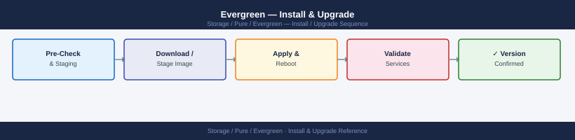
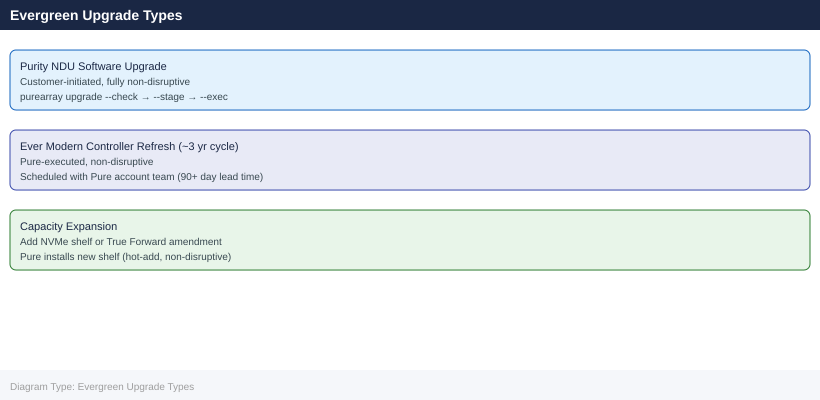

---
tags:
  - operations
  - pure
description: "Install & Upgrade reference covering Evergreen Program Tiers, Software Upgrade (Purity), Drive Replacement, Controller Refresh (Evergreen//Forever)..."
---
# Evergreen — Install & Upgrade

<div class="kb-summary">
Install & Upgrade reference covering Evergreen Program Tiers, Software Upgrade (Purity), Drive Replacement, Controller Refresh (Evergreen//Forever), Lifecycle Timeline and 1 more sections.

*Applies to: Evergreen*
</div>




> Part of the [Evergreen Operations](index.md) reference.

---

## Before you begin

- **Access:** Storage admin credentials (cluster admin or equivalent)
- **Timing:** safe to run during business hours unless a step is marked ⚠ (causes interruption)
- **Dependencies:** no active upgrades or migrations on the same infrastructure
- **Logging:** capture command output — paste into the change record on completion

---

## Evergreen Program Tiers

| Program | Model | Refresh Included |
|---|---|---|
| Evergreen//Forever | Customer-owned (CapEx) | Controller upgrades; drives purchased |
| Evergreen//Flex | Subscription lease | Hardware within subscription term |
| Evergreen//One | STaaS (Pure-owned) | All hardware; Pure manages lifecycle |

## Software Upgrade (Purity)

Purity (FlashArray OS) upgrades are non-disruptive and performed by Pure Storage:

1. Pure Storage schedules upgrade with advance notice
2. Customer confirms maintenance window
3. Pure upgrades both controllers sequentially — no I/O interruption
4. Purity version is validated post-upgrade

```bash
# Verify current Purity version
purecli array list | grep -i version
# or in GUI: System → Software
```


```text title="Expected output"
Name                          Version          Controller Model      Serial Number
flasharray-prod-01            6.4.2.1234       FA-405                PURE12345ABC
flasharray-prod-02            6.4.2.1234       FA-405                PURE12345DEF
flasharray-dr-01              6.3.8.5678       FA-370                PURE12345GHI
```

!!! warning "Common errors"
    **`purecli: command not found`** — Install the Pure CLI tools or ensure the PATH includes the Pure management tools directory.
    **`Error: Unable to connect to array`** — Verify network connectivity to the array management IP and confirm your Pure credentials are configured in `~/.purerc`.
## Drive Replacement

Drives are monitored by Pure1 and replaced proactively before failure:

- Pure Storage ships replacement drive
- Pure engineer (or guided remote process) swaps drive
- Parity rebuild begins automatically
- No host impact during rebuild

```bash
# Check drive health
purecli drive list
purecli drive list --filter "status!=healthy"
```


```text title="Expected output"
Name                Serial              Capacity  Status    Temperature
drive.0             SN-A7F2K9X1         1.92TB    healthy   32°C
drive.1             SN-B4M8L2P5         1.92TB    healthy   31°C
drive.2             SN-C9R3N6Q8         1.92TB    healthy   33°C
drive.3             SN-D1S7V4W2         1.92TB    healthy   30°C
drive.4             SN-E5T9Y8Z3         1.92TB    healthy   32°C
...
Total: 24 drives

Name                Serial              Capacity  Status         Temperature
drive.12            SN-F6U2X1A4         1.92TB    degraded       48°C
drive.18            SN-G3V5C7D9         1.92TB    failed         52°C
```

!!! warning "Common errors"
    **`purecli: command not found`** — Ensure the Pure Storage CLI is installed and the PATH environment variable includes its bin directory.
    **`Error: Authentication failed (401)`** — Verify your Pure Storage array credentials are configured via `purecli login` or check the PURE_API_TOKEN environment variable.
    **`Error: Connection timeout to array`** — Confirm the array hostname/IP is reachable and the management interface is responding on port 443.
## Controller Refresh (Evergreen//Forever)

Under Evergreen//Forever, controllers are refreshed when new generations are available:
- Customer purchases new controller shelf
- Pure performs non-disruptive controller swap
- Data remains in place (no migration required)

### How Controller Upgrades Work

1. Pure Storage proactively schedules controller upgrades based on technology lifecycle
2. Customer receives advance notice (typically 90+ days)
3. The upgrade is performed non-disruptively by Pure Storage engineers
4. Active I/O continues during the upgrade — hosts see no interruption

### Customer Pre-Upgrade Responsibilities

- Confirm maintenance window with the Pure Storage team
- Verify all hosts are healthy and paths are redundant
- Ensure no in-progress background tasks (e.g., parity rebuilds) would extend the window

```bash
# Check array health before upgrade
purecli array list
purecli drive list
purecli alert list
```


```text title="Expected output"
Name                          Status    Version    Model
pure-array-01.prod.local      Healthy   6.4.2      FlashArray//X
pure-array-02.prod.local      Healthy   6.4.2      FlashArray//X
pure-array-03.prod.local      Healthy   6.4.1      FlashArray//X

Name              Status    Capacity      Used        Array
SSD-001           Healthy   3.6TB         2.1TB       pure-array-01
SSD-002           Healthy   3.6TB         1.9TB       pure-array-01
SSD-003           Healthy   3.6TB         2.3TB       pure-array-02
SSD-004           Healthy   3.6TB         2.0TB       pure-array-02
...

Severity    Code      Message                                    Timestamp
warning     PFA0042   Controller temperature elevated (68°C)     2024-01-15T09:23:14Z
info        PFA0015   Scheduled snapshot completed successfully  2024-01-15T09:15:00Z
info        PFA0018   Replication sync lag: 2.3 seconds          2024-01-15T09:20:45Z
```

!!! warning "Common errors"
    **`purecli: command not found`** — Ensure Pure Storage CLI is installed and the PATH environment variable includes the installation directory.
    **`Error: Unable to connect to array at <ip>. Connection refused`** — Verify network connectivity to the array management IP and confirm the array is online and responding to management requests.
    **`Error: Authentication failed. Invalid credentials`** — Confirm your Pure Storage API token or username/password is valid and has not expired.
### Verifying Paths During/After Upgrade

**On the host:**

```bash
# Linux with multipath
multipath -ll

# Windows PowerShell (MPIO)
mpclaim -s -d

# VMware
esxcli storage nmp device list
```


```text title="Expected output"
# Linux with multipath
mpatha (36001405abcd1234ef567890abcd1234) dm-0 PURE,FlashArray
size=1.0T features='1 queue_if_no_path' hwhandler='1 alua' wp=rw
|-+- policy='service-time 0' prio=50 status=active
| |- 2:0:0:1 sda 8:0  active ready running
| `- 3:0:0:1 sdb 8:16 active ready running
`-+- policy='service-time 0' prio=10 status=enabled
  |- 4:0:0:1 sdc 8:32 active ready running
  `- 5:0:0:1 sdd 8:48 active ready running

mpathb (36001405zyxw9876vut543210zyxw9876) dm-1 PURE,FlashArray
size=2.0T features='1 queue_if_no_path' hwhandler='1 alua' wp=rw
|-+- policy='service-time 0' prio=50 status=active
| |- 2:0:1:1 sde 8:64  active ready running
| `- 3:0:1:1 sdf 8:80  active ready running

# Windows PowerShell (MPIO)
MPIO Device: PURE FlashArray//X
  Paths: 4
  Status: Healthy
  Load Balance Policy: Round-Robin
  Path 1: \\.\SCSI2: Status OK
  Path 2: \\.\SCSI3: Status OK
  Path 3: \\.\SCSI4: Status OK
  Path 4: \\.\SCSI5: Status OK

# VMware
Name: naa.6001405abcd1234ef567890abcd1234
Device: naa.6001405abcd1234ef567890abcd1234
Transport: SAS
Devfs Path: /vmfs/devices/disks/naa.6001405abcd1234ef567890abcd1234
Multipath Plugin: NMP
Path Count: 4
Storage Array Type Plugin: VMW_SATP_ALUA
Path Selection Plugin: VMW_PSP_RR
```

!!! warning "Common errors"
    **`device-mapper: multipath: command not found`** — Install device-mapper-multipath package with `apt-get install device-mapper-multipath` or `yum install device-mapper-multipath`.
    **`mpclaim : The MPIO service is not running`** — Start the MPIO service with `net start msiscsi` and `net start mpiosvc` in an elevated PowerShell.
    **`Unknown command or namespace`** — Ensure you are running the esxcli command on an ESXi host with proper SSH access and correct syntax for your vSphere version.
Confirm all expected paths are active after the upgrade completes.

### Post-Upgrade Verification

```bash
purecli array list     # Confirm new controller hardware
purecli hardware list  # All components healthy
purecli alert list     # No post-upgrade alerts
```


```text title="Expected output"
Name                          Version
purearray-prod-01.example.com 6.4.2
purearray-prod-02.example.com 6.4.2

Name                 Status    Capacity
Controller-A         Healthy   47.2 TB
Controller-B         Healthy   47.2 TB
NVMe-SSD-1           Healthy   12.8 TB
NVMe-SSD-2           Healthy   12.8 TB
DRAM-Module-A        Healthy   256 GB
DRAM-Module-B        Healthy   256 GB

Severity    Code      Message                              Timestamp
(no alerts)
```

!!! warning "Common errors"
    **`purecli: command not found`** — Install the Pure Storage CLI package or add it to your PATH environment variable.
    **`Error: Unable to connect to array at <hostname>`** — Verify network connectivity and that the management IP is reachable with `ping` or `nc`.
    **`Error: Authentication failed`** — Confirm your Pure Storage credentials are configured in `~/.purerc` or via environment variables.
### Common Considerations

| Item | Detail |
|---|---|
| Downtime | None — non-disruptive by design |
| Pre-requisite | Dual-path host connectivity required |
| Scheduling | Coordinated with Pure Storage |
| Data migration | None — data stays in place |
| Host action required | None (verify paths post-upgrade) |

## Lifecycle Timeline

| Activity | Trigger | Lead Time |
|---|---|---|
| Purity upgrade | Pure-scheduled or customer request | 30–90 days notice |
| Drive replacement | Proactive Pure1 alert | 5–14 days for parts |
| Controller upgrade | Generation availability | 90+ days notice |
| Platform EOL | Pure announcement | Multi-year notice |

## End-of-Life Considerations

- Purity software is supported for all active subscriptions
- Pure Storage commits to NVM and drive compatibility across generations
- Customer-owned (Evergreen//Forever) arrays receive software support for the platform lifetime

---

## Verify

- Confirm the operation completed without errors in the log or management UI
- Verify the expected state change is visible (service running, object created, config applied)
- Document the outcome in the change record

---

## See also

- [Evergreen — Procedures](../procedures/)
- [Evergreen — Health Checks](../health-checks/)
