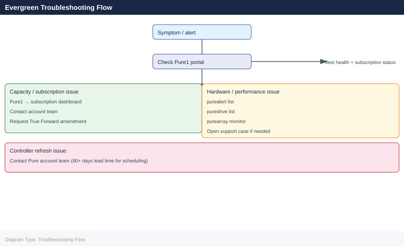

---
tags:
  - pure
  - troubleshooting
search:
  boost: 1.5
description: "Pure Storage Evergreen Troubleshooting reference covering Common Issues, Diagnostic Commands, Log Locations, Before Calling Support."
---
# Pure Storage Evergreen Troubleshooting

<div class="kb-summary">
Pure Storage Evergreen Troubleshooting reference covering Common Issues, Diagnostic Commands, Log Locations, Before Calling Support.

*Applies to: Evergreen*
</div>



```d2
direction: down

symptom: Identify Symptom {shape: diamond}
common_issues: "Common Issues" {shape: rectangle}
diagnostic_commands: "Diagnostic Commands" {shape: rectangle}
log_locations: "Log Locations" {shape: rectangle}
before_calling_support: "Before Calling Support" {shape: rectangle}
verify_resolution: "Verify resolution" {shape: rectangle}
resolution: Resolve or Escalate {shape: oval}

symptom -> common_issues: investigate
symptom -> diagnostic_commands: investigate
symptom -> log_locations: investigate
symptom -> before_calling_support: investigate
symptom -> verify_resolution: investigate
common_issues -> resolution
diagnostic_commands -> resolution
log_locations -> resolution
before_calling_support -> resolution
verify_resolution -> resolution
```

## Before you begin

- **Access:** Storage admin credentials (cluster admin or equivalent)
- **Gather first:** recent error message text, event timestamps, and affected object names
- **Scope:** confirm whether the issue affects a single object, host, cluster, or site
- **Escalation:** open a vendor support ticket before running any destructive step
- **Logging:** document each command and output — required if escalation is needed

---

## Common Issues

| Symptom | Likely Cause | Action |
|---|---|---|
| Capacity utilisation exceeds subscription entitlement | Organic data growth, snapshot accumulation, or workload onboarding beyond plan | Review Pure1 capacity vs. subscription tier; identify top capacity consumers with `purearray list --space` and `puresnapshot list --space`; initiate a True Forward capacity upgrade if growth is sustained |
| Controller refresh notification missed | Pure1 lifecycle alert not actioned or subscription window not tracked | Check Pure1 lifecycle alerts and subscription dashboard; contact the Pure account team immediately to reschedule — operating past the controller support window voids the Ever Modern guarantee |
| Performance below SLA | Workload growth, QoS policy not set, or wrong array series for workload type | Run a Pure1 workload assessment; review QoS limits on affected volumes; engage Pure account team to assess whether tier (//X vs //C) is appropriate |
| Replication lag exceeds RPO | Network bandwidth insufficient for change rate, remote array degraded, or pod unhealthy | Run `purepod list` to check pod and ActiveCluster status; check replication network bandwidth; review `purealert list` on both source and target arrays |
| Snapshot retention growing unexpectedly | Protection group schedule creating more snapshots than retention policy expires | Audit protection group schedules with `purepgroup list --schedule`; confirm retention policy matches intent; eradicate accumulated expired snapshots |
| Host path offline after controller upgrade | Multipath failover not restored after Ever Modern controller swap | Run `purehostconnection list` to confirm all host path states; rescan HBAs or iSCSI sessions on affected hosts; contact Pure Support if paths do not restore |
| Pure1 phonehome offline | Proxy change, firewall rule update, or network reconfiguration blocked outbound 443 | Confirm outbound HTTPS to Pure1 endpoints; check proxy configuration in array GUI; restore phonehome before scheduling any maintenance — Pure Support visibility depends on it |
| Volume not visible to host after provisioning | Host group membership not set, or HBA/iSCSI initiator not logged in | Confirm volume is connected to the correct host group; verify host IQN or WWPN is registered in Purity; check SAN fabric zoning |

## Diagnostic Commands

```bash
# Capacity usage breakdown
purearray list --space

# Controller hardware status and generation
purearray list --controller

# All active alerts with severity
purealert list

# Replication pod status and ActiveCluster health
purepod list

# Recent snapshot inventory (first 20)
puresnap list | head -20

# Snapshot space consumption
puresnapshot list --space

# Host connection and path status
purehostconnection list

# Volume space and provisioned size
purevol list --space

# Protection group schedules and replication targets
purepgroup list --schedule

# Array hardware components
purearray list --hardware
```


```text title="Expected output"
Name                          Capacity(GB)  Used(GB)    Available(GB)  Reduction
pure-array-01                 102400        45230.5     57169.5        2.3x
pure-array-02                 204800        89456.2     115343.8       2.1x

Name          Generation  Model              Status    Version
controller-0  //2         FA-405            online    6.4.2.1234567
controller-1  //2         FA-405            online    6.4.2.1234567

Name                          Severity  Code        Message                           Timestamp
array_unhealthy               warning   PHYS_HW_ERR Hardware error on SSD slot 14    2024-01-15T09:23:45Z
replication_lag_high          critical  REP_LAG     Replication lag >60s to pod-dr    2024-01-15T09:18:12Z
controller_temp_warning       warning   THERM_WARN  Controller-1 temp 78°C           2024-01-15T09:15:33Z

Name              Status      Mediator          Arrays
prod-pod          healthy     mediator-01       array-prod-01, array-prod-02
dr-pod            degraded    mediator-02       array-dr-01

Name                          Size(GB)  Created                 Expires
prod-vol.snap.20240115.0100   512.3     2024-01-15T01:00:12Z   2024-02-15T01:00:12Z
prod-vol.snap.20240114.2300   512.1     2024-01-14T23:00:08Z   2024-02-14T23:00:08Z
prod-vol.snap.20240114.2000   511.9     2024-01-14T20:00:15Z   2024-02-14T20:00:15Z
...

Name                          Snapshots  Space(GB)  Reduction
prod-vol                      48         2048.7     1.8x
backup-vol                    32         1024.2     1.9x

Name                          Host              Volume            Status    Paths
prod-vol-conn-01              prod-host-01      prod-vol          online    4/4
backup-vol-conn-02            backup-host-02    backup-vol        online    2/4

Name                          Provisioned(GB)  Used(GB)  Snapshots  Status
prod-vol                      1024             856.4     48         online
backup-vol                    2048             1456.2    32         online
archive-vol                   4096             2234.1    16         online

Name                          Enabled  Schedule              Replication_Target
prod-pgroup                   yes      daily@02:00,weekly   pod-dr
backup-pgroup                 yes      hourly@:00           pod-dr

Name                    Type              Status    Capacity(GB)  Serial
SSD-Slot-01             SSD-3.2TB         healthy   3200          PURE-SSD-001234
SSD-Slot-02             SSD-3.2TB         healthy   3200          PURE-SSD-001235
Controller-0-PSU        PSU-2400W         healthy   2400          PSU-C0-
```
## Log Locations

| Log Source | Location / Access |
|---|---|
| Pure1 phonehome logs | Pure1 portal > Arrays > select array > Support > Phone Home — history of phonehome sessions and any connectivity gaps |
| Array audit log | Purity GUI > Settings > Audit Log — all admin actions with user, timestamp, and IP; also forwarded to syslog if configured |
| `purediag` output | Run `purediag` on the array; generates a diagnostic bundle that Pure Support can pull via phonehome or download from the support portal |
| Array syslog | Forwarded to external syslog/SIEM if configured; contains hardware events, Purity OS messages, and audit entries |
| Pure1 alert history | Pure1 > Alerts — historical alert record for all arrays in the subscription including closed and auto-resolved alerts |

## Before Calling Support

Gather the following before opening a case to reduce time to resolution:

1. **Pure1 health score** — screenshot or note the current health score and any open alerts from Pure1 > Arrays
2. **`purediag` output** — run `purediag` and confirm the diagnostic bundle is available; Pure Support can pull it via phonehome if the tunnel is active
3. **Current Purity version** — `purearray list` — confirm exact Purity//FA version
4. **Subscription entitlement confirmation** — log into Pure1 and confirm the subscription tier, entitled capacity, and controller generation; this is needed if the issue relates to capacity, lifecycle, or controller refresh
5. **Alert history** — `purealert list` — all active and recent alerts
6. **Symptom timeline** — when did the issue start, what changed around that time, what has already been attempted

Having this information ready before calling significantly reduces time to first meaningful action from the support engineer.

---

## Verify resolution

- Confirm the original symptom no longer occurs
- Check logs for any residual errors related to the issue
- Monitor for 10–15 minutes to confirm the fix is stable

## See also

- [Architecture](../architecture/)
- [Cli Reference](../cli-reference/)
- [Controller Upgrades](../controller-upgrades/)
- [Evergreen One](../evergreen-one/)
- [Integration](../integration/)
- [Learning Path](../learning-path/)
- [Lifecycle](../lifecycle/)
- [Operations](../operations/)
- [Scripts](../scripts/)
- [Security](../security/)
- [Standards](../standards/)
- [Vendor Support](../vendor-support/)
- [Evergreen — Overview](../)
