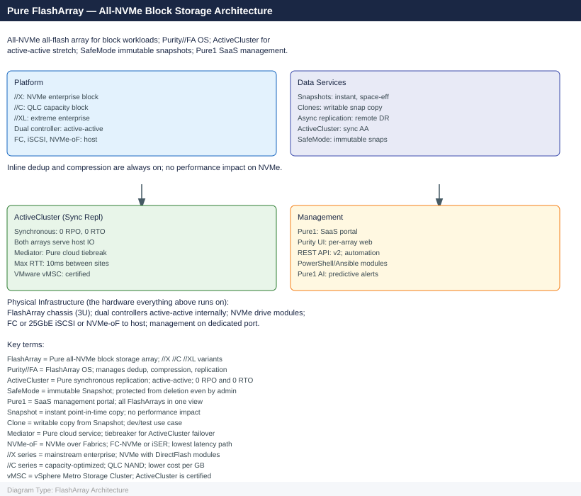

---
tags:
  - architecture
  - pure
description: "Architecture reference for Pure Storage FlashArray. Covers the dual-controller HA model, product lines (//X/C/E), host connectivity protocols (FC, iSCSI..."
---
# FlashArray — Architecture

Architecture reference for Pure Storage FlashArray. Covers the dual-controller HA model, product lines (//X/C/E), host connectivity protocols (FC, iSCSI, NVMe-oF), Purity data services, ActiveCluster synchronous replication, and design standards.

*Applies to: FlashArray Purity 6.x*

<a class="kb-card" href="how-it-works/">
  <strong>How It Works</strong>
  Dual-controller HA, NVRAM write path, DirectFlash, and data services.
</a>

<a class="kb-card" href="integrations/">
  <strong>Integrations</strong>
  ActiveCluster, ActiveDR, vSphere plugin, and Pure1 cloud portal.
</a>

<a class="kb-card" href="design-standards/">
  <strong>Design Standards</strong>
  Sizing guidelines, protocol selection, and replication design standards.
</a>

