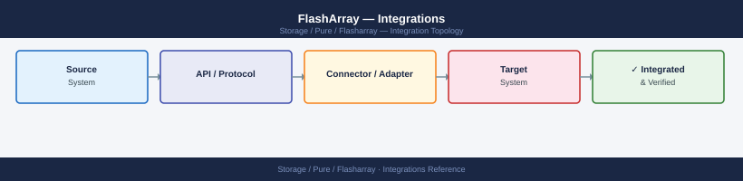

---
tags:
  - architecture
  - pure
description: "Integrations reference covering VMware Integration, Backup Integration, Pure1 Monitoring, Authentication, REST API."
---
# FlashArray — Integrations

<div class="kb-summary">
Integrations reference covering VMware Integration, Backup Integration, Pure1 Monitoring, Authentication, REST API.

*Applies to: FlashArray Purity 6.x*
</div>


**Generate an API token for a service account:**

```bash
# On the array CLI
pureadmin create --role array_admin svc-monitoring
pureadmin apitoken create svc-monitoring
# Copy the token and store in a secrets manager
```


```text title="Expected output"
Created admin user svc-monitoring
API token: 02a8d4c1-7f3e-4a9b-8c2e-9b1f5e3a2c4d
```

!!! warning "Common errors"
    | Error | Fix |
    |---|---|
    | `Error: User svc-monitoring already exists` | Delete the existing user with `pureadmin delete --role array_admin svc-monitoring` before recreating it. |
    | `Error: Invalid role specified` | Verify the role name is correct; use `pureadmin list --role` to see available roles on your array version. |
**Common API calls:**

```bash
# Get array status
GET /api/2.x/arrays

# List volumes
GET /api/2.x/volumes

# List active alerts
GET /api/2.x/alerts?filter=state%3D%27open%27

# Get array capacity
GET /api/2.x/arrays?space=true
```


```text title="Expected output"
{
  "items": [
    {
      "id": "0b2e4567-e89b-12d3-a456-426614174000",
      "name": "flasharray-prod-01",
      "status": "healthy",
      "version": "6.4.2",
      "model": "FA-405R3"
    }
  ]
}
{
  "items": [
    {
      "name": "db-prod-vol-001",
      "size": 1099511627776,
      "provisioned": 1099511627776,
      "serial": "0b2e4567e89b12d3a456426614174001"
    },
    {
      "name": "backup-vol-002",
      "size": 2199023255552,
      "provisioned": 2199023255552,
      "serial": "0b2e4567e89b12d3a456426614174002"
    }
  ]
}
{
  "items": [
    {
      "id": "alert-12847",
      "severity": "warning",
      "message": "Controller temperature elevated",
      "opened": "2024-01-15T09:23:14Z"
    }
  ]
}
{
  "items": [
    {
      "capacity": 109951162777600,
      "used": 45875200000000,
      "available": 64075962777600,
      "provisioned": 87960930222080
    }
  ]
}
```

!!! warning "Common errors"
    | Error | Fix |
    |---|---|
    | `curl: (7) Failed to connect to flasharray.local port 443: Connection refused` | Verify the array hostname/IP is reachable and the management interface is running with `ping` and `telnet <ip> 443`. |
    | `{"error_code":401,"message":"Unauthorized"}` | Ensure your API token is valid and included in the Authorization header with `curl -H "Authorization: Bearer <token>"`. |
    | `{"error_code":400,"message":"Invalid filter syntax"}` | URL-encode filter parameters correctly; use `filter=state%3D%27open%27` instead of unencoded quotes. |
Full API reference: [Pure Storage API documentation](https://support.purestorage.com/bundle/m_fa_rest_api)

---

## See also

- [FlashArray — How It Works](../how-it-works/)
- [FlashArray — Design Standards](../design-standards/)
