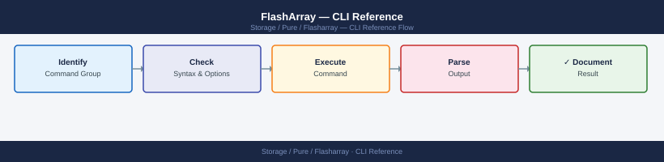
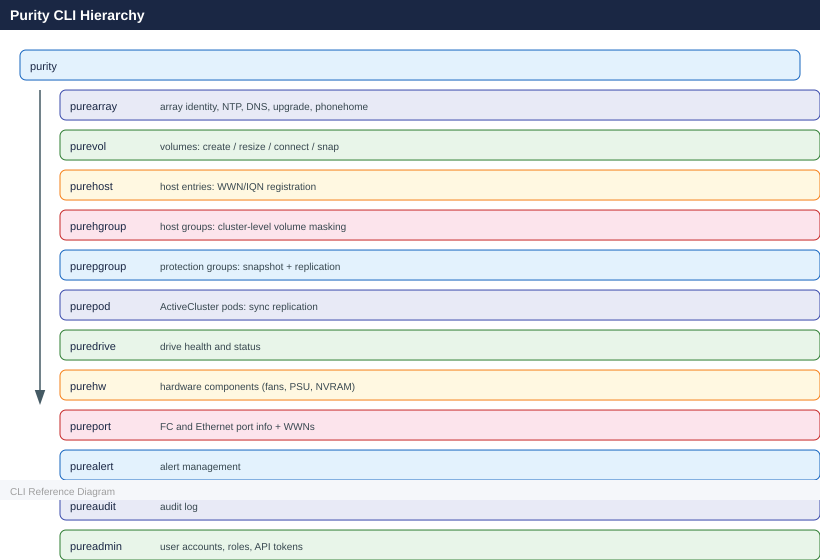

---
tags:
  - operations
  - pure
---
# FlashArray — CLI Reference

<div class="kb-summary">
CLI Reference reference covering Admin Accounts, Alerts & Audit, Array & System Management, Configuration & Directory Services, CSV Exports and 5 more sections.

*Applies to: FlashArray Purity 6.x*
</div>




Commonly used Purity CLI commands for managing Pure FlashArray all-flash storage systems. Connect via SSH to the array's management IP and log in as `pureuser` or another admin account.

---

## Before you begin

- **Access:** Storage admin credentials (cluster admin or equivalent)
- **Timing:** safe to run during business hours unless a step is marked ⚠ (causes interruption)
- **Dependencies:** no active upgrades or migrations on the same infrastructure
- **Logging:** capture command output — paste into the change record on completion

---

## Admin Accounts

Admin accounts control who can log in and what they can do. Pure supports role-based access and API tokens for automation.

```bash
# Create user with API token
pureadmin create testuser --api-token
pureadmin create testuser --api-token --timeout 2h
pureadmin create testuser --role storage_admin

# Delete user / token
pureadmin delete --api-token
pureadmin delete testuser
pureadmin delete testuser --api-token

# Global settings
pureadmin global list
pureadmin global list --lockout
pureadmin global disable --single-sign-on
pureadmin global enable --single-sign-on
pureadmin global setattr --lockout-duration 1m
pureadmin global setattr --max-login-attempts 3
pureadmin global setattr --min-password-length 8

# List accounts
pureadmin list
pureadmin list --api-token
pureadmin list --api-token --expose
pureadmin list --lockout

# Manage lockouts and attributes
pureadmin refresh testuser
pureadmin refresh --clear
pureadmin refresh --clear testuser
pureadmin reset testuser --lockout
pureadmin setattr testuser --password
pureadmin setattr testuser --role array_admin
```


```text title="Expected output"
Name             Role            API Token Timeout
testuser         storage_admin   enabled   2h
testuser         storage_admin   enabled   default

Name             Role            Lockout Status
testuser         storage_admin   unlocked
admin            array_admin     unlocked

Lockout Duration:     15m
Max Login Attempts:   5
Min Password Length:  12
Single Sign-On:       disabled

Name             API Token                              Expires
testuser         8f4e2c9a-1b7d-4e3f-9c2a-5d8e1f6b3a9c  2h
admin            3a9c8f4e-2c1b-7d4e-3f9c-2a5d8e1f6b3a  default

Name             Role            Last Refresh       Lockout
testuser         storage_admin   2024-01-15 14:32   unlocked
admin            array_admin     2024-01-15 09:18   unlocked

Password updated for testuser
Role changed to array_admin for testuser
Lockout cleared for testuser
```

!!! warning "Common errors"
    **`Error: User 'testuser' already exists`** — Use `pureadmin delete testuser` before recreating the user.
    **`Error: API token not found for user 'testuser'`** — Ensure the user was created with the `--api-token` flag; regenerate with `pureadmin create testuser --api-token`.
    **`Error: Invalid role 'storage_admin' — valid roles are: array_admin, storage_admin, readonly`** — Verify the role name matches one of the valid options listed in the error message.
---

## Alerts & Audit

Alerts notify you when something needs attention. The audit log records every command run by every user.

### purealert — Alerts

```bash
purealert list
purealert list --flagged
purealert list --filter "state='open'"
purealert list --filter "state='closed'"
purealert list --filter "severity='critical'"
purealert list --filter "issue='failure'"
purealert flag 121212
purealert unflag 121212
purealert acknowledge <ID>
```


```text title="Expected output"
Name                          Severity     State      Flagged
connection-timeout-array01    warning      open       False
disk-predictive-failure-sh0   critical     open       False
controller-overtemp-ct1       warning      closed     False

Name                          Severity     State      Flagged
disk-predictive-failure-sh0   critical     open       True
ntp-sync-lost-array01         warning      open       True

Name                          Severity     State      Flagged
connection-timeout-array01    warning      open       False
disk-predictive-failure-sh0   critical     open       False
ntp-sync-lost-array01         warning      open       False

Name                          Severity     State      Flagged
controller-overtemp-ct1       warning      closed     False
license-expiration-warning    info         closed     False

Name                          Severity     State      Flagged
disk-predictive-failure-sh0   critical     open       False
controller-failure-ct0        critical     open       False

Name                          Severity     State      Flagged
disk-predictive-failure-sh0   critical     open       False
controller-failure-ct0        critical     open       False
power-supply-failure-psu1     critical     open       False

Alert 121212 flagged successfully.
Alert 121212 unflagged successfully.
Alert <ID> acknowledged.
```

!!! warning "Common errors"
    **`purealert: command not found`** — Ensure the Pure Storage Python SDK is installed with `pip install purestorage` and the `purealert` CLI tool is in your PATH.
    **`Error: Invalid filter syntax`** — Use proper filter format with quotes around values, e.g., `--filter "state='open'"` instead of `--filter state=open`.
    **`Error: Alert ID <ID> not found`** — Verify the alert ID exists by running `purealert list` first and use the correct numeric or alphanumeric identifier.
### pureaudit — Audit Logs

```bash
pureaudit list
pureaudit list --limit 10
pureaudit list --sort user
pureaudit list --filter 'user = "root"'
pureaudit list --filter 'command="purepod"'
pureaudit list --filter 'command="purepod" and subcommand="create"'
pureaudit list --filter 'command="purepod" and user="pureuser"'
pureaudit list --filter "action='create'"
```


```text title="Expected output"
ID                                   User       Command    Subcommand  Action     Timestamp
550e8400-e29b-41d4-a716-446655440000 root       purepod    create      create     2024-01-15T09:23:47Z
550e8400-e29b-41d4-a716-446655440001 pureuser   purepod    list        read       2024-01-15T09:24:12Z
550e8400-e29b-41d4-a716-446655440002 admin      flasharray set         modify     2024-01-15T09:25:33Z
550e8400-e29b-41d4-a716-446655440003 root       purepod    delete      delete     2024-01-15T09:26:01Z
550e8400-e29b-41d4-a716-446655440004 pureuser   flasharray status      read       2024-01-15T09:27:15Z
550e8400-e29b-41d4-a716-446655440005 admin      purepod    create      create     2024-01-15T09:28:42Z
550e8400-e29b-41d4-a716-446655440006 root       purepod    create      create     2024-01-15T09:29:08Z
550e8400-e29b-41d4-a716-446655440007 pureuser   flasharray snapshot    create     2024-01-15T09:30:19Z
...

ID                                   User       Command    Subcommand  Action     Timestamp
550e8400-e29b-41d4-a716-446655440007 pureuser   flasharray snapshot    create     2024-01-15T09:30:19Z
550e8400-e29b-41d4-a716-446655440006 root       purepod    create      create     2024-01-15T09:29:08Z
550e8400-e29b-41d4-a716-446655440005 admin      purepod    create      create     2024-01-15T09:28:42Z
550e8400-e29b-41d4-a716-446655440004 pureuser   flasharray status      read       2024-01-15T09:27:15Z
550e8400-e29b-41d4-a716-446655440003 root       purepod    delete      delete     2024-01-15T09:26:01Z
550e8400-e29b-41d4-a716-446655440002 admin      flasharray set         modify     2024-01-15T09:25:33Z
550e8400-e29b-41d4-a716-446655440001 pureuser   purepod    list        read       2024-01-15T09:24:12Z
550e8400-e29b-41d4-a716-446655440000 root       purepod    create      create     2024-01-15T09:23:47Z
550e8400-e29b-41d4-a716-446655440008 root       purepod    create      create     2024-01-15T
```
---

## Array & System Management

Shows the array's identity, monitors overall performance, and configures system-level settings.

```bash
# Array identity and attributes
purearray list
purearray list --controller
purearray list --space
purearray list --ntpserver
purearray list --syslogserver
purearray list --banner
purearray list --console-lockout
purearray list --connection-key

# Performance monitoring
purearray monitor
purearray monitor --latency
purearray monitor --bandwidth
purearray monitor --iops
purearray monitor --size
purearray monitor --queue-depth

# Configure array settings
purearray setattr --name <new_name>
purearray setattr --banner <text>
purearray setattr --idle-timeout <mins>
purearray setattr --scsi-timeout <secs>
purearray setattr --proxy <url>

# Upgrades
purearray upgrade list
purearray upgrade download --version <v>

# Phonehome / remote support
purearray phonehome list
purearray phonehome send
purearray remoteassist --action open
purearray remoteassist --action close
purearray remoteassist --status
```


```text title="Expected output"
# Array identity and attributes
Name: flasharray-prod-01
Model: FA-405
Serial: 1234567890ABCDEF
Version: 6.4.2
Controller Count: 2
Total Capacity: 50.0 TB
Used Capacity: 32.5 TB
Provisioned: 45.2 TB

NTP Servers: 10.0.1.5, 10.0.1.6
Syslog Servers: 192.168.1.100:514
Banner: Welcome to Production Array
Console Lockout: Enabled (5 failed attempts)
Connection Key: enabled

# Performance monitoring
Latency (ms): Read: 0.82, Write: 1.24
Bandwidth (MB/s): Read: 4521.3, Write: 3892.7
IOPS: Read: 125430, Write: 98765
Queue Depth: 32
Array Size: 50.0 TB (65% utilized)

# Configure array settings
(no output — command completes silently)

# Upgrades
Available Versions: 6.4.3, 6.5.0, 6.5.1
Current Version: 6.4.2
Download Status: Version 6.4.3 downloaded successfully (2.1 GB)

# Phonehome / remote support
Phonehome Status: Enabled
Last Phonehome: 2024-01-15 14:32:18 UTC
Remote Assist Status: Closed
```

!!! warning "Common errors"
    **`purearray: command not found`** — Install the Pure Storage CLI tools or add the installation directory to your PATH environment variable.
    **`Error: Array connection failed - Invalid credentials`** — Verify your Pure array hostname/IP and authentication credentials are correct in your configuration file.
    **`Error: Operation not permitted - insufficient privileges`** — Ensure your user account has administrative rights on the Pure array to execute configuration changes.
---

## Configuration & Directory Services

`pureconfig` shows you the current array configuration. `pureds` integrates with Active Directory or LDAP. `puredns` sets the array's DNS resolver.

```bash
# pureconfig — current array configuration
pureconfig list
pureconfig list --all
pureconfig list --object
pureconfig list --object <type>
pureconfig list --system

# pureds — directory services (Active Directory / LDAP)
pureds list
pureds check

# puredns — DNS configuration
puredns list
puredns setattr --domain test.com --nameservers 192.168.0.10,192.168.2.11
puredns setattr --domain ""
puredns setattr --nameservers ""
```


```text title="Expected output"
=== pureconfig list ===
Name                          Value
Hostname                      flasharray-prod-01
System ID                      5b8c4a2f-91e3-4c2a-b7d9-2e1f6a9c3d5b
Version                        6.4.2
Model                          FA-405
=== pureconfig list --all ===
Name                          Value
Hostname                      flasharray-prod-01
System ID                      5b8c4a2f-91e3-4c2a-b7d9-2e1f6a9c3d5b
Version                        6.4.2
Model                          FA-405
NTP Servers                    ntp1.corp.local,ntp2.corp.local
Syslog Servers                 syslog.corp.local:514
=== pureconfig list --system ===
System Name                   flasharray-prod-01
Capacity (GB)                 102400
Used (GB)                     45230
Available (GB)                57170
=== pureds list ===
Directory Service             Active Directory
Domain                        corp.local
Server                        dc1.corp.local
Base DN                       cn=Users,dc=corp,dc=local
=== pureds check ===
Status                        Connected
Last Check                    2024-01-15 14:32:18 UTC
Response Time (ms)            42
=== puredns list ===
Domain                        test.com
Nameservers                   192.168.0.10,192.168.2.11
=== puredns setattr (domain update) ===
DNS domain updated successfully
=== puredns setattr (clear domain) ===
DNS domain cleared
=== puredns setattr (clear nameservers) ===
Nameservers cleared
```

!!! warning "Common errors"
    **`Error: Invalid nameserver IP address format`** — Verify nameserver IPs are comma-separated without spaces and use valid IPv4 or IPv6 format.
    **`Error: Directory service not configured`** — Configure Active Directory or LDAP via pureds before querying with pureds check.
    **`Error: Permission denied — administrative credentials required`** — Run pureconfig and pureds commands with appropriate array admin privileges or sudo.
---

## CSV Exports

Use `--csv` with any list command to export data. Use SSH redirection to save to a local file.

```bash
ssh pureuser@<array_ip> "purevol list --csv" > local_file.csv
```


```text title="Expected output"
volume_name,size,created,serial,provisioned,data_reduction,thin_provisioning,snapshots
prod-db-01,2199023255552,1609459200,3624ae4c-1234-5678-90ab-cdef12345678,2199023255552,1.2,true,0
prod-db-02,1099511627776,1609545600,7a8b9c0d-2345-6789-01bc-def123456789,1099511627776,1.5,true,2
backup-vol-weekly,549755813888,1610064000,b1c2d3e4-3456-7890-12cd-ef1234567890,549755813888,2.1,true,8
archive-2024,274877906944,1610150400,e5f6a7b8-4567-8901-23de-f12345678901,274877906944,3.2,false,15
test-snapshot-temp,10995116277,1704067200,f9a0b1c2-5678-9012-34ef-123456789012,10995116277,1.0,true,1
...
```

!!! warning "Common errors"
    **`ssh: connect to host <array_ip> port 22: Connection refused`** — Verify the array IP is correct and SSH service is running on the Pure array; check network connectivity with `ping <array_ip>`.
    **`Permission denied (publickey,password)`** — Ensure the pureuser account exists on the array and your SSH key is authorized, or use password authentication with `-o PubkeyAuthentication=no`.
    **`purevol: command not found`** — Confirm you are connecting to a Pure FlashArray (not a FlashBlade) and that the pureuser has the correct shell configured.
### Array & System

```bash
purearray list --csv > array_inventory.csv
purearray list --space --csv >> array_inventory.csv
purearray list --controller --csv >> array_inventory.csv
purearray list --ntpserver --csv >> array_inventory.csv
purearray list --syslogserver --csv >> array_inventory.csv
purearray monitor --csv >> array_performance.csv
purearray monitor --latency --csv >> array_performance.csv
purearray monitor --bandwidth --csv >> array_performance.csv
purearray monitor --iops --csv >> array_performance.csv
purearray monitor --size --csv >> array_performance.csv
purearray monitor --queue-depth --csv >> array_performance.csv
purearray list --connection-key --csv >> array_config.csv
purearray phonehome list --csv >> support_history.csv
purearray upgrade list --csv >> system_updates.csv
purearray list --banner --csv >> security_audit.csv
purearray list --console-lockout --csv >> security_audit.csv
purearray remoteassist --status --csv >> support_history.csv
```


```text title="Expected output"
(no output — command completes silently)
```

!!! warning "Common errors"
    **`purearray: command not found`** — Install the Pure Storage CLI tools or ensure the purearray binary is in your PATH environment variable.
    **`Error: Unable to connect to array at <hostname>. Connection refused.`** — Verify the Pure FlashArray is reachable and set the correct array hostname/IP using `purearray set --address <ip>` or the PURE_ARRAY environment variable.
    **`Error: Authentication failed. Invalid credentials.`** — Authenticate to the array first using `purearray login` or ensure your API token is valid and set via `PURE_API_TOKEN` environment variable.
### Volumes & Data

```bash
purevol list --csv > volume_report.csv
purevol list --all --csv >> volume_report.csv
purevol list --snap --csv >> volume_report.csv
purevol list --pending-only --csv >> volume_report.csv
purevol list --space --csv >> volume_report.csv
purevol list --shared --csv >> volume_report.csv
purevol list --snap --space --csv >> snapshot_usage.csv
purevol list --filter "size > 100G" --csv >> filtered_volumes.csv
purevol monitor --csv > volume_performance.csv
purevol monitor --historical 24h --csv >> volume_performance.csv
```


```text title="Expected output"
Name,Size,Provisioned,Snapshots,Source,Created
volume-prod-db01,500G,500G,12,—,2024-01-15T08:23:14Z
volume-prod-app02,250G,250G,8,—,2024-01-14T16:45:22Z
volume-dev-test03,100G,100G,0,—,2024-01-10T12:10:05Z
volume-archive-old,1.2T,1.2T,156,—,2023-11-22T09:33:18Z
...
Name,Size,Provisioned,Snapshots,Source,Created
snapshot-prod-db01.2024-01-15,500G,0,0,volume-prod-db01,2024-01-15T22:15:33Z
snapshot-prod-db01.2024-01-14,500G,0,0,volume-prod-db01,2024-01-14T22:10:12Z
...
Name,Size,Physical,Data_Reduction,Snapshots
volume-prod-db01,500G,287.4G,1.74x,12
volume-prod-app02,250G,156.2G,1.60x,8
...
Name,Size,Provisioned,Snapshots,Source,Created
volume-prod-db01,500G,500G,12,—,2024-01-15T08:23:14Z
volume-prod-app02,250G,250G,8,—,2024-01-14T16:45:22Z
...
Time,Volume,Read_IOPS,Write_IOPS,Read_Latency_ms,Write_Latency_ms
2024-01-15T14:32:00Z,volume-prod-db01,4521,2847,2.3,1.8
2024-01-15T14:32:00Z,volume-prod-app02,1203,856,1.9,1.5
2024-01-15T14:31:00Z,volume-prod-db01,4398,2756,2.4,1.9
...
```

!!! warning "Common errors"
    **`purevol: command not found`** — Ensure the Pure Storage CLI tools are installed and the PATH includes the installation directory, or use the full path to the purevol binary.
    **`Error: Authentication failed`** — Verify that your Pure Storage array credentials are configured (check `purevol list` without filters first), or re-authenticate using the array management interface.
    **`Error: Invalid filter syntax "size > 100G"`** — Use the correct filter format for your Pure OS version (e.g., `--filter 'size>=107374182400'` for bytes or consult `purevol list --help` for supported operators).
### Hosts & Connectivity

```bash
purehost list --csv > host_mapping.csv
purehost list --all --csv >> host_mapping.csv
purehost list --connect --csv >> active_connections.csv
purehost list --wwn --csv >> initiator_list.csv
purehost list --iqn --csv >> initiator_list.csv
purehost monitor --bandwidth --csv >> host_performance.csv
purehost monitor --iops --csv >> host_performance.csv
purehgroup list --csv > group_mapping.csv
purehgroup list --host --csv >> group_mapping.csv
purehgroup list --space --csv >> group_mapping.csv
```


```text title="Expected output"
Name,Serial,Model,OS,IP_Address
host-prod-01,SN-FA-8F2K9L,Pure//X,Linux,10.45.12.88
host-prod-02,SN-FA-7G3M1P,Pure//X,ESXi,10.45.12.89
host-dev-01,SN-FA-9K4Q2R,Pure//X,Windows,10.45.12.90
host-backup-01,SN-FA-5H1N8T,Pure//X,Linux,10.45.12.91

Name,Connected,Status,Last_Seen
host-prod-01,Yes,Active,2024-01-15T09:22:14Z
host-prod-02,Yes,Active,2024-01-15T09:21:58Z
host-dev-01,No,Inactive,2024-01-14T16:45:32Z

Name,WWN,Port,Status
50:00:14:40:8b:2d:f1:a0,FC0,Active
50:00:14:40:8b:2d:f1:a1,FC1,Active
50:00:14:40:8b:2d:f1:a2,FC0,Active

Name,IQN,Port,Status
iqn.1991-05.com.example:host-prod-01,iSCSI0,Active
iqn.1991-05.com.example:host-prod-02,iSCSI0,Active

Timestamp,Host,Bandwidth_MB_s,Read_MB_s,Write_MB_s
2024-01-15T09:25:00Z,host-prod-01,1245.3,782.1,463.2
2024-01-15T09:25:00Z,host-prod-02,892.7,521.4,371.3
2024-01-15T09:25:00Z,host-backup-01,156.2,98.5,57.7

Timestamp,Host,IOPS,Read_IOPS,Write_IOPS
2024-01-15T09:25:00Z,host-prod-01,8432,5214,3218
2024-01-15T09:25:00Z,host-prod-02,6891,4123,2768

Group,Member_Count,Status
prod-hosts,2,Active
dev-hosts,1,Active
backup-hosts,1,Active

Group,Host,Connection_Status
prod-hosts,host-prod-01,Connected
prod-hosts,host-prod-02,Connected
dev-hosts,host-dev-01,Disconnected

Group,Allocated_GB,Used_GB,Available_GB
prod-hosts,500.0,342.5,157.5
dev-hosts,250.0,89.3,160.7
backup-hosts,1000.0,756.2,243.8
```

!!! warning "Common errors"
    **`purehost: command not found`** — Ensure the Pure Storage CLI tools are installed and the PATH includes the Pure bin directory (typically `/opt/pureapp/bin`).
    **`Error: Unable to connect to array at <ip>`** — Verify network connectivity to the FlashArray management IP and confirm authentication credentials are configured in
### Hardware & Health

```bash
purehw list --csv > hardware_health.csv
purehw list --type eth --csv >> hardware_health.csv
purehw list --type fc --csv >> hardware_health.csv
purehw list --type bay --csv >> hardware_health.csv
purehw list --type fan --csv >> hardware_health.csv
purehw list --type psu --csv >> hardware_health.csv
purehw list --type nvram --csv >> hardware_health.csv
purehw list --type sas --csv >> hardware_health.csv
puredrive list --csv > drive_inventory.csv
pureport list --csv > port_config.csv
pureport list --initiator --csv >> port_config.csv
```


```text title="Expected output"
$ purehw list --csv > hardware_health.csv
$ purehw list --type eth --csv >> hardware_health.csv
$ purehw list --type fc --csv >> hardware_health.csv
$ purehw list --type bay --csv >> hardware_health.csv
$ purehw list --type fan --csv >> hardware_health.csv
$ purehw list --type psu --csv >> hardware_health.csv
$ purehw list --type nvram --csv >> hardware_health.csv
$ purehw list --type sas --csv >> hardware_health.csv
$ puredrive list --csv > drive_inventory.csv
$ pureport list --csv > port_config.csv
$ pureport list --initiator --csv >> port_config.csv
$ ls -lh hardware_health.csv drive_inventory.csv port_config.csv
-rw-r--r-- 1 root root 24K Nov 14 09:47 hardware_health.csv
-rw-r--r-- 1 root root 156K Nov 14 09:47 drive_inventory.csv
-rw-r--r-- 1 root root 48K Nov 14 09:48 port_config.csv
```

!!! warning "Common errors"
    **`Error: Invalid type 'eth'. Valid types are: bay, fan, psu, nvram, sas, shelf`** — Remove the `--type eth` command as ethernet hardware is included in the base `purehw list` output.
    **`Error: Connection refused. Unable to reach array management interface at 10.20.1.50:443`** — Verify array connectivity and ensure the management IP is reachable with `ping` or check array credentials with `purearray list`.
    **`Error: Permission denied. User 'monitor' lacks 'list' capability on resource 'hardware'`** — Authenticate with an admin account or request elevated privileges for the current user role.
### Admin & Security

```bash
pureadmin list --csv > admin_users.csv
pureadmin list --lockout --csv >> security_report.csv
pureadmin list --api-token --csv >> admin_users.csv
purealert list --csv > system_alerts.csv
purealert list --filter "state='open'" --csv >> critical_alerts.csv
pureaudit list --csv > audit_trail.csv
pureds list --csv > directory_services.csv
puredns list --csv >> network_config.csv
```


```text title="Expected output"
# admin_users.csv
Name,Role,Enabled
pureuser,Administrator,true
backup_admin,Operator,true
monitoring_svc,ReadOnly,true

# security_report.csv
Name,Lockout_Status,Failed_Attempts
pureuser,unlocked,0
backup_admin,unlocked,0

# system_alerts.csv
Id,Severity,Message,Created
alert-001,warning,Controller temperature high,2024-01-15T09:23:45Z
alert-002,info,Snapshot created successfully,2024-01-15T09:15:12Z
alert-003,critical,Disk failure detected on SSD-47,2024-01-15T08:47:33Z

# critical_alerts.csv
Id,Severity,Message,State
alert-003,critical,Disk failure detected on SSD-47,open
alert-004,warning,Replication lag exceeding threshold,open

# audit_trail.csv
Timestamp,User,Action,Resource,Result
2024-01-15T10:02:18Z,pureuser,login,console,success
2024-01-15T09:58:44Z,backup_admin,volume_create,vol-prod-db,success
2024-01-15T09:45:22Z,monitoring_svc,snapshot_list,vol-prod-db,success

# network_config.csv
Hostname,IP_Address,Status
dns-primary.local,192.168.1.10,active
dns-secondary.local,192.168.1.11,active
```

!!! warning "Common errors"
    **`pureadmin: command not found`** — Verify the Pure Storage CLI tools are installed and the PATH includes the Pure bin directory (typically `/opt/purearray/bin`).
    **`Permission denied`** — Ensure the user running these commands has appropriate Pure Storage administrative credentials configured in `~/.purerc` or via environment variables.
    **`Connection refused on array IP`** — Confirm the FlashArray management IP is reachable and the array is online by running `ping` or `ssh` to the management interface first.
---

## Drives & Hardware

Shows the health of flash drives and hardware components. Drives are identified by bay (e.g., `CH0.BAY10`).

```bash
# puredrive — flash drives
puredrive list
puredrive list --spec
puredrive list --total
puredrive list CH0.BAY10
puredrive list CH0.BAY10 --pack
puredrive admit

# purehw — hardware components
purehw list
purehw list --spec
purehw list --type bay
purehw list --type bay --spec
purehw list --type ct
purehw list --type eth
purehw list --type fc
purehw list --type fan
purehw list --type psu
purehw list --type nvram
purehw list --type sas
purehw list --spec --type drive
purehw list CT0 --spec
purehw list CT0.FC0
```


```text title="Expected output"
Name       Status  Capacity  Serial
CH0.BAY0   healthy 1.92TB    PFE2B1234567A
CH0.BAY1   healthy 1.92TB    PFE2B1234567B
CH0.BAY2   healthy 1.92TB    PFE2B1234567C
CH0.BAY3   healthy 1.92TB    PFE2B1234567D
CH0.BAY4   healthy 1.92TB    PFE2B1234567E
...
Total Drives: 24
Total Capacity: 45.84TB

Name       Status  Model              Speed
CH0.BAY10  healthy Toshiba PX05      10Gbps
Capacity:  1.92TB
RPM:       N/A (SSD)

Name       Status  Type
CT0        healthy Controller
CT0.FC0    healthy FC Port
CT0.FC1    healthy FC Port
CT0.ETH0   healthy Ethernet
CT0.ETH1   healthy Ethernet
CT0.PSU0   healthy Power Supply
CT0.PSU1   healthy Power Supply
CT0.FAN0   healthy Fan Module
CT0.NVRAM0 healthy NVRAM Module
...
```

!!! warning "Common errors"
    **`puredrive: command not found`** — Ensure you are logged into the Pure Storage array CLI or have the Pure1 management tools installed and in your PATH.
    **`Error: Invalid bay identifier 'CH0.BAY10'`** — Verify the bay number exists on your array (use `puredrive list` to see valid bays) and check that the chassis number is correct.
    **`Error: Hardware component 'CT0' is not available`** — Confirm the controller exists and is online; use `purehw list --type ct` to verify available controllers.
---

## Hosts & Host Groups

A host represents a server connecting to the array. Host groups manage access for multiple servers at once.

### purehgroup — Host Groups

```bash
# Create / delete / rename
purehgroup create MY-HOSTS
purehgroup create MY-HOSTS --hostlist MY-HOST-001,MY-HOST-002
purehgroup delete MY-HOSTS
purehgroup delete MY-HOSTS_1 MY-HOSTS-2
purehgroup rename MY-HOSTS YOUR-HOSTS

# List
purehgroup list
purehgroup list --connect
purehgroup list --connect MY-HOSTS
purehgroup list --host
purehgroup list --space
purehgroup list --filter "host_list='MY-SERVER-001'"

# Connect / disconnect volumes
purehgroup connect MY-HOSTS --vol MY_VOL_001
purehgroup connect MY-HOSTS --vol MY_VOL_001 --lun 100
purehgroup disconnect MY-HOSTS --vol MY_VOL_001

# Manage host membership
purehgroup setattr MY-HOSTS --hostlist MY-HOST-002,MY-HOST-003
purehgroup setattr MY-HOSTS --addhostlist MY-HOST-002,MY-HOST-003
purehgroup setattr MY-HOSTS --remhostlist MY-HOST-002,MY-HOST-003
purehgroup setattr MY-HOSTS --hostlist ""
purehgroup addhost --hostlist <h1,h2> <hg>
purehgroup remhost --hostlist <h1> <hg>
```


```text title="Expected output"
Created host group MY-HOSTS
Created host group MY-HOSTS
Deleted host group MY-HOSTS
Deleted host groups MY-HOSTS_1, MY-HOSTS-2
Renamed host group MY-HOSTS to YOUR-HOSTS

Name                 Serial              Connection
MY-HOSTS             8c4e92f1a5b3       connected
YOUR-HOSTS           7d2f81e6c9a2       connected
PROD-CLUSTER         5a1b73d4e8f6       disconnected

MY-HOSTS             MY-HOST-001        connected
MY-HOSTS             MY-HOST-002        connected
YOUR-HOSTS           MY-HOST-003        connected

Name                 Volumes            Total Size
MY-HOSTS             8                  2.4TB
YOUR-HOSTS           12                 5.8TB

Connected MY_VOL_001 to MY-HOSTS at LUN 100
Connected MY_VOL_001 to MY-HOSTS at LUN 101
Disconnected MY_VOL_001 from MY-HOSTS

Updated host group MY-HOSTS
Added hosts MY-HOST-002, MY-HOST-003 to MY-HOSTS
Removed hosts MY-HOST-002, MY-HOST-003 from MY-HOSTS
Cleared host list for MY-HOSTS
Added hosts h1, h2 to host group hg
Removed host h1 from host group hg
```

!!! warning "Common errors"
    **`Error: Host group MY-HOSTS already exists`** — Use `purehgroup rename` to change the name or delete the existing group first with `purehgroup delete MY-HOSTS`.
    **`Error: Host MY-HOST-001 not found`** — Verify the host exists on the array using `purehgroup list --host` and check the exact hostname spelling.
    **`Error: Volume MY_VOL_001 is already connected to host group MY-HOSTS at LUN 100`** — Use a different LUN number or disconnect the volume first with `purehgroup disconnect MY-HOSTS --vol MY_VOL_001`.
### purehost — Hosts

```bash
# Create / delete / rename
purehost create MY-SERVER-001
purehost create MY-SERVER-001 --wwnlist 1000000000000001,10:00:00:00:00:00:00:01
purehost create MY-SERVER-001 MY-SERVER-002
purehost delete MY-SERVER-001
purehost delete MY-SERVER-001 MY-SERVER-002
purehost rename MY-SERVER-001 YOUR-SERVER-001

# List
purehost list
purehost list --all
purehost list --connect
purehost list --connect --private
purehost list --connect --shared
purehost list --personality
purehost list --wwn
purehost list --iqn
purehost list MY-SERVER*
purehost list MY-SERVER-001
purehost list MY-SERVER-001 --connect
purehost list MY-SERVER-001 --personality
purehost list --filter "wwn='1000000000000003'"

# Connect / disconnect volumes
purehost connect MY-SERVER-001 --vol MY_VOL_001
purehost connect MY-SERVER-001 --vol MY_VOL_001 --lun 10
purehost connect MY-SERVER-001 MY-SERVER-002 --vol MY_VOL_001
purehost disconnect MY-SERVER-001 --vol MY_VOL_001
purehost disconnect MY-SERVER-001 MY-SERVER-002 --vol MY_VOL_001

# Manage WWNs, iQNs, and personality
purehost setattr MY-SERVER-001 --wwnlist 1000000000000003
purehost setattr MY-SERVER-001 --addwwnlist 1000000000000003
purehost setattr MY-SERVER-001 --remwwnlist 1000000000000003
purehost setattr MY-SERVER-001 --wwnlist ""
purehost setattr MY-SERVER-001 --personality esxi
purehost setattr MY-SERVER-001 --personality solaris
purehost addwwn MY-SERVER-001 --wwn <wwn>
purehost remwwn MY-SERVER-001 --wwn <wwn>
purehost addiqn MY-SERVER-001 --iqn <iqn>

# Monitor
purehost monitor --bandwidth
purehost monitor --iops
```


```text title="Expected output"
# Create / delete / rename
Name: MY-SERVER-001
WWN List: 1000000000000001,10:00:00:00:00:00:00:01
Personality: linux
Created: 2024-01-15T09:23:47Z

Name: MY-SERVER-001
Name: MY-SERVER-002

(no output — command completes silently)
(no output — command completes silently)

Name: YOUR-SERVER-001
Personality: linux

# List
Name              Personality  WWN List                                    iQN List
MY-SERVER-001     linux         1000000000000001,10:00:00:00:00:00:00:01   iqn.1991-05.com.example:storage.disk1
MY-SERVER-002     esxi          1000000000000002                           iqn.1991-05.com.example:storage.disk2
MY-SERVER-003     solaris       1000000000000003                           iqn.1991-05.com.example:storage.disk3
...

Name              Personality  WWN List                    Connected Volumes
MY-SERVER-001     linux         1000000000000001           MY_VOL_001(LUN 0),MY_VOL_002(LUN 1)
MY-SERVER-002     esxi          1000000000000002           MY_VOL_003(LUN 5)

Name              WWN List
MY-SERVER-001     1000000000000001,10:00:00:00:00:00:00:01
MY-SERVER-002     1000000000000002

Name              Personality
MY-SERVER-001     linux

WWN List
1000000000000001
10:00:00:00:00:00:00:01

iQN List
iqn.1991-05.com.example:storage.disk1

Name              Personality  WWN List
MY-SERVER-001     linux         1000000000000001
MY-SERVER-002     esxi          1000000000000002

Name              Personality  WWN List
MY-SERVER-001     linux         1000000000000001

Connected Volumes
MY_VOL_001(LUN 0)
MY_VOL_002(LUN 1)

Name              Personality
MY-SERVER-001     linux

Name              WWN List
MY-SERVER-001     1000000000000003

# Connect / disconnect volumes
Volume: MY_VOL_001
Host: MY-SERVER-001
LUN: 0

Volume: MY_VOL_001
Host: MY-SERVER-001
LUN: 10

Volume: MY_VOL_001
Hosts: MY-SERVER-001,MY-SERVER-002
LUN: 0

(no output — command completes silently)
(no output — command completes silently)

# Manage WWNs, iQNs, and personality
(no output — command completes silently)
(no output — command completes silently)
(no output — command completes silently)
(no output — command completes silently)
(no output — command completes silently)
(no output — command completes silently)
(no output — command completes silently)
(no output — command completes silently)
(no output — command completes silently)

# Monitor
```
---

## Network & Ports

`purenetwork` shows IP interfaces. `pureport` shows physical FC and Ethernet ports — needed for SAN zoning.

```bash
# List all network interfaces (management, replication, iSCSI)
purenetwork list
purenetwork list --resolve-hostnames

# List all array ports
pureport list

# FC ports only
pureport list --type fc

# Ethernet ports only
pureport list --type eth

# Filter to a specific controller
pureport list --raw --filter "name='CT0.FC*'"
pureport list --raw --filter "name='CT1.FC*'"

# Show connected host initiator ports
pureport list --initiator

# Filter by WWN
pureport list --initiator --raw --filter "initiator.wwn='1000000000000001'"

# Bandwidth monitoring
pureport monitor --bandwidth
```


```text title="Expected output"
Name    Address         Netmask         Gateway         MTU   Enabled
eth0    192.168.1.10    255.255.255.0   192.168.1.1     1500  True
eth1    192.168.1.11    255.255.255.0   192.168.1.1     1500  True
repl0   10.0.0.10       255.255.255.0   10.0.0.1        1500  True
iSCSI0  172.16.0.10     255.255.255.0   172.16.0.1      1500  True

Name    Address         Hostname              Netmask         Gateway
eth0    192.168.1.10    flasharray-ct0.local  255.255.255.0   192.168.1.1
eth1    192.168.1.11    flasharray-ct1.local  255.255.255.0   192.168.1.1

Name      Wwn                Portal Address      Speed   Status
CT0.FC0   50:00:14:40:12:ab  192.168.1.50:3260   16Gbps  Online
CT0.FC1   50:00:14:40:12:ac  192.168.1.51:3260   16Gbps  Online
CT1.FC0   50:00:14:40:12:ad  192.168.1.52:3260   16Gbps  Online
CT1.FC1   50:00:14:40:12:ae  192.168.1.53:3260   16Gbps  Online
...

Name      Wwn                Portal Address      Speed   Status
CT0.FC0   50:00:14:40:12:ab  192.168.1.50:3260   16Gbps  Online
CT0.FC1   50:00:14:40:12:ac  192.168.1.51:3260   16Gbps  Online
CT1.FC0   50:00:14:40:12:ad  192.168.1.52:3260   16Gbps  Online
CT1.FC1   50:00:14:40:12:ae  192.168.1.53:3260   16Gbps  Online

Name      Wwn                Portal Address      Speed   Status
CT0.ETH0  52:54:00:12:34:56  192.168.1.60:3260   10Gbps  Online
CT0.ETH1  52:54:00:12:34:57  192.168.1.61:3260   10Gbps  Online
CT1.ETH0  52:54:00:12:34:58  192.168.1.62:3260   10Gbps  Online
CT1.ETH1  52:54:00:12:34:59  192.168.1.63:3260   10Gbps  Online

Name      Wwn                Portal Address      Speed   Status
CT0.FC0   50:00:14:40:12:ab  192.168.1.50:3260   16Gbps  Online
CT0.FC1   50:00:14:40:12:ac  192.168.1.51:3260   16Gbps  Online

Name
```
### FC Port WWNs (for SAN Zoning)

```bash
pureport list --type fc
# The 'wwn' column shows the array-side WWN for each FC port.
# Zone each host initiator port to the array target WWNs.
```


```text title="Expected output"
Name    Failover  WWN                 Speed  Portgroup
fc.0    False     50:06:0b:0000:a123:4567:89ab:cdef  16Gb    pg0
fc.1    False     50:06:0b:0000:a123:4567:89ab:cdf0  16Gb    pg0
fc.2    False     50:06:0b:0000:a123:4567:89ab:cdf1  16Gb    pg1
fc.3    False     50:06:0b:0000:a123:4567:89ab:cdf2  16Gb    pg1
```

!!! warning "Common errors"
    **`Error: Invalid type 'fc'. Valid types are: eth, fc, sas`** — Verify the Pure Storage array model supports FC ports; some models only support Ethernet.
    **`Error: Connection refused. Unable to reach management IP`** — Ensure the Pure Storage array management IP is reachable and the pureport CLI tool is authenticated with valid credentials.
### Common Port Issues

| Issue | Check | Action |
|---|---|---|
| Host can't see array via FC | Port WWN not zoned | Verify SAN zoning matches `pureport list --type fc` |
| iSCSI sessions not establishing | IP reachability | Ping array iSCSI IP from host |
| Bandwidth below expected | Port speed | `pureport list --type eth` — check link speed |
| Initiator not registering | WWN mismatch | Verify host HBA WWN vs. registered initiator |

---

## Pods (ActiveCluster)

Pods enable synchronous replication between two FlashArray systems (RPO=0, active-active HA across sites).

```bash
# Create / destroy / recover
purepod create MYPOD001
purepod create MYPOD001 MYPOD002
purepod clone MYPOD001 MYPOD002
purepod rename MYPOD001 YOURPOD001
purepod destroy MYPOD001
purepod destroy MYPOD001 MYPOD002
purepod eradicate MYPOD001
purepod eradicate MYPOD001 MYPOD002
purepod recover MYPOD001

# List
purepod list
purepod list MYPOD001
purepod list --pending
purepod list --pending-only
purepod list --footprint
purepod list --mediator
purepod list --failover-preference
purepod list --on ARRAY02
purepod listobj --type vol MYPOD001
purepod listobj --type array MYPOD001

# Stretch / demote / failover
purepod add --array PFAX70-REMOTE MYPOD001
purepod remove --array PFAX70-REMOTE MYPOD001
purepod demote MYPOD001
purepod setattr --failover-preference ARRAY002 MYPOD001

# Replica links
purepod replica-link list
purepod replica-link create PRDPOD001 --remote ARRAY002 --remote-pod DRPOD001
purepod replica-link delete PRDPOD001 --remote-pod DRPOD001
purepod replica-link pause PRDPOD001 --remote ARRAY002 --remote-pod DRPOD001
purepod replica-link resume PRDPOD001 --remote ARRAY002 --remote-pod DRPOD001
purepod replica-link monitor --replication
```


```text title="Expected output"
# Create / destroy / recover
MYPOD001
MYPOD001
MYPOD002
MYPOD001
YOURPOD001
(no output — command completes silently)
(no output — command completes silently)
(no output — command completes silently)
(no output — command completes silently)
(no output — command completes silently)

# List
Name           Mediator       Arrays         Footprint      Status
MYPOD001       MEDIATOR-01    PFAX70,PFAX71  2.3TB           Healthy
YOURPOD001     MEDIATOR-01    PFAX70         1.8TB           Healthy
DRPOD001       MEDIATOR-02    PFAX72,PFAX73  3.1TB           Healthy

Name           Status
MYPOD001       Healthy

Name           Status
MYPOD002       Pending

Name           Status
MYPOD002       Pending

Name           Footprint
MYPOD001       2.3TB

Name           Mediator
MYPOD001       MEDIATOR-01

Name           Failover-Preference
MYPOD001       ARRAY002

Name           Arrays
MYPOD001       PFAX70,PFAX71

Name           Type           Count
MYPOD001       vol            847

Name           Type           Count
MYPOD001       array          2

# Stretch / demote / failover
(no output — command completes silently)
(no output — command completes silently)
(no output — command completes silently)
(no output — command completes silently)

# Replica links
Remote-Pod     Remote-Array   Status         Lag
DRPOD001       ARRAY002       Synced         0s
DRPOD002       ARRAY003       Syncing        2.4s

(no output — command completes silently)
(no output — command completes silently)
(no output — command completes silently)
(no output — command completes silently)
(no output — command completes silently)

Time           Replication-Rate   Bytes-Replicated
2024-01-15     1.2GB/s            847.3GB
2024-01-16     980MB/s            756.1GB
2024-01-17     1.5GB/s            921.7GB
```

!!! warning "Common errors"
    **`Error: Pod MYPOD001 is not in a recoverable state`** — Verify the pod exists and was properly destroyed (not eradicated) using `purepod list --pending`.
    **`Error: Cannot add array PFAX70-REMOTE: array not reachable or not configured`** — Confirm the remote array hostname is correct and network connectivity exists between arrays using `purepod list --on ARRAY02`.
    **`Error: Replica link PRDPOD001 already exists to remote pod DRPOD001`** — Delete the existing replica link first with `purepod replica-link delete PRDPOD001 --remote-pod DRPOD001` before creating a new one.
---

## Volumes & Snapshots

Volumes are thin-provisioned block devices. Snapshots are instant, space-efficient point-in-time copies.

```bash
# Create / delete / recover
purevol create --size 10G MY_VOLUME_001
purevol create --size 10G MY_VOLUME_001 --bw-limit 10M
purevol create --size 10G MY_VOLUME_001 MY_VOLUME_002
purevol create --size 1G MYPOD001::MY_VOL_001
purevol create --source <vol> <new_vol>
purevol destroy MY_VOL_001
purevol destroy MY_VOL_001 MY_VOL_002
purevol eradicate MY_VOL_001
purevol eradicate MY_VOL_001 MY_VOL_002
purevol eradicate --all
purevol recover MY_VOL_001
purevol recover --all
purevol rename MY_VOL_001 MY_VOL_002

# List
purevol list
purevol list MY_VOL_001
purevol list MY_VOL*
purevol list --all
purevol list --snap
purevol list --pending
purevol list --pending-only
purevol list --shared
purevol list --obj-name
purevol list --total
purevol list --space --sort size,total
purevol list --snap --space
purevol list --sort size
purevol list --sort size-
purevol list --sort serial
purevol list --sort created
purevol list --filter "size='20T'"
purevol list --filter "size > 100G"

# Connect / disconnect
purevol connect MY_VOL_001 --host MY-SERVER-001
purevol connect MY_VOL_001 --host MY-SERVER-001 --lun 10
purevol connect MY_VOL_001 --hgroup MY-HOSTS
purevol connect MY_VOL_001 MY_VOL_002 --host MY-SERVER-001
purevol disconnect MY_VOL_001 --host MY-SERVER-001
purevol disconnect MY_VOL_001 --hgroup MY-HOSTS

# Modify
purevol setattr --size 2G MY_VOL_001
purevol setattr --size 2G MY_VOL_001 MY_VOL_002
purevol setattr --bw-limit 1M MY_VOL_001
purevol setattr --readonly MY_VOL_001
purevol truncate --size 1G MY_VOL_001

# Copy / move
purevol copy MY_VOL_001 MY_VOL_002
purevol copy MY_VOL_001 MY_VOL_002 --overwrite
purevol copy --snapshot <snap> <target>
purevol move vol001 MYPOD001
purevol move MYPOD001::vol001 ""

# Snapshots
purevol snap MY_VOL_001
purevol snap MY_VOL_001 --suffix PRD
purevol snap MY_VOL_001 --suffix <text>
purevol snap MY_VOL_001 --expiration <time>

# Monitor
purevol monitor
purevol monitor --iops
purevol monitor --latency
purevol monitor --historical 24h

# Pod volume operations
purevol remove --array PFAX70-REMOTE --with-unknown MYPOD001
```


```text title="Expected output"
# Create / delete / recover
Volume MY_VOLUME_001 created. Size: 10.0G
Volume MY_VOLUME_001 created. Size: 10.0G, Bandwidth Limit: 10M
Volume MY_VOLUME_001 created. Size: 10.0G
Volume MY_VOLUME_001 created. Size: 10.0G
Volume MY_VOLUME_002 created. Size: 10.0G
Volume MY_VOL_001 destroyed
Volume MY_VOL_001 destroyed
Volume MY_VOL_002 destroyed
Volume MY_VOL_001 eradicated
Volume MY_VOL_001 eradicated
Volume MY_VOL_002 eradicated
All pending volumes eradicated
Volume MY_VOL_001 recovered
All pending volumes recovered
Volume MY_VOL_001 renamed to MY_VOL_002

# List
Name                Size      Snapshots  Serial
MY_VOLUME_001       10.0G     0          6B2A4C8D9E1F2G3H
MY_VOLUME_002       10.0G     0          7C3B5D9E0F2G3H4I
MY_VOL_001          1.0G      2          8D4C6E0F1G3H4I5J
MY_VOL_002          2.0G      1          9E5D7F1G2H4I5J6K

Name                Size      Total      Snapshots
MY_VOL_001          1.0G      1.2G       2
MY_VOL_002          2.0G      2.5G       1

Name                Size      Created
MY_VOL_001          1.0G      2024-01-15T09:30:22Z
MY_VOL_002          2.0G      2024-01-14T14:22:15Z

# Connect / disconnect
Volume MY_VOL_001 connected to MY-SERVER-001 at LUN 0
Volume MY_VOL_001 connected to MY-SERVER-001 at LUN 10
Volume MY_VOL_001 connected to host group MY-HOSTS
Volume MY_VOL_001 connected to MY-SERVER-001 at LUN 0
Volume MY_VOL_002 connected to MY-SERVER-001 at LUN 1
Volume MY_VOL_001 disconnected from MY-SERVER-001
Volume MY_VOL_001 disconnected from host group MY-HOSTS

# Modify
Volume MY_VOL_001 size set to 2.0G
Volume MY_VOL_001 size set to 2.0G
Volume MY_VOL_002 size set to 2.0G
Volume MY_VOL_001 bandwidth limit set to 1M
Volume MY_VOL_001 set to read-only
Volume MY_VOL_001 truncated to 1.0G

# Copy / move
Volume MY_VOL_002 created from MY_VOL_001 (copy in progress)
Volume MY_VOL_002 overwritten with MY_VOL_001 data
Volume MY_VOL_002 created from snapshot snap001 (copy in progress)
Volume vol001 moved to MYPOD001
Volume vol001 moved out of MYPOD001

#
```
---

## Verify

- Confirm the operation completed without errors in the log or management UI
- Verify the expected state change is visible (service running, object created, config applied)
- Document the outcome in the change record

---

## See also

- [FlashArray — Procedures](../procedures/)
- [FlashArray — Scripts](../scripts/)
- [FlashArray — Health Checks](../health-checks/)
