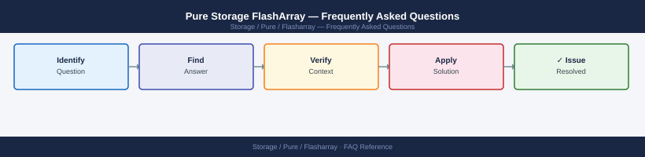

---
tags:
  - pure-flasharray
  - faq
  - operations
description: "Common questions about Pure Storage FlashArray operations, configuration, and troubleshooting. For step-by-step procedures, see the Operations section."
---
# Pure Storage FlashArray — Frequently Asked Questions

*Applies to: Pure Storage FlashArray*

Common questions about Pure Storage FlashArray operations, configuration, and troubleshooting. For step-by-step procedures, see the <a href="index.md">Operations</a> section.

## General

**Q: What Purity//FA version is recommended?**
A: Purity//FA 6.5.x is the current recommendation. Check via Pure1 or `purearray list --version` on the CLI. Pure1 will also recommend the latest qualified upgrade path for your array model.

**Q: How do I check the current Pure Storage FlashArray version?**
A: `purearray list --version`

## Configuration

**Q: What is the default data reduction setting and when should it change?**
A: Inline deduplication and compression are enabled by default on all FlashArray models. Never disable these — they are always beneficial and do not impact latency on flash media. DRR typically ranges 3:1 to 5:1.

**Q: How do I enable SafeMode for ransomware protection?**
A: Contact Pure Support to enable SafeMode. Once enabled, snapshots cannot be deleted for the configured retention period (minimum 24 hours, configurable up to years). Eradication requires a 24-hour hold plus dual admin approval.

## Operations

**Q: How do I upgrade Purity//FA without downtime?**
A: Pure upgrades are non-disruptive: Pure1 → select array → Update Software. Purity updates each controller sequentially with automatic HA failover. Typically completes in 30-90 minutes. Monitor via Pure1 during upgrade.

**Q: What is the correct procedure to add a new host and provision a volume?**
A: Create host: `purehost create <hostname> --iqn <iqn>` (iSCSI) or `--wwn <wwn>` (FC). Create volume: `purevol create <vol> --size 1T`. Connect: `purehost connect <hostname> --vol <vol> --lun 1`. Rescan on host.

## Troubleshooting

**Q: FlashArray shows 'SafeMode eradication pending'. What does it mean?**
A: A volume or snapshot is scheduled for SafeMode eradication after the mandatory hold period. This cannot be cancelled by standard admins once initiated under SafeMode. Contact Pure Support if this was triggered accidentally.

**Q: FlashArray latency spiked above 1ms — where do I start?**
A: Check Pure1 → Performance → per-volume latency. Review host QoS policies. Look for queue depth storms from a single host (`purearray list --qos`). Check for garbage collection activity. Pure1 AI analytics will flag if this is anomalous.

## Backup and Recovery

**Q: How often should I back up FlashArray configuration?**
A: Pure1 automatically backs up array configuration. Additionally: `puresupport bundle --transfer` weekly for an offline backup bundle. Back up before any Purity upgrade.

**Q: Can I restore a single volume from a FlashArray snapshot?**
A: Yes — copy from snapshot: `purevol copy <snapshot>.<vol> <new-vol>`. Or overwrite in-place: `purevol copy --overwrite <snapshot>.<vol> <existing-vol>`. Connect the restored volume to the host and mount.

## See Also

- [Pure Storage FlashArray Operations](index.md)
- [Pure Storage FlashArray Troubleshooting](../../../../troubleshooting/index.md)
