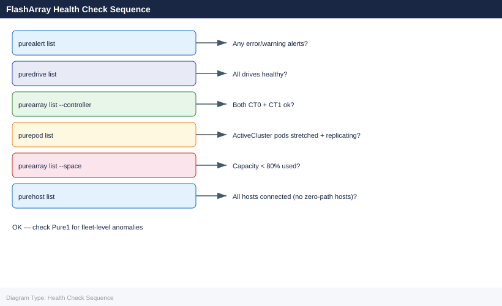
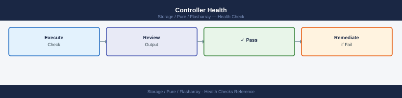

---
tags:
  - operations
  - pure
description: "Health Checks reference covering Daily Checks, Health Check, Controller Health, Drive Health, Volume Health and 5 more sections."
---
# FlashArray — Health Checks

<div class="kb-summary">
Health Checks reference covering Daily Checks, Health Check, Controller Health, Drive Health, Volume Health and 5 more sections.

*Applies to: FlashArray Purity 6.x*
</div>



## Before you begin

- **Access:** Storage admin credentials (cluster admin or equivalent)
- **Timing:** safe to run during business hours unless a step is marked ⚠ (causes interruption)
- **Dependencies:** no active upgrades or migrations on the same infrastructure
- **Logging:** capture command output — paste into the change record on completion

---

## Run This Routine

1. **Array health** — `purediag --run basic` or Pure1 → Array → Health — verify all components are green
2. **Drive status** — `pureadm list` — all drives should be Healthy; `pureadm list --failed` should return empty
3. **Volume health** — `purevol list --flagged` — should return empty
4. **Protection group lag** — `purepgroup list --snap` — verify snapshot lag is within RPO
5. **ActiveDR / ActiveCluster status** — `purehgroup list` — verify host group and pod status
6. **Performance baseline** — `purearray monitor` — check IOPS, bandwidth, and latency vs baseline
7. **Capacity trend** — `purearray monitor --resolution 86400 --length 604800` — review 7-day capacity trend
8. **Phone home status** — Pure1 → Settings → Phone Home — verify array is connected and reporting

## Daily Checks


| Check | Command | Notes |
|---|---|---|
| [ ] Run `purealert list` | `purealert list` | review all active alerts; flag any with severity `error` or `warning` |
| [ ] Run `puredrive list` | `puredrive list` | confirm all drives are in `healthy` state; flag any `failed`, `recovering`, or `missing` drives |
| [ ] Run `purearray list --space` | `purearray list --space` | review array capacity and data reduction ratio; flag if used capacity > 80% |
| [ ] Run `purepod list` | `purepod list` | confirm all ActiveCluster pods are `stretched` and online (if configured) |
| [ ] Check Pure1 portal for AI-driven health recommendations, anomalies |  |  |
| [ ] Run `purevol list --space` | `purevol list --space` | review volume space usage; flag any volumes approaching their allocated limit |
| [ ] Run `puresnap list` | `puresnap list` | check snapshot count; flag runaway snapshot growth from misconfigured protection group schedules |
| [ ] Confirm replication to the secondary array is current | `purepod list --replicating` |  |

## Health Check


- [ ] No active alerts in `purealert list`
- [ ] All drives healthy — `puredrive list` shows no `failed` or `recovering` drives
- [ ] Array capacity below 80% used
- [ ] Both controllers are healthy and running the same Purity version: `purearray list --controller`
- [ ] ActiveCluster pods are stretched and replicating: `purepod list --replicating` shows `true`
- [ ] All host connections are active — no hosts with zero paths: `purehost list`
- [ ] No runaway snapshot growth consuming unexpected capacity

```bash
# Array overall status and Purity version
purearray list

# Controller status and firmware version
purearray list --controller

# Array capacity, data reduction, and space usage
purearray list --space

# All active alerts
purealert list

# All drives and health state
puredrive list

# ActiveCluster pods and replication state
purepod list
purepod list --replicating

# All volumes with space usage
purevol list --space

# Snapshot count and usage
puresnap list

# Real-time performance (latency, IOPS, bandwidth)
purearray monitor

# Host and host group connectivity
purehost list
purehgroup list
```


```text title="Expected output"
Name              Status    Version    Capacity          Data Reduction
flasharray-prod1  OK        6.4.2      367.3 TB          3.2x
flasharray-prod2  OK        6.4.2      367.3 TB          3.1x

Controller        Status    Firmware Version    Model
CT0.flasharray1   OK        6.4.2.1234          FA-405
CT1.flasharray1   OK        6.4.2.1234          FA-405

Space Summary     Capacity      Provisioned       Used              Free
Total             734.6 TB      1.2 PB            892.3 TB          156.4 TB
Data Reduction    3.15x

Pod Name          Status    Replication Status    Arrays
pod-us-east-1     OK        Synced                flasharray-prod1, flasharray-prod2
pod-us-west-1     OK        Synced                flasharray-prod2

Volume Name       Size        Used        Snapshots
prod-db-01        500 GB      387 GB      12
prod-db-02        1 TB        756 GB      8
prod-app-vol      250 GB      198 GB      5
...

Snapshot Name              Source Volume    Created              Size
prod-db-01.snap.20240115   prod-db-01       2024-01-15 14:32     45 GB
prod-db-02.snap.20240115   prod-db-02       2024-01-15 14:30     62 GB

Latency (ms)    Read IOPS    Write IOPS    Bandwidth (MB/s)
2.3             18,450       12,340        1,247

Host Name         Status    Connected Arrays    Volumes
host-app-01       OK        flasharray-prod1    3
host-app-02       OK        flasharray-prod2    3
host-db-01        OK        flasharray-prod1    2

Host Group       Status    Member Count    Volumes
hgroup-app       OK        2               5
hgroup-db        OK        3               4
```

!!! warning "Common errors"
    **`Error: Connection refused to management IP 10.20.30.40:443`** — Verify the array management IP is reachable and the REST API service is running with `ssh admin@<array-ip> show system`.
    **`Error: Invalid credentials for user 'pureuser'`** — Confirm API token is valid and not expired by regenerating it in the Pure1 web UI or using `pureauthtoken set`.
    **`Error: Command 'purearray' not found`** — Install the Pure Storage Python SDK with `pip install purestorage` and ensure the CLI tools are in your PATH.
## Controller Health



```bash
purehw list | grep -i ct
```


```text title="Expected output"
Name             Status  Temperature  Mode
CT0.FM0.NV0     healthy 32C          optimal
CT0.FM1.NV0     healthy 31C          optimal
CT0.FM2.NV0     healthy 32C          optimal
CT1.FM0.NV0     healthy 33C          optimal
CT1.FM1.NV0     healthy 32C          optimal
CT1.FM2.NV0     healthy 31C          optimal
```

!!! warning "Common errors"
    **`purehw: command not found`** — Ensure the Pure Storage CLI tools are installed and the PATH includes the installation directory.
    **`grep: (standard input) is empty`** — Verify the array is reachable and you have authenticated to the FlashArray using `pureadmin login`.
Both controllers (CT0, CT1) should show `status: ok` and `temperature` within normal range.

## Drive Health


```bash
puredrive list
```


```text title="Expected output"
Name                          Serial                Size    Status    Temperature
pure-drive-001                1625A7B9E2F4         1.92TB  healthy   32°C
pure-drive-002                1625A7B9E2F5         1.92TB  healthy   31°C
pure-drive-003                1625A7B9E2F6         1.92TB  healthy   33°C
pure-drive-004                1625A7B9E2F7         1.92TB  healthy   32°C
pure-drive-005                1625A7B9E2F8         1.92TB  degraded  45°C
pure-drive-006                1625A7B9E2F9         1.92TB  healthy   30°C
...
Total: 24 drives | Healthy: 23 | Degraded: 1 | Failed: 0
```

!!! warning "Common errors"
    **`puredrive: command not found`** — Install the Pure Storage CLI tools or ensure the PATH includes the Pure management utilities directory.
    **`Error: Not authenticated to array`** — Authenticate to the FlashArray using `pureadmin login` with valid credentials before running drive commands.
All drives should show `status: healthy`. Any drive in `failed`, `unhealthy`, or `recovering` state requires attention.

## Volume Health


```bash
purevol list
purevol list --space
```


```text title="Expected output"
Name                                Size    Source
vol-prod-db-01                      2.0T    -
vol-prod-db-02                      2.0T    -
vol-staging-app-01                  500G    -
vol-backup-archive                  5.0T    -
vol-dev-test-01                     1.0T    -

Name                                Provisioned    Used        Data Reduction
vol-prod-db-01                      2.0T           1.8T        2.3x
vol-prod-db-02                      2.0T           1.2T        1.9x
vol-staging-app-01                  500G           320G        2.1x
vol-backup-archive                  5.0T           4.7T        1.1x
vol-dev-test-01                     1.0T           650G        1.8x
```

!!! warning "Common errors"
    **`purevol: command not found`** — Ensure the Pure Storage Python SDK is installed (`pip install purestorage`) and the purevol CLI wrapper is in your PATH.
    **`Error: Unable to connect to array at <ip>`** — Verify the FlashArray management IP is reachable and set the `PURE_IP` environment variable or pass credentials via `--api-token` flag.
Verify no volumes are in an unexpected state and capacity is within expected range.

## Host Connectivity


```bash
# List hosts and their connected volumes
purehost list
purehost list --connect

# List host connections
purehost list --connection
```


```text title="Expected output"
Name                          Serial                State      OS Type
host-prod-01                  5f8c9a2b-1e4d-4a9c  connected  Linux
host-prod-02                  7a3d1c5e-9f2b-6d8e  connected  Windows
host-dev-01                   2b4f6a8c-3e5d-9a1b  connected  Linux
host-backup-01                8e9c2a4f-5b7d-1c3e  connected  ESXi
host-test-01                  1a5c8e2f-4d9b-6a3c  disconnected  Linux

Name                          Serial                State      OS Type      Connected Volumes
host-prod-01                  5f8c9a2b-1e4d-4a9c  connected  Linux        8
host-prod-02                  7a3d1c5e-9f2b-6d8e  connected  Windows      12
host-dev-01                   2b4f6a8c-3e5d-9a1b  connected  Linux        3
host-backup-01                8e9c2a4f-5b7d-1c3e  connected  ESXi         15
host-test-01                  1a5c8e2f-4d9b-6a3c  disconnected  Linux      0

Host                          Volume                        LUN
host-prod-01                  prod-db-vol-01                1
host-prod-01                  prod-db-vol-02                2
host-prod-02                  prod-app-vol-01               1
host-prod-02                  prod-app-vol-02               2
host-prod-02                  prod-backup-vol-01            3
...
```

!!! warning "Common errors"
    **`Error: Invalid option '--connect'`** — Use `purehost list --connected` (with 'ed' suffix) to show connected hosts with volume counts.
    **`Error: Array connection failed: Connection timeout`** — Verify the Pure Storage array IP/hostname is reachable and credentials are configured in your Pure CLI environment.
Confirm all expected hosts are connected.

## Replication Health


```bash
# FlashArray Async Replication (ActiveDR or async)
purepod list
purepod list --replicating
purepod list --schedule
```


```text title="Expected output"
Name                          Status    Replication Type    Source
flasharray-prod-01            Online    ActiveDR             N/A
flasharray-prod-02            Online    Async                flasharray-prod-01
flasharray-dr-site-03         Online    Async                flasharray-prod-01
flasharray-backup-04          Offline   None                 N/A

Name                          Status    Replication Type    Source              Progress
flasharray-prod-02            Syncing   Async                flasharray-prod-01  87%
flasharray-dr-site-03         Syncing   Async                flasharray-prod-01  92%

Name                          Status    Schedule Type       Next Sync           Interval
flasharray-prod-02            Active    Hourly              2024-01-15 14:30    3600s
flasharray-dr-site-03         Active    Daily               2024-01-16 02:00    86400s
```

!!! warning "Common errors"
    **`Error: Pod 'flasharray-prod-02' is not replicating`** — Verify the replication relationship is configured and enabled with `purepod list --replicating` to confirm active replication.
    **`Error: Connection refused to management IP 10.20.30.40`** — Ensure the FlashArray management interface is reachable and the `PURE_HOST` environment variable or `--host` parameter points to the correct IP address.
Verify pod/protection group replication is healthy.

## Pure1 Cloud Monitoring


Pure1 provides proactive health monitoring and AI-driven alerts:
- Log in to **Pure1 → Arrays** → verify all arrays show green
- **Analysis → Capacity** — no arrays approaching full
- **Alerts** — no critical unacknowledged alerts

## Pre-Change Checklist

- [ ] All drives `healthy`
- [ ] Both controllers `ok`
- [ ] No critical active alerts
- [ ] Replication healthy
- [ ] Capacity below 80%

## Health Summary Table

| Check | Command | Expected |
|---|---|---|
| Array health | `purearray list` | No warnings |
| Drives | `puredrive list` | All healthy |
| Hardware | `purehw list` | All ok |
| Alerts | `purealert list` | No critical |
| Capacity | `purearray list --space` | < 80% used |

---

## Verify

- Confirm the operation completed without errors in the log or management UI
- Verify the expected state change is visible (service running, object created, config applied)
- Document the outcome in the change record

---

## See also

- [FlashArray — Procedures](../procedures/)
- [FlashArray — CLI Reference](../cli-reference/)
- [FlashArray — Common Issues](../../troubleshooting/common-issues/)
