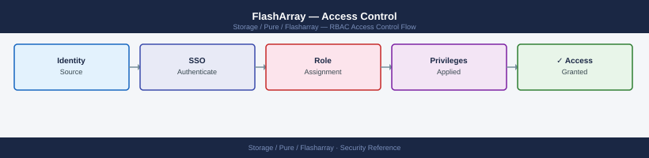
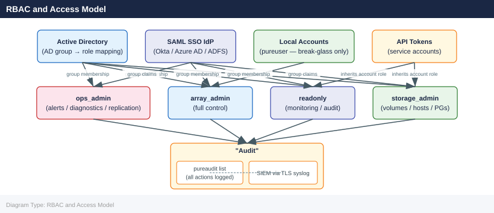

---
tags:
  - pure
  - security
description: "FlashArray uses a role-based access control (RBAC) model with four built-in roles. Custom roles are not supported."
---
# FlashArray — Access Control

<div class="kb-summary">
FlashArray uses a role-based access control (RBAC) model with four built-in roles. Custom roles are not supported.

*Applies to: FlashArray Purity 6.x*
</div>


 All human admin accounts should be mapped through directory service groups (AD or LDAP); individual named local accounts should be limited to break-glass scenarios and service accounts.

---

## Before you begin

- **Access:** Storage admin credentials (cluster admin or equivalent)
- **Change management:** security changes require CAB approval in most environments
- **Rollback plan:** document current state before any security control change
- **Testing:** validate in a non-production environment first where possible

---

## RBAC and Access Model



---

## Built-in Roles

| Role | Write Access | Restrictions | Recommended For |
|---|---|---|---|
| `array_admin` | Full array configuration, user management, all data operations | None — full control including account creation, SafeMode, and array-level settings | Storage team leads; break-glass admin accounts; Purity upgrade operators |
| `storage_admin` | Volumes, hosts, host groups, protection groups, snapshots, replication | Cannot modify array-level configuration (network, NTP, DNS, alerts); cannot manage user accounts | Storage admins performing day-to-day provisioning and data management |
| `ops_admin` | Start/stop replication, acknowledge alerts, run diagnostics, view all configuration | Cannot provision volumes; cannot modify array config; cannot manage user accounts | Operations team; on-call engineers who respond to alerts |
| `readonly` | None — read-only access to all array data and configuration | Cannot make any changes | Monitoring integrations; SIEM accounts; read-only access for application teams and auditors |

---

## Assigning Roles to Local Accounts

```bash
# Create a local account with a specific role
pureadmin create --role storage_admin jsmith

# Change an existing account's role
pureadmin setattr jsmith --role ops_admin

# Downgrade to read-only
pureadmin setattr jsmith --role readonly

# List all accounts and their current roles
pureadmin list
```


```text title="Expected output"
Account jsmith created with role storage_admin
Account jsmith role changed to ops_admin
Account jsmith role changed to readonly
Name                Role              Created              Last Login
jsmith              readonly          2024-01-15 09:22:14  2024-01-15 14:47:33
pureuser            storage_admin     2023-11-02 11:05:22  2024-01-16 08:15:09
svc_backup          ops_admin         2023-12-10 16:33:41  2024-01-16 02:30:15
admin               super_admin       2023-06-01 08:00:00  2024-01-16 09:05:22
```

!!! warning "Common errors"
    | Error | Fix |
    |---|---|
    | `Error: Account 'jsmith' already exists` | Use `pureadmin setattr jsmith --role <role>` to modify an existing account instead of creating a duplicate. |
    | `Error: Invalid role 'ops_admin'. Valid roles are: readonly, storage_admin, super_admin` | Verify the role name matches one of the supported roles for your Pure FlashArray model. |
---

## Assigning Roles to Directory Service Groups

Groups in Active Directory or LDAP are mapped to Purity roles. When a user logs in, Purity checks which AD groups they are a member of and applies the highest-privilege role from the mapped groups.

```bash
# Map an AD group to array_admin role
pureadmin setattr --role array_admin \
    --group "CN=pure-array-admins,OU=Groups,DC=example,DC=com"

# Map an AD group to storage_admin role
pureadmin setattr --role storage_admin \
    --group "CN=pure-storage-admins,OU=Groups,DC=example,DC=com"

# Map an AD group to ops_admin role
pureadmin setattr --role ops_admin \
    --group "CN=pure-ops,OU=Groups,DC=example,DC=com"

# Map an AD group to read-only role
pureadmin setattr --role readonly \
    --group "CN=pure-readonly,OU=Groups,DC=example,DC=com"

# List all mapped groups and their roles
pureadmin list
```


```text title="Expected output"
Setting role array_admin for group CN=pure-array-admins,OU=Groups,DC=example,DC=com
Setting role storage_admin for group CN=pure-storage-admins,OU=Groups,DC=example,DC=com
Setting role ops_admin for group CN=pure-ops,OU=Groups,DC=example,DC=com
Setting role readonly for group CN=pure-readonly,OU=Groups,DC=example,DC=com

Name                                              Role            Type
CN=pure-array-admins,OU=Groups,DC=example,DC=com array_admin     group
CN=pure-storage-admins,OU=Groups,DC=example,DC=com storage_admin  group
CN=pure-ops,OU=Groups,DC=example,DC=com          ops_admin       group
CN=pure-readonly,OU=Groups,DC=example,DC=com     readonly        group
```

!!! warning "Common errors"
    | Error | Fix |
    |---|---|
    | `Error: LDAP group not found in directory` | Verify the AD group DN is correct and the array has network connectivity to the domain controller. |
    | `Error: Authentication failed - insufficient privileges` | Ensure the account running pureadmin has array_admin role or equivalent credentials configured. |
    | `Error: Invalid role name 'array_admin'` | Check the exact role name using `pureadmin list --roles` and use the correct spelling (roles are case-sensitive). |
**Group design guidance:**

- Use one AD group per Purity role — do not add the same user to multiple role groups; Purity grants the highest role if a user is in more than one mapped group
- Nest the Purity role groups under a parent OU for easy ACL reporting and audit
- Apply AD group membership reviews quarterly — remove members who have changed roles or left the organisation

---

## API Token Access Control

API tokens provide programmatic access without interactive authentication. They inherit the role of the account they belong to.

```bash
# Create a monitoring service account (read-only)
pureadmin create --role readonly svc-monitoring
pureadmin apitoken create svc-monitoring

# Create a provisioning service account for Terraform / Ansible
pureadmin create --role storage_admin svc-automation
pureadmin apitoken create svc-automation

# Create an account for Veeam FlashArray integration
pureadmin create --role storage_admin svc-veeam
pureadmin apitoken create svc-veeam

# List all accounts and whether they have API tokens
pureadmin list --api-token

# Revoke a token without deleting the account
pureadmin delete svc-old --api-token
```


```text title="Expected output"
Creating account svc-monitoring with role readonly...
Account svc-monitoring created successfully
API token created: 2b3f8c1a-9e47-4d2f-b1c6-7a5d9e2f4c8b
Creating account svc-automation with role storage_admin...
Account svc-automation created successfully
API token created: 5c7a2e9d-3f1b-4a8c-9b2e-1d6f3a8c5e2b
Creating account svc-veeam with role storage_admin...
Account svc-veeam created successfully
API token created: 8f4b1c6e-2a9d-5f3c-7b1e-9a4d2c6f8e3a

Name              Role            API Token Status
svc-monitoring    readonly        Active (2b3f8c1a...)
svc-automation    storage_admin   Active (5c7a2e9d...)
svc-veeam         storage_admin   Active (8f4b1c6e...)
pureuser          system_admin    Active (legacy)

Revoking API token for svc-old...
API token revoked. Account svc-old retained for audit purposes.
```

!!! warning "Common errors"
    | Error | Fix |
    |---|---|
    | `Error: Account svc-monitoring already exists` | Delete the existing account with `pureadmin delete svc-monitoring` or use a different service account name. |
    | `Error: Invalid role 'storage_admin' for this array version` | Verify the role name with `pureadmin list --roles` and use the correct role identifier for your FlashArray OS version. |
    | `Error: API token creation failed: Account has no active session` | Ensure the account was created successfully before attempting to generate a token, or re-run the account creation command. |
**Token access matrix:**

| Integration | Recommended Role | Rationale |
|---|---|---|
| Pure1 phone-home (built-in) | Managed by Purity | No token needed — automatic |
| Veeam / Commvault backup | `storage_admin` | Needs to create/delete snapshots and protection groups |
| Terraform provider | `storage_admin` | Needs to create volumes, hosts, protection groups |
| Ansible `purefa_info` module | `readonly` | Read-only inventory collection |
| Monitoring (SNMP, Prometheus) | `readonly` | No write access required |
| vCenter VASA provider | `storage_admin` | Needs to create and manage vVols |
| Custom automation (provisioning) | `storage_admin` | Apply scope restriction at the application layer |
| Audit/compliance tool | `readonly` | Read-only audit collection |

---

## Least Privilege Implementation

Purity does not support resource-level access control (i.e., limiting a `storage_admin` to specific volumes or protection groups). The role grants access to all objects of that type. Compensate for this limitation through:

1. **Process controls:** require change requests for all provisioning; ops team approves requests before storage admins execute
2. **Audit log review:** forward audit logs to SIEM and alert on unexpected destructive operations (volume destroy, protection group delete, snapshot eradication)
3. **Separate environments:** use separate FlashArrays (or separate Pure1 organisations) for production and non-production if strict separation is required
4. **Named accounts only:** never share a `pureuser` credential for routine work — every admin action must be attributable to a named user in the audit log

```bash
# Audit all admin actions in the last 24 hours
pureaudit list --sort time- | head -50

# Find all volume delete (destroy) operations
pureaudit list --filter 'command="purevol" and subcommand="destroy"'

# Find all snapshot eradication operations
pureaudit list --filter 'command="puresnap" and subcommand="eradicate"'

# Find all protection group schedule changes
pureaudit list --filter 'command="purepgroup" and subcommand="schedule"'
```


```text title="Expected output"
=== Admin Actions (Last 24 Hours) ===
Time                     User      Command    Subcommand  Object           Status
2024-01-15T23:47:32Z     admin     purevol    create      vol-prod-db-01   success
2024-01-15T23:12:18Z     svc_mgmt  purepgroup set         pg-backup-daily  success
2024-01-15T22:55:04Z     admin     puresnap   eradicate   snap-test-001    success
2024-01-15T21:33:22Z     operator  purevol    destroy     vol-temp-staging success
2024-01-15T20:18:47Z     admin     purehost   connect     host-app-server  success
...

=== Volume Destroy Operations ===
Time                     User      Command    Subcommand  Object           Status
2024-01-15T21:33:22Z     operator  purevol    destroy     vol-temp-staging success
2024-01-14T18:22:15Z     admin     purevol    destroy     vol-dev-test-02  success
2024-01-13T14:05:33Z     svc_mgmt  purevol    destroy     vol-archive-old  success

=== Snapshot Eradication Operations ===
Time                     Time                     User      Command    Subcommand  Object           Status
2024-01-15T23:12:18Z     admin     puresnap   eradicate   snap-test-001    success
2024-01-14T16:44:52Z     operator  puresnap   eradicate   snap-backup-tmp  success
2024-01-12T09:31:07Z     admin     puresnap   eradicate   snap-old-weekly  success

=== Protection Group Schedule Changes ===
Time                     User      Command      Subcommand  Object           Status
2024-01-15T19:47:33Z     admin     purepgroup   schedule    pg-backup-daily  success
2024-01-14T10:22:18Z     svc_mgmt  purepgroup   schedule    pg-hourly-sync   success
```

!!! warning "Common errors"
    | Error | Fix |
    |---|---|
    | `pureaudit: command not found` | Ensure the Pure Storage CLI tools are installed and the PATH includes the Pure bin directory (typically `/opt/pureapp/bin`). |
    | `Error: Invalid filter syntax` | Verify filter syntax uses proper quoting and valid field names; check `pureaudit list --help` for supported filter operators and fields. |
    | `Error: Authentication failed` | Confirm your Pure Storage array credentials are configured in `~/.purerc` or via environment variables (`PURE_HOST`, `PURE_USERNAME`, `PURE_PASSWORD`). |
---

## Account Lifecycle Management

### Onboarding a New Admin

1. Add the new admin's account to the appropriate AD security group for their role
2. Verify they can log into the array with their domain account
3. Confirm their role is correct: `pureadmin list` and check the role column
4. If they need API access, create a named service account or provide them a personal API token tied to their account

### Offboarding an Admin

```bash
# If using AD: remove the user from the relevant AD group — their next login attempt will fail
# Invalidate any active sessions immediately:
pureadmin refresh <username>

# If they had a local account, delete it:
pureadmin delete jsmith

# If they had a personal API token:
pureadmin delete jsmith --api-token
```


```text title="Expected output"
Invalidating sessions for user jsmith...
Session refresh completed successfully.
User jsmith removed from local accounts.
API token for jsmith deleted.
```

!!! warning "Common errors"
    | Error | Fix |
    |---|---|
    | `Error: User jsmith not found` | Verify the username spelling and that the user exists in the system with `pureadmin list --users`. |
    | `Error: Cannot delete user with active sessions` | Run `pureadmin refresh <username>` before deletion to invalidate all active sessions. |
If the departing admin had access to any shared credentials (e.g., the vaulted `pureuser` password), rotate those credentials immediately after their departure.

### Periodic Access Review

Run quarterly:

```bash
# Export all admin accounts and roles to CSV for access review
ssh pureuser@<array_ip> "pureadmin list --csv" > admin_review_$(date +%Y%m%d).csv

# Export API token inventory
ssh pureuser@<array_ip> "pureadmin list --api-token --csv" >> admin_review_$(date +%Y%m%d).csv
```


```text title="Expected output"
Name,Role,Email,Enabled,Last_Login
admin,Administrator,admin@company.local,true,2024-01-15T09:23:45Z
storage_ops,StorageAdmin,ops@company.local,true,2024-01-14T16:42:12Z
backup_svc,ReadOnly,backup@company.local,true,2024-01-15T08:15:33Z
monitoring,ReadOnly,monitor@company.local,true,2024-01-13T22:05:18Z
Name,Token_ID,Owner,Created,Expires,Last_Used
token_prod_01,8f4a2c9e-b1d3-47e2-9c5f-2a8b3d6e1f4c,storage_ops,2023-11-20,2025-11-20,2024-01-15T10:12:44Z
token_backup_02,c7e9f2a1-3b5d-41c8-8e2f-5d9c4a7b2e6f,backup_svc,2023-10-05,2025-10-05,2024-01-14T23:30:22Z
token_legacy_03,a2b8d4f1-6c9e-42a5-7d1f-9e3c5b8a2d6f,admin,2022-06-12,2024-06-12,2023-12-01T14:22:10Z
```

!!! warning "Common errors"
    | Error | Fix |
    |---|---|
    | `ssh: connect to host <array_ip> port 22 (tcp) closed` | Replace `<array_ip>` with the actual management IP of your Pure FlashArray and verify SSH connectivity is enabled on the array. |
    | `pureadmin: command not found` | Ensure the Pure FlashArray CLI tools are installed on the SSH target system or use the full path to the pureadmin binary (typically `/opt/pureapp/bin/pureadmin`). |
    | `Permission denied (publickey,password)` | Verify the pureuser account exists on the array and that your SSH key or password authentication is configured correctly. |
Review output and action:

- Remove AD group memberships for any accounts that should no longer have access
- Revoke API tokens for decommissioned service accounts or integrations
- Confirm that no accounts have `array_admin` that should be `storage_admin`

---

## SNMP Access Control

FlashArray supports SNMPv3 for monitoring integrations. Always use SNMPv3 — never SNMPv1 or SNMPv2c in production.

```bash
# Configure SNMPv3 community (authPriv — SHA auth + AES encryption)
puresnmp create --version v3 \
    --auth-protocol SHA \
    --auth-passphrase "<auth_password>" \
    --privacy-protocol AES \
    --privacy-passphrase "<priv_password>" \
    --user monitoring-user \
    siem-snmp

# List SNMP configuration
puresnmp list

# Configure SNMP trap destination
puresnmptrap create --version v3 \
    --auth-protocol SHA \
    --auth-passphrase "<auth_password>" \
    --privacy-protocol AES \
    --privacy-passphrase "<priv_password>" \
    --user monitoring-user \
    --host <trap_receiver_ip> \
    nms-trap
```


```text title="Expected output"
Created SNMPv3 user: monitoring-user
  Version: v3
  Auth Protocol: SHA
  Privacy Protocol: AES
  Status: enabled

SNMP Configuration:
Name                Version  Auth Protocol  Privacy Protocol  User              Status
monitoring-user     v3       SHA            AES               monitoring-user   enabled
siem-snmp           v3       SHA            AES               monitoring-user   enabled

Created SNMP trap destination: nms-trap
  Host: 192.168.45.120
  Version: v3
  Auth Protocol: SHA
  Privacy Protocol: AES
  User: monitoring-user
  Status: enabled
```

!!! warning "Common errors"
    | Error | Fix |
    |---|---|
    | `Error: Invalid auth passphrase length. Minimum 8 characters required.` | Ensure both auth and privacy passphrases are at least 8 characters long. |
    | `Error: Host unreachable: 192.168.45.120` | Verify the trap receiver IP is correct and reachable from the array management network. |
    | `Error: SNMPv3 user 'monitoring-user' already exists` | Use `puresnmp delete monitoring-user` to remove the existing user before recreating it. |
SNMPv3 is read-only by design on FlashArray — it cannot be used to make configuration changes.

---

## Management Network Access Restriction

FlashArray does not provide built-in IP-based ACLs for management plane access. Restrict access at the network layer:

| Control | Implementation |
|---|---|
| Firewall / ACL on management VLAN | Allow SSH (22) and HTTPS (443) only from admin jump hosts and monitoring systems; deny all other inbound |
| Dedicated management VLAN | Place the array management interface on a VLAN separate from data traffic; apply the ACL at the access layer switch |
| Jump host requirement | Require all admin access to originate from a bastion/jump host; the jump host should enforce MFA at the host level |
| SSH key restriction | If using local accounts for CLI access, use SSH key authentication and disable password-based SSH on the jump host (not on the array itself — Purity does not support SSH key auth natively) |

Document the allowed source IP ranges in the firewall change log and review them annually.

---

## See also

- [FlashArray — Authentication](../authentication/)
- [FlashArray — Hardening](../hardening/)
- [FlashArray — Encryption](../encryption/)
