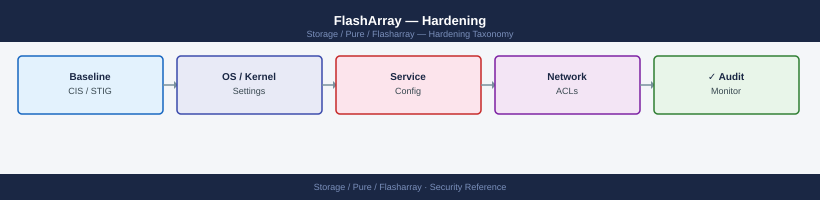
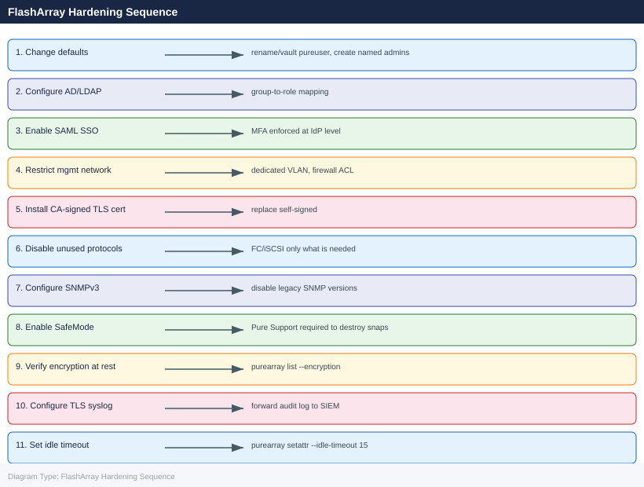

---
tags:
  - pure
  - security
---
# FlashArray — Hardening

<div class="kb-summary">
Hardening reference covering Hardening Checklist, Step-by-Step Controls, Post-Hardening Verification.

*Applies to: FlashArray Purity 6.x*
</div>




This page covers the ordered hardening steps to apply on every new FlashArray before it enters production, along with the rationale and CLI commands for each control. Apply these steps after initial network and identity configuration and before connecting any production hosts.

---

## Before you begin

- **Access:** Storage admin credentials (cluster admin or equivalent)
- **Change management:** security changes require CAB approval in most environments
- **Rollback plan:** document current state before any security control change
- **Testing:** validate in a non-production environment first where possible

---

## Hardening Checklist

Work through these steps in order. Each control builds on the previous ones.

| # | Control | Status | Notes |
|---|---|---|---|
| 1 | Change default credentials and create named admin accounts | | |
| 2 | Configure AD/LDAP authentication | | |
| 3 | Enforce MFA via SAML SSO | | |
| 4 | Restrict management network access | | |
| 5 | Install a CA-signed TLS certificate | | |
| 6 | Disable unused protocols | | |
| 7 | Configure SNMPv3 and disable legacy SNMP | | |
| 8 | Enable SafeMode snapshots | | |
| 9 | Verify encryption at rest | | |
| 10 | Verify replication TLS | | |
| 11 | Configure syslog/audit forwarding to SIEM | | |
| 12 | Set session idle timeout | | |
| 13 | Audit and disable unused API tokens | | |
| 14 | Configure SMTP with TLS for alert emails | | |

---

## Step-by-Step Controls

### 1. Change Default Credentials and Create Named Admin Accounts

The factory default `pureuser` account uses a password printed on the array chassis label. This password is shared knowledge by anyone who has physically accessed the array.

```bash
# Change pureuser password to a strong randomly-generated credential
pureadmin setattr pureuser --password
# Enter a 20+ character random password at the prompt

# Create named admin accounts for the storage team
pureadmin create --role array_admin s.jones
pureadmin create --role storage_admin p.smith
pureadmin create --role ops_admin oncall-storage

# Set passwords for named accounts
pureadmin setattr s.jones --password
pureadmin setattr p.smith --password
pureadmin setattr oncall-storage --password
```


```text title="Expected output"
Password changed successfully for pureuser
Created admin account s.jones with role array_admin
Created admin account p.smith with role storage_admin
Created admin account oncall-storage with role ops_admin
Password changed successfully for s.jones
Password changed successfully for p.smith
Password changed successfully for oncall-storage
```

!!! warning "Common errors"
    **`Error: User s.jones already exists`** — Check existing accounts with `pureadmin list --users` and use a different username or delete the existing account first.
    **`Error: Password does not meet complexity requirements (minimum 20 characters, must include uppercase, lowercase, number, and special character)`** — Enter a password with at least 20 characters including uppercase, lowercase, numbers, and special characters at the prompt.
    **`Error: Invalid role 'array_admin'. Valid roles are: array_admin, storage_admin, ops_admin, readonly_admin`** — Verify the role name spelling matches one of the valid roles listed in the error message.
Store the `pureuser` credentials in the organisation's PAM vault (CyberArk, HashiCorp Vault, etc.) with access restricted to the on-call and emergency procedures. Document the vault path in the array's CMDB record.

---

### 2. Configure AD/LDAP Authentication

After AD integration, individual named local accounts can be removed for human admin access — role assignment comes from AD group membership.

```bash
# Join to Active Directory
puredirectoryservice setattr \
    --base-dn "DC=example,DC=com" \
    --bind-user "svc-pure-bind" \
    --bind-password "<password>" \
    --domain "example.com" \
    --uri "ldaps://dc01.example.com"

# Test the connection
pureds check

# Map AD groups to Purity roles
pureadmin setattr --role array_admin \
    --group "CN=pure-array-admins,OU=Groups,DC=example,DC=com"

pureadmin setattr --role storage_admin \
    --group "CN=pure-storage-admins,OU=Groups,DC=example,DC=com"

pureadmin setattr --role ops_admin \
    --group "CN=pure-ops,OU=Groups,DC=example,DC=com"

pureadmin setattr --role readonly \
    --group "CN=pure-readonly,OU=Groups,DC=example,DC=com"
```


```text title="Expected output"
Directory Service configured.
  Base DN: DC=example,DC=com
  Bind User: svc-pure-bind
  Domain: example.com
  URI: ldaps://dc01.example.com
  Status: configured

Connection test to ldaps://dc01.example.com: OK
  Response time: 142ms
  Bind successful: Yes
  Base DN reachable: Yes

Role mapping configured:
  array_admin ← CN=pure-array-admins,OU=Groups,DC=example,DC=com
  storage_admin ← CN=pure-storage-admins,OU=Groups,DC=example,DC=com
  ops_admin ← CN=pure-ops,OU=Groups,DC=example,DC=com
  readonly ← CN=pure-readonly,OU=Groups,DC=example,DC=com
```

!!! warning "Common errors"
    **`Connection test to ldaps://dc01.example.com: FAILED - Connection refused`** — Verify the LDAP server hostname/IP is correct and the LDAPS port (636) is open in the firewall between the array and domain controller.
    **`Error: Group CN=pure-array-admins,OU=Groups,DC=example,DC=com not found`** — Confirm the group DN is correct by querying Active Directory with `ldapsearch` and verify the bind user has permission to read group objects.
    **`Error: Directory Service not configured`** — Run the `puredirectoryservice setattr` command first to configure the directory service before attempting to map groups.
Validate: log out and log back in with a domain account in each role group to confirm access works before removing or downgrading local accounts.

---

### 3. Enforce MFA via SAML SSO

SAML SSO delegates authentication to an enterprise IdP (Okta, Azure AD, ADFS) that enforces MFA. This is the preferred mechanism for production arrays where compliance requires MFA for privileged access.

```bash
# Enable SSO (after configuring SAML in the IdP and Purity GUI)
pureadmin global enable --single-sign-on

# Verify SSO is enabled
pureadmin global list
```


```text title="Expected output"
Single sign-on enabled.
Name                          Value
single-sign-on                on
idle-timeout                  900
session-timeout               3600
api-token-ttl                 86400
api-token-max-age             2592000
password-min-length           8
password-max-consecutive-chars 3
password-history-length       12
```

!!! warning "Common errors"
    **`Error: SAML not configured`** — Configure SAML identity provider settings in the Purity GUI under System > Security > Single Sign-On before enabling SSO.
    **`Error: Command requires administrative privileges`** — Run the command with a user account that has administrative or security-admin role on the FlashArray.
See the [Authentication](authentication.md) page for full SAML configuration steps. SAML integration requires Purity//FA 6.0 or later.

If SAML is not feasible in the short term, compensate with:
- Named account controls and PAM vault for credential management
- Network-level restriction (step 4) to limit the attack surface
- Audit log alerting for failed login attempts

---

### 4. Restrict Management Network Access

FlashArray does not provide built-in IP-based ACLs for the management plane. Implement network controls to protect the management interface:

| Control | Implementation |
|---|---|
| Dedicated management VLAN | Place management interface on a separate VLAN from data traffic |
| Firewall ACL | Allow TCP 22 (SSH) and TCP 443 (HTTPS/REST API) only from admin jump hosts and monitoring systems; deny all other sources |
| Jump host requirement | Require all admin access through a bastion host; the jump host should enforce MFA |
| No direct internet access | Management interface must not be directly internet-reachable; Pure1 phone-home uses outbound HTTPS only |

Verify the management interface is on the correct VLAN and the IP is not routable from untrusted networks. Document the allowed source ranges in the firewall change record.

---

### 5. Install a CA-Signed TLS Certificate

The factory default is a self-signed certificate that generates browser warnings and prevents proper certificate pinning in automation tools.

```bash
# View the current certificate (confirm it is currently self-signed)
purearray list --ssl-certificate

# Install a CA-signed certificate (PEM format: cert + intermediates + key combined)
purearray setattr --tls-certificate /path/to/combined.pem

# Verify the new certificate is active
purearray list --ssl-certificate
```


```text title="Expected output"
Certificate Information:
  Issuer: CN=purearray-self-signed,O=Pure Storage,C=US
  Subject: CN=purearray.example.com,O=Pure Storage,C=US
  Valid From: 2023-01-15T08:22:14Z
  Valid Until: 2026-01-14T08:22:14Z
  Fingerprint (SHA256): a7:b2:c9:d4:e1:f6:2a:3b:4c:5d:6e:7f:8a:9b:0c:1d:2e:3f:4a:5b

(no output — command completes silently)

Certificate Information:
  Issuer: CN=DigiCert Global Root CA,O=DigiCert Inc,C=US
  Subject: CN=purearray.example.com,O=Pure Storage,C=US
  Valid From: 2024-03-10T14:30:00Z
  Valid Until: 2025-03-10T14:30:00Z
  Fingerprint (SHA256): f1:e2:d3:c4:b5:a6:97:88:79:6a:5b:4c:3d:2e:1f:0a:9b:8c:7d:6e
```

!!! warning "Common errors"
    **`Error: Certificate file not found at /path/to/combined.pem`** — Verify the file path is correct and the certificate file exists with `ls -la /path/to/combined.pem`.
    **`Error: Invalid certificate format. Expected PEM with certificate chain and private key`** — Ensure the PEM file contains the certificate, intermediate chain, and private key in the correct order using `openssl x509 -in /path/to/combined.pem -text -noout`.
    **`Error: Certificate validation failed: private key does not match certificate`** — Regenerate the combined PEM file ensuring the private key corresponds to the certificate using `openssl verify -CAfile /path/to/combined.pem /path/to/combined.pem`.
Requirements:
- RSA 4096 or ECDSA P-256 key
- SAN must include the array management IP and/or FQDN
- Certificate must be trusted by the browsers and automation tools that access the array
- Set a calendar reminder 30 days before expiry for renewal

---

### 6. Disable Unused Protocols

Reduce the attack surface by disabling protocols that are not in use.

```bash
# Check which protocols are currently enabled
purenetwork list
pureport list
```


```text title="Expected output"
Name  Address         Netmask         Gateway         MTU   Enabled
eth0  192.168.1.100   255.255.255.0   192.168.1.1     1500  True
eth1  192.168.1.101   255.255.255.0   192.168.1.1     1500  True
eth2  10.0.0.50       255.255.255.0   10.0.0.1        1500  False

Name     Portal  Speed      Failover  Enabled
fc.0     fc0     16Gb       fc.1      True
fc.1     fc0     16Gb       fc.0      True
eth0     eth0    1000Mb     eth1      True
eth1     eth1    1000Mb     eth0      True
```

!!! warning "Common errors"
    **`purenetwork: command not found`** — Ensure you are logged into the FlashArray management interface or have the Pure Storage CLI tools installed and in your PATH.
    **`Error: Invalid credentials`** — Verify your FlashArray credentials and that your management session has not expired; re-authenticate if necessary.
**If iSCSI is not in use (FC-only environment):**

Disable iSCSI interfaces at the network level — set the iSCSI interface IP to `0.0.0.0` or down the interface via `purenetwork setattr`. Coordinate with Pure Support before disabling any interface if unsure.

**If SNMP is not required:**

Do not configure SNMP at all — Purity only enables SNMP if an SNMP community or trap destination is configured. If SNMP was previously configured for a legacy integration:

```bash
# List SNMP configuration
puresnmp list
puresnmptrap list

# Remove legacy SNMPv1/v2c communities if present
puresnmp delete <community_name>
```


```text title="Expected output"
SNMP Configuration:
  Community: public
  Version: v2c
  Trap Host: 192.168.1.100
  Trap Community: public_traps

SNMP Trap Configuration:
  Trap Host: 192.168.1.100
  Community: public_traps
  Enabled: true

(no output — command completes silently)
```

!!! warning "Common errors"
    **`Error: SNMP community 'public' is in use by trap receiver`** — Delete the associated trap configuration first using `puresnmptrap delete <trap_host>` before removing the community.
    **`Error: Invalid community name '<community_name>'`** — Verify the exact community name with `puresnmp list` and ensure it exists before attempting deletion.
**SSH access:**

SSH to the management interface is enabled by default and required for Purity CLI access. Do not disable SSH — restrict access at the network layer instead (step 4).

---

### 7. Configure SNMPv3 and Disable Legacy SNMP

If SNMP monitoring is required, use SNMPv3 with `authPriv` security level only (authentication + encryption). Never use SNMPv1 or SNMPv2c — they transmit community strings in plaintext and provide no access control.

```bash
# Configure SNMPv3 monitoring user
puresnmp create \
    --version v3 \
    --auth-protocol SHA \
    --auth-passphrase "<auth_pass_20_chars>" \
    --privacy-protocol AES \
    --privacy-passphrase "<priv_pass_20_chars>" \
    --user svc-snmp-monitor \
    monitoring-v3

# Configure SNMPv3 trap destination
puresnmptrap create \
    --version v3 \
    --auth-protocol SHA \
    --auth-passphrase "<auth_pass_20_chars>" \
    --privacy-protocol AES \
    --privacy-passphrase "<priv_pass_20_chars>" \
    --user svc-snmp-monitor \
    --host <nms_ip> \
    nms-trap-v3

# Verify
puresnmp list
puresnmptrap list
```


```text title="Expected output"
SNMPv3 user 'svc-snmp-monitor' created successfully
Name: svc-snmp-monitor
Auth Protocol: SHA
Privacy Protocol: AES
Status: Enabled

SNMPv3 trap destination 'nms-trap-v3' created successfully
Host: 10.45.120.88
User: svc-snmp-monitor
Version: v3
Status: Enabled

Name                      Version  Auth Protocol  Privacy Protocol  Status
svc-snmp-monitor          v3       SHA            AES               Enabled
legacy-snmp-ro            v2c      —              —                 Enabled

Name              Host            User                 Version  Status
nms-trap-v3       10.45.120.88    svc-snmp-monitor     v3       Enabled
legacy-trap-dest  10.45.120.50    legacy-snmp-ro       v2c      Enabled
```

!!! warning "Common errors"
    **`Error: Auth passphrase must be at least 20 characters`** — Ensure both `--auth-passphrase` and `--privacy-passphrase` values are exactly 20 or more characters long.
    **`Error: Host 10.45.120.88 is unreachable`** — Verify the NMS server IP is correct and reachable from the array management network before creating the trap destination.
    **`Error: User 'svc-snmp-monitor' already exists`** — Delete the existing user with `puresnmp delete svc-snmp-monitor` before recreating it, or use a different username.
Ensure no SNMPv1 or v2c communities exist: `puresnmp list` should show only v3 entries.

---

### 8. Enable SafeMode Snapshots

SafeMode makes protection group snapshot schedules and snapshot retention policies immutable. No local admin (including `array_admin`) can delete a locked snapshot or modify its retention until the retention window expires. This prevents ransomware attacks from destroying backups even if admin credentials are compromised.

**How to enable:** Contact Pure Storage Support. SafeMode requires a dual-approval process — it cannot be activated from the array CLI alone. Engagement with a Pure Support engineer is required.

Before enabling SafeMode:
- [ ] Confirm all production protection group schedules are correct — retention windows, frequency, and replication targets
- [ ] Confirm the Purity eradication timer (default 24 hours for destroyed volumes) is set appropriately — SafeMode can extend this
- [ ] Brief the storage team: once SafeMode is enabled, snapshot deletion operations require Pure Support involvement

```bash
# Verify SafeMode status (after enablement)
purearray list --safemode
```


```text title="Expected output"
Name                          SafeMode  SafeModeExpiration
flasharray-prod-01            enabled   2025-03-15T14:22:00Z
flasharray-prod-02            enabled   2025-03-15T14:22:00Z
flasharray-dr-01              disabled  —
```

!!! warning "Common errors"
    **`Error: Invalid credentials or insufficient permissions`** — Verify your Pure Storage API token is valid and has admin-level access by running `purearray login`.
    **`Error: Unable to connect to array at <hostname>`** — Confirm the array hostname/IP is reachable and the management interface is online by pinging the array's management IP.
---

### 9. Verify Encryption at Rest

Encryption at rest is always-on and requires no configuration. Verify it is active after initial setup:

```bash
# Verify encryption is active
purearray list --encryption

# Verify all drives are SEDs (self-encrypting drives)
puredrive list --spec
# Look for 'encryption_enabled: true' or equivalent in the output
```


```text title="Expected output"
Name                          Encryption  Status
flasharray-prod-01            enabled     active
flasharray-prod-02            enabled     active
flasharray-dr-01              enabled     active

Drive                         Capacity    Type              Encryption
SSD-001                       1.92TB      SSD               enabled
SSD-002                       1.92TB      SSD               enabled
SSD-003                       1.92TB      SSD               enabled
SSD-004                       1.92TB      SSD               enabled
SSD-005                       1.92TB      SSD               enabled
...
(47 more drives)
```

!!! warning "Common errors"
    **`purearray: command not found`** — Install the Pure Storage CLI tools or ensure the PATH includes the Pure management tools directory.
    **`Error: Unable to connect to array at <ip>. Authentication failed.`** — Verify your Pure Storage credentials are configured in `~/.purerc` or set the PURE_API_TOKEN environment variable.
If KMIP external key management is required, configure it now. See [Encryption](encryption.md) for the full KMIP configuration procedure.

---

### 10. Verify Replication TLS

Inter-array replication uses TLS by default. Verify the connection is established and encrypted:

```bash
# List connected remote arrays and their connection status
purearray list --connection

# Verify replication protection groups have active targets
purepgroup list --replication
```


```text title="Expected output"
Name                          Address           Connected  Version
flasharray-prod-01            192.168.1.50      true       6.4.2
flasharray-dr-02              192.168.1.51      true       6.4.2
flasharray-backup-03          192.168.1.52      false      6.3.8
flasharray-remote-04          10.20.30.40       true       6.4.1

Name                          Targets  Status      Last Sync
pg-prod-database              1        active      2024-01-15T09:23:14Z
pg-prod-vmware               2        active      2024-01-15T09:22:58Z
pg-backup-archive            1        paused      2024-01-14T18:45:22Z
pg-dr-failover               2        active      2024-01-15T09:23:01Z
```

!!! warning "Common errors"
    **`Error: Connection refused — verify Pure Storage management IP is reachable and purearray service is running on the target array.`** — Verify network connectivity and that the Pure Storage management interface is accessible.
    **`Error: Authentication failed for array flasharray-prod-01 — check API token expiration and permissions.`** — Regenerate or refresh the API token in Pure Storage management console.
If the array is not yet connected to a remote array, this step is deferred until replication is configured.

---

### 11. Configure Syslog/Audit Forwarding to SIEM

Local audit logs can potentially be modified by a compromised `array_admin` account. Forward all logs to an external SIEM immediately so the log record is preserved off-array.

```bash
# Configure TLS syslog to SIEM (preferred — use TCP TLS for integrity)
puresyslog create --uri tls://<siem_ip>:6514 siem-tls

# UDP syslog (fallback only — not recommended for audit purposes)
puresyslog create --uri udp://<siem_ip>:514 siem-udp

# List configured syslog destinations
puresyslog list
```


```text title="Expected output"
Syslog destination siem-tls created successfully.
Syslog destination siem-udp created successfully.

Name          URI                        Enabled  Facility
siem-tls      tls://192.168.45.120:6514  True     local0
siem-udp      udp://192.168.45.120:514   True     local0
```

!!! warning "Common errors"
    **`Error: Invalid URI scheme 'tls'. Supported schemes: udp, tcp`** — Use `tcp://<siem_ip>:6514` instead of `tls://` if your FlashArray firmware does not support TLS syslog (requires Purity 6.0+).
    **`Error: Connection refused to 192.168.45.120:6514`** — Verify the SIEM IP address and port are correct, and that the SIEM syslog listener is running and accessible from the array's management network.
Verify syslog delivery by checking the SIEM for log events from the array management IP. Generate a test event:

```bash
# Generate a test audit event (e.g., run a read-only command)
purearray list
# Check the SIEM for the corresponding audit log entry within 60 seconds
```


```text title="Expected output"
Name                          Capacity  Used%  Data Reduction  Snapshots
flasharray-prod-01            100.0T    68.5%  4.2x            12.3T
flasharray-prod-02            100.0T    71.2%  4.1x            14.7T
flasharray-dr-01              50.0T     45.3%  3.8x            8.2T
flasharray-test-01            25.0T     22.1%  3.5x            2.1T
```

!!! warning "Common errors"
    **`purearray: command not found`** — Install the Pure Storage Python SDK or ensure the purearray CLI tool is in your PATH.
    **`Error: Unable to connect to array at <ip>: Connection refused`** — Verify the FlashArray management IP is reachable and the REST API service is running on port 443.
Configure SIEM alerts for:
- Multiple failed login attempts from the same source IP (brute force indicator)
- API token creation or deletion by non-standard accounts
- Protection group schedule modifications
- Volume or snapshot eradication events
- SafeMode-related audit entries

---

### 12. Set Session Idle Timeout

Unattended CLI or GUI sessions with admin-level privileges are a security risk. Set the idle timeout to 15 minutes.

```bash
# Set CLI/GUI session idle timeout (in minutes)
purearray setattr --idle-timeout 15

# Verify
purearray list --idle-timeout
```


```text title="Expected output"
Idle timeout set to 15 minutes.
Idle timeout: 15 minutes
```

!!! warning "Common errors"
    **`Error: Array connection failed`** — Verify the array hostname/IP is reachable and credentials are configured via `purearray login` or environment variables.
    **`Error: Permission denied`** — Ensure your user account has administrative privileges on the Pure FlashArray; contact your array administrator to grant the required role.
This applies to both SSH (CLI) and HTTPS (GUI) sessions. A session that has been idle for 15 minutes will require re-authentication.

---

### 13. Audit and Disable Unused API Tokens

Service account API tokens that are unused represent permanent credentials with no expiry. Audit them after initial setup and at least quarterly.

```bash
# List all accounts and their API token status
pureadmin list --api-token

# Identify the last-used timestamp for each token
pureadmin list --api-token --expose
# Compare 'last_used' timestamp against expected usage pattern

# Revoke a token that is no longer needed (without deleting the account)
pureadmin delete svc-old --api-token

# Delete an account and its token if the integration no longer exists
pureadmin delete svc-decommissioned
```


```text title="Expected output"
Name                          API Token Status      Created               Last Used
svc-backup                    enabled               2024-01-15 09:22:14   2024-01-18 14:33:02
svc-monitoring                enabled               2023-11-02 16:45:30   2024-01-18 08:15:47
svc-replication               enabled               2024-01-10 11:08:56   2024-01-17 22:41:19
svc-old                       enabled               2023-08-20 13:12:05   2023-09-04 10:22:33
svc-decommissioned            disabled              2023-06-15 08:30:22   2023-07-22 15:18:44

Name                          API Token Status      Created               Last Used              Token Exposed
svc-backup                    enabled               2024-01-15 09:22:14   2024-01-18 14:33:02    false
svc-monitoring                enabled               2023-11-02 16:45:30   2024-01-18 08:15:47    false
svc-replication               enabled               2024-01-10 11:08:56   2024-01-17 22:41:19    true
svc-old                       enabled               2023-08-20 13:12:05   2023-09-04 10:22:33    false
svc-decommissioned            disabled              2023-06-15 08:30:22   2023-07-22 15:18:44    false

API token revoked for account 'svc-old'. Account remains active.

Account 'svc-decommissioned' and associated API token deleted successfully.
```

!!! warning "Common errors"
    **`Error: Account 'svc-old' not found`** — Verify the account name matches exactly (case-sensitive) using `pureadmin list --api-token` first.
    **`Error: Cannot delete account with active sessions`** — Wait for active connections to close or use `pureadmin disconnect svc-decommissioned` before deletion.
Establish a quarterly review process:
1. Export the API token inventory to a ticket or spreadsheet
2. Confirm each token is actively used by an integration
3. Revoke tokens that cannot be accounted for

---

### 14. Configure SMTP with TLS for Alert Emails

Alert emails contain operational data about the array. Use STARTTLS or SMTPS to protect them in transit.

```bash
# Configure SMTP relay with TLS
puresmtp create \
    --username "pure-alerts@example.com" \
    --password "<smtp_password>" \
    --relay-host "smtp.example.com" \
    --relay-host-port 587 \
    --sender-domain "example.com" \
    default

# Add alert notification recipients
purealert create --email storage-team@example.com storage-team
purealert create --email oncall@example.com oncall

# Verify SMTP configuration
puresmtp list

# Send a test alert to confirm delivery
purealert test storage-team
```


```text title="Expected output"
SMTP relay configured successfully
  Relay Host: smtp.example.com:587
  Sender Domain: example.com
  Username: pure-alerts@example.com
  TLS Enabled: true

Alert recipient 'storage-team' created
  Email: storage-team@example.com
  Status: active

Alert recipient 'oncall' created
  Email: oncall@example.com
  Status: active

Name          Relay Host           Port  TLS    Username
default       smtp.example.com     587   true   pure-alerts@example.com

Test alert sent to storage-team@example.com
  Message ID: alert-20240115-7f3a9c2e
  Status: queued for delivery
```

!!! warning "Common errors"
    **`Error: SMTP relay host unreachable on port 587`** — Verify the relay host is accessible from the array's management network and that the firewall allows outbound SMTP traffic on port 587.
    **`Error: Authentication failed for user 'pure-alerts@example.com'`** — Confirm the SMTP username and password are correct and that the account is not locked or restricted by IP whitelist policies.
    **`Error: Alert recipient 'storage-team' already exists`** — Delete the existing recipient with `purealert delete storage-team` before recreating it, or use a different recipient name.
---

## Post-Hardening Verification

Run the following checks after completing all hardening steps:

```bash
# Confirm array name, version, and general status
purearray list

# Confirm no critical alerts from hardening changes
purealert list

# Confirm AD authentication is working
pureds check
pureds list

# Confirm TLS certificate is from a CA (not self-signed)
purearray list --ssl-certificate

# Confirm SNMPv3 is the only SNMP configuration
puresnmp list

# Confirm syslog destinations are active
puresyslog list

# Confirm session timeout is set
purearray list --idle-timeout

# Confirm SafeMode status
purearray list --safemode

# Confirm encryption is active
purearray list --encryption

# Audit log: confirm recent hardening actions are captured
pureaudit list --sort time- | head -30
```


```text title="Expected output"
Name                          Version          Status
flasharray-prod-01            6.4.2            Optimal

AlertId  Severity  Component  Message
(no alerts)

DirectoryServer Status: Connected
Name              Type    Enabled  Status
corp-ad-01        AD      True     Connected
corp-ad-02        AD      True     Connected

Certificate Subject: CN=flasharray-prod-01.corp.local,O=Acme Inc,C=US
Issuer: CN=Acme Root CA,O=Acme Inc,C=US
Valid From: 2023-11-15  Valid To: 2025-11-14
Self-Signed: False

SnmpVersion  Enabled  Community
SNMPv1       False    —
SNMPv2c      False    —
SNMPv3       True     —

SyslogServer         Protocol  Status
syslog.corp.local    UDP/514   Active
syslog-backup.corp   UDP/514   Active

IdleTimeout: 15 minutes

SafeMode Status: Enabled
SafeMode Eradication Delay: 24 hours

Encryption Status: Enabled
Algorithm: AES-256

Time                          User              Action
2024-01-18T14:32:15Z         admin             TLS certificate updated
2024-01-18T14:28:42Z         admin             SNMPv1 disabled
2024-01-18T14:25:19Z         admin             AD authentication enabled
2024-01-18T14:22:07Z         admin             Syslog destination added
2024-01-18T14:18:33Z         admin             Session timeout modified
...
```

!!! warning "Common errors"
    **`Error: Connection refused — connect to the array management IP and verify network connectivity.`** — Verify the array hostname/IP is reachable and the management interface is online.
    **`Error: Authentication failed for user 'admin' — check credentials.`** — Confirm your Pure Storage API token or credentials are valid and have not expired.
    **`Error: puresnmp: command not found`** — Install or source the Pure Storage CLI tools, or verify the PATH includes the Pure CLI installation directory.
Document the completion date, the engineer who performed the hardening, and the Purity version at time of hardening in the array's CMDB record. Schedule a re-review at the next major Purity upgrade or 12 months, whichever comes first.

---

## See also

- [FlashArray — Authentication](../authentication/)
- [FlashArray — Access Control](../access-control/)
- [FlashArray — Encryption](../encryption/)
