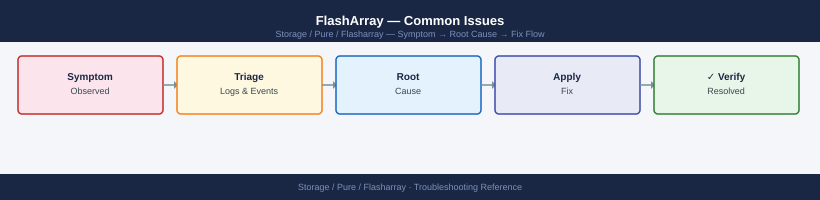

---
tags:
  - pure
  - troubleshooting
search:
  boost: 1.5
---
# FlashArray — Common Issues

<div class="kb-summary">
Detailed resolution procedures for the most frequently encountered FlashArray issues. Each section includes diagnostic commands, root cause identification, and resolution steps.

*Applies to: FlashArray Purity 6.x*
</div>


---

```d2
direction: down

symptom: Identify Symptom {shape: diamond}
diagnostic_flow: "Diagnostic Flow" {shape: rectangle}
drive_failure_and_rebuild: "Drive Failure and Rebuild" {shape: rectangle}
host_loses_all_paths_to_volumes: "Host Loses All Paths to Volumes" {shape: rectangle}
host_has_only_one_active_path_single: "Host Has Only One Active Path (Single-Path Warning)" {shape: rectangle}
activecluster_pod_mediator_unreachab: "ActiveCluster Pod Mediator Unreachable" {shape: rectangle}
activecluster_pod_out_of_sync_paused: "ActiveCluster Pod Out of Sync (Paused or Unhealthy)" {shape: rectangle}
resolution: Resolve or Escalate {shape: oval}

symptom -> diagnostic_flow: investigate
symptom -> drive_failure_and_rebuild: investigate
symptom -> host_loses_all_paths_to_volumes: investigate
symptom -> host_has_only_one_active_path_single: investigate
symptom -> activecluster_pod_mediator_unreachab: investigate
symptom -> activecluster_pod_out_of_sync_paused: investigate
diagnostic_flow -> resolution
drive_failure_and_rebuild -> resolution
host_loses_all_paths_to_volumes -> resolution
host_has_only_one_active_path_single -> resolution
activecluster_pod_mediator_unreachab -> resolution
activecluster_pod_out_of_sync_paused -> resolution
```

## Diagnostic Flow

```d2
direction: right

S: "What is the symptom?" {shape: rectangle}
A: "Host volume not visible" {shape: rectangle}
B: "Drive failure / RAID rebuilding" {shape: rectangle}
C: "Replication session behind" {shape: rectangle}
D: "Alert storm from phone-home" {shape: rectangle}
E: "Purity upgrade failed or hung" {shape: rectangle}
A1: "A1" {shape: rectangle}
A2: "Connect volume to host group — see Volume Not\nVisible on Host After Provisioning" {shape: rectangle}
A3: "Check initiator registration and rescan HBA on host" {shape: rectangle}
B1: "B1" {shape: rectangle}
B2: "P1 case immediately — do not pull drives — see\nDrive Failure and Rebuild" {shape: rectangle}
B3: "Single drive — open P2 case; monitor rebuild with\npuredrive list" {shape: rectangle}
C1: "C1" {shape: rectangle}
C2: "Restore network path; pod resyncs automatically —\nsee ActiveCluster Pod Out of Sync" {shape: rectangle}
C3: "Check mediator reachability and bandwidth saturation" {shape: rectangle}
D1: "D1" {shape: rectangle}
D2: "Address hardware or capacity alerts — see Array\nReporting High Latency" {shape: rectangle}
D3: "Check Pure1 cloud connectivity and phone-home\nproxy settings" {shape: rectangle}
E1: "E1" {shape: rectangle}
E2: "Run purearray upgrade --check and resolve blockers\n— see Purity Upgrade Hangs or Fails" {shape: rectangle}
E3: "Contact Pure Support if no progress after 30 minutes" {shape: rectangle}

S -> A
S -> B
S -> C
S -> D
S -> E
A1 -> A2
A1 -> A3
B1 -> B2
B1 -> B3
C1 -> C2
C1 -> C3
D1 -> D2
D1 -> D3
E1 -> E2
E1 -> E3
```

---

## Before you begin

- **Access:** Storage admin credentials (cluster admin or equivalent)
- **Gather first:** recent error message text, event timestamps, and affected object names
- **Scope:** confirm whether the issue affects a single object, host, cluster, or site
- **Escalation:** open a vendor support ticket before running any destructive step
- **Logging:** document each command and output — required if escalation is needed

---

## Drive Failure and Rebuild

### Symptoms
- `purealert list` shows a drive failure alert with severity `error`
- `puredrive list` shows a drive in `failed`, `recovering`, or `unhealthy` state

```d2
direction: right

A: "purealert list shows\ndrive error alert" {shape: rectangle}
B: "puredrive list\n(identify bay and state" {shape: rectangle}
C: "Drive state?" {shape: rectangle}
D: "Automatic rebuild in progress\nDo NOT pull the drive\nMonitor: puredrive list --progress" {shape: rectangle}
E: "Second drive\nalso failed?" {shape: rectangle}
F: "P1 case immediately\nDo NOT pull any drive\nAwait Pure Support guidance" {shape: rectangle}
G: "Open P2 case\nSchedule drive replacement\nArray degraded but protected" {shape: rectangle}
H: "Open P2 case — drive may fail soon\nMonitor closely\nPurity may proactively evict" {shape: rectangle}
I: "Check physical seating\nOpen support case if drive present\nbut not detected" {shape: rectangle}
J: "Rebuild complete\n(state = healthy" {shape: rectangle}
K: "Array back to full redundancy\nOpen case to schedule physical replacement" {shape: rectangle}
L: "Open support case\nDo not manually intervene" {shape: rectangle}

A -> B
B -> C
C -> D
C -> E
E -> F
E -> G
C -> H
C -> I
D -> J
J -> K
J -> L
```

### Diagnosis

```bash
# Identify the failed drive and its bay location
puredrive list

# Monitor rebuild progress on a recovering drive
puredrive list --progress

# Check if there are multiple drive failures (increases risk)
puredrive list | grep -v healthy

# Check array hardware alerts for related events
purehw list
purealert list --filter "severity='error'"
```


```text title="Expected output"
Name                    Status      Capacity  Serial
drive.0                 healthy     1.92TB    PD-ABC123XYZ001
drive.1                 healthy     1.92TB    PD-ABC123XYZ002
drive.2                 failed      1.92TB    PD-ABC123XYZ003
drive.3                 healthy     1.92TB    PD-ABC123XYZ004
drive.4                 recovering  1.92TB    PD-ABC123XYZ005
drive.5                 healthy     1.92TB    PD-ABC123XYZ006

Name                    Status      Capacity  Progress  Time_Remaining
drive.4                 recovering  1.92TB    67%       2h 14m

Name                    Status      Capacity  Serial
drive.2                 failed      1.92TB    PD-ABC123XYZ003
drive.4                 recovering  1.92TB    PD-ABC123XYZ005

Component_ID            Status      Details
psu.0                   ok          Power Supply 0
psu.1                   ok          Power Supply 1
fan.0                   warning     Fan speed degraded
fan.1                   ok          Fan 1
controller.0            ok          Controller A
controller.1            ok          Controller B

Timestamp                Severity  Component      Message
2024-01-15T09:42:18Z     error     drive.2        Drive failure detected in bay 2
2024-01-15T09:43:05Z     error     array.rebuild  Rebuild started for drive.2
2024-01-15T10:12:33Z     warning   fan.0          Fan speed below threshold
```

!!! warning "Common errors"
    **`puredrive: command not found`** — Ensure the Pure Storage CLI tools are installed and the PATH includes the Pure bin directory, or use the full path `/opt/purearray/bin/puredrive`.
    **`Error: Array unreachable or authentication failed`** — Verify network connectivity to the array management IP and confirm your credentials are valid with `pureadmin list --credentials`.
    **`purealert: invalid filter syntax`** — Use proper filter syntax with quotes: `purealert list --filter "severity=error"` (remove single quotes around the value).
### Resolution

| Scenario | Action |
|---|---|
| Single drive in `recovering` state | Purity is rebuilding automatically — no action required; monitor rebuild progress; do not pull the drive |
| Single drive in `failed` state | Open a Pure Support case to schedule a replacement; the array is degraded but data is protected (RAID-equivalent protection) |
| Two drives in `failed` state simultaneously | Open a P1 support case immediately; do not pull any drives until Pure Support authorises a replacement sequence |
| Drive in `unhealthy` state (not yet failed) | Open a P2 case; monitor closely; Purity may evict and replace the drive proactively |
| Drive rebuild stalled (progress not advancing) | Open a support case; do not attempt manual intervention on the drive |

**Never pull a drive that is in `recovering` state** — this interrupts the rebuild and may leave the array in a double-degraded state depending on the protection scheme.

After replacement, confirm rebuild completes:

```bash
# Confirm new drive is admitted and rebuilding
puredrive list
# Confirm new drive transitions from 'recovering' to 'healthy'
```


```text title="Expected output"
Name                    Status      Capacity  Serial
SSD.DAE.1.0             healthy     1.6TB     1234567890ABCDEF
SSD.DAE.1.1             healthy     1.6TB     1234567890ABCDEG
SSD.DAE.1.2             recovering  1.6TB     1234567890ABCDEH
SSD.DAE.1.3             healthy     1.6TB     1234567890ABCDEI
SSD.DAE.2.0             healthy     1.6TB     1234567890ABCDEJ
SSD.DAE.2.1             healthy     1.6TB     1234567890ABCDEK
...
```

!!! warning "Common errors"
    **`puredrive: command not found`** — Ensure you are logged into the FlashArray management interface or have the Pure Storage CLI tools installed and in your PATH.
    **`Error: Invalid credentials or insufficient permissions`** — Verify your user account has administrative privileges on the FlashArray and re-authenticate if necessary.
---

## Host Loses All Paths to Volumes

### Symptoms
- Application I/O errors or storage timeouts on one or more hosts
- Multipath driver reports no active paths to the device
- `purehost list` shows a host with no active connections

### Diagnosis

```bash
# Check host path status on the array
purehost list --connection

# Check FC port status on the array
pureport list --type fc
pureport list --initiator

# Check which host initiators are registered
purehost list --wwn   # for FC
purehost list --iqn   # for iSCSI

# Check for array-side alerts that could explain path loss
purealert list

# Check controller health — a controller restart causes brief path interruption
purearray list --controller
```


```text title="Expected output"
Name     Address          Connected  
host-prod-01  192.168.1.45     true       
host-prod-02  192.168.1.46     true       
host-dev-01   192.168.1.50     false      
...

Name     Speed  Status  
fc.0     16Gbps online  
fc.1     16Gbps online  
fc.2     16Gbps offline 
fc.3     16Gbps online  

Initiator                          Host           
50:00:14:40:5a:2b:c1:d0           host-prod-01   
50:00:14:40:5a:2b:c1:d1           host-prod-02   
50:00:14:40:5a:2b:c1:e2           host-dev-01    

WWN                    Host Name        
50:00:14:40:5a:2b:c1:d0  host-prod-01   
50:00:14:40:5a:2b:c1:d1  host-prod-02   

Severity  Code    Message                              Created              
warning   PFC001  FC port fc.2 link down              2024-01-15T09:23:44Z 
info      HCN002  Host host-dev-01 offline            2024-01-15T08:15:12Z 

Controller  Status   Model          Version        
CT0         healthy  FA-m70         8.2.4.1234     
CT1         healthy  FA-m70         8.2.4.1234
```

!!! warning "Common errors"
    **`Error: connection failed to array at 192.168.1.100`** — Verify the array management IP is reachable and the Pure1 REST API service is running with `ssh <array-mgmt-ip> purealert list`.
    **`Error: invalid option '--connection'`** — Use `purehost list` without the `--connection` flag; connection status is shown in the output by default.
    **`Error: unauthorized: insufficient privileges`** — Ensure your Pure1 API token has read permissions for host and port objects; regenerate the token in Pure1 if needed.
**Host-side diagnostics (Linux):**

```bash
# Check multipath device status
multipath -ll

# Check DM-Multipath path status
multipathd show paths

# Check HBA port status
systool -c fc_host -v | grep -E "(host_name|port_name|port_state)"

# iSCSI session status
iscsiadm -m session
```


```text title="Expected output"
mpatha (360a98000534d41386b324e6c41786945) dm-0 PURE,FlashArray
size=10T features='1 queue_if_no_path' hwhandler='1 alua' wp=rw
|-+- policy='service-time 0' prio=50 status=active
| |- 2:0:0:1 sdb 8:16 active ready running
| `- 3:0:0:1 sdc 8:32 active ready running
`-+- policy='service-time 0' prio=10 status=enabled
  |- 4:0:0:1 sdd 8:48 active ready running
  `- 5:0:0:1 sde 8:64 active ready running

hcil dev dev_name host_state
2:0:0:1  sdb 360a98000534d41386b324e6c41786945 active ready
3:0:0:1  sdc 360a98000534d41386b324e6c41786945 active ready
4:0:0:1  sdd 360a98000534d41386b324e6c41786945 active ready
5:0:0:1  sde 360a98000534d41386b324e6c41786945 active ready

  Attribute: host_name
    Value: host2
  Attribute: port_name
    Value: 50:00:14:40:5b:2d:a0:01
  Attribute: port_state
    Value: Online

tcp: [192.168.1.45]:3260,[1] 192.168.1.100:3260 iqn.1991-05.com.purestorage:flasharray.1234567890abcdef
tcp: [192.168.1.46]:3260,[2] 192.168.1.101:3260 iqn.1991-05.com.purestorage:flasharray.1234567890abcdef
```

!!! warning "Common errors"
    **`multipath: command not found`** — Install device-mapper-multipath package with `yum install device-mapper-multipath` or `apt-get install multipath-tools`.
    **`multipathd: unrecognized command 'show paths'`** — Use `multipathd show topology` or `multipathd show maps` instead; older versions may not support 'show paths'.
    **`iscsiadm: No active sessions`** — Verify iSCSI target discovery with `iscsiadm -m discovery -t st -p <target_ip>` and log in with `iscsiadm -m node -T <iqn> -p <target_ip> -l`.
**Host-side diagnostics (Windows):**

```powershell
# Check MPIO paths
Get-MSDSMSupportedHW
mpclaim -s -d    # MPIO device path status

# Check iSCSI sessions
Get-IscsiSession
```

### Resolution by Root Cause

| Root Cause | Identification | Fix |
|---|---|---|
| FC zone removed or misconfigured | Array port WWN missing from zone; `pureport list --initiator` does not show the host | Restore the zone on the FC switch; confirm single-initiator/single-target zone design |
| Host HBA failed | No paths on both ports; host-side HBA driver shows error | Replace HBA; re-register WWNs on array: `purehost setattr <host> --addwwnlist <new_wwn>` |
| Array FC port down | `pureport list --type fc` shows port in `down` state | Check SFP and cable; open support case if port remains down |
| Volume disconnected accidentally | `purehost list --connection` does not show the volume | Reconnect: `purehgroup connect <hgroup> --vol <vol>` |
| Controller restart during upgrade (NDU) | Controller shows `not ready` briefly; paths restore automatically | Expected behaviour for single-path hosts; verify multipathing; paths restore when controller returns |
| iSCSI network routing changed | Ping from host to array iSCSI IP fails | Restore routing; verify iSCSI VLANs are intact |

---

## Host Has Only One Active Path (Single-Path Warning)

### Symptoms
- Multipath driver on the host shows only one active path instead of the expected two or more
- `purealert list` may show a host-specific alert about degraded path count

### Diagnosis

```bash
# Confirm expected path count per host
purehost list --connection

# Identify which paths are active/standby
pureport list --initiator
```


```text title="Expected output"
Name             Address          Wwn                           Connection
host-prod-01    192.168.1.45     50:00:09:73:12:ab:cd:ef       eth0
host-prod-02    192.168.1.46     50:00:09:73:12:ab:cd:f0       eth1
host-prod-03    192.168.1.47     50:00:09:73:12:ab:cd:f1       eth0
host-prod-04    192.168.1.48     50:00:09:73:12:ab:cd:f2       eth1

Initiator                         PortName                      Status
host-prod-01:iqn.1991-05.com     pureport-fc.1a               active
host-prod-01:iqn.1991-05.com     pureport-fc.1b               active
host-prod-02:iqn.1991-05.com     pureport-fc.2a               active
host-prod-02:iqn.1991-05.com     pureport-fc.2b               standby
host-prod-03:iqn.1991-05.com     pureport-fc.3a               active
host-prod-04:iqn.1991-05.com     pureport-fc.4a               active
host-prod-04:iqn.1991-05.com     pureport-fc.4b               standby
```

!!! warning "Common errors"
    **`Error: Connection refused — verify the Pure Storage management IP is reachable and the CLI credentials are configured correctly.`** — Test connectivity with `ping` to the array management IP and confirm credentials in `~/.purerc`.
    **`Error: No such host — ensure the hostname exists in the Pure Storage array inventory.`** — Run `purehost list` to confirm the host is registered on the array before querying its paths.
    **`Error: Authentication failed — check that your Pure Storage API token or username/password has not expired.`** — Regenerate the API token in the Pure Storage GUI or re-authenticate using `pureadmin login`.
### Resolution

1. Identify which HBA or port is missing paths — compare expected ports (CT0.FC0 and CT1.FC0 for a two-path design) against `pureport list --initiator`
2. Check the FC switch port connected to the missing path — look for port errors, offline ports, or zone configuration issues
3. If the missing path is on CT1 (the secondary controller), confirm CT1 is in `ready` state: `purearray list --controller`
4. If the path was lost due to a zoning change, restore the zone and verify the initiator appears in `pureport list --initiator`
5. Rescan multipath on the host after restoring the path

**Resolution is urgent:** a host with one active path is one failure away from complete I/O interruption. Restore the second path before performing any maintenance on the array.

---

## ActiveCluster Pod Mediator Unreachable

### Symptoms
- `purealert list` shows a mediator connectivity alert
- `purepod list --mediator` shows mediator as `unreachable` or `unknown`

### Diagnosis

```bash
# Check mediator status for all pods
purepod list --mediator

# Confirm pod is still replicating despite mediator loss
purepod list --replicating

# Check if mediator is the Pure1-hosted mediator or a custom on-premises instance
purepod list --mediator oracle-pod
# Note the mediator IP — if it is a Pure1 cloud address, the issue is internet connectivity
```


```text title="Expected output"
Name                          Mediator Status    Mediator IP         Pod ID
oracle-pod                    UNAVAILABLE        203.0.113.42        5f8c9e2a-b441-4d2e-9c1f-7a3b2e8d1c5a
finance-pod                   AVAILABLE          203.0.113.43        8b2f4c1a-9e3d-4a7b-8c2e-5d9f1a3b6c2e
backup-pod                    UNAVAILABLE        198.51.100.15       2c5a8f1e-7d3b-4a9c-6e2f-1b8d3a5c7e9f

Name                          Replication Status  Last Sync           Pod ID
oracle-pod                    REPLICATING         2024-01-15 14:32:18 5f8c9e2a-b441-4d2e-9c1f-7a3b2e8d1c5a
finance-pod                   REPLICATING         2024-01-15 14:35:22 8b2f4c1a-9e3d-4a7b-8c2e-5d9f1a3b6c2e
backup-pod                    REPLICATING         2024-01-15 14:28:45 2c5a8f1e-7d3b-4a9c-6e2f-1b8d3a5c7e9f

Name                          Mediator Status    Mediator IP         Pod ID
oracle-pod                    UNAVAILABLE        203.0.113.42        5f8c9e2a-b441-4d2e-9c1f-7a3b2e8d1c5a
```

!!! warning "Common errors"
    **`Error: Unable to connect to mediator at 203.0.113.42:443`** — Verify network connectivity to the mediator IP and confirm firewall rules allow outbound HTTPS traffic on port 443.
    **`Error: Pod 'oracle-pod' not found or offline`** — Ensure the pod name is correct and the pod management interface is reachable; check `purepod status oracle-pod` for detailed health information.
### Resolution

**Important:** A mediator outage alone does not stop synchronous replication. The mediator is only required as a tiebreaker if the inter-array replication link also fails (split-brain). If the mediator is unreachable but the inter-array link is healthy, the pod continues replicating normally.

| Mediator Type | Resolution |
|---|---|
| Pure1-hosted mediator | Verify outbound HTTPS (port 443) from both arrays to `*.purestorage.com`; check proxy configuration: `purearray list --proxy` |
| On-premises mediator VM | Check VM health and network connectivity; verify the mediator service is running; check firewall rules |
| Both mediator and inter-array link failed | This is a split-brain scenario — `purepod list` will show the pod as `paused` on one or both arrays; see split-brain resolution below |

**Do not attempt to force-promote a pod during split-brain without Pure Support guidance** — incorrect promotion can result in data divergence between the two sites.

---

## ActiveCluster Pod Out of Sync (Paused or Unhealthy)

### Symptoms
- `purepod list` shows pod status as `paused` or `unhealthy`
- `purealert list` shows replication error alert
- Hosts at one site may be serving I/O on stale data

```d2
direction: right

A: "purepod list shows\npod paused / unhealthy" {shape: rectangle}
B: "Check inter-array\nreplication link\npurenetwork list" {shape: rectangle}
C: "Replication\nlink up?" {shape: rectangle}
D: "Restore network path\n(routing / VLAN / firewall" {shape: rectangle}
E: "Check mediator\npurepod list --mediator" {shape: rectangle}
F: "Mediator\nreachable?" {shape: rectangle}
G: "Verify HTTPS outbound port 443\nto mediator IP from both arrays\nCheck proxy: purearray list --proxy" {shape: rectangle}
H: "Note: replication continues\nwithout mediator if inter-array\nlink is healthy" {shape: rectangle}
I: "Pod paused\non both arrays?" {shape: rectangle}
J: "Do NOT force-promote\nwithout Pure Support\nContact Pure Support P1" {shape: rectangle}
K: "Check replica-link state\npurepod replica-link list" {shape: rectangle}
L: "Resume if manually paused\npurepod replica-link resume\n--remote array --remote-pod pod" {shape: rectangle}

A -> B
B -> C
C -> D
C -> E
E -> F
F -> G
G -> H
F -> I
I -> J
I -> K
K -> L
```

### Diagnosis

```bash
# Check pod status and member arrays
purepod list oracle-pod

# Check replica-link status
purepod replica-link list

# Check replication network interface status
pureport list --type eth
purenetwork list

# Check for bandwidth saturation on replication interface
purearray monitor --bandwidth
```


```text title="Expected output"
Name             Status   Mediator   Arrays
oracle-pod       Online   10.20.1.5  flasharray-dc1,flasharray-dc2

Local Array      Remote Array         Status      Lag (ms)
flasharray-dc1   flasharray-dc2       Synced      12
flasharray-dc2   flasharray-dc1       Synced      15

Name      Wwn                Port   Speed   Status
eth0      50:00:09:73:12:ab  1a     10Gb    Online
eth1      50:00:09:73:12:cd  1b     10Gb    Online
eth2      50:00:09:73:12:ef  2a     10Gb    Online

Name              Subnet           MTU    Status
replication-net   10.20.1.0/24     9000   Up
management-net    10.10.1.0/24     1500   Up

Array              Bandwidth (Mbps)  Usage (%)  Peak (Mbps)
flasharray-dc1     9800              78         9950
flasharray-dc2     9750              81         9950
```

!!! warning "Common errors"
    **`Error: Pod 'oracle-pod' not found`** — Verify the pod name with `purepod list` and ensure you have network connectivity to the mediator.
    **`Error: Connection timeout on replica-link list`** — Check that the replication network interface (eth0/eth1) is online and the remote array is reachable via `ping 10.20.1.x`.
    **`Error: Bandwidth threshold exceeded (>90%)`** — Reduce replication load by throttling snapshots, adding additional replication links, or scheduling replication during off-peak hours.
### Resolution

| Root Cause | Identification | Fix |
|---|---|---|
| Replication network link down | Replication interface shows `down`; ping to remote array replication IP fails | Restore network path; pod will resync automatically when link comes back |
| Replication bandwidth saturated | Array monitor shows bandwidth at 100% of replication interface capacity | Identify the cause of the spike (large data change); increase replication interface bandwidth or rate-limit the source workload temporarily |
| Split-brain event | Pod paused on both arrays; mediator and inter-array link both lost | Contact Pure Support; manual pod promotion sequence required to resolve |
| Pod manually paused | Replica-link is paused | Resume: `purepod replica-link resume <pod> --remote <array> --remote-pod <pod>` |

After resolving the network issue, confirm resync:

```bash
# Confirm pod returns to replicating state
purepod list --replicating oracle-pod

# Monitor resync progress via replica-link
purepod replica-link monitor --replication
```


```text title="Expected output"
Name                    Status          Replication-Status    Last-Sync
oracle-pod              Available       Replicating           2024-01-15T09:42:31Z

Replica Link: oracle-pod → dr-site-array (10.20.50.12)
Direction: Outbound
Status: Active
Bytes Synced: 847.3 GB / 1.2 TB (70.6%)
Sync Rate: 285 MB/s
Est. Time Remaining: 8m 42s
Last Update: 2024-01-15T09:47:18Z
```

!!! warning "Common errors"
    **`Error: Pod 'oracle-pod' not found or not in replicating state`** — Verify the pod name matches exactly and confirm replication was initiated with `purepod create-replica-link`.
    **`Error: No active replica-link found for monitoring`** — Ensure the replica-link exists and is connected by running `purepod replica-link list` to check status.
---

## Unexpected Capacity Growth

### Symptoms
- `purearray list --space` shows capacity growing faster than expected
- `purealert list` shows a capacity threshold alert

### Diagnosis

```bash
# Check overall capacity and data reduction ratio
purearray list --space

# Identify top capacity consumers (volumes)
purevol list --space --sort size-

# Identify top snapshot capacity consumers
puresnap list --space --sort size-

# Check protection group retention settings
purepgroup list --schedule

# Count snapshots per protection group
puresnap list | awk '{print $1}' | cut -d. -f1 | sort | uniq -c | sort -rn | head -10
```


```text title="Expected output"
Name                          Capacity    Used      Data Reduction
flasharray-prod-01            100.0T      47.3T     4.2x
Snapshots                     12.5T
System                        2.1T

Name                          Size        Provisioned Snapshots
volume-db-prod-01             18.5T       20.0T      847
volume-backup-archive         12.3T       15.0T      1203
volume-logs-tier2             8.7T        10.0T      412
volume-cache-layer            4.2T        5.0T       156
volume-temp-workspace         3.6T        4.0T       89
...

Name                          Size        Snapshots
pg-daily-backup.1703001600    2.1T        156
pg-weekly-archive.1702396800  1.8T        42
pg-monthly-retain.1701792000  1.5T        12
pg-hourly-prod.1703088000     0.9T        287
...

Name                          Schedule              Retention
pg-daily-backup               daily@22:00           30 days
pg-weekly-archive             weekly@02:00          90 days
pg-monthly-retain             monthly@03:00         365 days
pg-hourly-prod                hourly                7 days

    287 pg-hourly-prod
    156 pg-daily-backup
     42 pg-weekly-archive
     12 pg-monthly-retain
      8 pg-ad-hoc-test
      5 pg-disaster-recovery
      3 pg-compliance-hold
      2 pg-dev-sandbox
      1 pg-migration-temp
```

!!! warning "Common errors"
    **`pure: command not found`** — Ensure the Pure Storage CLI tools are installed and the PATH includes the installation directory (typically `/opt/purearray/bin`).
    **`Error: Invalid credentials or unable to connect to flasharray-prod-01`** — Verify the array hostname/IP is reachable and run `pureauthenticate` to establish a valid session token.
    **`Error: Insufficient privileges to execute 'list' command`** — Confirm your Pure user account has read permissions for capacity and snapshot objects; contact your Pure administrator to grant the necessary role.
### Resolution

| Root Cause | Fix |
|---|---|
| Snapshot schedule creating more snaps than retention deletes | Reduce `snap-per-day` or `snap-frequency` in the PG schedule; `purepgroup schedule <pg> --snap-per-day 4` |
| `snap-for-days` set too long | Reduce retention window; old snapshots will expire on their next scheduled check |
| No expiry on manual snapshots | Manually eradicate old on-demand snapshots: `puresnap eradicate <snap>` |
| Volume thin-provisioning consuming more than expected | Identify high-growth volumes; check application for unexpected write amplification or log accumulation |
| Data reduction ratio dropped | Check for workload changes — encrypted data does not deduplicate or compress; confirm no misconfigured application is writing pre-compressed or pre-encrypted data |

**Eradicating old snapshots:**

```bash
# Eradicate a specific snapshot (destructive — cannot undo)
puresnap eradicate prod-oracle-pg.premigration-20250101

# List all pending (destroyed but not yet eradicated) snapshots
puresnap list --pending

# Eradicate all pending snapshots (use with caution)
puresnap eradicate --all
```


```text title="Expected output"
Eradicating snapshot prod-oracle-pg.premigration-20250101...
Snapshot eradicated successfully. Space reclaimed: 847.3 GB

Pending snapshots:
Name                                    Created              Destroyed            Space
prod-oracle-pg.premigration-20241215    2024-12-15 14:22:10  2025-01-08 09:15:33  156.2 GB
prod-oracle-pg.premigration-20241220    2024-12-20 11:45:22  2025-01-09 16:42:18  203.8 GB
prod-mysql-backup.old-restore-20241201  2024-12-01 08:30:15  2025-01-07 13:20:44  89.5 GB

Eradicating all pending snapshots...
Eradicated 3 snapshots. Total space reclaimed: 449.5 GB
```

!!! warning "Common errors"
    **`Snapshot not found: prod-oracle-pg.premigration-20250101`** — Verify the snapshot name with `puresnap list` and confirm it exists before eradication.
    **`Permission denied: insufficient privileges to eradicate snapshots`** — Ensure your user account has array administrator or snapshot eradication role assigned.
    **`Cannot eradicate snapshot: in use by replication or clone`** — Wait for any active replication jobs to complete or delete dependent clones before attempting eradication.
---

## Purity Upgrade Hangs or Fails

### Symptoms
- `purearray upgrade --exec` was run but upgrade is not progressing
- `purearray list` shows controllers at different Purity versions after expected completion time
- `purealert list` shows an upgrade-related alert

### Diagnosis

```bash
# Check upgrade status
purearray upgrade --status

# Check if both controllers are running the same version
purearray list --controller

# Check for active alerts that may be blocking upgrade
purealert list

# Check drive health — drive rebuilds during upgrade can cause delays
puredrive list
```


```text title="Expected output"
=== Upgrade Status ===
Upgrade Status: IDLE
Current Version: 6.4.2
Target Version: 6.4.2
Last Upgrade: 2024-01-15 03:22:14 PST
Upgrade Progress: 100%

=== Controller Status ===
Name          Version    Status    Model
controller-0  6.4.2      OK        FA-m70
controller-1  6.4.2      OK        FA-m70

=== Active Alerts ===
Severity  Code    Message                              Timestamp
warning   PUR-1847 Drive bay 2.3 temperature elevated  2024-01-18 14:32:01
info      PUR-2104 Snapshot retention policy updated   2024-01-18 10:15:22

=== Drive Health ===
Bay       Serial          Capacity  Status    Rebuild%
1.1       SN-FA-8K2L9P    1.92TB    OK        —
1.2       SN-FA-7M4Q1R    1.92TB    OK        —
2.3       SN-FA-9N5X2T    1.92TB    REBUILDING 67
3.1       SN-FA-6K8P3W    1.92TB    OK        —
...
```

!!! warning "Common errors"
    **`purearray: command not found`** — Ensure the Pure Storage CLI tools are installed and the PATH includes the Pure bin directory (typically `/opt/purearray/bin`).
    **`Error: Unable to connect to array at <ip>. Connection refused`** — Verify the array management IP is reachable and the management interface is online with `ping` and `ssh`.
    **`Error: Authentication failed. Invalid credentials`** — Confirm your Pure Storage credentials are correct and your user account has sufficient privileges to run upgrade commands.
### Resolution

- **Do not manually reboot controllers** during an upgrade — this can corrupt the Purity state
- If the upgrade appears stuck (no progress for > 30 minutes): contact Pure Support with the output of `purearray upgrade --status` and `purealert list`
- If the upgrade failed pre-check: run `purearray upgrade --check` to identify the specific blocker; resolve the blocking condition and re-run `purearray upgrade --exec`
- Common pre-check blockers: active drive rebuild, critical alerts unresolved, single-path hosts, insufficient capacity for the upgrade staging area

---

## Volume Not Visible on Host After Provisioning

### Symptoms
- Volume was created and connected on the array but the host OS does not see the device
- Multipath driver does not show the new LUN

### Diagnosis

```bash
# Verify the volume exists and is not in destroyed state
purevol list prod-new-vol-01

# Verify the volume is connected to the host or host group
purehost list prod-oracle-01 --connection
purehgroup list prod-oracle-cluster --connection

# Verify the host WWN/IQN is registered on the array
purehost list prod-oracle-01 --wwn   # for FC
purehost list prod-oracle-01 --iqn   # for iSCSI

# Confirm the host is in the correct host group
purehgroup list prod-oracle-cluster
```


```text title="Expected output"
Name                  Size      Source  Provisioned  Snapshots  Hosts  
prod-new-vol-01       1.0T      -       847.3G       0          1      

Host: prod-oracle-01
  Connection: prod-oracle-cluster
  Volume: prod-new-vol-01 (connected)

Host Group: prod-oracle-cluster
  Hosts: prod-oracle-01, prod-oracle-02, prod-oracle-03
  Volumes: prod-new-vol-01, prod-new-vol-02

Host: prod-oracle-01
  WWN: 50:00:14:40:12:a8:c0:01

Host: prod-oracle-01
  IQN: iqn.1991-05.com.example:prod-oracle-01.storage

Host Group: prod-oracle-cluster
  Members: prod-oracle-01, prod-oracle-02, prod-oracle-03
  Connected Volumes: 3
```

!!! warning "Common errors"
    **`Error: Volume 'prod-new-vol-01' not found`** — Verify the volume name spelling and that it exists with `purevol list | grep prod-new-vol-01`.
    **`Error: Host 'prod-oracle-01' is not a member of host group 'prod-oracle-cluster'`** — Add the host to the host group using `purehgroup addhostmember prod-oracle-cluster --host prod-oracle-01`.
    **`Error: Connection refused — unable to reach Pure array at <ip>`** — Verify network connectivity and array IP address, and confirm your Pure credentials are set in `PURE_APITOKEN` and `PURE_MANAGEMENT_IP` environment variables.
### Resolution Steps

1. Confirm volume is connected: `purehost list <host> --connection` — if not listed, connect it:
   ```bash
   purehgroup connect prod-oracle-cluster --vol prod-new-vol-01
   ```

2. Confirm the host WWN/IQN matches what is registered on the array:
   - On the host, get the HBA WWN: `cat /sys/class/fc_host/host*/port_name` (Linux) or Device Manager (Windows)
   - On the array: `purehost list <host> --wwn`
   - If they do not match: `purehost setattr <host> --addwwnlist <correct_wwn>`

3. Rescan for new LUNs on the host:
   - Linux: `echo "- - -" > /sys/class/scsi_host/hostX/scan` or `rescan-scsi-bus.sh`
   - Windows: Disk Management > Action > Rescan Disks (or `diskpart > rescan`)
   - ESXi: vCenter > Storage > Rescan (or `esxcli storage core adapter rescan --adapter vmhbaX`)

4. Check multipath driver has picked up the new device:
   - Linux: `multipath -ll` — look for the new device
   - Windows: `mpclaim -s -d`

---

## Array Reporting High Latency

### Symptoms
- Application response times degraded
- `purearray monitor` shows read or write latency above 1 ms
- `purealert list` may show a performance alert

### Diagnosis

```bash
# Real-time performance snapshot
purearray monitor
purearray monitor --latency
purearray monitor --iops

# Identify top volume consumers
purevol monitor --latency
purevol monitor --iops

# Check for drive rebuilds consuming controller resources
puredrive list
puredrive list --progress

# Check array capacity (high capacity > 90% increases write amplification)
purearray list --space

# Check for active QoS limits that may be creating queue depth
purevol list <vol> --space   # check bw_limit and iops_limit fields
```


```text title="Expected output"
=== Array Performance ===
Name          Latency(ms)  Read_IOPS  Write_IOPS  Total_IOPS
flasharray-1  2.3          45821      28934       74755
Latency_P99:  8.7ms

=== Volume Latency ===
Name                Latency(ms)  Read_Lat  Write_Lat
prod-db-01          1.8          1.2       2.4
prod-db-02          3.2          2.1       4.8
backup-tier-03      0.9          0.6       1.3

=== Drive Status ===
Name     Serial         Capacity  Status    Progress
SSD.1    PFE2A1B2C3D4E  1.92TB    healthy   —
SSD.2    PFE2A1B2C3F5G  1.92TB    rebuilding 34%
SSD.3    PFE2A1B2C3H6I  1.92TB    healthy   —

=== Array Capacity ===
Name          Total(TB)  Used(TB)  Available(TB)  Used%
flasharray-1  50.0       47.2      2.8            94.4%

=== Volume QoS Limits ===
Name         Capacity  bw_limit(MB/s)  iops_limit  Status
prod-db-01   2.0TB     500             10000       active
prod-db-02   1.5TB     unlimited       unlimited   —
```

!!! warning "Common errors"
    **`purearray: command not found`** — Ensure the Pure Storage CLI tools are installed and the PATH includes the installation directory (typically `/opt/purearray/bin`).
    **`Error: Array unreachable at <ip_address>`** — Verify network connectivity to the array management IP and confirm credentials are set via `purearray login <array_ip>`.
    **`Error: Permission denied - insufficient privileges`** — Confirm your user account has read permissions on the array; contact your Pure Storage administrator to grant monitoring access.
### Resolution

| Root Cause | Fix |
|---|---|
| Drive rebuild in progress | Rebuild increases controller load temporarily; latency should return to normal after rebuild completes; open a support case if latency is critically high |
| Noisy neighbour workload | Apply QoS limit to the high-consumer volume: `purevol setattr prod-etl-vol --iops-limit 10000` |
| Array capacity above 90% | Free capacity by eradicating expired snapshots or expanding; high capacity causes increased write amplification |
| Workload is genuinely exceeding array capacity | Review Pure1 capacity planning data; consider workload redistribution or array upgrade |
| Queue depth spike from host | Check host application for runaway queries or batch jobs generating excessive I/O |

---

## Controller Shows `not ready` or Missing

### Symptoms
- `purearray list --controller` shows one controller in `not ready` or `offline` state
- `purealert list` shows a controller-related critical alert
- This is a P1 incident

### Immediate Actions

```bash
# Confirm which controller is affected and current role distribution
purearray list --controller

# Confirm surviving controller is serving I/O (check for active alerts)
purealert list --filter "severity='error'"

# Check volume access from the host side — are hosts still serving I/O?
purehost list --connection
```


```text title="Expected output"
Name          Status    Mode      Version       
controller-0  Online    Primary   6.4.2.1234    
controller-1  Online    Secondary 6.4.2.1234    

id     object_type  severity  code              message                                    created_at            
1847   array        error     CTRL_FAILOVER     Controller 0 experienced unplanned failover 2024-01-15T09:23:14Z  
2156   array        error     CACHE_DEGRADED    Write cache operating in degraded mode     2024-01-15T09:23:45Z  

Name           Address          Status    I/O_Ops  Latency_ms  Connected_Volumes
host-prod-01  192.168.1.45     Connected 8542     2.3         vol-db-01, vol-db-02
host-prod-02  192.168.1.46     Connected 12104    1.8         vol-app-01, vol-app-02
host-backup   192.168.1.50     Connected 342      4.1         vol-backup-01
host-dev-01   192.168.1.55     Disconnected 0      —           —
...
```

!!! warning "Common errors"
    **`Error: Unable to connect to array management interface`** — Verify network connectivity to the array's management IP and confirm firewall rules allow port 443.
    **`Error: Authentication failed - invalid credentials`** — Ensure your Pure Storage API token is current and has not expired; regenerate if necessary.
**Do not:**
- Reboot the surviving controller
- Manually power cycle the array
- Replace any hardware without Pure Support authorisation

**Do:**
- Open a P1 support case immediately — provide `purearray list --controller` output, `purealert list` output, and the diagnostic bundle
- Collect the diagnostic bundle: `purediag --output /tmp/diag_$(date +%Y%m%d_%H%M).tgz`
- Call the Pure Support P1 hotline directly (do not wait for email response)
- Confirm from the host side that I/O is continuing on surviving paths — if hosts are down, this is a full outage

**Expected behaviour during normal controller failure:**
- Hosts with proper multipathing (two paths, one per controller) experience no I/O interruption
- The failed controller will attempt to reboot and rejoin automatically
- `purearray list --controller` will show the recovering controller return to `ready` status within 5–15 minutes for a software-initiated restart
- Hardware failures take longer and require Pure field service

---

## Verify resolution

- Confirm the original symptom no longer occurs
- Check logs for any residual errors related to the issue
- Monitor for 10–15 minutes to confirm the fix is stable

---

## See also

- [FlashArray — Diagnostics](../diagnostics/)
- [FlashArray — Escalation](../escalation/)
- [FlashArray — Health Checks](../../operations/health-checks/)
