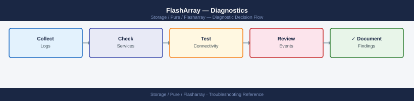
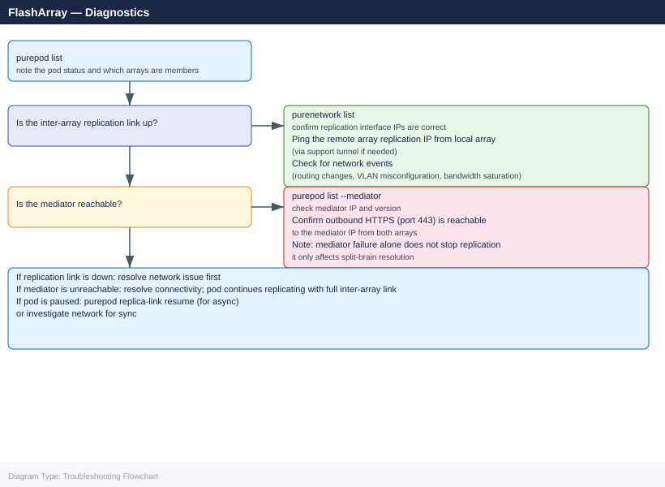
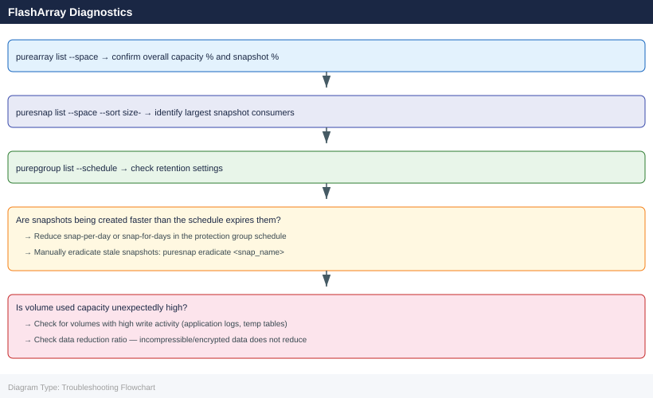

---
tags:
  - pure
  - troubleshooting
search:
  boost: 1.5
description: "FlashArray diagnostic commands: run the first-response sequence (purealert list, purearray list --controller, puredrive list) to identify the failure..."
---
# FlashArray — Diagnostics

<div class="kb-summary">
FlashArray diagnostic commands: run the first-response sequence (<code>purealert list</code>, <code>purearray list --controller</code>, <code>puredrive list</code>) to identify the failure domain, inspect controller and hardware component health with <code>purehw list</code>, check drive rebuild with <code>puredrive list --progress</code>, verify FC port state and host paths with <code>pureport list</code> and <code>purehost list --connection</code>, investigate performance with <code>purearray monitor --latency</code>, check ActiveCluster pod and mediator state with <code>purepod list --mediator</code>, and collect a diagnostic bundle with <code>purediag --output</code>.

*Applies to: FlashArray Purity 6.x*
</div>


```d2
direction: right

A: "FlashArray Issue" {shape: rectangle}
B: "purealert list: find failure domain\npurearray list --controller: CTs" {shape: rectangle}
C: "C" {shape: rectangle}
D: "purearray list --controller: state\npurehw list --type ct: component" {shape: rectangle}
E: "puredrive list: drive states\npuredrive list --progress: rebuild" {shape: rectangle}
F: "purehost list --connection: paths\npureport list --type fc: port state" {shape: rectangle}
G: "purearray monitor: latency\npurevol monitor --latency: volumes" {shape: rectangle}
H: "purepod list: pod status + mediator\npurepgroup list --replication" {shape: rectangle}
I: "purearray list --space: capacity\npuresnap list --space: consumers" {shape: rectangle}
J: "J" {shape: rectangle}
K: "Open P1 case immediately\nHold: wait for Pure Support auth" {shape: rectangle}
L: "Monitor for recovery\nVerify host I/O on surviving CT" {shape: rectangle}
M: "M" {shape: rectangle}
N: "Open support case\nHold: wait for Pure Support auth" {shape: rectangle}
O: "Monitor puredrive list --progress\nDo not interrupt rebuild" {shape: rectangle}
P: "pureport list --initiator: visible?\nVerify FC zone: correct WWN pair" {shape: rectangle}
Q: "purevol monitor: noisy neighbour\npurearray list --space: above 90%" {shape: rectangle}
R: "Check reachability to remote array\npurepod list --mediator: connect" {shape: rectangle}
S: "purediag --send or --output .tgz\nOpen Pure Support case with bundle" {shape: rectangle}

A -> B
C -> D
C -> E
C -> F
C -> G
C -> H
C -> I
J -> K
J -> L
M -> N
M -> O
F -> P
G -> Q
H -> R
K -> S
L -> S
N -> S
O -> S
P -> S
Q -> S
R -> S
I -> S
```

```d2
direction: down

symptom: Identify Symptom {shape: diamond}
step_1_firstresponse_sequence: "Step 1 — First-response sequence" {shape: rectangle}
step_2_alert_triage: "Step 2 — Alert triage" {shape: rectangle}
step_3_controller_diagnostics: "Step 3 — Controller diagnostics" {shape: rectangle}
step_4_drive_diagnostics: "Step 4 — Drive diagnostics" {shape: rectangle}
step_5_port_and_connectivity_diagnos: "Step 5 — Port and connectivity diagnostics" {shape: rectangle}
step_6_host_and_volume_connectivity: "Step 6 — Host and volume connectivity" {shape: rectangle}
resolution: Resolve or Escalate {shape: oval}

symptom -> step_1_firstresponse_sequence: investigate
symptom -> step_2_alert_triage: investigate
symptom -> step_3_controller_diagnostics: investigate
symptom -> step_4_drive_diagnostics: investigate
symptom -> step_5_port_and_connectivity_diagnos: investigate
symptom -> step_6_host_and_volume_connectivity: investigate
step_1_firstresponse_sequence -> resolution
step_2_alert_triage -> resolution
step_3_controller_diagnostics -> resolution
step_4_drive_diagnostics -> resolution
step_5_port_and_connectivity_diagnos -> resolution
step_6_host_and_volume_connectivity -> resolution
```

## Before you begin

- **Access:** SSH to the FlashArray management IP as `pureuser` or cluster admin; Pure1 portal access for historical analytics and AI recommendations
- **Gather first:** `purealert list` (failure domain and severity), `purearray list` (version and model), `purearray list --controller` (CT0/CT1 status), and the specific symptom — host I/O error, alert text, drive state, or replication lag
- **Scope:** confirm whether the issue affects a single host (connectivity / zoning), a volume (performance, space), a drive (hardware fault), or the entire array (controller fault, capacity) — `purealert list` maps directly to the affected component

---

## Step 1 — First-response sequence

When an incident is reported, run these commands in order. Capture all output for the support case.

```bash
# 1. Check array reachability and Purity version
purearray list

# 2. Check controller health (critical — confirm both controllers are up)
purearray list --controller

# 3. Check all active alerts — this is the fastest path to the failure domain
purealert list

# 4. Check drive health — most common hardware event
puredrive list

# 5. Check array space — rule out capacity as a contributing factor
purearray list --space

# 6. Check pod (ActiveCluster) state — replication events are high-impact
purepod list

# 7. Check host connectivity — are hosts affected?
purehost list
purehost list --connection

# 8. Check port status — identify any downed FC or Ethernet ports
pureport list

# 9. Real-time performance snapshot
purearray monitor

# 10. Collect and save full diagnostic bundle for support
purediag --output /tmp/fa_diag_$(date +%Y%m%d_%H%M).tgz
```


```text title="Expected output"
Name          Address      Version
flasharray-1  192.168.1.10 6.4.2
flasharray-2  192.168.1.11 6.4.2

Name          Status  Model
CT0           Healthy FA-405
CT1           Healthy FA-405

Name                    Severity  Code      Message
vol-snapshot-expired    Warning   PSNAP001  Snapshot retention exceeded on volume prod-db-01
repl-lag-high           Critical  REPL002   Replication lag 45 seconds on pod-us-east
cache-hit-low           Warning   CACHE001  L3 cache hit ratio 62% (threshold: 75%)

Name      Status  Capacity  Serial
SSD.0     Healthy 1.92TB    PURE1A2B3C4D5E6F
SSD.1     Healthy 1.92TB    PURE1A2B3C4D5E7G
SSD.2     Healthy 1.92TB    PURE1A2B3C4D5E8H
SSD.3     Degraded 1.92TB   PURE1A2B3C4D5E9I
...

Capacity  Used      Available  Provisioned
100TB     67.3TB    32.7TB     156.2TB

Name              Status  Replication  Arrays
us-east-primary   Linked  Synced       flasharray-1, flasharray-2
us-west-replica   Linked  Synced       flasharray-3

Name              Address       IQN                                    Connected
host-db-01       192.168.2.50  iqn.1991-05.com.example:host-db-01    Yes
host-app-02      192.168.2.51  iqn.1991-05.com.example:host-app-02   Yes
host-web-03      192.168.2.52  iqn.1991-05.com.example:host-web-03   No

Name      Type      Status  Speed
CT0.FC0   Fibre     Up      16Gbps
CT0.FC1   Fibre     Up      16Gbps
CT0.ETH0  Ethernet  Up      10Gbps
CT1.FC0   Fibre     Down    16Gbps
CT1.ETH0  Ethernet  Up      10Gbps

Input/Output Rate  Latency  Queue Depth  Cache Hit Ratio
2.3GB/s read       1.2ms    847          71%
1.8GB/s write      2.1ms    612          68%

Diagnostic bundle created: /tmp/fa_diag_20240115_143022.tgz (2.4GB)
```

!!! warning "Common errors"
    **`purearray: command not found`** — Ensure the Pure Storage CLI tools are installed and the PATH includes the bin directory (typically `/opt/purearray/bin`).
    **`Error: Array unreachable at 192.168.1.10`** — Verify network connectivity to the array management IP and confirm firewall rules allow port 443 (HTTPS) from the admin host.
    **`purediag: insufficient disk space in /tmp`** — Redirect the diagnostic bundle to a mount point with at least 5GB free space using `--output /var/log/fa
---

## Step 2 — Alert triage

Alerts are the first place to look. Purity generates alerts for hardware faults, replication failures, capacity thresholds, and software events.

```bash
# List all active alerts (all severities)
purealert list

# Filter for critical/error severity only
purealert list --filter "severity='error'"

# Filter for warning severity
purealert list --filter "severity='warning'"

# Show only open (unresolved) alerts
purealert list --filter "state='open'"

# Show flagged alerts (manually flagged by an admin)
purealert list --flagged

# Show all alerts including closed/resolved (audit view)
purealert list --filter "state='closed'"
```


```text title="Expected output"
# List all active alerts (all severities)
┌───────────────────────────────────────────────────────────────────────────────────────────────────────┐
│ ID       │ Severity │ State  │ Component      │ Message                                               │
├─────────────────────────────────────────────────────────────────────────────┤
│ alert.42 │ error    │ open   │ controller-0   │ Controller temperature high                           │
│ alert.51 │ warning  │ open   │ eth0           │ Network latency detected                              │
│ alert.63 │ critical │ open   │ power-supply-1 │ PSU failure imminent                                  │
│ alert.78 │ warning  │ open   │ disk-shelf-2   │ Shelf fan speed degraded                              │
└───────────────────────────────────────────────────────────────────────────────────────────────────────┘
4 alerts

# Filter for critical/error severity only
┌───────────────────────────────────────────────────────────────────────────────────────────────────────┐
│ ID       │ Severity │ State  │ Component      │ Message                                               │
├─────────────────────────────────────────────────────────────────────────────┤
│ alert.42 │ error    │ open   │ controller-0   │ Controller temperature high                           │
│ alert.63 │ critical │ open   │ power-supply-1 │ PSU failure imminent                                  │
└───────────────────────────────────────────────────────────────────────────────────────────────────────┘
2 alerts

# Filter for warning severity
┌───────────────────────────────────────────────────────────────────────────────────────────────────────┐
│ ID       │ Severity │ State  │ Component      │ Message                                               │
├─────────────────────────────────────────────────────────────────────────────┤
│ alert.51 │ warning  │ open   │ eth0           │ Network latency detected                              │
│ alert.78 │ warning  │ open   │ disk-shelf-2   │ Shelf fan speed degraded                              │
└───────────────────────────────────────────────────────────────────────────────────────────────────────┘
2 alerts

# Show only open (unresolved) alerts
┌───────────────────────────────────────────────────────────────────────────────────────────────────────┐
│ ID       │ Severity │ State  │ Component      │ Message                                               │
├─────────────────────────────────────────────────────────────────────────────┤
│ alert.42 │ error    │ open   │ controller-0   │ Controller temperature high                           │
│ alert.51 │ warning  │ open   │ eth0           │ Network latency detected                              │
│ alert.63 │ critical │ open   │ power-supply-1 │ PSU failure imminent                                  │
│ alert.78 │ warning  │ open   │ disk-shelf-2   │ Shelf fan speed degraded                              │
└───────────────────────────────────────────────────────────────────────────────────────────────────────┘
4 alerts

# Show
```
**Alert severity mapping:**

| Severity | Meaning | Response |
|---|---|---|
| `error` | Critical fault — hardware failure, controller issue, replication broken | Immediate response; open P1 or P2 support case |
| `warning` | Degraded state or threshold breach — drive recovering, capacity above 80%, single-path host | Investigate within the hour; open P2 or P3 case |
| `info` | Informational — upgrade completed, replication resumed, drive admitted | Acknowledge and close; no action required |

---

## Step 3 — Controller diagnostics

```bash
# Show both controllers with status, role, and Purity version
purearray list --controller

# Expected output:
# NAME     STATUS   ROLE    VERSION
# CT0      ready    primary 6.6.3
# CT1      ready    secondary 6.6.3

# Show detailed hardware status for all controller components
purehw list --type ct

# Show NVRAM module status (critical for write path health)
purehw list --type nvram

# Show all hardware components
purehw list
```


```text title="Expected output"
NAME     STATUS   ROLE        VERSION
CT0      ready    primary     6.6.3
CT1      ready    secondary   6.6.3

Name          Type    Status    Index
CT0           ct      ok        0
CT1           ct      ok        1
CT0.BAT0      bat     ok        0
CT0.BAT1      bat     ok        1
CT1.BAT0      bat     ok        0
CT1.BAT1      bat     ok        1

Name          Type    Status    Index
CT0.NVRAM0    nvram   ok        0
CT1.NVRAM0    nvram   ok        0

Name          Type      Status    Index    Details
CT0           ct        ok        0        Dual 10GbE
CT0.BAT0      bat       ok        0        Capacity: 100%
CT0.BAT1      bat       ok        1        Capacity: 100%
CT0.NVRAM0    nvram     ok        0        Size: 256GB
CT0.PSU0      psu       ok        0        Status: online
CT0.PSU1      psu       ok        1        Status: online
CT1           ct        ok        1        Dual 10GbE
...
```

!!! warning "Common errors"
    **`Error: purearray: command not found`** — Ensure the Pure Storage CLI tools are installed and the PATH includes the Pure bin directory, or use the full path `/opt/purity/bin/purearray`.
    **`Error: Unable to connect to array at <ip>: Connection refused`** — Verify the array management IP is reachable and the management service is running with `ping <array-ip>` and check array network connectivity.
    **`Error: Authentication failed: Invalid credentials`** — Confirm your Pure Storage credentials are correct and your user account has sufficient privileges to run hardware diagnostics commands.
**Interpreting controller states:**

| Controller Status | Meaning | Action |
|---|---|---|
| `ready` | Controller is healthy and serving I/O | Normal |
| `not ready` | Controller is recovering after a restart or failover | Monitor; it should return to `ready` within minutes |
| `offline` | Controller is powered off or completely unresponsive | Open a P1 support case immediately |
| `unknown` | Purity cannot determine controller state | Open a P1 support case |

If one controller is `not ready` or `offline`: hosts with proper multipathing are continuing to serve I/O on the surviving controller. Verify hosts are not reporting I/O errors before escalating.

---

## Step 4 — Drive diagnostics

```bash
# List all drives and their state
puredrive list

# Show drive specification (capacity, type, firmware, bay location)
puredrive list --spec

# Show rebuild progress for a recovering drive
puredrive list --progress

# List drives in a specific bay
puredrive list CH0.BAY10

# Show total drive capacity
puredrive list --total
```


```text title="Expected output"
Name                          Status      Capacity  Type
CH0.BAY0                       healthy     1.92TB    SSD
CH0.BAY1                       healthy     1.92TB    SSD
CH0.BAY2                       healthy     1.92TB    SSD
CH0.BAY3                       recovering  1.92TB    SSD
CH0.BAY4                       healthy     1.92TB    SSD
...

Name                          Capacity  Type      Firmware  Bay
CH0.BAY0                       1.92TB    SSD-NVMe 5.2.1     0
CH0.BAY1                       1.92TB    SSD-NVMe 5.2.1     1
CH0.BAY2                       1.92TB    SSD-NVMe 5.2.1     2
CH0.BAY3                       1.92TB    SSD-NVMe 5.2.0     3

Name                          Progress  ETA
CH0.BAY3                       47%       2h 15m

Name                          Status      Capacity
CH0.BAY10                      healthy     1.92TB

Total Capacity: 34.56TB (32 drives × 1.92TB)
```

!!! warning "Common errors"
    **`Error: Invalid bay specification 'CH0.BAY99'`** — Verify the bay number exists on your array by running `puredrive list` without filters.
    **`Error: Command 'puredrive' not found`** — Ensure you are logged into the Pure Storage management interface or have the Pure CLI tools installed and in your PATH.
**Drive state reference:**

| State | Action |
|---|---|
| `healthy` | No action |
| `recovering` | Active rebuild in progress — do not pull the drive; monitor progress with `puredrive list --progress` |
| `failed` | Drive has failed; array is degraded — open support case immediately; schedule replacement |
| `missing` | Bay is empty or drive not detected — check physical seating; open support case if drive is installed but undetected |
| `evicting` | Purity is migrating data off the drive — wait for eviction to complete; do not interrupt |
| `unhealthy` | Drive is operating but reporting errors — open a support case; monitor closely |

If two or more drives are in `failed` state simultaneously, open a P1 case immediately. Do not pull any drives until a Pure Support engineer authorises the replacement sequence.

---

## Step 5 — Port and connectivity diagnostics

```bash
# List all ports (FC, Ethernet, NVMe-oF)
pureport list

# FC ports only — note WWNs for zoning verification
pureport list --type fc

# Ethernet ports only
pureport list --type eth

# Show connected host initiator ports (registered initiators seen on FC fabric)
pureport list --initiator

# Filter by specific port on CT0
pureport list --raw --filter "name='CT0.FC0'"
pureport list --raw --filter "name='CT0.FC1'"

# Network interface configuration (management, replication, iSCSI)
purenetwork list
```


```text title="Expected output"
Name    Personality  Failover  Speed      Status
CT0.FC0 target       CT1.FC0   16Gb/s     online
CT0.FC1 target       CT1.FC1   16Gb/s     online
CT1.FC0 target       CT0.FC0   16Gb/s     online
CT1.FC1 target       CT0.FC1   16Gb/s     online
CT0.ETH0 management  CT1.ETH0  1Gb/s      online
CT0.ETH1 replication CT1.ETH1  10Gb/s     online
CT1.ETH0 management  CT0.ETH0  1Gb/s      online
CT1.ETH1 replication CT0.ETH1  10Gb/s     online

Name    Personality  Failover  Speed      Status
CT0.FC0 target       CT1.FC0   16Gb/s     online
CT0.FC1 target       CT1.FC1   16Gb/s     online
CT1.FC0 target       CT0.FC0   16Gb/s     online
CT1.FC1 target       CT0.FC1   16Gb/s     online

Name    Personality  Speed      Status
CT0.ETH0 management  1Gb/s      online
CT0.ETH1 replication 10Gb/s     online
CT1.ETH0 management  1Gb/s      online
CT1.ETH1 replication 10Gb/s     online

Initiator_Name                           Ports
iqn.1991-05.com.example:host01           CT0.ETH1,CT1.ETH1
iqn.1991-05.com.example:host02           CT0.ETH1,CT1.ETH1
50:00:14:40:5a:2b:c1:e0                  CT0.FC0,CT1.FC0
50:00:14:40:5a:2b:c1:e1                  CT0.FC1,CT1.FC1

name='CT0.FC0'
  name: CT0.FC0
  personality: target
  failover: CT1.FC0
  speed: 16Gb/s
  status: online
  wwn: 50:00:14:40:5a:2b:c1:e0

name='CT0.FC1'
  name: CT0.FC1
  personality: target
  failover: CT1.FC1
  speed: 16Gb/s
  status: online
  wwn: 50:00:14:40:5a:2b:c1:e1

Name    Address         Netmask         MTU    Status
CT0.ETH0 192.168.1.10   255.255.255.0   1500   online
CT0.ETH1 10.20.30.40    255.255.255.0   9000   online
CT1.ETH0 192.168.1.11   255.255.255.0   1500   online
CT1.ETH1 10.20.30.41    255.255.255.0   9000   online
```

!!! warning "Common errors"
    **`pureport:
**FC port troubleshooting flow:**

```text
Host reports path missing
    ↓
pureport list --type fc → Is the port in 'up' state?

No: Port is down
    → Check physical SFP and cable on the array
    → Check the FC switch port connected to this array port
    → Open a support case if port remains down after physical check

Yes: Port is up — check zoning
    → pureport list --initiator — is the host initiator WWN visible?
    → If not: FC fabric is not presenting the initiator to the target port
    → Check FC zone on the relevant FC switch
    → Verify zone contains one initiator (host HBA WWN) and one target (array port WWN)
```

**iSCSI connectivity troubleshooting:**

```bash
# Confirm iSCSI interfaces are up and have IPs
purenetwork list

# From the host — test IP reachability to the array iSCSI IP
ping -c 4 <array_iscsi_ip>

# Check iSCSI sessions on Linux
iscsiadm -m session

# Check iSCSI sessions on Windows (PowerShell)
Get-IscsiSession
```


```text title="Expected output"
$ purenetwork list
Name    Address         Netmask         MTU   Enabled
ct0.eth2  10.20.30.45     255.255.255.0   1500  True
ct0.eth3  10.20.30.46     255.255.255.0   1500  True
ct1.eth2  10.20.30.47     255.255.255.0   1500  True
ct1.eth3  10.20.30.48     255.255.255.0   1500  True

$ ping -c 4 10.20.30.45
PING 10.20.30.45 (10.20.30.45) 56(84) bytes of data.
64 bytes from 10.20.30.45: icmp_seq=1 ttl=64 time=2.34 ms
64 bytes from 10.20.30.45: icmp_seq=2 ttl=64 time=1.98 ms
64 bytes from 10.20.30.45: icmp_seq=3 ttl=64 time=2.11 ms
64 bytes from 10.20.30.45: icmp_seq=4 ttl=64 time=2.05 ms
--- 10.20.30.45 statistics ---
4 packets transmitted, 4 received, 0% packet loss, time 3004ms

$ iscsiadm -m session
tcp: [1] 10.20.30.45:3260,1 iqn.2010-06.com.purestorage:flasharray.a1b2c3d4e5f6g7h8.ct0
tcp: [2] 10.20.30.46:3260,1 iqn.2010-06.com.purestorage:flasharray.a1b2c3d4e5f6g7h8.ct0
tcp: [3] 10.20.30.47:3260,1 iqn.2010-06.com.purestorage:flasharray.a1b2c3d4e5f6g7h8.ct1
tcp: [4] 10.20.30.48:3260,1 iqn.2010-06.com.purestorage:flasharray.a1b2c3d4e5f6g7h8.ct1
```

!!! warning "Common errors"
    **`ping: unknown host <array_iscsi_ip>`** — Replace the placeholder with the actual array iSCSI IP address (e.g., `ping -c 4 10.20.30.45`).
    **`iscsiadm: No active sessions.`** — Run `iscsiadm -m discovery -t st -p <array_ip>` to discover targets, then `iscsiadm -m node --login` to establish sessions.
    **`iscsiadm: command not found`** — Install open-iscsi package with `apt-get install open-iscsi` (Debian/Ubuntu) or `yum install iscsi-initiator-utils` (RHEL/CentOS).
---

## Step 6 — Host and volume connectivity

```bash
# List all hosts and their registered initiators
purehost list

# List host volume connections
purehost list --connection

# Show all volume connections for a specific host
purehost list prod-oracle-01 --connection

# List all host groups
purehgroup list

# List host group volume connections
purehgroup list --connection

# List volumes with their connection status
purevol list

# Check a specific volume's connection
purevol list prod-oracle-data-01
purehost list --connection | grep prod-oracle-data-01
```


```text title="Expected output"
Name                          Serial                State      OS Type
prod-oracle-01                1234567890ABCDEF1234 connected  linux
prod-vmware-esx-01            1234567890ABCDEF1235 connected  vmware
prod-sql-server-01            1234567890ABCDEF1236 connected  windows
dev-app-01                    1234567890ABCDEF1237 connected  linux
backup-host-01                1234567890ABCDEF1238 disconnected linux

Host                          Volume                         LUN
prod-oracle-01                prod-oracle-data-01            1
prod-oracle-01                prod-oracle-redo-01            2
prod-vmware-esx-01            prod-vmware-datastore-01       3
prod-sql-server-01            prod-sql-backup-01             4
dev-app-01                    dev-app-vol-01                 5

Name                          Volumes Connected
prod-oracle-hgroup            3
prod-vmware-hgroup            2
backup-hgroup                 1

Name                          Size      Provisioned   Used      Snapshots
prod-oracle-data-01           500.0G    500.0G        387.2G    12
prod-oracle-redo-01           100.0G    100.0G        89.5G     8
prod-vmware-datastore-01      1.0T      1.0T          756.3G    4
prod-sql-backup-01            2.0T      2.0T          1.8T      2
dev-app-vol-01                250.0G    250.0G        142.1G    0

Name                          Size      Provisioned   Used      Snapshots
prod-oracle-data-01           500.0G    500.0G        387.2G    12

prod-oracle-01                prod-oracle-data-01            1
```

!!! warning "Common errors"
    **`Error: Host 'prod-oracle-01' not found`** — Verify the exact hostname with `purehost list` and check for typos or case sensitivity.
    **`Error: Connection to array failed: timeout`** — Ensure the management IP is reachable and the SSH/REST API port (443 or 22) is not blocked by firewall rules.
**Volume not visible on host — diagnostic flow:**

```text
Host does not see volume
    ↓
purehost list --connection → Is the volume connected to the host or its host group?

No: Volume is not connected
    → purehgroup connect <hgroup> --vol <vol>
    → or: purehost connect <host> --vol <vol>
    → Then rescan HBA on the host

Yes: Volume is connected — check initiator registration
    → purehost list --wwn (for FC) or purehost list --iqn (for iSCSI)
    → Compare host HBA WWN/IQN against what is registered
    → If mismatch: purehost setattr <host> --addwwnlist <correct_wwn>
    → Then rescan HBA on the host
```

---

## Step 7 — Performance diagnostics

```bash
# Real-time array performance (1-second refresh)
purearray monitor

# Latency breakdown (read/write, per queue depth)
purearray monitor --latency

# IOPS breakdown
purearray monitor --iops

# Bandwidth breakdown
purearray monitor --bandwidth

# Queue depth
purearray monitor --queue-depth

# Per-volume performance (identify top consumers)
purevol monitor
purevol monitor --latency
purevol monitor --iops

# Historical performance (last 24 hours)
purevol monitor --historical 24h

# Per-host performance
purehost monitor --bandwidth
purehost monitor --iops

# Per-port bandwidth
pureport monitor --bandwidth
```


```text title="Expected output"
=== Array Performance (Real-time) ===
Timestamp: 2024-01-15T14:32:18Z
Read IOPS: 45,230 | Write IOPS: 28,910 | Total: 74,140
Read BW: 892 MB/s | Write BW: 156 MB/s | Total: 1,048 MB/s
Read Latency: 0.82ms | Write Latency: 1.24ms
Queue Depth: 342

=== Latency Breakdown ===
Queue Depth 1-4:    Read: 0.45ms  Write: 0.68ms
Queue Depth 5-16:   Read: 0.91ms  Write: 1.15ms
Queue Depth 17-64:  Read: 1.82ms  Write: 2.34ms
Queue Depth 65+:    Read: 3.12ms  Write: 4.56ms

=== Top 5 Volume Consumers (by IOPS) ===
prod-db-01:        42,150 IOPS | 612 MB/s | 0.95ms latency
backup-tier-02:    18,230 IOPS | 287 MB/s | 1.42ms latency
analytics-vol:     8,920 IOPS  | 98 MB/s  | 0.78ms latency
archive-nightly:   3,450 IOPS  | 45 MB/s  | 2.10ms latency
test-clone-03:     1,390 IOPS  | 6 MB/s   | 0.52ms latency

=== Historical Performance (24h) ===
Peak IOPS: 156,420 (14:15 UTC) | Avg: 68,340 | Min: 12,100
Peak BW: 2,156 MB/s (14:18 UTC) | Avg: 892 MB/s | Min: 145 MB/s
Peak Latency: 8.42ms (13:45 UTC) | Avg: 1.18ms

=== Per-Host Performance ===
esx-prod-01:       Read: 1,240 MB/s | Write: 340 MB/s
esx-prod-02:       Read: 892 MB/s   | Write: 215 MB/s
db-server-04:      Read: 2,100 MB/s | Write: 1,850 MB/s

=== Per-Port Bandwidth ===
CT0.FC0: 892 MB/s  | CT0.FC1: 745 MB/s
CT1.FC0: 1,024 MB/s | CT1.FC1: 856 MB/s
```

!!! warning "Common errors"
    **`purearray: command not found`** — Ensure the Pure Storage CLI tools are installed and the PATH includes the installation directory (typically `/opt/purearray/bin`).
    **`Error: Unable to connect to array at 192.168.1.100:443`** — Verify array IP/hostname is correct and reachable, and that your user account has API credentials configured via `purearray login`.
    **`Error: Permission denied - insufficient privileges for monitoring`** — Confirm your Pure Storage user role includes "Monitor" or "
**Latency diagnostic targets:**

| Metric | Normal | Elevated | Critical |
|---|---|---|---|
| Read latency (4K random) | < 300 µs | 300–1000 µs | > 1 ms |
| Write latency (4K random) | < 300 µs | 300–1000 µs | > 1 ms |
| Queue depth | < 4 | 4–16 | > 16 |

**High latency investigation flow:**

```text
purearray monitor → note read/write latency and queue depth
    ↓
purevol monitor --latency → identify which volumes have the highest latency
    ↓
puredrive list → check for active drive rebuilds (rebuilds consume controller resources)
    ↓
Check for active QoS limits: purevol list --space (check bw_limit / iops_limit fields)
    ↓
Check for capacity > 90%: purearray list --space (high capacity triggers write amplification)
    ↓
If a specific volume is the culprit — consider applying a temporary QoS limit:
    purevol setattr prod-noisy-vol-01 --iops-limit 5000
```

---

## Step 8 — Replication and ActiveCluster diagnostics

```bash
# List all pods and their status
purepod list

# Show which array has failover preference for each pod
purepod list --failover-preference

# Show mediator status (critical for split-brain resolution)
purepod list --mediator

# Show pod replication state
purepod list --replicating

# Show volumes inside a pod
purepod listobj --type vol oracle-pod

# List replica-links (for ActiveDR async replication)
purepod replica-link list

# Monitor replication throughput
purepod replica-link monitor --replication

# List async protection group replication status
purepgroup list --replication
purepgroup list --schedule
```


```text title="Expected output"
Name                Status      Mediator          Failover Preference
oracle-pod          Healthy     10.20.30.40       array-1
finance-pod         Degraded    10.20.30.40       array-2
backup-pod          Healthy     10.20.30.41       array-1

Name                Status      Array-1           Array-2
oracle-pod          Synced      Primary           Secondary
finance-pod         Replicating Primary           Secondary
backup-pod          Synced      Primary           Secondary

Mediator IP         Status      Reachable From
10.20.30.40         Healthy     array-1, array-2
10.20.30.41         Healthy     array-1, array-2

Name                Replicating   Lag (ms)   Direction
oracle-pod          Yes           45         array-1 → array-2
finance-pod         Yes           312        array-1 → array-2
backup-pod          No            —          —

Volume Name         Size (GB)    Status      Pod
oracle-data-01      500          Online      oracle-pod
oracle-data-02      750          Online      oracle-pod
oracle-logs         250          Online      oracle-pod

Name                 Direction    Status      RPO (sec)
oracle-to-dr         Outbound     Active      300
finance-to-dr        Outbound     Idle        300

Throughput (MB/s):   oracle-to-dr: 245.3   finance-to-dr: 0.0

Name                 Status      Replicated Volumes   Last Sync
oracle-pg            Synced      12                   2024-01-15 14:32:15
finance-pg           Syncing      8                   2024-01-15 14:31:42
backup-pg            Synced      24                   2024-01-15 14:30:08

Schedule Name        Frequency   Next Run            Status
daily-sync           24h         2024-01-16 02:00:00 Active
hourly-sync          1h          2024-01-15 15:30:00 Active
```

!!! warning "Common errors"
    **`Error: Connection refused to array management interface`** — Verify array IP connectivity and that the management network is reachable from your current host.
    **`Error: Mediator unreachable from one or more arrays`** — Check mediator network connectivity and firewall rules; pod cannot achieve quorum without mediator access.
    **`Error: Pod status is Unhealthy - replication lag exceeds threshold`** — Investigate network bandwidth between arrays and check for storage performance bottlenecks on the replication target.
**Pod unhealthy or paused — diagnostic flow:**



---

## Step 9 — Capacity diagnostics

```bash
# Overall array capacity and data reduction
purearray list --space

# Volume-level space usage (sorted by used capacity)
purevol list --space --sort size-

# Snapshot space usage (identify capacity consumers)
puresnap list --space --sort size-

# Protection group space usage
purepgroup list --space
```


```text title="Expected output"
Name                          Capacity    Used      Data Reduction    Free
flasharray-prod-01            100.0T      67.3T     4.2:1             32.7T

Name                          Size        Used      Data Reduction    Snapshots
prod-db-vol-01                50.0T       45.2T     3.8:1             2.1T
prod-backup-vol-02            30.0T       18.5T     4.6:1             1.3T
dev-test-vol-03               15.0T       2.1T      2.1:1             0.4T
archive-vol-04                5.0T        1.2T      5.9:1             0.1T
...

Name                          Size        Used      Created
prod-db-vol-01.snap-20240115  2.1T        1.8T      2024-01-15T09:30:00Z
prod-backup-vol-02.snap-20240114  1.3T   1.1T      2024-01-14T22:15:00Z
dev-test-vol-03.snap-20240113  0.4T      0.3T      2024-01-13T18:45:00Z
...

Name                          Volumes     Snapshots    Used      Data Reduction
prod-protection-group         8           24           52.1T     4.1:1
backup-protection-group       5           12           28.3T     3.9:1
dev-protection-group          3           6            3.5T      2.3:1
```

!!! warning "Common errors"
    **`Error: Invalid credentials or unable to connect to array`** — Verify the Pure array hostname/IP is reachable and your API token is valid in your Pure credentials file.
    **`Error: Command 'purearray' not found`** — Install the Pure Python SDK (`pip install purestorage`) or ensure the Pure CLI tools are in your system PATH.
    **`Error: Permission denied: insufficient privileges for this operation`** — Confirm your Pure user account has at least "Operator" role permissions to view space metrics.
**Unexpected capacity growth — investigation flow:**



---

## Step 10 — Diagnostic bundle and Pure1 portal

### Collect diagnostic bundle for support

```bash
# Save diagnostic bundle locally
purediag --output /tmp/fa_diag_$(hostname)_$(date +%Y%m%d_%H%M).tgz

# Or send directly to Pure Support (requires active phone-home connection)
purediag --send
# Confirm with purearray phonehome list that phone-home is active before using --send
```


```text title="Expected output"
Diagnostic bundle created successfully.
Bundle: /tmp/fa_diag_flasharray01_20240315_1423.tgz
Size: 247.3 MB
Timestamp: 2024-03-15 14:23:47 UTC
Contents: system logs, performance metrics, configuration snapshots
Compression: gzip
Status: Ready for download or analysis

Sending diagnostic bundle to Pure Support...
Bundle ID: 5f8c2a1e-9d4f-42b8-a3c5-7e2f1b9d6c4a
Transmission status: In progress
Estimated time: 2-5 minutes
Phone-home connection: Active
```

!!! warning "Common errors"
    **`purediag: command not found`** — Ensure you are running this command on the FlashArray controller (SSH to the array management IP) or install the Pure CLI tools on your local system.
    **`Error: Phone-home is not active. Cannot send diagnostic bundle.`** — Run `purearray phonehome list` to verify phone-home status, then enable it with `purearray phonehome --enable` before retrying `purediag --send`.
    **`Permission denied: /tmp/fa_diag_*.tgz`** — Run the command with appropriate privileges (use `sudo` if needed) or verify write permissions on the `/tmp` directory.
The diagnostic bundle includes controller logs, Purity event logs, drive health data, performance metrics, configuration snapshots, and network interface state. Always collect it before or immediately after opening a support case.

### Pure1 portal diagnostics

Pure1 provides historical analytics and AI-driven anomaly detection that complement real-time CLI diagnostics.

| Pure1 View | Path | Use |
|---|---|---|
| Array health status | Arrays > select array > Overview | Overall health at a glance; hardware fault indicators |
| Historical performance | Arrays > select array > Performance | Correlate latency spikes with events (upgrades, VM migrations, replication spikes) |
| Capacity trend | Arrays > select array > Capacity | Project days-to-full; identify snapshot growth |
| Alert history | Arrays > select array > Alerts | Full alert history including acknowledged/resolved alerts |
| Event timeline | Arrays > select array > Events | Ordered timeline of controller restarts, drive events, and Purity upgrades |
| Support cases | Support > Cases | Track open cases and add attachments |

---

## Log locations

| Log / Data Source | Access Method |
|---|---|
| Purity array events log | `purearray list --log` — controller events, upgrades, failovers |
| Admin audit log | `pureaudit list` — all admin actions with timestamp and user |
| Alert history | `purealert list --filter "state='closed'"` — resolved alerts |
| Replication log | `purepgroup list --replication` |
| Diagnostic bundle (all logs) | `purediag --output /tmp/diag.tgz` — comprehensive bundle for support |
| Pure1 event timeline | Pure1 portal > Arrays > select array > Events |
| Syslog (external SIEM) | Forwarded via `puresyslog` configuration — all Purity events in syslog format |

---

## See also

- [FlashArray — Common Issues](../common-issues/)
- [FlashArray — Escalation](../escalation/)

## Verify resolution

- `purealert list --filter "state='open'"` returns no active alerts related to the incident
- `purearray list --controller` shows both CT0 and CT1 with `ready` status
- `puredrive list | grep -v healthy` returns only drives in expected non-healthy states (e.g., `recovering` that was already in progress)
- `purehost list --connection` shows the expected number of paths for each affected host
- `purearray monitor --latency` shows read and write latency below 1 ms
- For replication issues: `purepod list` shows all pods in a healthy state and `purepod list --mediator` shows mediator reachable
