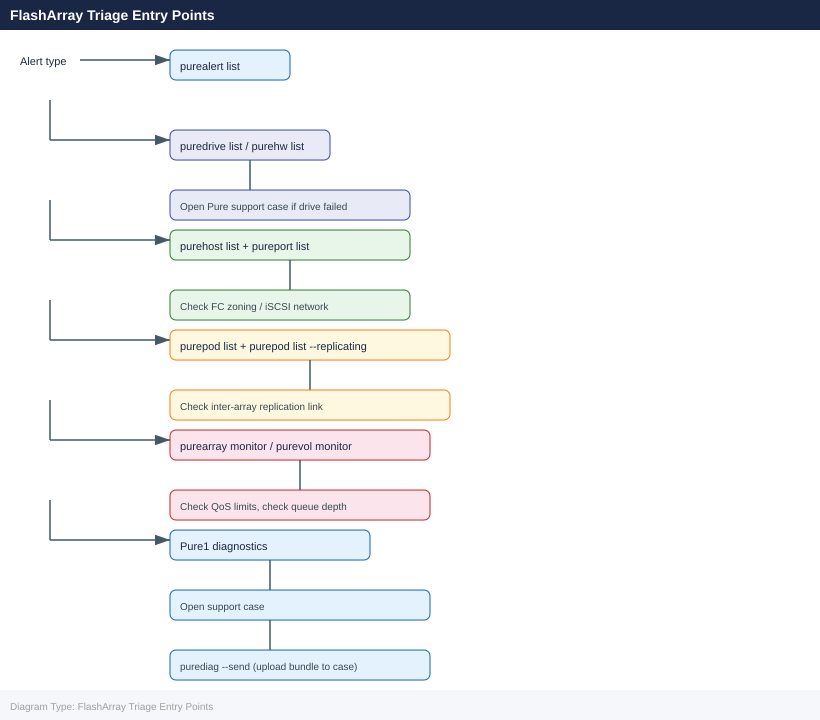

---
tags:
  - pure
  - troubleshooting
search:
  boost: 1.5
description: "FlashArray — Troubleshooting navigation for Common Issues, Diagnostics, Escalation."
---
# FlashArray — Troubleshooting

FlashArray — Troubleshooting navigation for Common Issues, Diagnostics, Escalation.

*Applies to: FlashArray Purity 6.x*

<a class="kb-card" href="common-issues/"><strong>Common Issues</strong>Quick reference for common problems and resolutions.</a>
<a class="kb-card" href="diagnostics/"><strong>Diagnostics</strong>Diagnostic procedures and log analysis.</a>
<a class="kb-card" href="escalation/"><strong>Escalation</strong>Vendor escalation procedures and support contacts.</a>

