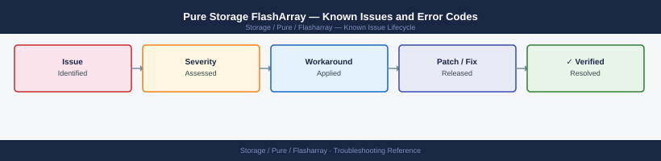

---
tags:
  - troubleshooting
  - flasharray
  - pure-storage
  - known-issues
description: "Catalog of known FlashArray bugs, error codes, and workarounds covering host connectivity, replication, and array health."
---
# Pure Storage FlashArray — Known Issues and Error Codes

<div class="kb-summary">
Catalog of known FlashArray bugs, error codes, and workarounds covering host connectivity, replication, and array health.

*Applies to: Purity//FA 6.x*
</div>



```d2
direction: down

symptom: Identify Symptom {shape: diamond}
host_connectivity: "Host Connectivity" {shape: rectangle}
replication_activedr_activecluster: "Replication (ActiveDR / ActiveCluster)" {shape: rectangle}
array_health: "Array Health" {shape: rectangle}
resolution: Resolve or Escalate {shape: oval}

symptom -> host_connectivity: investigate
symptom -> replication_activedr_activecluster: investigate
symptom -> array_health: investigate
host_connectivity -> resolution
replication_activedr_activecluster -> resolution
array_health -> resolution
```

## Before you begin

- FlashArray alerts appear in the web UI under `Health → Alerts` and via email if configured.
- Logs: Pure1 captures all diagnostic data automatically via phone-home; for on-demand: `pure support upload` via `purearray` CLI.
- Most host connectivity issues are iSCSI/FC multipath configuration on the host side.

## Host Connectivity

| Error / Symptom | Affected Versions | Cause | Workaround / Fix | Fixed In |
|---|---|---|---|---|
| Host shows single path to FlashArray (iSCSI) | Purity 6.x | Multipath daemon not configured or iSCSI session to only one port | Configure host multipath: install `multipath-tools`; add both array iSCSI IPs to initiator discovery | N/A |
| `Host not connected` in FlashArray web UI | Purity 6.x | Host WWN/IQN not registered as FlashArray host object | Add host IQN/WWN in FlashArray → Storage → Hosts → Create Host | N/A |
| Volume not visible to host after connection | Purity 6.x | Volume not in host's connected volumes or host group | Connect volume to host: `purehost addvol --host <name> <volume-name>` | N/A |

## Replication (ActiveDR / ActiveCluster)

| Error / Symptom | Affected Versions | Cause | Workaround / Fix | Fixed In |
|---|---|---|---|---|
| ActiveCluster pod shows `Degraded` | Purity 6.x | One side of stretched pod has lost quorum with mediator | Check mediator connectivity (TCP 443 to pure-mediator); verify both arrays can reach mediator | N/A |
| Async replication lag increasing | Purity 6.x | WAN bandwidth insufficient for change rate | Reduce replication frequency or increase WAN bandwidth; check `purevol list --pgrouplist` for lag | N/A |

## Array Health

| Error / Symptom | Affected Versions | Cause | Workaround / Fix | Fixed In |
|---|---|---|---|---|
| `Drive failed` alert — array still healthy | Purity 6.x | Single NVMe/SSD failure; array rebuilding parity | No action needed; array continues operating; replace drive per Pure support RMA process | N/A |
| `Controller failover` occurred | Purity 6.x | Active controller fault; passive controller took over | Array continues serving I/O; replace failed controller via Pure support | N/A |
| Pure1 showing `Array offline` | Purity 6.x | Phone-home blocked: TCP 443 to pure1.purestorage.com blocked | Verify outbound 443 from array management IP to pure1.purestorage.com | N/A |

## See also

- [Pure Storage FlashArray — Common Issues](../common-issues/)
- [Pure Storage FlashBlade — Known Issues](../../flashblade/troubleshooting/known-issues.md)
- [Pure1 — Known Issues](../../pure1/troubleshooting/known-issues.md)
