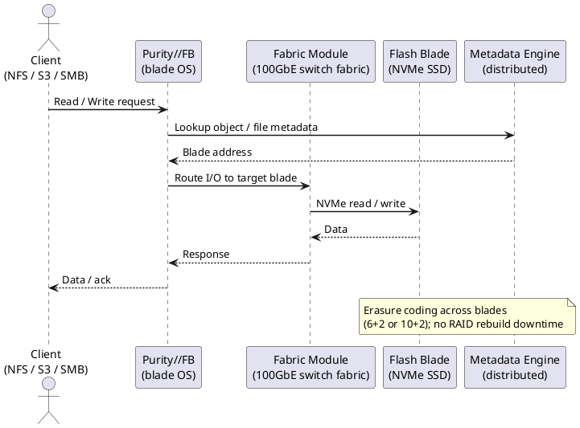

---
tags:
  - architecture
  - pure
description: "How It Works reference covering Overview, Scale-Out Architecture, HA Topology, Connectivity, File Services and 3 more sections."
---
# FlashBlade — How It Works

<div class="kb-summary">
How It Works reference covering Overview, Scale-Out Architecture, HA Topology, Connectivity, File Services and 3 more sections.

*Applies to: FlashBlade Purity//FB 4.x*
</div>




## Overview

Pure Storage FlashBlade is a scale-out all-flash storage platform running Purity//FB OS, purpose-built for unstructured data workloads: AI/ML training data, analytics, high-performance computing, backup repositories, and large-scale file storage. Unlike FlashArray's fixed dual-controller appliance, FlashBlade uses a disaggregated scale-out architecture where both compute and flash capacity scale together by adding blades to a chassis.

Each FlashBlade blade is an independent storage node containing its own NVMe flash and compute resources. The chassis hosts multiple blades plus Fabric Modules (FMs) that provide the high-speed internal interconnect. This delivers consistently high aggregate throughput regardless of access pattern — critical for GPU training jobs demanding tens of GB/s of sustained bandwidth.

FlashBlade serves NFS v3/v4.1, SMB 2/3, S3 object, and HDFS natively from a single platform without any protocol gateway.

## Scale-Out Architecture

```d2
direction: right

B1: "Blade 1" {shape: rectangle}
B2: "Blade 2" {shape: rectangle}
B3: "Blade 3" {shape: rectangle}
BN: "Blade N…" {shape: rectangle}
FMM: "Fabric Management Module\n(NVMe-oF internal fabric" {shape: rectangle}
ETH: "10 / 25 / 100 GbE\nData Ports" {shape: rectangle}
NFS: "NFS v3/v4.1 Clients" {shape: rectangle}
S3: "S3 / Object Clients" {shape: rectangle}
SMB: "SMB Clients" {shape: rectangle}

B1 -> B2
B2 -> B3
B3 -> BN
BN -> FMM
FMM -> ETH
ETH -> NFS
ETH -> S3
ETH -> SMB
```

## HA Topology

FlashBlade does not use a dual-controller model. High availability is achieved through blade-level and Fabric Module redundancy:

- **Blade redundancy:** Data is distributed (striped and replicated) across multiple blades; a single blade failure causes no data loss and only a proportional reduction in capacity and performance while the array rebalances.
- **Fabric Module redundancy:** Two FMs per chassis provide redundant internal connectivity; an FM failure does not interrupt data access.
- **Power and cooling:** Dual redundant power supplies and fan trays, each connected to separate PDUs.

**Failover behaviour for blade failure:**

1. Purity//FB detects the blade failure and marks it unavailable.
2. Data striped across the failed blade is reconstructed from parity/replicas on surviving blades.
3. Client access (NFS, SMB, S3, HDFS) continues uninterrupted — performance and capacity are reduced during rebuild.
4. Insert a replacement blade; Purity//FB automatically rebalances data across the new blade.

**Protocol service HA:** Each FlashBlade presents a virtual IP (VIP) per protocol service; VIPs float across blades automatically on blade failure. NFS and SMB clients reconnect automatically to the new VIP host; S3 clients require no reconfiguration.

## Connectivity

| Protocol | Standard | Notes |
|---|---|---|
| NFS v3 | NFSv3 over TCP/UDP | Widely supported; suitable for Linux clients and HPC workloads |
| NFS v4.1 | NFSv4.1 over TCP | Stateful; supports pNFS for parallel access; recommended for AI/ML |
| SMB 2.0 / 3.0 | SMB over TCP | Windows file sharing; SMB 3.0 supports encryption and multichannel |
| S3 (object) | S3-compatible REST API | Bucket/object model; compatible with AWS S3 SDK, Boto3, and most S3 clients |
| HDFS | HDFS-over-IP | Compatible with Hadoop/Spark workloads without a dedicated Hadoop cluster |

Network requirements: data interfaces 10 GbE minimum (25/100 GbE recommended for AI/ML); dedicated replication interface on separate VLAN; management on dedicated 1 GbE; MTU 9000 (jumbo frames) end-to-end for NFS and S3.

## File Services

FlashBlade provides NFS and SMB through managed filesystems.

```bash
purefb fs list                                     # list all filesystems
purefb fs list --all                               # includes destroyed

# Create an NFS filesystem
purefb fs create --name <fs_name> --size 10T --nfs-v3-enabled true --nfs-v4-1-enabled true

# Create an SMB filesystem
purefb fs create --name <fs_name> --size 10T --smb-enabled true

# Set NFS export rules
purefb fs update <fs_name> --nfs-rules "*(rw,no_root_squash)" --nfs-v4-1-enabled true

# Mount on client
mount -t nfs <FlashBlade_VIP>:/<fs_name> /mnt/<mountpoint>
mount -t nfs4 -o minorversion=1 <FlashBlade_VIP>:/<fs_name> /mnt/<mountpoint>

# Resize
purefb fs update <fs_name> --size 20T

# Destroy (recoverable 24 hours) / eradicate permanently
purefb fs destroy <fs_name>
purefb fs eradicate <fs_name>
```


```text title="Expected output"
# purefb fs list
Name                    Size      Provisioned   Used       NFS v3    NFS v4.1  SMB
data-prod               10.0T     10.0T         2.3T       enabled   enabled   disabled
backup-share            5.0T      5.0T          1.8T       enabled   disabled  disabled
archive-old             20.0T     20.0T         18.5T      disabled  disabled  enabled

# purefb fs create --name nfs-export --size 10T --nfs-v3-enabled true --nfs-v4-1-enabled true
Name                    Size      Provisioned   NFS v3    NFS v4.1
nfs-export              10.0T     10.0T         enabled   enabled

# purefb fs update nfs-export --nfs-rules "*(rw,no_root_squash)" --nfs-v4-1-enabled true
Name                    Size      NFS Rules
nfs-export              10.0T     *(rw,no_root_squash)

# mount -t nfs 192.168.1.50:/nfs-export /mnt/nfs-export
(no output — command completes silently)

# purefb fs update nfs-export --size 20T
Name                    Size      Provisioned
nfs-export              20.0T     20.0T

# purefb fs destroy nfs-export
Name                    Destroyed
nfs-export              true
```

!!! warning "Common errors"
    **`Error: Invalid filesystem name '<fs_name>'`** — Replace `<fs_name>` with an actual filesystem name (e.g., `purefb fs create --name my-nfs-fs --size 10T --nfs-v3-enabled true`).
    **`mount.nfs: access denied by server while mounting 192.168.1.50:/nfs-export`** — Verify NFS export rules are correctly set and the client IP is included in the rules (e.g., `purefb fs update nfs-export --nfs-rules "192.168.1.0/24(rw)"`).
    **`Error: Filesystem nfs-export not found`** — Confirm the filesystem exists with `purefb fs list` before attempting to update or destroy it.
## Object Services (S3)

FlashBlade provides S3-compatible object storage through accounts, buckets, and access keys.

```bash
purefb bucket list
purefb bucket create --name <bucket_name> --account <account_name>

purefb object-store-account create --name <account_name>
purefb object-store-user create --name <user_name> --account <account_name>
purefb object-store-access-key create --user <user_name>/<account_name>

# S3 client access
aws s3 ls --endpoint-url https://<flashblade_s3_vip>/
aws s3 cp local_file.txt s3://<bucket_name>/ --endpoint-url https://<flashblade_s3_vip>/
```


```text title="Expected output"
Name                          Account                       Created
test-bucket-01                prod-account                  2024-01-15T09:23:44Z
archive-bucket-02             dev-account                   2024-01-14T16:45:12Z
backup-bucket-03              prod-account                  2024-01-10T11:02:33Z

Account created successfully: prod-account
User created successfully: s3-user
Access Key created successfully
Access Key ID: PKABC123DEF456GHI789
Secret Access Key: +jK9mL2nOpQrStUvWxYz1aB3cD4eF5gH6iJ7kL8m

2024-01-15 14:32:18       1024 local_file.txt
upload: ./local_file.txt to s3://test-bucket-01/local_file.txt
```

!!! warning "Common errors"
    **`error: account '<account_name>' does not exist`** — Create the object-store-account before creating users with `purefb object-store-account create --name <account_name>`.
    **`An error occurred (InvalidAccessKeyId) when calling the ListBuckets operation: The Access Key Id you provided does not exist in our records.`** — Verify the AWS credentials are set correctly with `aws configure` and match the access key created via `purefb object-store-access-key create`.
    **`error: unable to connect to https://<flashblade_s3_vip>/: certificate verify failed`** — Add `--no-verify-ssl` flag to the aws s3 command or configure your environment to trust the FlashBlade's self-signed certificate.
## Purity//FB Data Services

| Component | Description |
|---|---|
| Blades | Individual storage nodes; capacity and performance scale by adding blades |
| Fabric Modules (FM) | High-speed internal interconnect; redundant FMs provide fault tolerance |
| Purity//FB OS | Runs across all blades; manages data services including dedup, compression, snapshots, and replication |
| ActiveDR | Async replication for filesystems and object store to a remote FlashBlade for DR |
| ActiveCluster (FB) | Synchronous replication for filesystems between two FlashBlade arrays for RPO=0 (Purity//FB 4.x+) |
| SafeMode snapshots | Immutable, admin-delete-locked snapshots for ransomware protection |
| Pure1 | SaaS monitoring, capacity forecasting, upgrade scheduling, and AI analytics |

## Health Commands

```bash
purefb array list              # array status, Purity version
purefb blade list              # all blades with health state and capacity
purefb hardware list           # hardware components (FMs, PSUs, fans)
purefb alert list              # active alerts
purefb filesystem list         # filesystems with capacity usage
purefb bucket list             # S3 buckets
purefb snap list               # filesystem and object store snapshots
purefb replication list        # ActiveDR links and lag
purefb network interface list  # data and replication interface status
```


```text title="Expected output"
Name          Status    Version           Capacity
flashblade-1  Optimal   5.3.2             365.3 TB
flashblade-2  Optimal   5.3.2             365.3 TB

Name     Status    Capacity      Used       Health
blade-1  Optimal   365.3 TB      142.8 TB   OK
blade-2  Optimal   365.3 TB      156.2 TB   OK
blade-3  Optimal   365.3 TB      128.5 TB   OK

Name     Type       Status    Count
FM-1     Controller Optimal   2
PSU-1    Power      Optimal   4
FAN-1    Cooling    Optimal   8

Severity  Code    Message                              Time
Warning   PFA001  Disk predictive failure imminent     2024-01-15T09:42:31Z
Critical  TEMP02  Blade-2 temperature threshold high   2024-01-15T08:15:22Z

Name              Provisioned  Used       Snapshots
data-prod         50.0 TB      38.2 TB    12
archive-backup    100.0 TB     67.5 TB    8
logs-retention    25.0 TB      19.3 TB    4

Name              Owner        Size       Created
backup-archive    eng-team     2.3 TB     2024-01-10T14:22:00Z
metrics-store     ops-team     5.8 TB     2024-01-12T09:15:00Z

Name                           Type       Created              Size
data-prod.20240115-0200       Filesystem 2024-01-15T02:00:00Z 38.2 TB
backup-archive.20240114-2300  Object     2024-01-14T23:00:00Z 2.3 TB

Source Array      Target Array      Status    Lag (ms)
flashblade-1      flashblade-dr     Active    45
flashblade-1      flashblade-dr2    Active    128

Name      IP Address       Status    Role
eth0      10.21.100.45     Up        Data
eth1      10.21.100.46     Up        Data
eth2      10.22.50.10      Up        Replication
```

!!! warning "Common errors"
    **`Error: Connection refused (10.21.100.45:443)`** — Verify the FlashBlade management IP is reachable and the REST API service is running with `purefb network interface list`.
    **`Error: Invalid credentials`** — Confirm your API token is valid and not expired by re-authenticating with `purefb login`.
    **`Error: Array not found`** — Ensure the array name or IP is correctly configured in your purefb connection settings.
---

## See also

- [FlashBlade — Design Standards](../design-standards/)
- [FlashBlade — Integrations](../integrations/)
- [FlashBlade — Deploy](../../deploy/)
