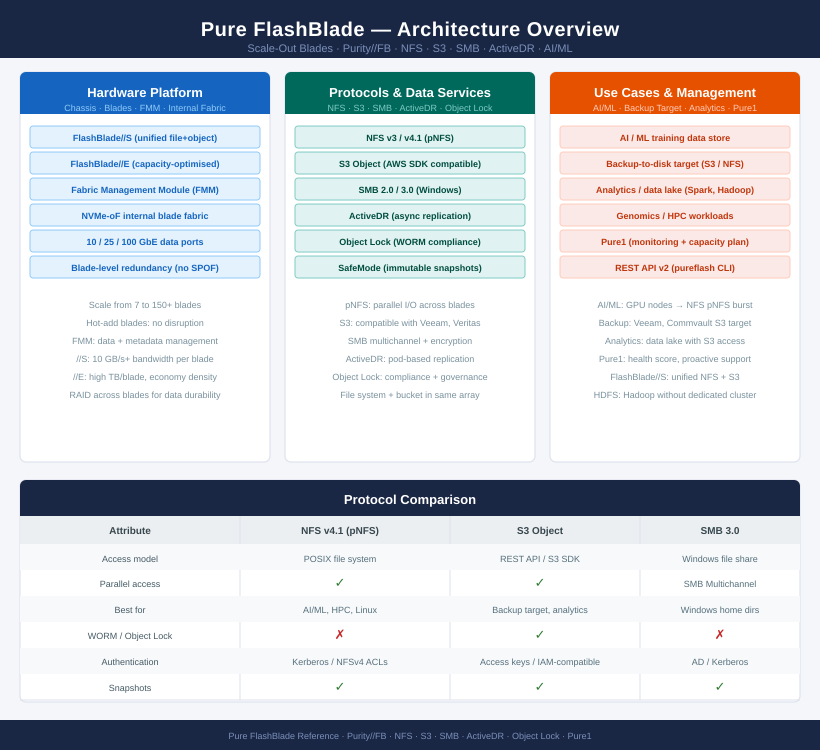
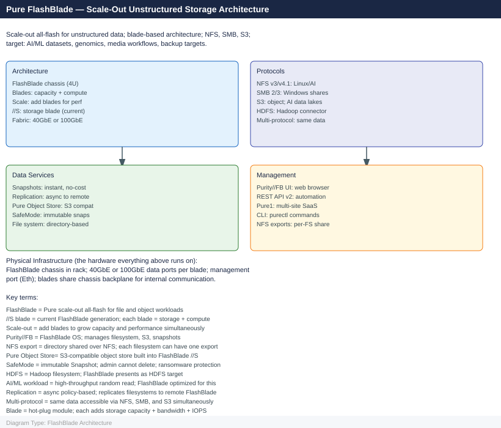

---
tags:
  - architecture
  - pure
description: "Architecture reference for Pure Storage FlashBlade. Covers the scale-out blade model, Purity//FB data services, NFS/SMB/S3/HDFS protocol support, HA..."
---
# FlashBlade — Architecture

<div class="kb-summary">
Architecture reference for Pure Storage FlashBlade. Covers the scale-out blade model, Purity//FB data services, NFS/SMB/S3/HDFS protocol support, HA through blade redundancy, ActiveDR and ActiveCluster replication, and design standards.

*Applies to: FlashBlade Purity//FB 4.x*
</div>





<div class="kb-grid kb-grid-3">
<a class="kb-card" href="how-it-works/"><strong>How It Works</strong><span>Scale-out architecture, HA topology, protocols, file and object services.</span></a>
<a class="kb-card" href="integrations/"><strong>Integrations</strong><span>VMware, backup tools, Pure1, authentication, and REST API.</span></a>
<a class="kb-card" href="design-standards/"><strong>Design Standards</strong><span>Naming conventions, sizing, build baseline, and configuration checklist.</span></a>
</div>

| Protocol | Use Case |
|---|---|
| NFS v3 / v4.1 | Linux clients, HPC workloads, AI/ML training data (pNFS for parallel access) |
| SMB 2.0 / 3.0 | Windows file sharing; SMB 3.0 encryption and multichannel |
| S3 object | Analytics pipelines, backup targets, object storage; compatible with AWS S3 SDK |
| HDFS | Hadoop/Spark workloads without a dedicated Hadoop cluster |

```d2
direction: right

B1: "Blade 1" {shape: rectangle}
B2: "Blade 2" {shape: rectangle}
B3: "Blade 3" {shape: rectangle}
BN: "Blade N…" {shape: rectangle}
FMM: "Fabric Management Module\n(NVMe-oF internal fabric" {shape: rectangle}
ETH: "10 / 25 / 100 GbE\nData Ports" {shape: rectangle}
NFS: "NFS v3/v4.1 Clients" {shape: rectangle}
S3: "S3 / Object Clients" {shape: rectangle}
SMB: "SMB Clients" {shape: rectangle}

B1 -> B2
B2 -> B3
B3 -> BN
BN -> FMM
FMM -> ETH
ETH -> NFS
ETH -> S3
ETH -> SMB
```
