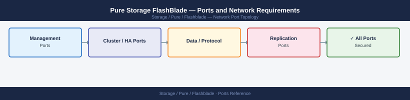

---
tags:
  - flashblade
  - pure-storage
  - networking
  - firewall
  - ports
description: "Firewall port reference for Pure Storage FlashBlade. FlashBlade provides unified fast file and object storage. Covers management access, NFS, SMB, S3..."
---
# Pure Storage FlashBlade — Ports and Network Requirements

<div class="kb-summary">
Firewall port reference for Pure Storage FlashBlade. FlashBlade provides unified fast file and object storage. Covers management access, NFS, SMB, S3 object, replication, and Pure1 cloud telemetry.

*Applies to: FlashBlade//S, FlashBlade//E, Purity//FB 4.x*
</div>


## Network Zones

```
┌──────────────────┐         ┌──────────────────────────────────────────────────────────────────────────┐
│  Admin browsers  │──443───▶│  FlashBlade                                                              │
│  REST API clients│──443───▶│  ┌─────────────┐  ┌──────────────────┐                                   │
│  Pure1 cloud     │◀──443───│  │ Blade Mgmt  │  │  Data Blades     │                                   │
└──────────────────┘         │  │ Network     │  │  (NFS/SMB/S3)    │    │
                             │  └─────────────┘  └──────────────────┘    │
                             └────────────────────────────────────────────┘
                                                         │
                             ┌───────────┬──────────────┬┤
                           NFS         SMB            S3
                          2049         445           9000
```

## Management (Inbound)

| Port | Protocol | Source | Purpose |
|---|---|---|---|
| 443 | TCP | Admin browsers, REST API clients | Purity//FB web UI and REST API |
| 22 | TCP | Jump hosts | SSH — diagnostic access to FlashBlade OS |

## Data Access Protocols

| Port | Protocol | Source | Purpose |
|---|---|---|---|
| 2049 | TCP | NFS client hosts | NFS file access |
| 111 | TCP/UDP | NFS client hosts | Portmapper / rpcbind for NFS mount |
| 635 | TCP/UDP | NFS client hosts | NFS mountd |
| 2049 | UDP | NFS client hosts | NFS (UDP — legacy clients) |
| 445 | TCP | SMB client hosts | SMB file access |
| 9000 | TCP | S3 client applications | S3 object API (HTTP) |
| 443 | TCP | S3 client applications | S3 object API (HTTPS) — if SSL-enabled VIP configured |

## Replication (FlashBlade to FlashBlade)

| Port | Protocol | Source | Destination | Purpose |
|---|---|---|---|---|
| 443 | TCP | FlashBlade (source) replication VIP | FlashBlade (target) replication VIP | ActiveDR / async replication control and data transfer |

## Pure1 Cloud Telemetry (Outbound)

| Port | Protocol | Source | Destination | Purpose |
|---|---|---|---|---|
| 443 | TCP | FlashBlade management IP | pure1.purestorage.com | Pure1 telemetry, health monitoring, and proactive support |

## vSphere Integration (Optional)

| Port | Protocol | Source | Destination | Purpose |
|---|---|---|---|---|
| 443 | TCP | vCenter Server | FlashBlade management IP | VASA provider — vSphere storage policy integration |
| 443 | TCP | FlashBlade management IP | vCenter Server | vSphere event subscription |

## Firewall Zone Summary

| From | To | Ports | Notes |
|---|---|---|---|
| Admin browsers | FlashBlade mgmt IP | 443, 22 | Management |
| NFS clients | FlashBlade data VIP | 2049, 111, 635 | NFS data access |
| SMB clients | FlashBlade data VIP | 445 | SMB data access |
| S3 clients | FlashBlade data VIP | 9000 (or 443) | Object storage |
| FlashBlade (replication) | Remote FlashBlade | 443 | Replication |
| FlashBlade mgmt | pure1.purestorage.com | 443 | Telemetry — required for proactive support |

## Verify

```bash
# From admin workstation — test FlashBlade UI
curl -sk -o /dev/null -w "%{http_code}" https://<flashblade-mgmt-ip>/

# From NFS client — test mount
showmount -e <flashblade-nfs-vip>
mount -t nfs <flashblade-nfs-vip>:/path/to/share /mnt/test

# From S3 client — test object access
curl -sk -o /dev/null -w "%{http_code}" http://<flashblade-s3-vip>:9000/

# From FlashBlade — verify Pure1 connectivity
# (via Purity//FB CLI)
purealertalert test
```


```text title="Expected output"
200
Export list for 192.168.10.45:
/data/nfs-share	192.168.1.0/24
/data/backup     192.168.1.0/24
mount.nfs: mounting 192.168.10.45:/data/nfs-share on /mnt/test
200
Name: purealertalert
Enabled: true
Last Test: 2024-01-15T14:32:18Z
Status: Connected to Pure1 Metadata Service
Test Result: PASSED
```

!!! warning "Common errors"
    **`curl: (60) SSL certificate problem: self signed certificate`** — Add `-k` flag to skip certificate verification (already present in example; if error occurs, verify HTTPS is enabled on management interface).
    **`mount.nfs: access denied by server while mounting 192.168.10.45:/data/nfs-share`** — Verify the client IP is in the NFS export ACL and that the export path exists on FlashBlade.
    **`purealertalert: command not found`** — Ensure you are logged into the FlashBlade CLI via SSH or console; this command only runs in Purity//FB shell, not on external hosts.
## See also

- [Pure Storage FlashBlade — Architecture](../how-it-works/)
