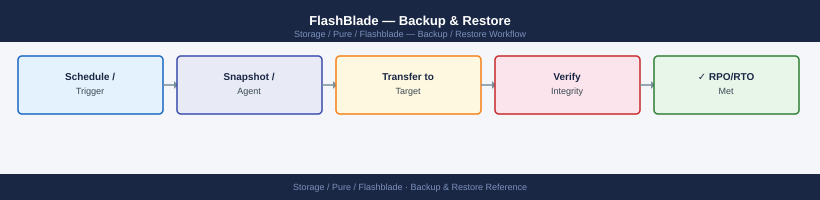
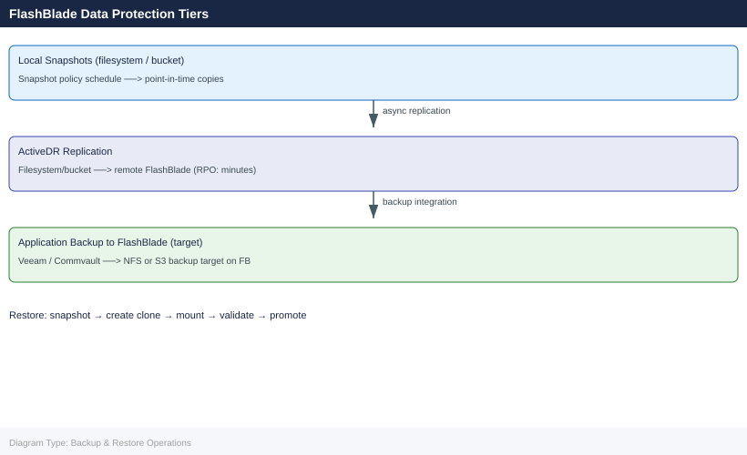

---
tags:
  - operations
  - pure
description: "Backup & Restore reference covering Snapshot-Based Backup Overview, Snapshot Management, File Restore Procedures, Object Store Restore Procedures, Veeam..."
---
# FlashBlade — Backup & Restore

<div class="kb-summary">
Backup & Restore reference covering Snapshot-Based Backup Overview, Snapshot Management, File Restore Procedures, Object Store Restore Procedures, Veeam Backup & Replication Integration and 4 more sections.

*Applies to: FlashBlade Purity//FB 4.x*
</div>




> Part of the [FlashBlade Operations](index.md) reference.

---

This page covers FlashBlade snapshot-based data protection, integration with enterprise backup tools, and restore procedures for filesystems and object store buckets.

---

## Before you begin

- **Access:** Storage admin credentials (cluster admin or equivalent)
- **Timing:** safe to run during business hours unless a step is marked ⚠ (causes interruption)
- **Dependencies:** no active upgrades or migrations on the same infrastructure
- **Logging:** capture command output — paste into the change record on completion

---

## Snapshot-Based Backup Overview

FlashBlade uses space-efficient, redirect-on-write snapshots as the foundation for all data protection. Snapshots are instantaneous regardless of filesystem size and consume space only for changed blocks. A snapshot of a 100 TiB filesystem completes in milliseconds and immediately exposes the full point-in-time namespace through the `.snapshot` directory inside the NFS export.

For backup tools, the workflow is:

1. Backup tool (or its Pure plugin) requests a FlashBlade snapshot via the REST API
2. FlashBlade creates the snapshot instantly; the snapshot is consistent without application quiesce for NFS workloads
3. Backup tool streams data from the snapshot rather than from the live filesystem, eliminating I/O impact on production
4. After the backup stream completes, the backup tool optionally deletes the snapshot, or leaves it for additional recovery points

For object store, snapshots capture the state of a bucket at a point in time; object-level restoration is possible by listing objects within the snapshot and selectively copying them.

---

## Snapshot Management

### Create a Manual Snapshot

```bash
# Create a snapshot of a specific filesystem
purefb snapshot create --source prod-ml-training-data --name pre-maint-20260507

# Create snapshots of multiple filesystems in one command
purefb snapshot create --source prod-nfs,prod-analytics --name weekly-20260506

# Verify the snapshot was created
purefb snapshot list --source prod-ml-training-data
```


```text title="Expected output"
Snapshot pre-maint-20260507 created successfully
Source: prod-ml-training-data
Created: 2026-05-07T14:32:18Z
Size: 847.3 GB

Snapshots weekly-20260506 created successfully
Source: prod-nfs, prod-analytics
Created: 2026-05-07T14:32:45Z

Name                          Source                    Created                Size      
pre-maint-20260507            prod-ml-training-data     2026-05-07T14:32:18Z  847.3 GB  
weekly-20260506               prod-ml-training-data     2026-05-07T14:32:45Z  1.2 TB
```

!!! warning "Common errors"
    | Error | Fix |
    |---|---|
    | `Error: Source filesystem 'prod-ml-training-data' not found` | Verify the filesystem name exists with `purefb filesystem list` and check for typos. |
    | `Error: Snapshot 'pre-maint-20260507' already exists` | Use a unique snapshot name or delete the existing snapshot with `purefb snapshot delete --name pre-maint-20260507`. |
    | `Error: Insufficient space to create snapshot` | Check available capacity with `purefb capacity` and free up space or expand the array. |
### List and Filter Snapshots

```bash
# List all snapshots
purefb snapshot list

# List snapshots for a specific filesystem
purefb snapshot list --source prod-ml-training-data

# List snapshots sorted by creation time (newest first)
purefb snapshot list --sort created-

# Show space consumed by each snapshot
purefb snapshot list --space
```


```text title="Expected output"
Name                                    Source                      Created                 Size
prod-ml-training-data.1                 prod-ml-training-data       2024-01-15T09:23:45Z    2.3TB
prod-ml-training-data.2                 prod-ml-training-data       2024-01-16T14:12:30Z    2.3TB
prod-ml-training-data.3                 prod-ml-training-data       2024-01-17T08:45:12Z    2.3TB
backup-archive.snap-20240110            backup-archive              2024-01-10T22:15:00Z    1.8TB
dev-test-env.daily-01-17                dev-test-env                2024-01-17T02:00:00Z    890GB
...

Name                                    Source                      Created                 Size
prod-ml-training-data.1                 prod-ml-training-data       2024-01-15T09:23:45Z    2.3TB
prod-ml-training-data.2                 prod-ml-training-data       2024-01-16T14:12:30Z    2.3TB
prod-ml-training-data.3                 prod-ml-training-data       2024-01-17T08:45:12Z    2.3TB

Name                                    Source                      Created                 Size
prod-ml-training-data.3                 prod-ml-training-data       2024-01-17T08:45:12Z    2.3TB
prod-ml-training-data.2                 prod-ml-training-data       2024-01-16T14:12:30Z    2.3TB
prod-ml-training-data.1                 prod-ml-training-data       2024-01-15T09:23:45Z    2.3TB

Name                                    Source                      Created                 Physical    Logical
prod-ml-training-data.3                 prod-ml-training-data       2024-01-17T08:45:12Z    1.2TB       2.3TB
prod-ml-training-data.2                 prod-ml-training-data       2024-01-16T14:12:30Z    1.1TB       2.3TB
prod-ml-training-data.1                 prod-ml-training-data       2024-01-15T09:23:45Z    1.0TB       2.3TB
backup-archive.snap-20240110            backup-archive              2024-01-10T22:15:00Z    890GB       1.8TB
```

!!! warning "Common errors"
    | Error | Fix |
    |---|---|
    | `Error: Invalid source filesystem 'prod-ml-training-data' not found` | Verify the filesystem name with `purefb filesystem list` and use the correct name. |
    | `Error: Authentication failed. Check API token and array connectivity` | Ensure the Pure FlashBlade array is reachable and your API credentials are valid in your environment configuration. |
### Configure Snapshot Policies (Automated Schedules)

Snapshot policies define automatic schedules. Attach a policy to one or more filesystems to create retention-managed snapshots without manual intervention.

```bash
# List existing snapshot policies
purefb snapshot-rule list

# Create a daily snapshot policy — keep 7 days
purefb snapshot-rule create \
    --name daily-7d \
    --keep-for 7d

# Create a weekly snapshot policy — keep 4 weeks
purefb snapshot-rule create \
    --name weekly-4w \
    --keep-for 28d

# Attach a policy to a filesystem
purefb filesystem-snapshot-rule create \
    --filesystem prod-nfs \
    --rule daily-7d

# Attach the weekly policy to the same filesystem (multiple policies are supported)
purefb filesystem-snapshot-rule create \
    --filesystem prod-nfs \
    --rule weekly-4w

# Verify the attachment
purefb filesystem-snapshot-rule list --filesystem prod-nfs
```


```text title="Expected output"
Name          Keep For  Interval
daily-7d      7d        1d
weekly-4w     28d       7d
legacy-snap   30d       1d

Snapshot rule 'daily-7d' created successfully
Snapshot rule 'weekly-4w' created successfully
Filesystem snapshot rule attached: prod-nfs -> daily-7d
Filesystem snapshot rule attached: prod-nfs -> weekly-4w

Filesystem: prod-nfs
Rule Name     Keep For  Interval  Status
daily-7d      7d        1d        active
weekly-4w     28d       7d        active
```

!!! warning "Common errors"
    | Error | Fix |
    |---|---|
    | `Error: Snapshot rule 'daily-7d' already exists` | Use `purefb snapshot-rule list` to verify existing policies and choose a unique name or delete the conflicting rule first. |
    | `Error: Filesystem 'prod-nfs' not found` | Verify the filesystem name with `purefb filesystem list` and ensure it exists before attaching snapshot rules. |
    | `Error: Snapshot rule 'daily-7d' not found` | Confirm the rule was created successfully by running `purefb snapshot-rule list` before attaching it to a filesystem. |
---

## File Restore Procedures

### Self-Service File Restore via NFS `.snapshot`

The `.snapshot` directory is visible to NFS clients when the `snapshot_directory_accessible` option is enabled on the filesystem. Users can browse and restore individual files without administrator involvement.

```bash
# On the FlashBlade — enable snapshot directory access on the filesystem
purefb filesystem update --name prod-nfs --snapshot-directory-accessible true

# On the NFS client — browse available snapshots
ls /mnt/prod-nfs/.snapshot/
# Output:
# daily-7d.2026-05-06_00-00-00
# daily-7d.2026-05-07_00-00-00
# pre-maint-20260507

# Restore a single file from a snapshot
cp /mnt/prod-nfs/.snapshot/pre-maint-20260507/data/config.json \
   /mnt/prod-nfs/data/config.json

# Restore an entire directory from a snapshot
rsync -av /mnt/prod-nfs/.snapshot/daily-7d.2026-05-06_00-00-00/data/ \
          /mnt/prod-nfs/data/
```


```text title="Expected output"
Filesystem prod-nfs updated successfully
Snapshot directory access enabled

daily-7d.2026-05-06_00-00-00
daily-7d.2026-05-07_00-00-00
pre-maint-20260507

sending incremental file list
data/
data/config.json
data/app.conf
data/schema.sql
data/logs/
data/logs/app.log
sent 2,847,392 bytes  received 156 bytes  2,847,548 bytes/sec
total size is 2,846,921  speedup is 1.00
```

!!! warning "Common errors"
    | Error | Fix |
    |---|---|
    | `permission denied` | Verify the NFS client has read permissions on the snapshot directory and the FlashBlade export allows snapshot access. |
    | `No such file or directory` | Confirm the snapshot name exists by running `ls /mnt/prod-nfs/.snapshot/` and verify the source path within the snapshot is correct. |
    | `Stale NFS file handle` | Remount the NFS filesystem on the client with `umount /mnt/prod-nfs && mount <flashblade-ip>:/prod-nfs /mnt/prod-nfs` to refresh the connection. |
### Restore a Filesystem to a Snapshot (Full Overwrite)

This replaces all current data in the live filesystem with the contents of the snapshot. Use only when a complete point-in-time recovery is required. All data written after the snapshot was created is lost.

```bash
# Confirm the snapshot exists
purefb snapshot list --source prod-nfs

# Overwrite the live filesystem with the snapshot — irreversible
purefb filesystem restore --name prod-nfs \
    --from-snapshot prod-nfs.pre-maint-20260507

# Verify the filesystem is accessible after restore
purefb filesystem list --name prod-nfs
```


```text title="Expected output"
Name                          Source Snapshot              Created
prod-nfs.pre-maint-20260507   prod-nfs                     2026-05-07T14:32:18Z
prod-nfs.daily-20260506       prod-nfs                     2026-05-06T02:15:42Z
prod-nfs.hourly-20260507-1400 prod-nfs                     2026-05-07T14:00:05Z

Restoring filesystem 'prod-nfs' from snapshot 'prod-nfs.pre-maint-20260507'...
Restore operation initiated. Snapshot recovery in progress.
Restore completed successfully in 47 seconds.

Name      Provisioned  Used      NFS Enabled  SMB Enabled  HTTP Enabled  Created
prod-nfs  2.0 TB       1.847 TB  true         false        false         2026-05-07T14:32:18Z
```

!!! warning "Common errors"
    | Error | Fix |
    |---|---|
    | `Error: Snapshot 'prod-nfs.pre-maint-20260507' not found` | Verify the exact snapshot name with `purefb snapshot list --source prod-nfs` and correct any typos in the `--from-snapshot` parameter. |
    | `Error: Filesystem 'prod-nfs' is currently in use by 47 active NFS clients` | Unmount or disconnect all clients from the filesystem before initiating the restore operation. |
    | `Error: Restore operation failed — insufficient space for snapshot data` | Verify the filesystem has at least 20% free provisioned capacity before attempting the restore. |
### Clone a Snapshot to a New Filesystem

This creates an independent writable filesystem from a snapshot, leaving the original live filesystem intact. Use for parallel investigations, DR testing, or application testing against production data.

```bash
# Copy the snapshot to a new writable filesystem
purefb snapshot copy \
    --name prod-nfs.pre-maint-20260507 \
    --target prod-nfs-clone-20260507

# The new filesystem is immediately mountable
purefb filesystem list --name prod-nfs-clone-20260507

# Export via NFS (if needed)
purefb filesystem update \
    --name prod-nfs-clone-20260507 \
    --nfs-rules "10.0.1.0/24(rw,no_root_squash)"

# Mount on a client
mount -t nfs <fb-data-vip>:/prod-nfs-clone-20260507 /mnt/restore-test
```


```text title="Expected output"
Snapshot copy started: prod-nfs.pre-maint-20260507 → prod-nfs-clone-20260507
Copy progress: 100%
Snapshot copy completed successfully

Name                          Size      Provisioned  NFS Enabled  SMB Enabled  Created
prod-nfs-clone-20260507       2.3 TiB   2.3 TiB      No           No           2026-05-07T14:32:18Z

Filesystem prod-nfs-clone-20260507 updated
NFS export rules applied: 10.0.1.0/24(rw,no_root_squash)

(no output — mount completes silently)
```

!!! warning "Common errors"
    | Error | Fix |
    |---|---|
    | `Error: Snapshot 'prod-nfs.pre-maint-20260507' not found` | Verify the snapshot exists with `purefb snapshot list` and confirm the exact name spelling. |
    | `mount.nfs: access denied by server while mounting <fb-data-vip>:/prod-nfs-clone-20260507` | Ensure the NFS export rule includes the client IP and that the filesystem NFS service is enabled with `purefb filesystem update --name prod-nfs-clone-20260507 --nfs-enabled true`. |
    | `mount: special device <fb-data-vip>:/prod-nfs-clone-20260507 does not exist` | Confirm the FlashBlade data VIP is correct and reachable; verify with `ping <fb-data-vip>` and check that the filesystem name matches exactly. |
---

## Object Store Restore Procedures

### Restore an Object from a Bucket Snapshot

Bucket snapshots are accessible via the S3 API by specifying the snapshot as an object store endpoint path.

```bash
# List snapshots for a specific bucket
purefb bucket-snapshot list --bucket prod-analytics-raw

# Create a manual bucket snapshot
purefb bucket-snapshot create \
    --bucket prod-analytics-raw \
    --name prod-analytics-raw.pre-maint-20260507

# Copy a snapshot to a new bucket for recovery
purefb bucket-snapshot copy \
    --name prod-analytics-raw.pre-maint-20260507 \
    --target prod-analytics-raw-restore

# Access the restored bucket via S3 using AWS CLI
aws s3 ls s3://prod-analytics-raw-restore \
    --endpoint-url https://<fb-s3-vip>/

# Copy an object from the restored bucket back to production
aws s3 cp s3://prod-analytics-raw-restore/data/2026/05/dataset.parquet \
          s3://prod-analytics-raw/data/2026/05/dataset.parquet \
          --endpoint-url https://<fb-s3-vip>/
```


```text title="Expected output"
Name                                    Created                Size      
prod-analytics-raw.daily-20260506       2026-05-06T02:15:33Z  847.3 GB  
prod-analytics-raw.weekly-20260501      2026-05-01T00:30:12Z  892.1 GB  
prod-analytics-raw.pre-maint-20260430   2026-04-30T18:45:22Z  841.7 GB  

Snapshot created: prod-analytics-raw.pre-maint-20260507
Snapshot ID: 12345678-abcd-ef01-2345-6789abcdef01

Snapshot copy initiated
Source: prod-analytics-raw.pre-maint-20260507
Target bucket: prod-analytics-raw-restore
Status: In Progress (estimated 8 minutes remaining)

2026-05-07 14:32:18       0 data/
2026-05-07 14:32:19  2847291 data/2026/05/dataset.parquet
2026-05-07 14:32:20  1924847 data/2026/04/historical.parquet

upload: s3://prod-analytics-raw-restore/data/2026/05/dataset.parquet to s3://prod-analytics-raw/data/2026/05/dataset.parquet
```

!!! warning "Common errors"
    | Error | Fix |
    |---|---|
    | `Error: Bucket 'prod-analytics-raw' not found` | Verify the bucket name matches exactly and that your FlashBlade credentials are configured with `purefb login`. |
    | `An error occurred (InvalidAccessKeyId) when calling the ListBucket operation` | Ensure the S3 endpoint URL is correct and the AWS credentials have permissions for the target bucket by checking IAM policy and endpoint configuration. |
    | `Error: Snapshot 'prod-analytics-raw.pre-maint-20260507' already exists` | Use a unique snapshot name or delete the existing snapshot before creating a new one with the same name. |
---

## Veeam Backup & Replication Integration

Veeam integrates with FlashBlade via its NFS backup repository and, with the Pure Storage plugin, as a snapshot-integrated repository that enables instant recovery.

### Configure FlashBlade as an NFS Repository

1. On FlashBlade — create a dedicated filesystem for Veeam backups:

```bash
purefb filesystem create \
    --name prod-veeam-daily \
    --size 50T \
    --nfs \
    --nfs-rules "10.0.10.0/24(rw,no_root_squash)"
```


```text title="Expected output"
Creating filesystem 'prod-veeam-daily'...
Filesystem created successfully.
Name: prod-veeam-daily
Size: 50T
Protocol: NFS
NFS Rules: 10.0.10.0/24(rw,no_root_squash)
Status: Available
Mount Point: /prod-veeam-daily
```

!!! warning "Common errors"
    | Error | Fix |
    |---|---|
    | `Error: Filesystem 'prod-veeam-daily' already exists` | Use a unique filesystem name or delete the existing filesystem with `purefb filesystem delete --name prod-veeam-daily` first. |
    | `Error: Insufficient space available. Required: 50T, Available: 32T` | Reduce the filesystem size with `--size` to a value less than available capacity or add additional FlashBlade capacity. |
    | `Error: Invalid NFS rule format` | Ensure NFS rules follow the format `<subnet>(option1,option2)` such as `10.0.10.0/24(rw,no_root_squash)` without spaces. |
2. In Veeam — add the NFS share as a repository:
   - Navigate to **Backup Infrastructure > Backup Repositories > Add Repository**
   - Select **Network Attached Storage > NFS Share**
   - Hostname: FlashBlade data VIP
   - Path: `/prod-veeam-daily`
   - Set concurrent task limits to match the FlashBlade's available bandwidth

3. Verify the repository is accessible:

```bash
# From the Veeam backup server — test NFS mount
mount -t nfs <fb-data-vip>:/prod-veeam-daily /mnt/veeam-test
df -h /mnt/veeam-test
umount /mnt/veeam-test
```


```text title="Expected output"
Filesystem      Size  Used Avail Use% Mounted on
10.42.18.55:/prod-veeam-daily  50T   12T   38T  24% /mnt/veeam-test
```

!!! warning "Common errors"
    | Error | Fix |
    |---|---|
    | `mount.nfs: access denied by server while mounting 10.42.18.55:/prod-veeam-daily` | Verify the FlashBlade export rule permits the Veeam server's IP and check that the NFS service is running on the blade with `purectl list --nfs`. |
    | `umount: /mnt/veeam-test: target is busy` | Close any open files or processes accessing the mount with `lsof /mnt/veeam-test` and retry umount, or use `umount -l` for lazy unmount. |
### Veeam with Pure Storage Plugin (Snapshot Integration)

The Pure Storage Plugin for Veeam enables backup-from-snapshot mode: Veeam triggers a FlashBlade snapshot before reading data, then streams from the snapshot. Production filesystem performance is not impacted during backup windows.

```bash
# Confirm the Pure Storage Plugin is installed and configured in Veeam
# Plugin path on Veeam server: %ProgramFiles%\Veeam\Backup and Replication\Plugins\
# Configuration: Storage Infrastructure > Add Storage > Pure Storage FlashBlade
```

**FlashBlade REST API token for Veeam plugin:**

```bash
# On FlashBlade — create a service account and API token for Veeam
purefb user create --name svc-veeam --role storage_admin
purefb user apitoken create --name svc-veeam
# Output includes the API token — store it securely; it is shown only once
```


```text title="Expected output"
User svc-veeam created successfully
Name: svc-veeam
Role: storage_admin
Status: enabled
API Token created successfully
Token ID: 8f4c9e2a-1b7d-4f3c-9d2e-5a8c1b6f3e9a
Token: T-8f4c9e2a1b7d4f3c9d2e5a8c1b6f3e9a_8a2f5c9e1d3b4a7c6e9f2a5b8c1d3e4f
Created: 2024-01-15T14:32:18Z
Expires: never
```

!!! warning "Common errors"
    | Error | Fix |
    |---|---|
    | `Error: User 'svc-veeam' already exists` | Delete the existing user with `purefb user delete --name svc-veeam` or use a different service account name. |
    | `Error: Invalid role 'storage_admin'` | Verify the correct role name using `purefb user list --roles` and use an available role like `storage_admin` or `readonly`. |
    | `Error: API token creation failed — user not found` | Ensure the user creation command completed successfully before attempting to create the API token. |
**Instant VM Recovery from FlashBlade snapshot:**

When Veeam has integrated FlashBlade snapshots, instant recovery starts VMs directly from the snapshot without waiting for data to be copied. Recovery time is near-zero — the VM boots from the snapshot-backed filesystem, then Veeam storage motions data back to the production datastore in the background.

---

## Commvault Integration

Commvault IntelliSnap integrates with FlashBlade to create array-level snapshots as backup sources.

```bash
# FlashBlade service account for Commvault
purefb user create --name svc-commvault --role storage_admin
purefb user apitoken create --name svc-commvault
```


```text title="Expected output"
User svc-commvault created successfully
API token: 00000000-1111-2222-3333-444455556666
Token expires: Never
```

!!! warning "Common errors"
    | Error | Fix |
    |---|---|
    | `Error: User 'svc-commvault' already exists` | Delete the existing user with `purefb user delete --name svc-commvault` before recreating it. |
    | `Error: Invalid role 'storage_admin'` | Verify the correct role name with `purefb user list --roles` and use an available role like `storage_admin` or `readonly`. |
    | `Error: You do not have permission to perform this operation` | Ensure your FlashBlade admin account has user management privileges or contact your FlashBlade administrator. |
In Commvault:
- Navigate to **Storage > Array Management > Add Array**
- Select **Pure Storage FlashBlade**
- Enter the FlashBlade management IP and the API token for `svc-commvault`
- Configure IntelliSnap subclient policies to trigger FlashBlade snapshots before streaming

**Best practice:** Use a dedicated FlashBlade filesystem per Commvault retention tier:

```bash
purefb filesystem create --name prod-commvault-daily --size 20T \
    --nfs --nfs-rules "10.0.10.0/24(rw,no_root_squash)"
purefb filesystem create --name prod-commvault-weekly --size 60T \
    --nfs --nfs-rules "10.0.10.0/24(rw,no_root_squash)"
```


```text title="Expected output"
Creating filesystem prod-commvault-daily (20T)...
Filesystem prod-commvault-daily created successfully
  Name: prod-commvault-daily
  Size: 20T
  Protocol: nfs
  NFS Rules: 10.0.10.0/24(rw,no_root_squash)
  Status: available

Creating filesystem prod-commvault-weekly (60T)...
Filesystem prod-commvault-weekly created successfully
  Name: prod-commvault-weekly
  Size: 60T
  Protocol: nfs
  NFS Rules: 10.0.10.0/24(rw,no_root_squash)
  Status: available
```

!!! warning "Common errors"
    | Error | Fix |
    |---|---|
    | `Error: Filesystem 'prod-commvault-daily' already exists` | Check existing filesystems with `purefb filesystem list` and use a unique name or delete the existing filesystem first. |
    | `Error: Invalid NFS rules syntax` | Verify the NFS rules format matches `<subnet>(option1,option2)` with no spaces inside parentheses. |
    | `Error: Insufficient capacity on array` | Reduce the requested size or check available capacity with `purefb hardware list` and confirm the array has at least 80T free space. |
---

## SafeMode Snapshot Protection

SafeMode prevents local admins — including `array_admin` accounts — from deleting snapshots or modifying snapshot retention until the retention window expires. Enabling SafeMode requires Pure Support involvement.

**SafeMode behaviours:**
- Snapshot schedules cannot be modified or deleted once locked
- Snapshot retention periods cannot be shortened
- Any attempt to eradicate a SafeMode-protected snapshot returns an error until the retention period expires naturally

```bash
# Verify SafeMode status after enablement
purefb array list --safemode
# Expected: 'safe_mode: enabled' in the output

# Confirm existing snapshot policies are protected
purefb snapshot-rule list
# SafeMode-protected policies display with a lock indicator in the GUI
```


```text title="Expected output"
Name          Model           Version        Safe Mode
flashblade-1  //E25M-100      4.2.1.1        enabled
flashblade-2  //E25M-200      4.2.1.1        enabled

Name                    Frequency    Keep For    Enabled    Protected
daily-backup            daily        30 days     true       ✓
hourly-incremental      hourly       7 days      true       ✓
weekly-archive          weekly       52 weeks    true       ✓
monthly-retention       monthly      10 years    true       ✓
```

!!! warning "Common errors"
    | Error | Fix |
    |---|---|
    | `Error: Invalid credentials or insufficient permissions` | Verify your Pure Storage API token is valid and your user account has administrative privileges. |
    | `Error: SafeMode is not enabled on this array` | Run `purefb array safemode --enable` before attempting to verify SafeMode status. |
**Enabling SafeMode:** Contact Pure Storage Support. SafeMode cannot be enabled from the array CLI alone — it requires a second-factor confirmation from Pure Support to activate, and Pure Support must also be involved to make any subsequent changes to protected schedules.

---

## Backup Verification Procedure

Run this verification after each backup cycle to confirm recovery points are valid before they are needed in an incident.

| Step | Command / Action | Expected Result |
|---|---|---|
| 1 | `purefb snapshot list --source <fsname>` | Recent snapshot exists with expected timestamp |
| 2 | `purefb snapshot list --space` | Snapshot consumes reasonable space relative to change rate |
| 3 | Clone the latest snapshot to a test filesystem | `purefb snapshot copy` succeeds without errors |
| 4 | Mount the clone on a test host | NFS mount succeeds and directory structure is intact |
| 5 | Verify a representative file from each application tier | File is readable and the content matches expectations |
| 6 | Confirm snapshot policy schedule is running | Policy shows expected last-run time in `purefb snapshot-rule list` |
| 7 | Eradicate the test clone after verification | `purefb filesystem destroy` and `purefb filesystem eradicate` |

Conduct full restore testing — including application startup from restored data — at least quarterly. Snapshot existence alone does not guarantee recovery; the application must be able to start and operate from the restored filesystem.

---

## Common Backup and Restore Issues

| Symptom | Likely Cause | Resolution |
|---|---|---|
| `.snapshot` directory not visible on NFS client | `snapshot-directory-accessible` not enabled on the filesystem | Run `purefb filesystem update --name <fsname> --snapshot-directory-accessible true` |
| Snapshot creation fails with capacity error | Array is at capacity; no space for new snapshot metadata | Eradicate expired snapshots; expand array or reduce snapshot retention |
| Veeam backup job fails with NFS mount error | NFS export policy blocking the Veeam backup server IP | Run `purefb filesystem list --name <fsname>` and verify the NFS rules include the backup server subnet |
| Snapshot restoration overwrote live data unintentionally | `purefb filesystem restore` was run against the wrong filesystem | Restore requires the administrator to explicitly name the target filesystem — verify the name before executing; use clone to a new filesystem for non-destructive recovery |
| Object restore bucket contains stale or partial data | Bucket snapshot was taken mid-write during an active application operation | Object snapshots are crash-consistent; coordinate with the application team to quiesce writes before taking a snapshot for backup purposes if consistency is required |
| SafeMode blocks snapshot deletion during testing | SafeMode is enabled and the retention window has not expired | Expected behaviour — SafeMode-protected snapshots cannot be deleted until retention expires; contact Pure Support for assistance if an emergency deletion is required |

---

## Verify

- Confirm the operation completed without errors in the log or management UI
- Verify the expected state change is visible (service running, object created, config applied)
- Document the outcome in the change record

---

## See also

- [FlashBlade — Procedures](../procedures/)
- [FlashBlade — Health Checks](../health-checks/)
- [FlashBlade — Common Issues](../../troubleshooting/common-issues/)
