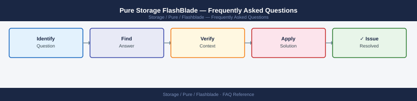

---
tags:
  - pure-flashblade
  - faq
  - operations
description: "Common questions about Pure Storage FlashBlade operations, configuration, and troubleshooting. For step-by-step procedures, see the Operations section."
---
# Pure Storage FlashBlade — Frequently Asked Questions

*Applies to: Pure Storage FlashBlade*

Common questions about Pure Storage FlashBlade operations, configuration, and troubleshooting. For step-by-step procedures, see the <a href="index.md">Operations</a> section.

## General

**Q: What Purity//FB version is recommended?**
A: Purity//FB 4.3.x is the current recommendation. Check via Pure1 or FlashBlade UI → System → Software Version.

**Q: How do I check the current Pure Storage FlashBlade version?**
A: `purefb list --version`

## Configuration

**Q: What is the default NFS export security and when should it change?**
A: Default NFS exports use `sec=sys` (AUTH_SYS). For security-sensitive environments, use Kerberos (`sec=krb5p` for encryption). Kerberos requires KDC integration and DNS configuration on the FlashBlade.

**Q: How do I enable S3 object store on FlashBlade?**
A: Create an Object Store account: `purefb objectstoreaccount create <acct>`. Create a bucket: `purefb objectstorebucket create <bucket> --account <acct>`. Create an access key: `purefb objectstoreuser create <user> --account <acct>`.

## Operations

**Q: How do I upgrade Purity//FB without disrupting NFS/S3 clients?**
A: Purity//FB upgrades are non-disruptive. Initiate via Pure1 or FlashBlade UI → System → Software → Upgrade. Blades upgrade sequentially; clients reconnect automatically. Monitor via Pure1 during the upgrade.

**Q: What is the correct procedure to add a new file system and NFS export?**
A: `purefb fs create <fs> --size 10T`. Create export: `purefb nfs exportpolicy add --fs <fs> --rules 'client=*,access=rw,security=sys'`. Mount from client: `mount -t nfs <fb-vip>:/<fs> /mnt/point`.

## Troubleshooting

**Q: FlashBlade shows 'Blade in Service Mode'. What does it mean?**
A: A blade has been taken offline for service (hardware issue or scheduled maintenance). Data is redistributed to remaining blades. Contact Pure Support if a blade enters service mode unexpectedly.

**Q: FlashBlade NFS throughput is below expected — where do I start?**
A: Check Pure1 performance metrics for the file system. Verify clients are using NFSv3 or NFSv4 (NFSv4.1 is preferred). Check NIC bonding on clients. Review rsize/wsize mount options (recommend 1M for large sequential I/O).

## Backup and Recovery

**Q: How often should I back up FlashBlade configuration?**
A: Weekly configuration export from FlashBlade UI → System → Download Configuration. Pure1 also maintains configuration history. For data protection, use FlashBlade native replication or integrate with a backup tool.

**Q: Can I restore a specific file from a FlashBlade snapshot?**
A: Yes — snapshots appear as read-only directories. Access via NFS: `ls /mnt/fs/.snapshot/<snapshot-name>/`. Copy the specific file from the snapshot directory back to the active file system.

## See Also

- [Pure Storage FlashBlade Operations](index.md)
- [Pure Storage FlashBlade Troubleshooting](../../../../troubleshooting/index.md)
