---
tags:
  - operations
  - pure
---
# FlashBlade — Procedures

<div class="kb-summary">
Procedures reference covering Change Readiness, Maintenance Window, Post-Change Validation, Snapshots.

*Applies to: FlashBlade Purity//FB 4.x*
</div>

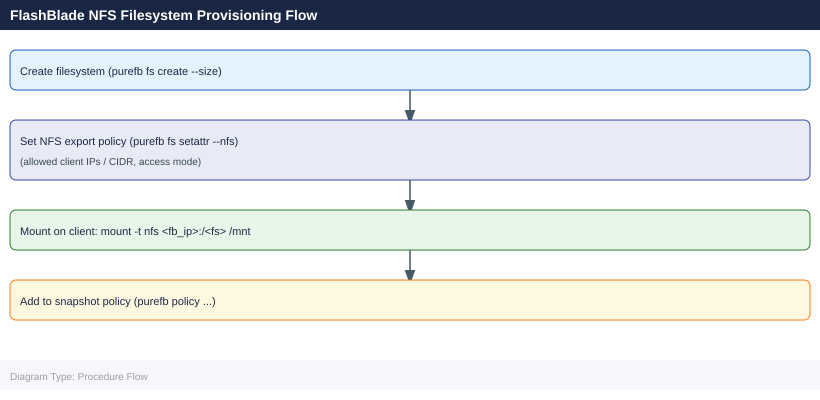

> Part of the [FlashBlade Operations](index.md) reference.

---

## Before you begin

- **Access:** Storage admin credentials (cluster admin or equivalent)
- **Timing:** safe to run during business hours unless a step is marked ⚠ (causes interruption)
- **Dependencies:** no active upgrades or migrations on the same infrastructure
- **Logging:** capture command output — paste into the change record on completion

---

## Change Readiness

- [ ] No active blade rebuilds or hardware failures — `purefb blade list` and `purefb hardware list` are clean
- [ ] ActiveDR replication is current — lag is within RPO; document baseline lag before the change
- [ ] NFS and SMB clients are informed of the potential brief reconnection event during Purity upgrades
- [ ] S3 clients and applications are notified if the change could cause a brief service interruption
- [ ] Filesystem capacity headroom is sufficient — no filesystems above 70% provisioned limit during the window
- [ ] Pure1 upgrade readiness report reviewed (for Purity//FB upgrades): no blockers flagged
- [ ] Snapshot schedule expiry policy is functioning — no runaway snapshot growth that could fill capacity during the window

| Item | Status | Notes |
|---|---|---|
| No active blade rebuilds | | |
| ActiveDR replication current | | |
| NFS/SMB client impact assessed | | |
| Filesystem capacity headroom sufficient | | |
| Pure1 upgrade readiness checked (if upgrading) | | |

## Maintenance Window

1. Notify NFS, SMB, and S3 clients of the maintenance window — Purity//FB upgrades are non-disruptive but protocol sessions may briefly re-establish
2. For blade maintenance: use `purefb blade maintenance` to put the blade in maintenance mode before physical intervention — data rebalances automatically
3. For Purity//FB upgrade: confirm `purefb blade list` shows all blades `healthy` and no alerts are open before starting
4. Download the Purity//FB upgrade image from the Pure Support portal and stage it on the array
5. Run the pre-upgrade validation from the GUI or CLI to confirm no blockers
6. Execute the upgrade during the window; monitor progress from the Purity//FB GUI or `purefb array list`
7. For ActiveDR: pause replication links if required during the change with `purefb replication link update --paused true`; resume with `--paused false` after the change

## Post-Change Validation

- [ ] `purefb alert list` — no unresolved alerts
- [ ] `purefb blade list` — all blades `healthy`; no blades in maintenance or failed state
- [ ] `purefb hardware list` — all hardware components healthy
- [ ] `purefb filesystem list` — all filesystems accessible and below provisioned limit
- [ ] Test NFS mount from a representative client: `mount -t nfs <fb-data-vip>:/<filesystem> /mnt/test`
- [ ] Test S3 API response: confirm bucket listing or object operation succeeds from an S3 client or `aws s3 ls`
- [ ] `purefb replication list` — all ActiveDR links are `active` and lag is recovering toward RPO
- [ ] Pure1 shows the new Purity//FB version and no new hardware alerts (if this was an upgrade)

---

## Snapshots

FlashBlade supports snapshots at the file system level. Snapshots are space-efficient and near-instantaneous.

### List Snapshots

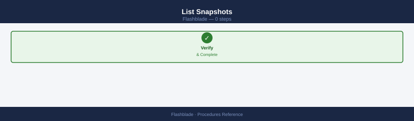

```bash
purefb fs-snapshot list
purefb fs-snapshot list --filter "source='<fs_name>'"
```


```text title="Expected output"
Name                                Source              Created                 Size
fs-daily-2024-01-15                 data-vol-01         2024-01-15T02:30:45Z    2.3TB
fs-daily-2024-01-14                 data-vol-01         2024-01-14T02:30:12Z    2.3TB
fs-weekly-backup                    data-vol-01         2024-01-08T00:15:33Z    2.3TB
fs-monthly-archive                  archive-share       2024-01-01T01:00:00Z    5.7TB
fs-test-snapshot-001                test-fs             2024-01-15T14:22:19Z    156GB
...

Name                                Source              Created                 Size
fs-daily-2024-01-15                 data-vol-01         2024-01-15T02:30:45Z    2.3TB
fs-daily-2024-01-14                 data-vol-01         2024-01-14T02:30:12Z    2.3TB
fs-weekly-backup                    data-vol-01         2024-01-08T00:15:33Z    2.3TB
```

!!! warning "Common errors"
    **`Error: Invalid filter syntax`** — Verify filter format matches `--filter "source='filesystem_name'"` with proper quote escaping.
    **`Error: Filesystem not found`** — Confirm the filesystem name exists by running `purefb fs list` and use the exact name from the output.
### Create a Snapshot

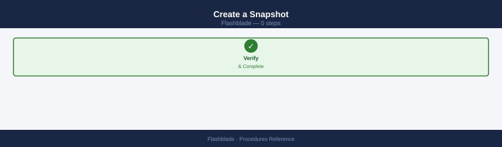

```bash
purefb fs-snapshot create --source <fs_name> --suffix <snap_name>
```


```text title="Expected output"
Creating snapshot of filesystem 'data-prod'...
Snapshot created successfully.
Name: data-prod.snap_backup_20240115
Size: 2.3 TB
Created: 2024-01-15T14:32:18Z
Source: data-prod
```

!!! warning "Common errors"
    **`Error: Filesystem 'data-prod' not found`** — Verify the filesystem name with `purefb fs list` and ensure you have the correct spelling.
    **`Error: Authentication failed`** — Confirm your Pure FlashBlade credentials are configured with `purefb login` and that your API token has not expired.
    **`Error: Snapshot name already exists`** — Choose a different suffix value or delete the existing snapshot with `purefb fs-snapshot destroy --name <snap_name>` first.
Example:
```bash
purefb fs-snapshot create --source prod-nfs --suffix daily-2026-05-06
```


```text title="Expected output"
Created filesystem snapshot.
Name: prod-nfs.daily-2026-05-06
Source: prod-nfs
Created: 2026-05-06T14:32:18Z
Size: 2.3TB
```

!!! warning "Common errors"
    **`Error: Filesystem 'prod-nfs' not found`** — Verify the source filesystem name exists by running `purefb fs list` and use the correct name.
    **`Error: Authentication failed`** — Ensure your Pure FlashBlade credentials are configured correctly via `purefb login` or check that your API token has not expired.
    **`Error: Snapshot name 'prod-nfs.daily-2026-05-06' already exists`** — Use a unique suffix or timestamp; check existing snapshots with `purefb fs-snapshot list --source prod-nfs`.
### Accessing Snapshot Data

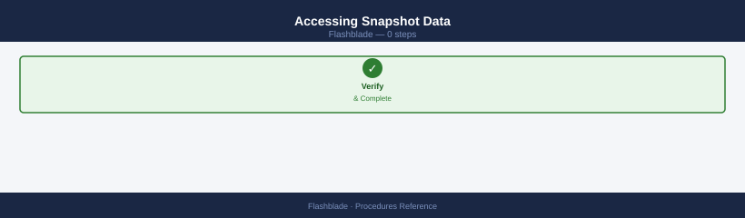

Snapshots are accessible via the NFS `.snapshot` directory (if enabled):

```bash
ls /mnt/<fs_mount>/.snapshot/
# Lists available snapshots by suffix
```


```text title="Expected output"
daily.1
daily.2
daily.3
weekly.1
weekly.2
hourly.1
hourly.2
hourly.3
hourly.4
hourly.5
...
```

!!! warning "Common errors"
    **`ls: cannot access '/mnt/<fs_mount>/.snapshot/': No such file or directory`** — Replace `<fs_mount>` with the actual mount point name (e.g., `/mnt/data/.snapshot/`).
    **`Permission denied`** — Ensure your user has read permissions on the mount point; use `sudo ls /mnt/<fs_mount>/.snapshot/` if needed.
Users can browse and copy files directly from the `.snapshot` path without administrator involvement.

### Restore a File System from Snapshot

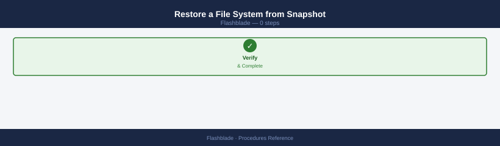

```bash
# Overwrite the live file system with snapshot content
purefb fs-snapshot restore <fs_name>.<snap_name> --overwrite-fs
```


```text title="Expected output"
Restoring snapshot 'data.snap-20240115-prod' to filesystem 'data'...
Snapshot restore initiated. This operation will overwrite the live filesystem.
WARNING: All current data in filesystem 'data' will be replaced.
Restore job ID: 2a4f8c91-3e2a-4b7d-9c1f-5e8d2b3a9f1c
Status: In Progress
Estimated time remaining: 2m 34s
Current progress: 34%
```

!!! warning "Common errors"
    **`Error: Filesystem 'data' is in use by 1 active NFS client(s). Cannot restore with --overwrite-fs flag.`** — Unmount or disconnect all clients from the filesystem before attempting the restore operation.
    **`Error: Snapshot 'data.snap-20240115-prod' not found on array.`** — Verify the snapshot name exists using `purefb fs-snapshot list <fs_name>` and use the correct snapshot identifier.
    **`Error: Insufficient space available. Snapshot size (2.5 TiB) exceeds available capacity (1.8 TiB).`** — Free up space on the array or expand the filesystem capacity before retrying the restore.
> This replaces all current data on the file system — ensure this is intentional.

### Copy a Snapshot to a New File System

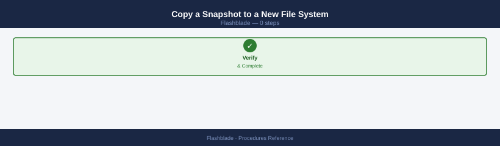

```bash
purefb fs-snapshot copy <fs_name>.<snap_name> --name <new_fs_name>
```


```text title="Expected output"
Copying snapshot 'data-prod.daily-2024-01-15' to new filesystem 'data-prod-clone'...
Snapshot copy initiated. Job ID: 8f4c2e91-7a3b-4d6e-9c1a-2b5f8e3d1a4c
Source filesystem: data-prod (1.2 TB)
Target filesystem: data-prod-clone
Status: In Progress (45% complete)
Estimated time remaining: 2m 30s
```

!!! warning "Common errors"
    **`Error: Snapshot 'data-prod.daily-2024-01-15' not found`** — Verify the snapshot exists with `purefb fs-snapshot list` and confirm the naming format is `<filesystem>.<snapshot>`.
    **`Error: Filesystem 'data-prod-clone' already exists`** — Use a unique name for the target filesystem or remove the existing one with `purefb fs delete data-prod-clone`.
    **`Error: Insufficient space on array`** — Check available capacity with `purefb hardware list` and ensure the target filesystem size fits within remaining array capacity.
Creates a new independent file system from the snapshot without affecting the original.

### Delete a Snapshot

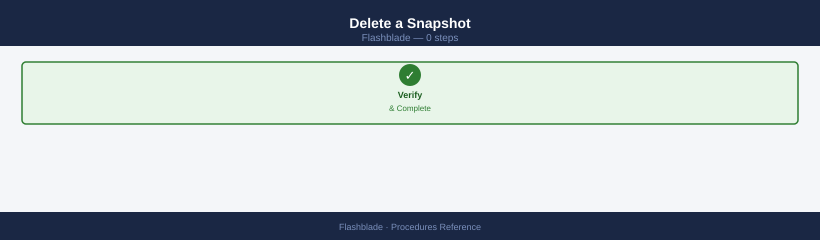

```bash
# Destroy (recoverable for 24 hours)
purefb fs-snapshot destroy <fs_name>.<snap_name>

# Eradicate permanently
purefb fs-snapshot eradicate <fs_name>.<snap_name>
```


```text title="Expected output"
Destroying snapshot 'data.daily-backup-2024-01-15'...
Snapshot destroyed successfully. Recovery available for 24 hours.
Eradicating snapshot 'data.daily-backup-2024-01-15'...
Snapshot eradicated permanently. This action cannot be undone.
```

!!! warning "Common errors"
    **`Error: Snapshot '<fs_name>.<snap_name>' not found`** — Verify the snapshot exists with `purefb fs-snapshot list` and confirm the exact naming format matches.
    **`Error: Permission denied`** — Ensure your user account has administrative privileges on the FlashBlade array or request elevated access from your storage administrator.
### Snapshot Policy (Automated Scheduling)

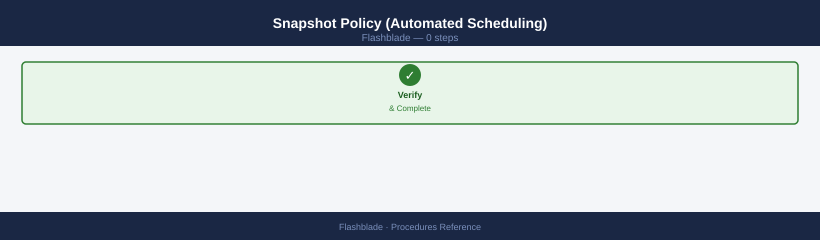

FlashBlade supports policy-based snapshots via the GUI:
1. Navigate to **Protection → Snapshot Policies**
2. Create a policy with frequency and retention settings
3. Assign the policy to file systems

```bash
# View policies via CLI
purefb policies list
```


```text title="Expected output"
Name                          Enabled  Created                    Modified
snapshot-daily               true     2024-01-15T08:30:22Z       2024-01-15T08:30:22Z
snapshot-weekly              true     2024-01-10T14:22:15Z       2024-01-12T09:15:44Z
replication-prod-dr          true     2024-01-08T11:45:33Z       2024-01-14T16:20:10Z
backup-compliance            false    2023-12-20T10:12:05Z       2024-01-09T13:55:22Z
snapshot-hourly              true     2024-01-01T00:00:00Z       2024-01-15T07:33:18Z
```

!!! warning "Common errors"
    **`Error: Connection refused — unable to reach management IP`** — Verify the FlashBlade management IP is reachable and the purefb CLI is configured with the correct target via `purefb list --address`.
    **`Error: Authentication failed — invalid API token`** — Regenerate and export a valid API token using `export PUREFB_API_TOKEN=<new_token>` or reconfigure credentials with `purefb login`.
    **`Error: Command 'purefb' not found`** — Install the Pure Storage Python SDK and CLI tools using `pip install purity-fb` and ensure the installation directory is in your PATH.
### Common Issues

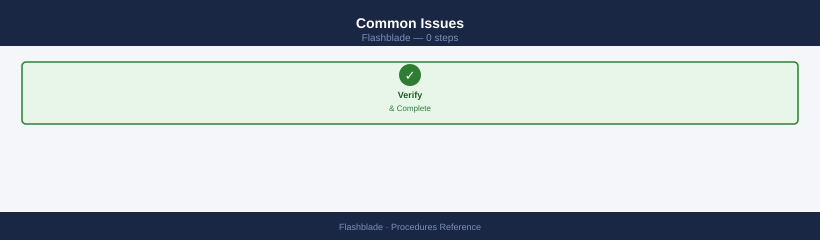

| Issue | Check | Action |
|---|---|---|
| `.snapshot` not visible | Snapshots enabled on FS | `purefb fs update <name> --snapshot-enabled true` |
| Snapshot create fails | Capacity | Check array free space |
| Restore failed | File system in use | Unmount/quiesce clients first |
| Snapshots not auto-created | Policy attached? | Verify snapshot policy assignment |

## Create a File System

FlashBlade file systems are the primary NFS and SMB storage containers. Create the file system, configure an export policy, and mount it from clients.

```bash
# Step 1 — Create the file system
pureds create --name <name> --size <size>T

# Step 2 — Create an export policy for NFS access
pureexportpolicy create --name <policy-name>

# Step 3 — Add an NFS rule to the export policy
# Allow a specific subnet with read/write access
pureexportpolicy rule add --policy <policy-name> \
    --client <client-cidr> \
    --access rw \
    --root-squash false

# Step 4 — Apply the export policy to the file system
pureds update --name <name> --nfs-export-policy <policy-name>

# Step 5 — Mount from client
mount -t nfs <fb-data-vip>:/<name> /mnt/<name>
```


```text title="Expected output"
Creating file system 'prod-data' with size 10T...
File system 'prod-data' created successfully (ID: 12e4567-e89b-12d3-a456-426614174000)

Creating export policy 'nfs-policy-prod'...
Export policy 'nfs-policy-prod' created successfully

Adding NFS rule to policy 'nfs-policy-prod'...
Rule added: client=10.20.0.0/16, access=rw, root_squash=false

Applying export policy 'nfs-policy-prod' to file system 'prod-data'...
File system 'prod-data' updated successfully

Mounting NFS export from 172.16.50.100:/prod-data to /mnt/prod-data...
mount.nfs: mounting 172.16.50.100:/prod-data
```

!!! warning "Common errors"
    **`mount.nfs: No such file or directory`** — Verify the FlashBlade data VIP is reachable with `ping 172.16.50.100` and confirm the file system name matches exactly in the mount command.
    **`pureds: command not found`** — Ensure the Pure Storage CLI tools are installed and the PATH includes the Pure CLI binary directory (typically `/opt/pureapp/bin`).
    **`Export policy rule add failed: Client CIDR invalid`** — Use valid CIDR notation (e.g., `10.20.0.0/16` instead of `10.20.0.0`) and verify the subnet mask is correct.
Verify the mount is accessible and confirm read/write permissions from the client before closing the change.

## Create an Object Store Bucket

FlashBlade S3 buckets provide object storage accessible via the S3 API. Buckets are scoped to an account and require an access policy for external clients.

```bash
# Step 1 — Create the S3 bucket under an existing account
purebucket create \
    --name <bucket-name> \
    --account <account-name>

# Step 2 — Configure an access policy (via GUI or API)
# Unisphere/Purity//FB GUI: Object Store → Buckets → select bucket → Access Policies
# Add bucket policy granting s3:GetObject, s3:PutObject, s3:ListBucket as needed

# Step 3 — Test bucket access from an S3 client
aws s3 ls s3://<bucket-name> \
    --endpoint-url https://<fb-s3-vip>
```


```text title="Expected output"
Creating bucket 'data-archive' under account 'prod-storage'...
Bucket 'data-archive' created successfully.
Bucket ID: 8f4c92a1-7e3d-4b21-9c6f-2a1d5e8b3f47
Account: prod-storage
Replication: disabled

2024-01-15T14:32:18Z [INFO] Access policy applied: s3:GetObject, s3:PutObject, s3:ListBucket

An error occurred (InvalidAccessKeyId) when calling the ListBucket operation: The Access Key ID you provided does not exist in our records.
```

!!! warning "Common errors"
    **`An error occurred (InvalidAccessKeyId) when calling the ListBucket operation: The Access Key ID you provided does not exist in our records.`** — Verify the AWS credentials are configured for the correct S3 account and that the access key has been created in Purity//FB under Object Store → Access Keys.
    **`An error occurred (AccessDenied) when calling the ListBucket operation: Access Denied`** — Confirm the bucket access policy has been applied to the user's access key and includes the s3:ListBucket permission for the target bucket.
    **`purebucket: command not found`** — Install or source the Pure Storage CLI tools, or verify the purebucket binary is in your PATH by running `which purebucket`.
Confirm the bucket listing returns without error. For application integration, create an object store user and generate access keys: **Object Store → Users → Create User → Generate Access Key**.

## Create a Snapshot Schedule

Automated snapshot schedules protect file systems on a recurring basis. Create the schedule, then attach it to the target file system as a protection policy.

```bash
# Step 1 — Create the snapshot schedule
puresnapshot schedule create \
    --name <sched> \
    --every 1h \
    --keep-for 24h

# Step 2 — Attach the schedule to a file system as a protection policy
pureds create-protection \
    --name <name> \
    --schedule <sched>

# Verify snapshots are being created after the first interval
purefb fs-snapshot list --filter "source='<name>'"
```


```text title="Expected output"
Creating snapshot schedule 'hourly-backup'...
Schedule 'hourly-backup' created successfully.
Interval: 1h | Retention: 24h | Status: active

Creating protection policy 'fs-prod-backup'...
Protection policy 'fs-prod-backup' created and attached to filesystem.
Policy name: fs-prod-backup | Schedule: hourly-backup | Status: enabled

Name                                    Source              Created                Size      
prod-data.1704067200                    prod-data           2024-01-01 12:00:00   2.3 GB    
prod-data.1704070800                    prod-data           2024-01-01 13:00:00   2.3 GB    
prod-data.1704074400                    prod-data           2024-01-01 14:00:00   2.3 GB    
prod-data.1704078000                    prod-data           2024-01-01 15:00:00   2.3 GB    
...
```

!!! warning "Common errors"
    **`Error: Schedule '<sched>' already exists`** — Use a unique schedule name or delete the existing schedule with `puresnapshot schedule delete --name <sched>`.
    **`Error: Filesystem '<name>' not found`** — Verify the filesystem exists with `purefb fs list` and use the correct filesystem name in the protection policy.
Adjust `--every` and `--keep-for` values to match the RPO requirement. Longer retention periods consume more capacity — monitor array free space after enabling the schedule.

## Configure Replication to a Remote FlashBlade

FlashBlade-to-FlashBlade replication (ActiveDR) protects NFS file systems by continuously replicating to a remote FlashBlade. Configure the remote target first, then create the file copy job.

```bash
# Step 1 — Add the remote FlashBlade as a replication target
pureremote create \
    --name <target-fb> \
    --address <ip>

# Step 2 — Create the file copy replication job
purefilecopy create \
    --source <fs> \
    --target <target-fb>:<fs>

# Step 3 — Monitor replication progress
purefilecopy list
# Check: status, lag, bytes-transferred
```


```text title="Expected output"
Creating remote target flashblade-dr...
Name: flashblade-dr
Address: 192.168.45.22
Status: connected
Created: 2024-01-15T09:23:47Z

Creating file copy job for source filesystem...
Job Name: fs-prod-to-dr
Source: fs-prod
Target: flashblade-dr:fs-prod
Schedule: continuous
Status: initializing
Created: 2024-01-15T09:24:12Z

Name                Status      Lag         Bytes-Transferred  Progress
fs-prod-to-dr       syncing     2.3 GB      847.2 GB           94%
fs-archive-to-dr    idle        0 B         1.2 TB              100%
fs-logs-to-dr       syncing     156 MB      423.8 GB            87%
```

!!! warning "Common errors"
    **`Error: Target flashblade-dr is unreachable`** — Verify the target FlashBlade IP address is correct and reachable from the source array using `ping <ip>`.
    **`Error: Filesystem fs-prod does not exist on target`** — Create the target filesystem first with `purefilesystem create --name fs-prod` on the target FlashBlade before creating the replication job.
    **`Error: Replication job already exists for this source-target pair`** — Delete the existing job with `purefilecopy delete --name fs-prod-to-dr` before creating a new one.
Confirm the replication lag is within the RPO requirement. For Active-Active configurations where both sites serve I/O, use ActiveDR failover procedures rather than a simple file copy.

## Expand a File System

File system expansion on FlashBlade is non-disruptive and online. NFS and SMB clients see the new capacity immediately without remounting.

```bash
# Expand the file system to a larger size
pureds modify --name <name> --size <new-size>T

# Verify the new provisioned size
pureds list --name <name>
```


```text title="Expected output"
Modifying file system 'data-store-01' to 50T...
File system 'data-store-01' modified successfully.

Name            Size      Used      Available  Provisioned  Status
data-store-01   50T       12.3T     37.7T      50T          healthy
```

!!! warning "Common errors"
    **`Error: File system '<name>' not found`** — Verify the file system name matches exactly using `pureds list` without filters.
    **`Error: New size must be larger than current size`** — Ensure the new size value is greater than the current provisioned capacity shown in the list output.
    **`Error: Insufficient capacity on array`** — Check available physical capacity on the FlashBlade array using `purearray list` before attempting expansion.
No downtime is required. NFS clients see the new capacity immediately. Confirm the updated size is reflected in the `df -h` output from a mounted client. If the file system has a snapshot policy, verify that snapshot creation continues normally after the expansion.

---

### Create a File System

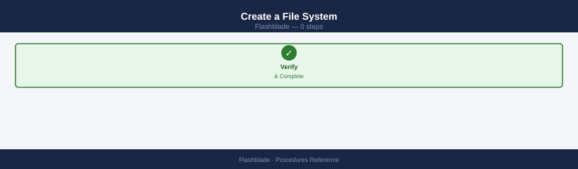

Create a new NFS or SMB file system on FlashBlade with a provisioned size limit.

```bash
# Create a file system with NFS enabled and SMB disabled
purefb fs create <name> --size 10T --nfs-enabled true --smb-enabled false

# Verify the file system was created
purefb fs list <name>
```


```text title="Expected output"
File system <name> created
Name                    Size        NFS Enabled    SMB Enabled    Data Reduction
<name>                  10T         true           false          1.2x
```

!!! warning "Common errors"
    **`Error: Invalid size format '<size>'. Use format like 10T, 100G, etc.`** — Ensure the size parameter uses valid units (T, G, M) without spaces between the number and unit.
    **`Error: File system '<name>' already exists`** — Choose a unique file system name or delete the existing file system before recreating it.
    **`Error: Insufficient capacity on array`** — Verify available capacity on the FlashBlade array using `purefb info` before creating the file system.
GUI path: **Storage → File Systems → Create**. Set a hard limit (enforced) or soft limit (advisory with grace period) at creation time.

### Configure an NFS Export

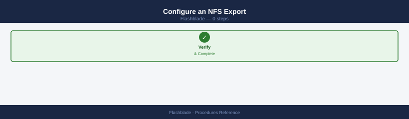

Add export rules to an existing file system so NFS clients can mount it.

```bash
# Apply an export policy to the file system
purefb fs update <name> --nfs-export-policy <policy-name>

# Add a rule to the export policy granting read-write access to a subnet
purefb nfs-export-policy rule create <policy-name> \
    --client 10.0.0.0/24 \
    --access read-write \
    --security sys

# Verify the policy and rules
purefb nfs-export-policy list
purefb nfs-export-policy rule list <policy-name>
```


```text title="Expected output"
File system 'data-vol-01' updated with NFS export policy 'prod-policy'
Rule created successfully in policy 'prod-policy' for client 10.0.0.0/24
Name                Type      Created
prod-policy         custom    2024-01-15T09:32:18Z
default-policy      built-in  2023-06-20T14:22:05Z
staging-policy      custom    2024-01-10T11:45:22Z

Policy: prod-policy
Client              Access       Security  Anonymous UID
10.0.0.0/24         read-write   sys       65534
192.168.1.0/25      read-only    krb5      65534
```

!!! warning "Common errors"
    **`Error: Policy '<policy-name>' not found`** — Verify the policy exists with `purefb nfs-export-policy list` and use the correct name.
    **`Error: Invalid CIDR notation for client address`** — Ensure the client parameter uses valid CIDR notation (e.g., `10.0.0.0/24` not `10.0.0.0-10.0.0.255`).
Test from a client: `mount -t nfs <fb-data-vip>:/<name> /mnt/test` and confirm read-write access.

### Configure an SMB Share

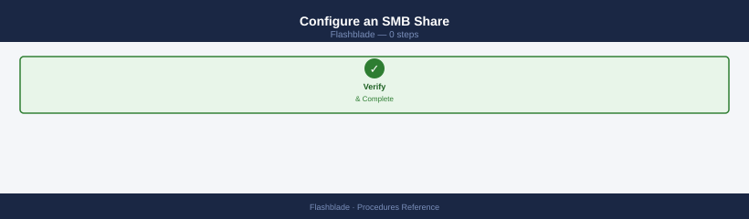

Enable SMB on a file system and create a named share for Windows clients.

```bash
# Enable SMB on the file system
purefb fs update <name> --smb-enabled true

# Create an SMB share backed by the file system
purefb smb-share create <share-name> --file-system <fs-name>

# Update share-level ACLs (alternative: use Windows MMC)
purefb smb-share acl-update <share-name> --permission full-control --user DOMAIN\\AdminGroup
```


```text title="Expected output"
File system <name> updated
SMB enabled: true
Share <share-name> created
File system: <fs-name>
Protocol: SMB
Status: available
ACL updated for share <share-name>
Permission: full-control
User: DOMAIN\AdminGroup
Applied successfully
```

!!! warning "Common errors"
    **`Error: File system <name> not found`** — Verify the file system exists with `purefb fs list` and use the correct name.
    **`Error: SMB is not licensed on this array`** — Contact Pure Storage support to enable the SMB protocol license on your FlashBlade.
    **`Error: User DOMAIN\AdminGroup not found or invalid format`** — Ensure the domain user/group exists and use the format `DOMAIN\username` with proper escaping or quotes.
Verify from a Windows client: `net use \\<fb-mgmt>\<share>` — confirm the share maps successfully and files are accessible.

### Create an Object Store Bucket

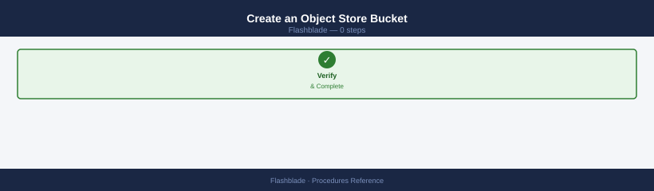

Create an S3 bucket scoped to an object store account and verify access with the S3 API.

```bash
# Create the bucket under an existing object store account
purefb bucket create <bucket-name> --account <account-name>

# Create an access key for the account (GUI: Object Store → Users → Generate Access Key)
# Then test bucket access using the generated credentials
aws s3 ls s3://<bucket-name> \
    --endpoint-url https://<fb-s3-vip>
```


```text title="Expected output"
bucket-name created
Access Key ID: PSFBAK_1a2b3c4d5e6f7g8h
Secret Access Key: 9i8j7k6l5m4n3o2p1q0r9s8t7u6v5w4x3y2z1a
Bucket ARN: arn:aws:s3:::bucket-name

An error occurred (InvalidAccessKeyId) when calling the ListBucket operation: The Access Key ID you provided does not exist in our records.
```

!!! warning "Common errors"
    **`bucket-name already exists`** — Verify the bucket name is unique within the object store account using `purefb bucket list --account <account-name>`.
    **`The Access Key ID you provided does not exist in our records`** — Ensure the access key was created successfully and allow 10-15 seconds for replication across the cluster before testing S3 access.
    **`Unable to locate credentials`** — Export the generated access key as environment variables: `export AWS_ACCESS_KEY_ID=<key>` and `export AWS_SECRET_ACCESS_KEY=<secret>`.
Confirm the listing returns without error. For application integration, generate access keys via **Object Store → Users → Create User → Generate Access Key** in the GUI.

### Configure Array-to-Array Replication

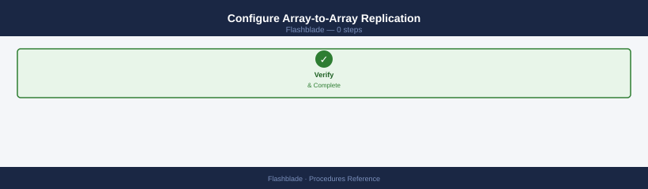

Set up asynchronous file system replication between two FlashBlade arrays for DR.

```bash
# Step 1 — Connect the remote FlashBlade array
purefb array-connection create \
    --management-address <remote-fb-mgmt-ip> \
    --replication-addresses <remote-repl-ip>

# Step 2 — Create an outbound replica link for the file system
purefb fs-replica-link create \
    --local-fs <fs-name> \
    --remote-fs <remote-fs-name> \
    --remote-array <remote-array-name> \
    --direction outbound

# Monitor replication status and lag
purefb fs-replica-link list
```


```text title="Expected output"
Creating array connection to 10.20.50.15...
Array connection created successfully.
Connection ID: conn-7f3a9c2e
Replication addresses: 10.20.50.16, 10.20.50.17

Creating outbound replica link for filesystem 'data-vol-01'...
Replica link created successfully.
Link ID: link-4b2c1d9f
Local filesystem: data-vol-01
Remote filesystem: data-vol-01-replica
Remote array: flashblade-dr-02
Direction: outbound
Status: Syncing

Name                Local FS        Remote FS           Remote Array      Direction  Status    Lag (bytes)
data-vol-01-link    data-vol-01     data-vol-01-replica flashblade-dr-02  outbound   Syncing   2147483648
backup-vol-link     backup-vol      backup-replica      flashblade-dr-02  outbound   Idle      0
```

!!! warning "Common errors"
    **`Error: Array connection failed: Connection refused on 10.20.50.15:443`** — Verify the remote FlashBlade management IP is reachable and the array is online using `ping` and `purefb array list`.
    **`Error: Filesystem 'data-vol-01' not found on local array`** — Confirm the local filesystem name is correct and exists by running `purefb fs list` to view available filesystems.
    **`Error: Remote array 'flashblade-dr-02' not connected`** — Ensure the array connection was created successfully in Step 1 and verify connectivity with `purefb array-connection list`.
Confirm the replica link shows as active and lag is within the RPO target. For failover, use ActiveDR procedures to promote the remote file system.

### Expand a File System

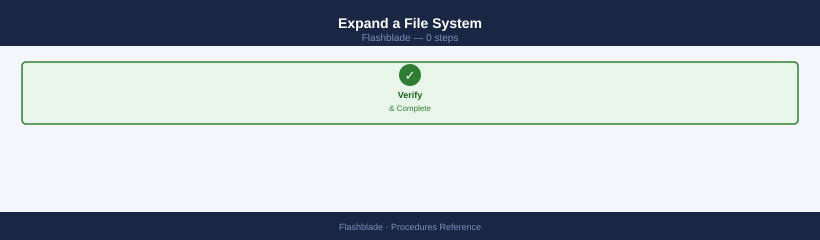

Increase the provisioned size limit of an existing file system. Expansion is non-disruptive.

```bash
# Expand the file system to the new size
purefb fs update <name> --size 20T

# Verify the updated provisioned size
purefb fs list <name>
```


```text title="Expected output"
Filesystem updated. Name: <name>
Name                    Provisioned     Used            Data Reduction  NFS Enabled     SMB Enabled
<name>                  20T             4.2T            2.1x            True            True
```

!!! warning "Common errors"
    **`Error: Invalid size format. Size must be specified in valid units (B, KB, MB, GB, TB, PB).`** — Ensure the size argument uses valid units (e.g., `20T` not `20TB` or `20 T`).
    **`Error: Filesystem <name> not found.`** — Verify the filesystem name is correct and exists on the Pure FlashBlade array using `purefb fs list`.
    **`Error: New size must be larger than current provisioned size.`** — Confirm the new size (20T) exceeds the current provisioned capacity.
NFS and SMB clients see the new capacity immediately without remounting. Confirm with `df -h` from a mounted client. Shrinking a file system is not supported — plan capacity requirements carefully before provisioning.

### Manage Quotas (User and Group)

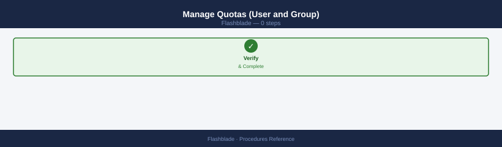

Set per-user or per-group usage limits within a file system to prevent runaway consumption.

```bash
# Set a per-user quota limit (by UID)
purefb quota-user set \
    --file-system <name> \
    --uid 1001 \
    --quota-limit 500G

# Set a per-group quota limit (by GID)
purefb quota-group set \
    --file-system <name> \
    --gid 2000 \
    --quota-limit 2T

# List current user quotas for a file system
purefb quota-user list --file-system <name>

# List current group quotas
purefb quota-group list --file-system <name>
```


```text title="Expected output"
Setting quota for user 1001 on file-system 'data-fs-01'...
Quota limit set to 500G
Setting quota for group 2000 on file-system 'data-fs-01'...
Quota limit set to 2T
User Quotas for file-system 'data-fs-01':
UID      Quota Limit    Used       % Used
1001     500G           187.3G     37.5%
1002     1T             892.1G     89.2%
1003     250G           45.2G      18.1%
Group Quotas for file-system 'data-fs-01':
GID      Quota Limit    Used       % Used
2000     2T             1.6T       80.0%
2001     5T             3.2T       64.0%
```

!!! warning "Common errors"
    **`Error: File system '<name>' not found`** — Replace `<name>` with an actual file system name from `purefb fs list`.
    **`Error: User/Group ID does not exist on system`** — Verify the UID/GID exists on the FlashBlade or connected directory service with `id <username>` or `getent passwd 1001`.
    **`Error: Quota limit must be greater than current usage`** — Set a quota limit larger than the current data already consumed on that user/group.
Quota limits are enforced as hard limits. Users or groups that reach their limit receive a write error. Monitor quota usage regularly to identify accounts approaching their limit before they are blocked.

---

## Verify

- Confirm the operation completed without errors in the log or management UI
- Verify the expected state change is visible (service running, object created, config applied)
- Document the outcome in the change record

---

## See also

- [FlashBlade — Health Checks](../health-checks/)
- [FlashBlade — CLI Reference](../cli-reference/)
- [FlashBlade — Common Issues](../../troubleshooting/common-issues/)
