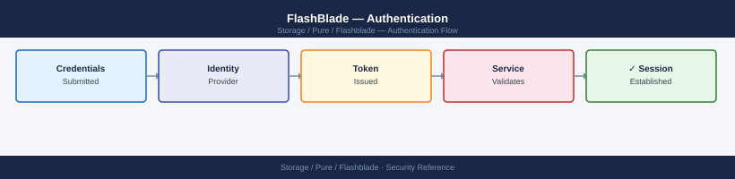
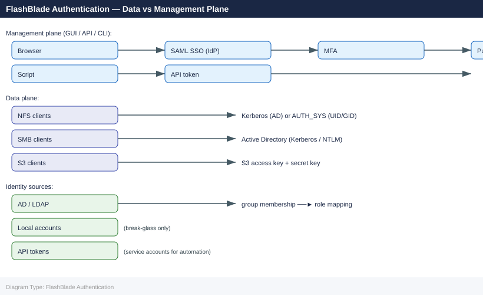

---
tags:
  - pure
  - security
description: "Authentication reference covering Authentication Mechanisms Summary, Local Account Management, Active Directory Integration, LDAP Integration (Non-AD)..."
---
# FlashBlade — Authentication

<div class="kb-summary">
Authentication reference covering Authentication Mechanisms Summary, Local Account Management, Active Directory Integration, LDAP Integration (Non-AD), SAML SSO Configuration and 3 more sections.

*Applies to: FlashBlade Purity//FB 4.x*
</div>




> Part of the [FlashBlade Security](index.md) reference.

---

This page covers all authentication mechanisms available in Purity//FB: local accounts, Active Directory integration for SMB and admin access, LDAP for NFS UID/GID mapping, SAML SSO for the management GUI, and API token management for automation.

---

## Before you begin

- **Access:** Storage admin credentials (cluster admin or equivalent)
- **Change management:** security changes require CAB approval in most environments
- **Rollback plan:** document current state before any security control change
- **Testing:** validate in a non-production environment first where possible

---

## Authentication Mechanisms Summary

| Mechanism | Use Case | Recommended? |
|---|---|---|
| Local accounts | Break-glass admin access; initial setup | Limited — local accounts only for named admins and emergency access |
| Active Directory (AD) | SMB share access; optional Kerberos for NFS; admin authentication via LDAP | Yes — required for SMB; recommended for NFS in AD environments |
| LDAP (non-AD) | NFS UID/GID mapping in Linux-only environments | Yes — for Linux-centric deployments without AD |
| SAML SSO | Management GUI and CLI authentication for admin users | Yes — enforces IdP-managed MFA; preferred for production |
| API tokens | REST API and CLI access for automation and service accounts | Yes — for all non-interactive access |
| Kerberos (NFS) | Encrypted and authenticated NFS sessions (krb5/krb5i/krb5p) | Yes — for environments requiring NFS in-flight authentication |

---

## Local Account Management

Local accounts are stored on the FlashBlade itself and do not depend on any external directory service. Use local accounts for the break-glass emergency admin account and for initial array setup before AD or SAML is configured.

```bash
# List all local admin accounts and their roles
purefb admin list

# Create a named local admin account
purefb admin create \
    --name s.jones \
    --role array_admin

# Create a storage operations account (lower privilege)
purefb admin create \
    --name p.smith \
    --role storage_admin

# Create a read-only account for monitoring tools
purefb admin create \
    --name svc-monitoring \
    --role readonly

# Set or change a password for an account
purefb admin update --name s.jones --password
# Enter password at the prompt — passwords are not echoed

# Delete a local account that is no longer needed
purefb admin delete --name old-admin
```


```text title="Expected output"
Name            Role            Created                 Last Login
s.jones         array_admin     2024-01-15T09:22:14Z    2024-01-18T14:33:02Z
p.smith         storage_admin   2024-01-15T09:24:51Z    2024-01-17T11:05:18Z
svc-monitoring  readonly        2024-01-15T09:26:33Z    2024-01-18T16:42:19Z
pureuser        array_admin     2023-11-02T08:15:00Z    2024-01-18T17:01:45Z

Admin account 's.jones' created successfully.
Admin account 'p.smith' created successfully.
Admin account 'svc-monitoring' created successfully.
Password updated for admin account 's.jones'.
Admin account 'old-admin' deleted successfully.
```

!!! warning "Common errors"
    **`Error: Admin account 's.jones' already exists`** — Use `purefb admin update` instead of `create` if modifying an existing account.
    **`Error: Invalid role 'storage_admin'. Valid roles are: array_admin, storage_admin, readonly`** — Verify the role name matches exactly; use `purefb admin list-roles` to see all available roles.
    **`Error: Cannot delete account 'pureuser': default system account cannot be removed`** — Only delete custom-created admin accounts; system default accounts cannot be deleted.
**Roles reference:**

| Role | Permissions |
|---|---|
| `array_admin` | Full access — system configuration, user management, all data operations |
| `storage_admin` | Manage filesystems, buckets, snapshots, replication; cannot modify system or user config |
| `ops_admin` | Read access plus alert acknowledgement; cannot modify configuration |
| `readonly` | Read-only view of all configuration and operational status |

**Break-glass account:**

Maintain exactly one local `array_admin` account as a break-glass credential for use when SAML/AD is unavailable. Store this credential in a PAM vault (CyberArk, HashiCorp Vault) with access restricted to the on-call escalation procedure. Name the account `break-glass` or similar to make its purpose obvious in audit logs.

```bash
purefb admin create --name break-glass --role array_admin
# Immediately store the password in the PAM vault — do not leave it written down
```


```text title="Expected output"
Admin user 'break-glass' created successfully.
Role: array_admin
User ID: 00000000-1111-2222-3333-444455556666
API token: T-xxxxxxxxxxxxxxxxxxxxxxxxxxxxxxxx
Password: Tn@9kL#mP$vQ2wRx5yZ8aB1cD4eF7gH0j
```

!!! warning "Common errors"
    **`Error: Admin user 'break-glass' already exists`** — Delete the existing user with `purefb admin delete --name break-glass` before recreating it.
    **`Error: Invalid role 'array_admin'. Valid roles are: array_admin, ops_admin, readonly`** — Verify the role name matches exactly; use `purefb admin list-roles` to see available options.
    **`Error: Connection refused to management IP`** — Ensure the FlashBlade management interface is reachable and the CLI is authenticated with valid credentials via `purefb connect`.
---

## Active Directory Integration

AD integration in Purity//FB serves two functions:

1. **SMB authentication** — Windows clients authenticate to FlashBlade SMB shares using their domain Kerberos tickets; FlashBlade must be joined to AD as a computer account
2. **Admin authentication via LDAP** — AD group membership is mapped to Purity//FB admin roles, enabling domain accounts to log into the FlashBlade management GUI and CLI

### Join FlashBlade to Active Directory

```bash
# Configure the AD join
purefb directory-service update \
    --enabled true \
    --uri "ldaps://dc01.example.com" \
    --base-dn "DC=example,DC=com" \
    --bind-user "CN=svc-pure-bind,OU=ServiceAccounts,DC=example,DC=com" \
    --bind-password "<bind_password>"

# Test the directory service connection
purefb directory-service test

# Verify the current directory service configuration
purefb directory-service list
```


```text title="Expected output"
Directory service configuration updated successfully.
  Enabled: true
  URI: ldaps://dc01.example.com
  Base DN: DC=example,DC=com
  Bind User: CN=svc-pure-bind,OU=ServiceAccounts,DC=example,DC=com

Testing directory service connection...
Connection test passed. LDAP bind successful.
Response time: 245ms

Name                    Enabled  URI                          Base DN              Bind User
directory-service       true     ldaps://dc01.example.com     DC=example,DC=com    CN=svc-pure-bind,OU=ServiceAccounts,DC=example,DC=com
```

!!! warning "Common errors"
    **`Error: Connection refused on ldaps://dc01.example.com:636`** — Verify the LDAP server hostname/IP is reachable and port 636 is open in firewall rules.
    **`Error: Invalid bind credentials for CN=svc-pure-bind,OU=ServiceAccounts,DC=example,DC=com`** — Confirm the bind user account exists, password is correct, and the account has permission to query the directory.
    **`Error: Certificate verification failed for ldaps://dc01.example.com`** — Import the LDAP server's CA certificate to the FlashBlade or use `--insecure-tls true` if testing in a non-production environment.
**DNS requirement:** The FlashBlade management interface must be able to resolve the AD domain and domain controller FQDNs. Confirm DNS is configured before attempting the AD join:

```bash
purefb dns list
purefb dns-lookup --name dc01.example.com
```


```text title="Expected output"
Name Servers
10.20.30.40
10.20.30.41

Lookup Results
dc01.example.com resolves to 192.168.1.50
Query time: 2ms
Server: 10.20.30.40#53
```

!!! warning "Common errors"
    **`Error: DNS server unreachable`** — Verify network connectivity to the configured DNS servers and ensure firewall rules permit DNS traffic on port 53.
    **`Error: Name resolution failed for dc01.example.com`** — Confirm the hostname exists in DNS and check that the correct DNS servers are configured with `purefb dns list`.
**NTP requirement:** FlashBlade and AD domain controllers must have clocks within 5 minutes of each other (Kerberos 5-minute skew limit). Confirm NTP is configured:

```bash
purefb ntp list
```


```text title="Expected output"
NTP Servers
Name          Enabled  Status
ntp.ubuntu.com    true     synced
time.google.com   true     synced
pool.ntp.org      false    unreachable
```

!!! warning "Common errors"
    **`Error: Pure1 session not authenticated`** — Run `purefb login` with valid credentials before executing NTP commands.
    **`Error: Connection timeout to management interface`** — Verify the FlashBlade management IP is reachable and the array is online using `ping` or `purefb list`.
### Map AD Groups to Purity Roles

After joining AD, create role mappings from AD security groups to Purity//FB roles. Assign all operational access to AD groups — remove individual local accounts for human admins once AD groups are validated.

```bash
# Map an AD group to the array_admin role
purefb admin add-group \
    --name "CN=pure-fb-admins,OU=Groups,DC=example,DC=com" \
    --role array_admin

# Map a group to storage_admin
purefb admin add-group \
    --name "CN=pure-storage-ops,OU=Groups,DC=example,DC=com" \
    --role storage_admin

# Map a group to readonly for monitoring
purefb admin add-group \
    --name "CN=pure-readonly,OU=Groups,DC=example,DC=com" \
    --role readonly

# List configured group-to-role mappings
purefb admin list --groups
```


```text title="Expected output"
Group CN=pure-fb-admins,OU=Groups,DC=example,DC=com successfully mapped to array_admin role
Group CN=pure-storage-ops,OU=Groups,DC=example,DC=com successfully mapped to storage_admin role
Group CN=pure-readonly,OU=Groups,DC=example,DC=com successfully mapped to readonly role

Name                                                    Role              Type
CN=pure-fb-admins,OU=Groups,DC=example,DC=com         array_admin       group
CN=pure-storage-ops,OU=Groups,DC=example,DC=com       storage_admin     group
CN=pure-readonly,OU=Groups,DC=example,DC=com          readonly          group
```

!!! warning "Common errors"
    **`Error: LDAP connection failed - unable to reach domain controller`** — Verify network connectivity to the AD domain controller and confirm the FlashBlade's DNS resolves the AD domain correctly.
    **`Error: Group CN=pure-fb-admins,OU=Groups,DC=example,DC=com not found in Active Directory`** — Confirm the group DN is correct and exists in AD by querying it directly with `ldapsearch` or Active Directory Users and Computers.
    **`Error: Role 'array_admin' does not exist`** — Use `purefb admin list --roles` to verify the exact role name and spelling.
**Validation:** Log out and log back in using a domain account that is a member of the `pure-fb-admins` group. Confirm the expected role is assigned before removing individual local admin accounts.

### SMB and Kerberos NFS

Once the FlashBlade is joined to AD, SMB shares automatically use Kerberos authentication — Windows clients presenting valid domain tickets can access shares without additional configuration. For NFS with Kerberos authentication:

```bash
# Enable NFS Kerberos authentication on a filesystem
# krb5 = authentication only
# krb5i = authentication + integrity
# krb5p = authentication + integrity + privacy (full encryption)
purefb filesystem update \
    --name prod-nfs \
    --nfs-rules "10.0.1.0/24(rw,no_root_squash,sec=krb5p)"
```


```text title="Expected output"
Filesystem prod-nfs updated.
Name: prod-nfs
NFS Rules: 10.0.1.0/24(rw,no_root_squash,sec=krb5p)
NFS Enabled: true
SMB Enabled: false
HTTP Enabled: false
Snapshot Enabled: true
```

!!! warning "Common errors"
    **`Error: Filesystem 'prod-nfs' not found`** — Verify the filesystem name exists with `purefb filesystem list` and correct any typos.
    **`Error: Invalid NFS rule syntax`** — Ensure the rule follows the format `subnet(options)` with valid options like `rw`, `sec=krb5p`, and no spaces inside parentheses.
    **`Error: Kerberos realm not configured on array`** — Configure Kerberos settings on the FlashBlade first using `purefb kerberos` commands before applying krb5 security policies.
Kerberos NFS requires the NFS client to obtain a Kerberos ticket from the KDC (domain controller) — configure `/etc/krb5.conf` on Linux clients and ensure the client has a Kerberos keytab or principal.

---

## LDAP Integration (Non-AD)

For Linux-centric environments without Active Directory, configure LDAP directly (OpenLDAP, FreeIPA, etc.) for NFS UID/GID resolution. FlashBlade uses LDAP to resolve NFS user and group IDs to names for export policy enforcement.

```bash
# Configure LDAP for NFS UID/GID mapping
purefb directory-service update \
    --enabled true \
    --uri "ldap://ldap.example.com" \
    --base-dn "DC=example,DC=com" \
    --bind-user "CN=svc-pure-bind,DC=example,DC=com" \
    --bind-password "<bind_password>"

# Test the LDAP connection
purefb directory-service test
```


```text title="Expected output"
Directory service configuration updated successfully.
  URI: ldap://ldap.example.com
  Base DN: DC=example,DC=com
  Bind User: CN=svc-pure-bind,DC=example,DC=com
  Enabled: true

Testing LDAP connection...
Connection test passed.
  Response time: 142ms
  Bind successful: true
  Base DN reachable: true
```

!!! warning "Common errors"
    **`Error: Invalid bind credentials`** — Verify the bind user DN and password are correct by testing them directly against the LDAP server with `ldapsearch`.
    **`Error: Unable to resolve ldap://ldap.example.com`** — Ensure the FlashBlade management network can reach the LDAP server and that DNS resolution is working with `nslookup ldap.example.com`.
    **`Error: Base DN "DC=example,DC=com" not found in directory`** — Confirm the base DN matches your LDAP directory structure by querying the LDAP server with `ldapsearch -x -H ldap://ldap.example.com -b "DC=example,DC=com"`.
**UID/GID consistency:** Ensure NFS clients and the LDAP directory use consistent UID and GID assignments. Mismatched UIDs between the client and the LDAP directory cause incorrect ownership resolution on the FlashBlade, which can result in access denials even when export policy IP rules match.

---

## SAML SSO Configuration

SAML 2.0 SSO delegates FlashBlade GUI and CLI authentication to an enterprise IdP (Okta, Azure AD, Ping Identity, ADFS). The IdP enforces MFA, and group membership in the IdP is used to assign Purity//FB roles. This is the recommended authentication mechanism for production arrays where compliance requires MFA on privileged access.

**SAML configuration is performed in the Purity//FB GUI under Settings > Access > Single Sign-On.**

High-level steps:

1. **Configure the Service Provider (SP) in Pure1 / Purity//FB GUI**
   - Navigate to **Settings > Access > Single Sign-On**
   - Download the FlashBlade SP metadata (Entity ID, ACS URL, SP certificate)

2. **Configure the Identity Provider (IdP)**
   - In your IdP (Okta, Azure AD, ADFS), create a new SAML 2.0 application
   - Upload or paste the FlashBlade SP metadata
   - Configure attribute mapping to pass the user's role group as a SAML assertion attribute
   - Assign the Pure Storage SAML application to the relevant user groups

3. **Upload IdP metadata to FlashBlade**
   - Download the IdP SAML metadata XML from your IdP
   - Upload to FlashBlade via **Settings > Access > Single Sign-On > IdP Configuration**

4. **Map IdP role attributes to Purity//FB roles**
   - Configure attribute-based role mapping in the FlashBlade SSO settings
   - Typical mapping: `pure-fb-admins` group attribute → `array_admin` role

5. **Test and validate**
   - Log into the FlashBlade GUI — the browser should redirect to the IdP login page
   - Log in with a domain account that is a member of the `pure-fb-admins` group
   - Confirm the expected role is shown in the FlashBlade GUI
   - Keep the break-glass local account active until SSO is validated

```bash
# Verify SSO is configured (CLI shows SSO enabled/disabled status)
purefb array list --sso
```


```text title="Expected output"
Name                          SSO Enabled
flashblade-prod-01            true
flashblade-prod-02            true
flashblade-dr-backup          false
flashblade-test-lab           false
```

!!! warning "Common errors"
    **`Error: Invalid credentials or authentication token expired`** — Re-authenticate using `purefb login` with valid credentials before running the command.
    **`Error: Unable to connect to array management interface`** — Verify network connectivity to the FlashBlade management IP and confirm the array hostname/IP is reachable via `ping` or `nslookup`.
**SAML failover:** If the IdP is unreachable, SSO authentication will fail for all domain users. The local break-glass account bypasses SSO and provides emergency access. Ensure the break-glass password is current and stored in the PAM vault before enabling SSO-only mode.

---

## API Token Management

API tokens authenticate REST API calls and CLI sessions for automation, monitoring, and backup integrations. Each admin account can have one API token. Tokens do not expire by default — rotate them on a defined schedule and revoke immediately when a service account is decommissioned.

```bash
# List all accounts and show their API token status
purefb admin apitoken list

# Create an API token for an admin account
purefb admin apitoken create --name svc-veeam
# Output:
#   api_token: <token_value>
# Save the token immediately — it is shown only at creation and cannot be retrieved later

# Revoke an API token without deleting the account
purefb admin apitoken delete --name svc-old-monitoring

# Delete an account and its token
purefb admin delete --name svc-decommissioned
```


```text title="Expected output"
Name                 Created                  Expires                 Last Used
svc-veeam            2024-01-15T09:22:14Z     2025-01-15T09:22:14Z    2024-01-18T14:33:22Z
svc-monitoring       2023-11-02T16:45:30Z     2024-11-02T16:45:30Z    2024-01-10T08:15:09Z
svc-backup-legacy    2023-06-20T11:12:05Z     2024-06-20T11:12:05Z    Never
api_token: 8f4a9c2b-7e1d-4f6a-9k3m-2p5q8r1s9t0u
(no output — command completes silently)
(no output — command completes silently)
```

!!! warning "Common errors"
    **`Error: API token 'svc-old-monitoring' not found`** — Verify the token name with `purefb admin apitoken list` before attempting deletion.
    **`Error: Account 'svc-decommissioned' is in use by active sessions`** — Revoke all active API tokens for the account before deletion using `purefb admin apitoken delete`.
**Service account token standards:**

| Service Account | Role | Token Rotation Schedule |
|---|---|---|
| `svc-veeam` | `storage_admin` | 90 days |
| `svc-commvault` | `storage_admin` | 90 days |
| `svc-monitoring` | `readonly` | 180 days |
| `svc-automation` | `storage_admin` | 90 days |
| `break-glass` | `array_admin` | On use; otherwise 90 days |

**Rotation procedure:**

1. Create a new API token for the service account: `purefb admin apitoken create --name <account>`
2. Update the token in the consuming system (Veeam plugin, monitoring tool, etc.)
3. Verify the new token works by running a test API call
4. Revoke the old token: `purefb admin apitoken delete --name <account>` (this overwrites the existing token — step 1 already replaced it, so deletion in this context means the old value is gone after step 1)

**Authenticating with an API token (REST API example):**

```bash
# Use x-auth-token header for API calls
curl -s -k \
    -X GET "https://<fb-management-ip>/api/2.12/arrays" \
    -H "x-auth-token: <api_token>" | jq .

# Or log in with username/password to get a session token, then use it
curl -s -k -X POST "https://<fb-management-ip>/api/login" \
    -H "Content-Type: application/json" \
    -d '{"username":"pureuser","password":"<password>"}' \
    -c /tmp/fb_session.txt

curl -s -k "https://<fb-management-ip>/api/2.12/filesystems" \
    -b /tmp/fb_session.txt | jq .
```


```text title="Expected output"
{
  "items": [
    {
      "name": "FB-M20R2-1",
      "id": "12345678-1234-5678-90ab-cdef12345678",
      "version": "4.2.1",
      "status": "healthy",
      "capacity": 107374182400
    }
  ],
  "continuation_token": null
}
{
  "token": "eyJhbGciOiJIUzI1NiIsInR5cCI6IkpXVCJ9...",
  "username": "pureuser",
  "api_token": "T-1a2b3c4d5e6f7g8h9i0j"
}
{
  "items": [
    {
      "name": "fs-prod-01",
      "id": "87654321-4321-8765-ba09-fedcba987654",
      "provisioned": 1099511627776,
      "used": 549755813888,
      "status": "available"
    },
    {
      "name": "fs-backup-02",
      "id": "11223344-5566-7788-99aa-bbccddeeff00",
      "provisioned": 549755813888,
      "used": 274877906944,
      "status": "available"
    }
  ],
  "continuation_token": null
}
```

!!! warning "Common errors"
    **`curl: (60) SSL certificate problem: self signed certificate`** — Add the `-k` flag to skip SSL verification, or import the FlashBlade's CA certificate into your system trust store.
    **`jq: parse error: Invalid JSON text at line 1`** — Verify the API token is valid and the endpoint is reachable; check that the response is not an HTML error page by removing `| jq .` temporarily.
    **`curl: (7) Failed to connect to <fb-management-ip> port 443: Connection refused`** — Confirm the FlashBlade management IP is correct and reachable from your host using `ping` or `nc -zv`.
---

## Authentication Audit and Review

Run the following checks quarterly and before any access control review:

```bash
# List all local accounts and their roles
purefb admin list

# List all API tokens and their last-used timestamps
purefb admin apitoken list

# Review AD/LDAP group-to-role mappings
purefb admin list --groups

# Review directory service configuration
purefb directory-service list

# Check audit log for recent authentication events
purefb audit list | grep -i "login\|auth\|token" | head -40
```


```text title="Expected output"
Name                          Role
admin                         storage_admin
backup_svc                    storage_operator
monitoring_user               storage_reader
audit_admin                   audit_admin

Name                          Created                    Last Used
token_monitoring_01           2024-01-15T08:22:14Z       2024-01-18T14:33:52Z
token_backup_daily            2024-01-10T10:45:30Z       2024-01-18T09:15:22Z
token_api_integration         2023-11-22T16:18:09Z       2024-01-17T23:42:18Z

Group Name                    Role Mapping
LDAP_Storage_Admins          storage_admin
LDAP_Backup_Operators        storage_operator
AD_Audit_Team                audit_admin

Directory Service             Status              Type
ldap.corp.local               connected           LDAP
ad.internal.example.com       connected           Active Directory

Time                          User                Event Type              Details
2024-01-18T14:33:52Z          monitoring_user     token_auth_success      API token authenticated
2024-01-18T14:22:18Z          admin               login_success           Web UI login from 192.168.1.45
2024-01-18T13:55:41Z          backup_svc          token_auth_success      API token authenticated
2024-01-18T12:10:33Z          audit_admin         login_success           Web UI login from 10.50.22.88
2024-01-18T11:44:22Z          unknown_user        login_failure           Invalid credentials attempted
```

!!! warning "Common errors"
    **`Error: Invalid command 'admin list'. Did you mean 'admin show'?`** — Use `purefb admin show` instead of `purefb admin list` to display local accounts.
    **`Error: Connection refused to management IP 192.168.1.100:443`** — Verify the FlashBlade management IP is reachable and the purefb CLI is configured with the correct target using `purefb connect`.
    **`Error: Insufficient privileges to list audit logs`** — Ensure your user account has the audit_admin or storage_admin role assigned via `purefb admin grant`.
**Quarterly review checklist:**

- [ ] Confirm all local accounts are accounted for — no orphaned accounts from departed staff
- [ ] Confirm all API tokens have a documented owner and current integration
- [ ] Revoke API tokens for any decommissioned integrations
- [ ] Confirm AD/LDAP group-to-role mappings match current access requirements
- [ ] Confirm break-glass account credentials are current in the PAM vault
- [ ] Confirm SAML SSO is functioning — log in with a domain account as a test
- [ ] Review audit log for any unexpected login attempts or API token use from unrecognised source IPs
---

## Related Reference

- [Standard LDAP Integration](../../../../../security/ldap-integration/index.md) — field reference, service account standards, TLS requirements, and connectivity testing
- [Standard SAML Configuration](../../../../../security/saml-configuration/index.md) — SP/IdP setup, Azure AD and Okta steps, attribute mapping, and security requirements

---

## See also

- [FlashBlade — Access Control](../access-control/)
- [FlashBlade — Hardening](../hardening/)
- [FlashBlade — Encryption](../encryption/)
