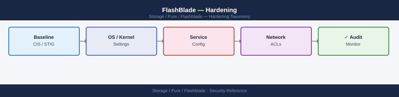
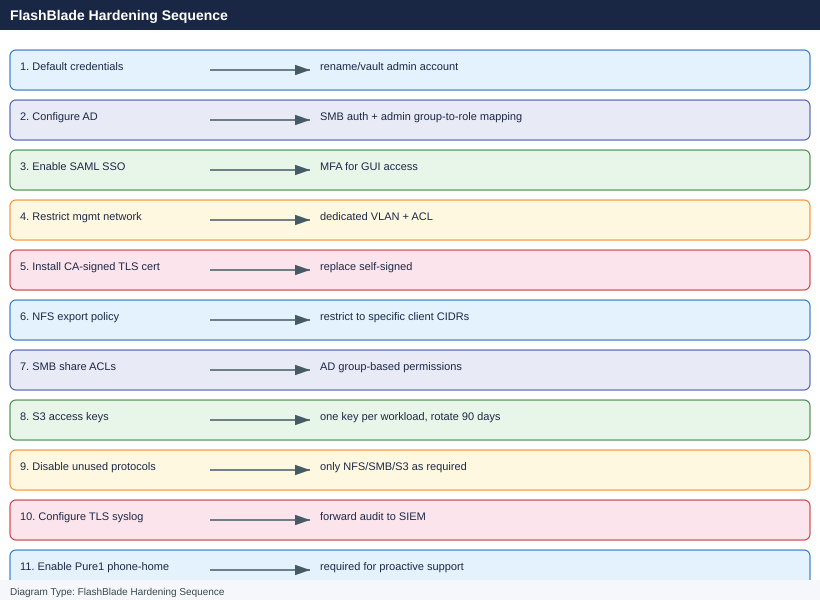

---
tags:
  - pure
  - security
---
# FlashBlade — Hardening

<div class="kb-summary">
Hardening reference covering Hardening Checklist, Step-by-Step Controls, Post-Hardening Verification.

*Applies to: FlashBlade Purity//FB 4.x*
</div>




> Part of the [FlashBlade Security](index.md) reference.

---

This page covers the ordered hardening steps to apply on every new FlashBlade before it enters production. Apply these steps after initial network and identity configuration and before connecting production NFS, SMB, or S3 clients.

---

## Before you begin

- **Access:** Storage admin credentials (cluster admin or equivalent)
- **Change management:** security changes require CAB approval in most environments
- **Rollback plan:** document current state before any security control change
- **Testing:** validate in a non-production environment first where possible

---

## Hardening Checklist

Work through these steps in order. Each control builds on the previous ones.

| # | Control | Status | Notes |
|---|---|---|---|
| 1 | Change default credentials and create named admin accounts | | |
| 2 | Configure AD/LDAP authentication and map groups to Purity roles | | |
| 3 | Enforce MFA via SAML SSO | | |
| 4 | Restrict management network access to dedicated management VLAN | | |
| 5 | Install a CA-signed TLS certificate on the management interface | | |
| 6 | Disable unused data protocols | | |
| 7 | Configure SNMPv3 and remove any legacy SNMP communities | | |
| 8 | Enable SafeMode snapshots | | |
| 9 | Verify encryption at rest is active | | |
| 10 | Restrict NFS exports to specific client IP ranges | | |
| 11 | Review and restrict S3 bucket policies | | |
| 12 | Configure syslog/audit forwarding to SIEM | | |
| 13 | Set session idle timeout | | |
| 14 | Audit and disable unused API tokens | | |
| 15 | Configure SMTP with TLS for alert emails | | |

---

## Step-by-Step Controls

### 1. Change Default Credentials and Create Named Admin Accounts

The factory default `pureuser` account credentials are documented in the array's initial setup guide and may be known to anyone who has been involved in the physical installation. Change the password immediately and create named accounts for the storage team.

```bash
# Change pureuser password to a strong randomly-generated credential (20+ characters)
purefb admin update --name pureuser --password
# Enter the new password at the prompt

# Create named admin accounts for the storage team
purefb admin create --name s.jones --role array_admin
purefb admin create --name p.smith --role storage_admin
purefb admin create --name svc-monitoring --role readonly

# Create a break-glass account
purefb admin create --name break-glass --role array_admin

# Set passwords for named accounts
purefb admin update --name s.jones --password
purefb admin update --name p.smith --password
```


```text title="Expected output"
Admin s.jones created successfully.
Admin p.smith created successfully.
Admin svc-monitoring created successfully.
Admin break-glass created successfully.
Admin s.jones password updated successfully.
Admin p.smith password updated successfully.
```

!!! warning "Common errors"
    **`Error: Admin user pureuser does not exist`** — Verify the default admin account name matches your FlashBlade system configuration; some systems use `admin` instead of `pureuser`.
    **`Error: Invalid role 'storage_admin'. Valid roles are: array_admin, storage_admin, readonly, ops_admin`** — Use only valid role names from the enumerated list; `storage_admin` may not exist on your FlashBlade version—use `ops_admin` instead.
    **`Error: Password must be at least 20 characters`** — Ensure the password entered at the prompt meets the minimum 20-character requirement with mixed case, numbers, and special characters.
Store the break-glass and pureuser credentials in the organisation's PAM vault (CyberArk, HashiCorp Vault) with access restricted to the on-call escalation procedure. Document the vault path in the array's CMDB record.

---

### 2. Configure AD/LDAP Authentication

After AD integration, individual named local accounts can be removed for human admin access — role assignment comes from AD group membership.

```bash
# Configure AD directory service
purefb directory-service update \
    --enabled true \
    --uri "ldaps://dc01.example.com" \
    --base-dn "DC=example,DC=com" \
    --bind-user "CN=svc-pure-bind,OU=ServiceAccounts,DC=example,DC=com" \
    --bind-password "<bind_password>"

# Test the connection
purefb directory-service test

# Map AD groups to Purity roles
purefb admin add-group \
    --name "CN=pure-fb-admins,OU=Groups,DC=example,DC=com" \
    --role array_admin

purefb admin add-group \
    --name "CN=pure-storage-ops,OU=Groups,DC=example,DC=com" \
    --role storage_admin

purefb admin add-group \
    --name "CN=pure-readonly,OU=Groups,DC=example,DC=com" \
    --role readonly
```


```text title="Expected output"
Directory service configuration updated successfully.
  URI: ldaps://dc01.example.com
  Base DN: DC=example,DC=com
  Bind User: CN=svc-pure-bind,OU=ServiceAccounts,DC=example,DC=com
  Status: Enabled

Testing directory service connection...
Connection test passed. LDAP bind successful.
Response time: 142ms

Group CN=pure-fb-admins,OU=Groups,DC=example,DC=com added to role array_admin
Group CN=pure-storage-ops,OU=Groups,DC=example,DC=com added to role storage_admin
Group CN=pure-readonly,OU=Groups,DC=example,DC=com added to role readonly
```

!!! warning "Common errors"
    **`Error: Connection test failed. Unable to reach ldaps://dc01.example.com:636`** — Verify the LDAP server hostname/IP is reachable and port 636 is open in firewall rules.
    **`Error: LDAP bind failed: Invalid credentials for CN=svc-pure-bind`** — Confirm the bind user account exists in AD and the password is correct and not expired.
    **`Error: Group CN=pure-fb-admins,OU=Groups,DC=example,DC=com not found in directory`** — Verify the AD group DN is correct and the bind user has permissions to query that OU.
Validate: log out and log back in with a domain account in each role group to confirm access works before removing individual local accounts.

---

### 3. Enforce MFA via SAML SSO

SAML SSO delegates authentication to an enterprise IdP (Okta, Azure AD, ADFS) that enforces MFA. This is the preferred mechanism for production FlashBlade arrays where compliance requires MFA for privileged access.

Configure SSO via the Purity//FB GUI: **Settings > Access > Single Sign-On**. See [Authentication](authentication.md) for full SAML configuration steps.

```bash
# Verify SSO status after configuration
purefb array list --sso
```


```text title="Expected output"
Name                          SSO Status    SSO Provider
fb-prod-01.example.com        enabled       okta
fb-prod-02.example.com        enabled       azure-ad
fb-dev-01.example.com         disabled      none
fb-qa-01.example.com          enabled       okta
```

!!! warning "Common errors"
    **`Error: Unable to connect to array management interface on fb-prod-01.example.com:443`** — Verify network connectivity to the FlashBlade management IP and confirm the management port is accessible.
    **`Error: Authentication failed - invalid credentials or insufficient permissions`** — Ensure your Pure Storage credentials are valid and your user account has array admin privileges.
If SAML is not feasible in the short term, compensate with:
- Named account controls and PAM vault for credential management
- Network-level restriction (step 4) to limit the attack surface
- SIEM alerting for failed login attempts

---

### 4. Restrict Management Network Access

FlashBlade does not provide built-in IP-based ACLs for the management plane. Implement network controls at the infrastructure layer:

| Control | Implementation |
|---|---|
| Dedicated management VLAN | Place the management interface on a separate VLAN from all data VLANs |
| Firewall ACL | Allow TCP 22 (SSH) and TCP 443 (HTTPS/REST API) only from admin jump hosts and monitoring systems; deny all other sources |
| Jump host requirement | Require all admin access through a bastion host with MFA; the FlashBlade management IP should not be reachable from general-purpose workstations |
| No direct internet access | Management interface must not be directly internet-reachable; Pure1 phone-home uses outbound HTTPS only |

Verify the management interface VLAN assignment and confirm the management IP is not routable from untrusted networks. Document the allowed source ranges in the firewall change record.

---

### 5. Install a CA-Signed TLS Certificate

The factory default is a self-signed certificate that generates browser warnings and prevents proper certificate pinning in automation tools.

```bash
# View the current certificate — confirm it is self-signed
purefb array list --certificate

# Install a CA-signed certificate (PEM format: certificate + intermediates + key)
purefb array update --certificate /path/to/combined.pem

# Verify the new certificate is active
purefb array list --certificate
```


```text title="Expected output"
Name                 Serial              Certificate Issuer
flashblade-01        FB-7X3K9M2L1Q5R8    CN=flashblade-01,O=Pure Storage,C=US
Expires              2025-03-15T14:22:00Z
Self-Signed          true

Name                 Serial              Certificate Issuer
flashblade-01        FB-7X3K9M2L1Q5R8    CN=flashblade-01.example.com,O=Example Corp,C=US
Expires              2026-09-22T08:15:00Z
Self-Signed          false
Issuer               CN=Example Corp Root CA,O=Example Corp,C=US
```

!!! warning "Common errors"
    **`Error: certificate file not found at /path/to/combined.pem`** — Verify the file path is correct and the certificate file exists with `ls -la /path/to/combined.pem`.
    **`Error: certificate validation failed - invalid PEM format`** — Ensure the PEM file contains the certificate, intermediate chain, and private key in the correct order with proper BEGIN/END markers.
    **`Error: certificate update failed - key does not match certificate`** — Confirm the private key in the PEM file corresponds to the certificate's public key using `openssl x509 -noout -modulus` and `openssl rsa -noout -modulus`.
Requirements:
- RSA 4096 or ECDSA P-256 key
- SAN must include the array management IP and/or FQDN
- Certificate must be trusted by the browsers and automation tools that access the array
- Set a calendar reminder 30 days before expiry for renewal

---

### 6. Disable Unused Data Protocols

Reduce the attack surface by disabling protocols that are not in use.

```bash
# Check which protocols are currently enabled on each filesystem
purefb filesystem list
# Review the 'nfs_v3', 'nfs_v4_1', and 'smb' columns

# Disable NFSv3 on a filesystem that only serves NFSv4.1 clients
purefb filesystem update \
    --name prod-ml-training-data \
    --nfs-v3-enabled false

# Disable SMB on a filesystem that is NFS-only
purefb filesystem update \
    --name prod-nfs-only \
    --smb-enabled false

# Disable S3 object store at the array level if it is not in use
# (done via the Purity//FB GUI under Settings > Array > Object Store)
```


```text title="Expected output"
Name                          NFS v3  NFS v4.1  SMB    S3     Snapshot
prod-ml-training-data         true    true      true   false  true
prod-nfs-only                 true    true      true   false  true
archive-smb-share             false   false     true   false  true
dev-multiprotocol             true    true      true   true   true

Filesystem prod-ml-training-data updated
Filesystem prod-nfs-only updated
```

!!! warning "Common errors"
    **`Error: filesystem 'prod-ml-training-data' not found`** — Verify the filesystem name with `purefb filesystem list` and use the exact name from the Name column.
    **`Error: Invalid value for '--nfs-v3-enabled': expected boolean`** — Use lowercase `true` or `false` without quotes in the command.
---

### 7. Configure SNMPv3 and Disable Legacy SNMP

If SNMP monitoring is required, use SNMPv3 with `authPriv` security level (authentication + encryption). Never use SNMPv1 or SNMPv2c — they transmit credentials in plaintext.

```bash
# Check existing SNMP configuration
purefb snmp list

# Remove any existing SNMPv1 or SNMPv2c community strings
purefb snmp delete <community_name>

# Create an SNMPv3 monitoring user
purefb snmp create \
    --version v3 \
    --auth-protocol SHA \
    --auth-passphrase "<auth_pass_20_chars>" \
    --privacy-protocol AES \
    --privacy-passphrase "<priv_pass_20_chars>" \
    svc-snmp-monitor

# Configure an SNMPv3 trap destination
purefb snmp-manager create \
    --version v3 \
    --community svc-snmp-monitor \
    --host <nms_ip> \
    nms-trap-v3

# Verify — only v3 entries should be present
purefb snmp list
purefb snmp-manager list
```


```text title="Expected output"
Name                    Version  Auth Protocol  Privacy Protocol
────────────────────────────────────────────────────────────────
public                  v1       —              —
private                 v2c      —              —

Name                    Version  Auth Protocol  Privacy Protocol
────────────────────────────────────────────────────────────────
svc-snmp-monitor        v3       SHA            AES

Manager Name            Host              Version  Community
────────────────────────────────────────────────────────────
nms-trap-v3             192.168.10.45     v3       svc-snmp-monitor
```

!!! warning "Common errors"
    **`Error: SNMP user 'svc-snmp-monitor' already exists`** — Delete the existing user with `purefb snmp delete svc-snmp-monitor` before recreating it.
    **`Error: Invalid passphrase length (minimum 20 characters required)`** — Ensure both auth-passphrase and privacy-passphrase are at least 20 characters long.
    **`Error: Cannot reach host <nms_ip>: connection timeout`** — Verify network connectivity to the NMS host and confirm the IP address is correct and reachable from the FlashBlade management network.
---

### 8. Enable SafeMode Snapshots

SafeMode makes snapshot schedules and retention policies immutable — no local admin can delete a protected snapshot until its retention window expires. This prevents ransomware from destroying backup copies even if admin credentials are compromised.

**How to enable:** Contact Pure Storage Support. SafeMode requires Pure Support involvement to activate and cannot be enabled from the CLI alone.

Before enabling SafeMode:
- [ ] Confirm all production snapshot schedules are correct — retention windows, frequency, and replication targets
- [ ] Confirm the Purity eradication timer (default 24 hours) is set appropriately
- [ ] Brief the storage team: deleting SafeMode-protected snapshots requires Pure Support involvement

```bash
# Verify SafeMode status after enablement by Pure Support
purefb array list --safemode
```


```text title="Expected output"
Name                          SafeMode  Retention
flashblade-prod-01            Enabled   30 days
flashblade-dr-02              Enabled   30 days
flashblade-test-03            Disabled  —
```

!!! warning "Common errors"
    **`Error: Invalid credentials or API token expired`** — Regenerate your Pure Storage API token and update your authentication configuration.
    **`Error: Command not found: purefb`** — Install the Pure Storage Python SDK using `pip install purity-fb` and ensure it is in your system PATH.
---

### 9. Verify Encryption at Rest

Encryption at rest (XTS-AES-256) is always on and cannot be disabled. Verify it is active after initial setup:

```bash
# Verify encryption status
purefb array list --encryption

# Confirm all drives are self-encrypting
purefb drive list
# Look for encryption_enabled in the output
```


```text title="Expected output"
Name                          Encryption  Encryption_Key_Manager
fb-prod-01                    enabled     internal
fb-prod-02                    enabled     internal
fb-dr-01                      enabled     kmip-server-01

Name       Slot  Status   Capacity  Encryption_Enabled  Model
fb-prod-01/0     online   1.92TB    true                NVMe-3.2TB
fb-prod-01/1     online   1.92TB    true                NVMe-3.2TB
fb-prod-01/2     online   1.92TB    true                NVMe-3.2TB
fb-prod-02/0     online   1.92TB    true                NVMe-3.2TB
fb-prod-02/1     online   1.92TB    true                NVMe-3.2TB
...
```

!!! warning "Common errors"
    **`Error: Invalid credentials or authentication failed`** — Verify your Pure Storage API token is valid and has not expired by checking `purefb login --help`.
    **`Error: Array 'fb-prod-01' not found or unreachable`** — Confirm the array hostname/IP is correct and network connectivity exists by running `ping <array-ip>` and checking firewall rules.
No configuration is required — encryption is hardware-enforced by the NVMe drives. If FIPS 140-2 compliance is required for the encryption implementation, confirm with the Pure account team that the installed hardware meets FIPS requirements.

---

### 10. Restrict NFS Exports to Specific Client IP Ranges

Avoid wildcard `*` NFS export rules in production. Restrict each filesystem's NFS export to the specific client subnets that require access.

```bash
# Restrict a production filesystem to the GPU cluster subnet only
purefb filesystem update \
    --name prod-ml-training-data \
    --nfs-rules "10.0.1.0/24(rw,root_squash)"

# Backup filesystem — restricted to the backup server only
purefb filesystem update \
    --name prod-veeam-daily \
    --nfs-rules "10.0.10.50/32(rw,no_root_squash)"

# Verify export rules for all filesystems — look for wildcard (*) entries
purefb filesystem list
```


```text title="Expected output"
Filesystem prod-ml-training-data updated successfully.
NFS export rules updated: 10.0.1.0/24(rw,root_squash)

Filesystem prod-veeam-daily updated successfully.
NFS export rules updated: 10.0.10.50/32(rw,no_root_squash)

Name                          State      Provisioned  Used        NFS Rules
prod-ml-training-data         Ready      2.0T         1.2T        10.0.1.0/24(rw,root_squash)
prod-veeam-daily              Ready      5.0T         3.8T        10.0.10.50/32(rw,no_root_squash)
prod-archive-logs             Ready      10.0T        8.5T        *(rw)
prod-general-share            Ready      1.0T         0.6T        10.0.0.0/16(rw,sync)
```

!!! warning "Common errors"
    **`Error: Filesystem 'prod-ml-training-data' not found`** — Verify the filesystem name matches exactly using `purefb filesystem list` and check for typos.
    **`Error: Invalid NFS rule syntax`** — Ensure the rule follows the format `<subnet>(option1,option2)` with no spaces inside parentheses.
**Use `root_squash` by default.** Only set `no_root_squash` for filesystems where the backup tool or application explicitly requires root access (Veeam NFS repositories, Kubernetes persistent volumes requiring root ownership).

---

### 11. Review and Restrict S3 Bucket Policies

Avoid wildcard principal grants on production S3 buckets. Apply bucket policies to explicitly enumerate allowed users and operations.

```bash
# List all S3 buckets and their current access policies
purefb bucket list
purefb bucket access-policy list

# Apply a restrictive bucket policy — allow only named users to access the bucket
purefb bucket access-policy update \
    --name prod-analytics-raw \
    --policy '{"Version":"2012-10-17","Statement":[
      {"Effect":"Allow","Principal":{"AWS":["arn:aws:iam:::user/svc-analytics/ml-platform"]},
       "Action":["s3:GetObject","s3:PutObject","s3:ListBucket"],
       "Resource":["arn:aws:s3:::prod-analytics-raw/*","arn:aws:s3:::prod-analytics-raw"]}
    ]}'
```


```text title="Expected output"
Name                          Provisioned Capacity  Object Count  Used Capacity
prod-analytics-raw            1.0 TB                2847          287.3 GB
dev-analytics-staging         500 GB                156           45.2 GB
backup-archive-2024           2.0 TB                18934         1.8 TB
logs-retention                250 GB                5621          89.7 GB

Bucket                        Policy Status         Last Modified
prod-analytics-raw            Custom                2024-01-15T09:22:14Z
dev-analytics-staging         Default               2024-01-10T14:05:22Z
backup-archive-2024           Custom                2024-01-08T16:43:51Z
logs-retention                Default               2024-01-12T11:18:09Z

Policy update for bucket 'prod-analytics-raw' completed successfully.
Applied policy version: v1.2.4
Affected principals: 1
Permissions granted: s3:GetObject, s3:PutObject, s3:ListBucket
```

!!! warning "Common errors"
    **`Error: Invalid JSON in policy document: Unexpected token at line 2 column 5`** — Validate the JSON policy syntax using a JSON linter before applying, or ensure no line breaks exist within the policy string.
    **`Error: Principal ARN 'arn:aws:iam:::user/svc-analytics/ml-platform' not found in this account`** — Verify the IAM user exists in your account and use the correct ARN format (typically `arn:aws:iam::ACCOUNT-ID:user/username`).
Verify no buckets have public access policies (`"Principal": "*"`). Any such policy on a production bucket should be treated as a security incident.

---

### 12. Configure Syslog/Audit Forwarding to SIEM

Forward audit logs to an external SIEM immediately so the log record is preserved off-array and cannot be tampered with.

```bash
# TLS syslog (preferred for integrity and confidentiality)
purefb syslog create --uri tls://siem.example.com:6514 siem-tls

# UDP syslog (fallback only)
purefb syslog create --uri udp://siem.example.com:514 siem-udp

# List configured syslog destinations
purefb syslog list
```


```text title="Expected output"
Creating syslog destination 'siem-tls'...
Syslog destination 'siem-tls' created successfully.
Creating syslog destination 'siem-udp'...
Syslog destination 'siem-udp' created successfully.

Name          URI                              Protocol  Status
siem-tls      tls://siem.example.com:6514      TLS       Connected
siem-udp      udp://siem.example.com:514       UDP       Connected
```

!!! warning "Common errors"
    **`Error: Connection refused on siem.example.com:6514`** — Verify the SIEM server is listening on the specified port and firewall rules allow outbound traffic from the FlashBlade management network.
    **`Error: Certificate verification failed for tls://siem.example.com:6514`** — Import the SIEM server's CA certificate into the FlashBlade trust store using `purefb certificate import` or disable certificate verification if the SIEM is in a trusted internal network.
Verify delivery by checking the SIEM for log events from the FlashBlade management IP. Configure SIEM alerts for:
- Multiple failed login attempts from the same source IP
- API token creation or deletion outside business hours
- Filesystem permission or export rule changes
- Snapshot eradication events
- SafeMode modification attempts

---

### 13. Set Session Idle Timeout

Unattended CLI or GUI sessions with admin privileges are a security risk. Set the session idle timeout to 15 minutes.

```bash
# Set session idle timeout (minutes)
purefb array update --idle-timeout 15

# Verify
purefb array list --idle-timeout
```


```text title="Expected output"
Name                          Idle Timeout (minutes)
flashblade-prod-01            15
flashblade-prod-02            15
```

!!! warning "Common errors"
    **`Error: array update failed: Invalid idle-timeout value '15'. Must be between 1 and 1440.`** — Verify the timeout value is within the supported range (1–1440 minutes); adjust if necessary.
    **`Error: Connection refused to management IP 10.20.30.40:443`** — Ensure the FlashBlade management interface is reachable and the purefb CLI is configured with correct credentials via `purefb login`.
This applies to both SSH (CLI) and HTTPS (GUI) sessions.

---

### 14. Audit and Disable Unused API Tokens

Service account API tokens with no expiry represent permanent credentials. Audit them at initial setup and at least quarterly.

```bash
# List all admin accounts and their API token status
purefb admin apitoken list

# Revoke a token for an account that no longer needs API access
purefb admin apitoken delete --name svc-old-integration

# Delete an account that no longer exists
purefb admin delete --name svc-decommissioned
```


```text title="Expected output"
Name                    API Token Status    Last Used
svc-backup              Active              2024-01-15 09:23:14
svc-monitoring          Active              2024-01-14 18:45:22
svc-old-integration     Active              2024-01-08 11:02:33
svc-replication         Active              2024-01-15 02:15:47
svc-decommissioned      Inactive            Never
admin-user              Active              2024-01-15 14:33:01

API token revoked for account: svc-old-integration

Account deleted successfully: svc-decommissioned
```

!!! warning "Common errors"
    **`Error: Account 'svc-old-integration' not found or token already revoked`** — Verify the account name with `purefb admin apitoken list` before attempting deletion.
    **`Error: Cannot delete account 'svc-decommissioned': account is still referenced by active policies`** — Remove the account from all associated policies or replication rules before deletion.
---

### 15. Configure SMTP with TLS for Alert Emails

Alert emails contain operational data about the array. Use STARTTLS or SMTPS.

```bash
# Configure SMTP relay with TLS
purefb smtp update \
    --relay-host smtp.example.com \
    --relay-host-port 587 \
    --sender-domain example.com

# Add alert notification recipients
purefb alert-watcher create --email storage-team@example.com storage-team
purefb alert-watcher create --email oncall@example.com oncall

# Verify SMTP configuration
purefb smtp list

# Send a test alert to confirm delivery
purefb alert-watcher test storage-team
```


```text title="Expected output"
SMTP relay updated successfully.
Relay Host: smtp.example.com
Relay Port: 587
Sender Domain: example.com

Alert watcher 'storage-team' created.
Email: storage-team@example.com

Alert watcher 'oncall' created.
Email: oncall@example.com

Name          Email                      Enabled
storage-team  storage-team@example.com   True
oncall        oncall@example.com         True

Test alert sent to storage-team@example.com
Delivery Status: Pending
Message ID: msg-7f3a9c2e-b14d-4a8f-91e2-5d6c8b1a4f9e
```

!!! warning "Common errors"
    **`Error: Connection refused to smtp.example.com:587`** — Verify the relay host is reachable and the port is open; test with `telnet smtp.example.com 587` from the FlashBlade management network.
    **`Error: Alert watcher 'storage-team' already exists`** — Remove the existing watcher with `purefb alert-watcher delete storage-team` before recreating it.
    **`Error: Invalid email format for oncall@example.com`** — Ensure the email address is properly formatted and the domain is valid; check DNS MX records with `nslookup -type=MX example.com`.
---

## Post-Hardening Verification

Run these commands after completing all hardening steps to confirm the configuration is correct:

```bash
# Array identity and status
purefb array list

# Confirm no alerts from hardening changes
purefb alert list

# Confirm AD/LDAP directory service is active
purefb directory-service list
purefb directory-service test

# Confirm syslog destinations are configured
purefb syslog list

# Confirm SNMP is v3 only — no v1/v2c communities
purefb snmp list

# Confirm NFS exports do not use wildcard source
purefb filesystem list
# Visually confirm no '*' in export rules

# Confirm SafeMode status
purefb array list --safemode

# Confirm encryption is active
purefb array list --encryption

# Confirm admin accounts and roles
purefb admin list

# Confirm API token inventory
purefb admin apitoken list

# Confirm audit log — review recent hardening actions
purefb audit list | head -30
```


```text title="Expected output"
Name                          Status
flashblade-prod-01            healthy
flashblade-prod-02            healthy

Name          Severity    Description
(no alerts)

Name          Enabled    Protocol
ldap-corp     true       LDAP
Directory service test: PASSED

Address              Protocol    Facility
syslog.corp.local    UDP         local0
syslog-backup.local  UDP         local1

Version    Enabled    Auth Protocol
v3         true       SHA
(SNMPv1/v2c communities: none configured)

Name              NFS Export Rules
fs-data-01       10.0.0.0/8(rw,sec=krb5)
fs-data-02       172.16.0.0/12(rw,sec=krb5)
fs-backup-01     192.168.1.0/24(ro,sec=krb5)

Name                  SafeMode    Status
flashblade-prod-01    enabled      active
flashblade-prod-02    enabled      active

Name                  Encryption    Status
flashblade-prod-01    AES-256       enabled
flashblade-prod-02    AES-256       enabled

Name              Role              Created
admin@corp.local  array_admin       2024-01-15
backup@corp.local backup_admin      2024-02-20

Token ID                              Created              Expires
8f3a2c1e-9d4b-11ee-a506-0242ac120002  2024-03-10 14:22:15  2025-03-10
a7c5f9d2-8e2a-11ee-b617-0242ac120003  2024-01-05 09:15:42  2025-01-05

Timestamp                  Action                    User              Object
2024-03-15 16:45:22       SNMP_CONFIG_CHANGED       admin@corp.local  snmp
2024-03-15 16:44:58       LDAP_CONFIG_VERIFIED      admin@corp.local  directory-service
2024-03-15 16:44:12       SYSLOG_DEST_ADDED         admin@corp.local  syslog
2024-03-15 16:43:45       SAFEMODE_ENABLED          admin@corp.local  array
2024-03-15 16:43:22       ENCRYPTION_VERIFIED       admin@corp.local  array
2024-03-15 16:42:58       ADMIN_ACCOUNT_CREATED     admin@corp.local  admin
```

!!! warning "Common errors"
    **`Error: Connection refused — unable to reach management interface`** — Verify the FlashBlade management IP is reachable and the purefb CLI is configured with the correct target array hostname or IP.
    **`Error: Authentication failed — invalid credentials`** — Confirm your Pure Storage API token or credentials are valid and have not expired by checking `purefb admin apitoken list`.
    **`Error: LDAP test failed — unable to contact directory server`** — Verify the LDAP server address and port are correct, the network path is unblocked, and the bind credentials have not changed.
Document the completion date, the engineer who performed the hardening, and the Purity//FB version at time of hardening in the array's CMDB record. Schedule a re-review at the next major Purity upgrade or 12 months, whichever comes first.

---

## See also

- [FlashBlade — Authentication](../authentication/)
- [FlashBlade — Access Control](../access-control/)
- [FlashBlade — Encryption](../encryption/)
